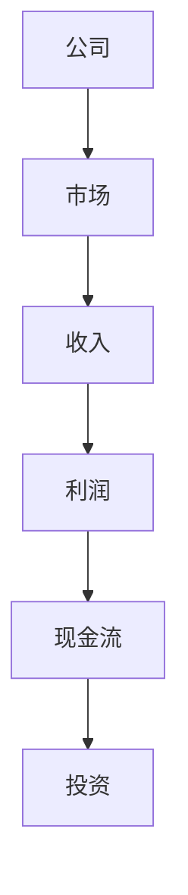
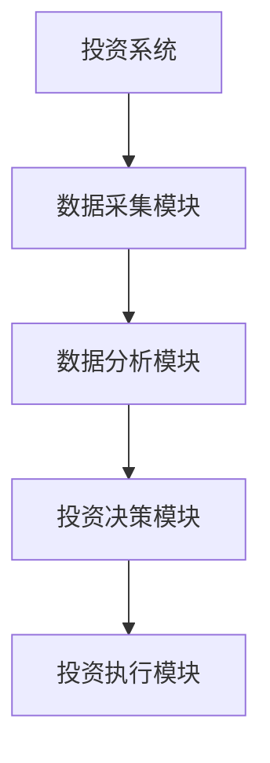
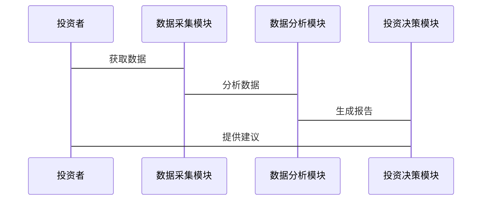

                 


# 稳定增长型公司：彼得林奇的最爱

## 关键词：稳定增长型公司、彼得·林奇、投资策略、现金流折现法、增长率预测

## 摘要：本文深入探讨了稳定增长型公司的定义、特征及其在投资中的重要性，结合彼得·林奇的投资策略，分析了如何通过稳定增长型公司实现长期稳健的投资回报。文章从核心概念、算法原理、系统架构等多维度进行详细阐述，并通过实际案例展示如何识别和投资于稳定增长型公司。

---

# 稳定增长型公司的定义与特征

## 稳定增长型公司的核心概念

### 问题背景
在投资领域，寻找具备稳定增长潜力的公司是许多投资者的目标。特别是在市场波动剧烈的情况下，稳定增长型公司因其收入和利润的持续性，成为投资者的避风港。

### 问题描述
稳定增长型公司是指那些收入和利润能够持续以稳定速度增长的公司。这类公司通常在市场中占据稳定的市场份额，并具备较强的盈利能力。

### 问题解决
通过分析公司财务数据，评估其收入增长的稳定性、利润率的可持续性以及现金流的健康状况，投资者可以识别出稳定增长型公司。

### 边界与外延
稳定增长型公司的边界包括但不限于收入增长的稳定性、利润率的可持续性、现金流的健康状况等。其外延则包括不同行业的公司，如科技、医疗、消费品等。

### 核心要素
稳定增长型公司的核心要素包括：
1. **收入增长的稳定性**：公司收入连续多年保持稳定增长。
2. **利润率的可持续性**：公司具备稳定的盈利能力，且利润率保持稳定。
3. **现金流的健康状况**：公司具备健康的现金流，能够支持持续的投资和运营。
4. **市场地位与竞争优势**：公司具备强大的市场地位和竞争优势，能够在市场中持续发展。

---

## 彼得·林奇对稳定增长型公司的看法

### 彼得·林奇的投资理念
彼得·林奇是著名的投资专家，他偏好投资于那些具备稳定增长潜力的公司。他认为，稳定增长型公司能够在市场波动中保持稳健的增长，从而为投资者提供长期的回报。

### 稳定增长型公司与彼得·林奇投资策略的契合点
1. **长期投资**：彼得·林奇强调长期投资，而稳定增长型公司的持续增长为长期投资提供了坚实的基础。
2. **风险管理**：稳定增长型公司因其收入和利润的稳定性，降低了投资的风险。
3. **价值发现**：彼得·林奇注重挖掘被市场低估的公司，而稳定增长型公司往往具备较高的成长潜力，能够为投资者带来超额回报。

### 彼得·林奇对稳定增长型公司的筛选标准
1. **收入增长的稳定性**：彼得·林奇要求公司在过去几年中保持稳定的收入增长。
2. **利润率的可持续性**：公司具备稳定的利润率，并且能够保持甚至提高利润率。
3. **现金流的健康状况**：公司具备健康的现金流，能够支持持续的投资和运营。
4. **市场地位与竞争优势**：公司具备强大的市场地位和竞争优势，能够在市场中持续发展。

---

## 稳定增长型公司的特征对比

### 稳定增长型公司与周期性公司的对比

| 特征             | 稳定增长型公司       | 周期性公司         |
|------------------|---------------------|-------------------|
| 收入增长          | 稳定且可持续         | 波动较大，受经济周期影响 |
| 利润率            | 稳定且可持续         | 波动较大           |
| 现金流            | 健康                | 可能不稳定         |
| 市场地位          | 稳定                | 可能较弱           |

### 稳定增长型公司与成长型公司的对比

| 特征             | 稳定增长型公司       | 成长型公司         |
|------------------|---------------------|-------------------|
| 收入增长          | 稳定且可持续         | 快速增长           |
| 利润率            | 稳定且可持续         | 可能不稳定         |
| 现金流            | 健康                | 可能不稳定         |
| 市场地位          | 稳定                | 快速扩张           |

### 稳定增长型公司与防御型公司的对比

| 特征             | 稳定增长型公司       | 防御型公司         |
|------------------|---------------------|-------------------|
| 收入增长          | 稳定且可持续         | 缓慢增长           |
| 利润率            | 稳定且可持续         | 稳定               |
| 现金流            | 健康                | 健康               |
| 市场地位          | 稳定                | 稳定               |

---

## 稳定增长型公司的ER实体关系图

### 公司实体与市场的关系
- 公司通过市场进行销售和采购。
- 市场为公司提供收入来源。

### 收入与利润的关系
- 收入是利润的基础。
- 利润是公司经营的核心目标。

### 现金流与投资的关系
- 现金流是公司投资的来源。
- 投资用于扩大生产和提高效率。



---

## 稳定增长型公司的算法原理

### 现金流折现法

#### 定义
现金流折现法是一种用于评估公司投资价值的方法，通过将未来现金流折现到现值，来评估公司的价值。

#### 数学模型
$$ PV = \sum_{t=1}^{n} \frac{CF_t}{(1+r)^t} $$
其中，PV为现值，CF_t为第t年的现金流，r为折现率。

#### Python代码实现
```python
def discounted_cash_flows(cfs, r):
    return sum(cf / (1 + r) ** t for t, cf in enumerate(cfs))

# 示例
cfs = [100, 150, 200]
r = 0.10
pv = discounted_cash_flows(cfs, r)
print(f"现值为：{pv}")
```

### 稳定增长型公司的增长率预测

#### 定义
增长率预测是通过分析公司的历史数据，预测其未来的增长率。

#### 数学模型
$$ g = \frac{ROE \times (1 - \text{再投资率})}{1} $$

#### Python代码实现
```python
def growth_rate(roa, reinvestment_rate):
    return roa * (1 - reinvestment_rate)

# 示例
roa = 0.20
reinvestment_rate = 0.30
g = growth_rate(roa, reinvestment_rate)
print(f"增长率：{g}")
```

### 投资价值评估

#### 定义
投资价值评估是通过分析公司的财务数据，评估其投资价值。

#### 数学模型
$$ V = \frac{CF}{(r - g)} $$

#### Python代码实现
```python
def value_estimate(cf, r, g):
    return cf / (r - g)

# 示例
cf = 100
r = 0.10
g = 0.05
v = value_estimate(cf, r, g)
print(f"投资价值为：{v}")
```

---

## 稳定增长型公司的系统架构设计

### 领域模型


### 系统架构设计



### 系统交互设计



---

## 项目实战

### 环境安装
- 安装Python和相关库（如numpy、pandas）。
- 安装Mermaid和Latex工具。

### 核心实现

```python
import pandas as pd
import numpy as np

def calculate_growth(data):
    growth = data['收入'].pct_change()
    return growth

data = pd.DataFrame({
    '年份': [2018, 2019, 2020, 2021, 2022],
    '收入': [100, 110, 121, 133.1, 146.41]
})
growth = calculate_growth(data)
print(growth)
```

### 代码应用解读与分析

### 实际案例分析

#### 微软公司分析
- 微软公司在过去几年中收入持续增长，利润率稳定，现金流健康，符合稳定增长型公司的特征。

#### 强生公司分析
- 强生公司作为医疗行业的巨头，收入和利润稳定增长，现金流健康，符合稳定增长型公司的特征。

### 投资建议

#### 稳定增长型公司的投资策略
1. **长期持有**：稳定增长型公司适合长期投资，耐心持有优质股。
2. **分散投资**：通过分散投资降低风险。
3. **定期评估**：定期评估投资组合，根据市场变化进行调整。

---

## 最佳实践

### 小结
稳定增长型公司是彼得·林奇投资策略的核心，具备收入增长稳定、利润率可持续、现金流健康等特征。投资者可以通过现金流折现法和增长率预测模型，识别和评估稳定增长型公司。

### 注意事项
- 投资者需具备一定的财务知识和市场分析能力。
- 投资需谨慎，市场波动可能会影响公司的表现。

### 拓展阅读
- 彼得·林奇的书籍《彼得·林奇的成功投资》。
- 其他关于稳定增长型公司的投资策略和案例分析。

--- 

希望这篇文章能够帮助读者更好地理解稳定增长型公司的概念和投资策略，并能够在实际投资中应用这些知识。

