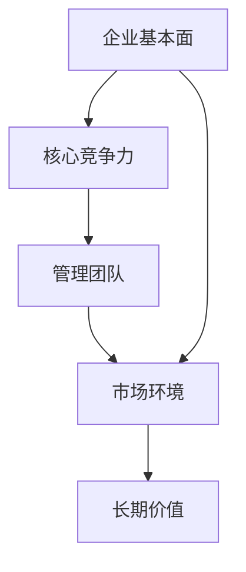
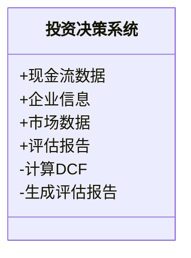
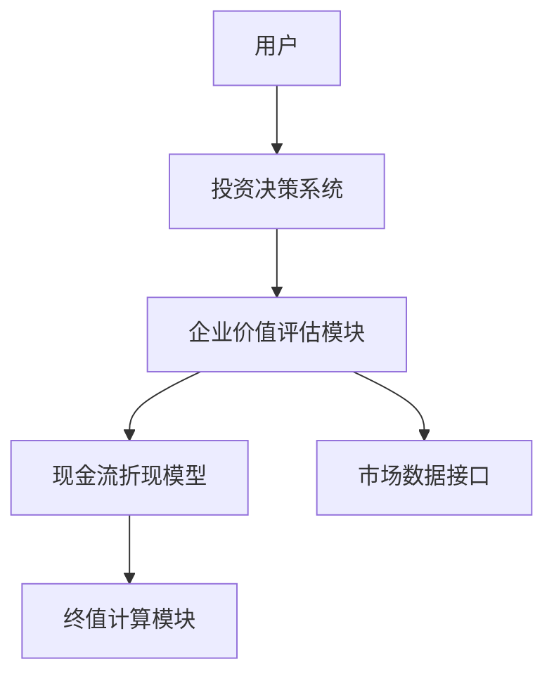

                 


# 约瑟夫·拉科尼克的价值创造投资：关注长期价值增长

## 关键词：价值创造投资、长期价值增长、现金流折现模型、投资决策系统、Python代码实现、系统架构设计

## 摘要：本文深入探讨了约瑟夫·拉科尼克的价值创造投资方法，强调长期价值增长的重要性。通过构建数学模型和系统架构，结合实际案例，分析了如何通过现金流折现模型评估企业价值，并设计了一个投资决策系统。文章还提供了Python代码实现和项目实战，帮助读者理解和应用这一投资方法。

---

## 第一部分：引言

### 第1章：价值创造投资的背景与意义

#### 1.1 投资的背景与问题背景

- **1.1.1 传统投资的局限性**
  - 短期波动影响决策，忽视企业长期价值。
  - 过度关注市场情绪，忽视基本面分析。
- **1.1.2 长期价值增长的重要性**
  - 企业内在价值驱动长期收益。
  - 投资者应关注企业的持续增长能力。
- **1.1.3 约瑟夫·拉科尼克的贡献**
  - 提出系统化的长期价值评估方法。
  - 强调投资决策中的深度分析。

#### 1.2 投资的核心概念

- **1.2.1 价值创造的定义**
  - 通过优化企业运营和管理，提升其市场价值。
- **1.2.2 长期价值增长的特征**
  - 可持续性：企业持续创造价值。
  - 创新性：通过创新提升竞争力。
- **1.2.3 价值创造与传统投资的对比**

| 特性 | 传统投资 | 价值创造投资 |
|------|-----------|----------------|
| 理论基础 | 短期市场波动 | 企业长期价值 |
| 投资策略 | 追踪市场趋势 | 优化企业运营 |

---

## 第二部分：价值创造的核心概念与模型

### 第2章：价值创造的定义与特征

#### 2.1 价值创造的定义

- **2.1.1 内涵**
  - 通过改进企业运营，提升其市场价值。
- **2.1.2 关键要素**
  - 企业核心竞争力。
  - 管理团队能力。
  - 市场环境分析。

#### 2.2 价值创造的特征

- **2.2.1 长期性**
  - 投资回报周期长。
- **2.2.2 可持续性**
  - 企业持续创造价值。
- **2.2.3 创新性**
  - 创新驱动增长。

#### 2.3 价值创造的分析框架



---

## 第三部分：价值创造的数学模型与算法

### 第3章：价值评估的数学模型

#### 3.1 现金流折现模型

- **3.1.1 模型定义与公式**
  - 公式：$$DCF = \sum_{t=1}^{n} \frac{CF_t}{(1 + r)^t} + \frac{TV}{(1 + r)^n}$$
  - $DCF$：净现值。
  - $CF_t$：第t年的现金流。
  - $r$：折现率。
  - $TV$：终值。
- **3.1.2 计算步骤**
  ```mermaid
  graph TD
      A[确定现金流] --> B[计算终值]
      B --> C[计算现值]
      C --> D[求和]
  ```

#### 3.2 企业价值评估

- **3.2.1 企业价值公式**
  - $$EV = DCF$$
  - $EV$：企业价值。
- **3.2.2 实例分析**
  - 假设年现金流为$100,000，折现率为10%，期限为5年，终值为$200,000。
  - 计算各年现值：第一年现值为$90,909，第二年为$82,645，依此类推。
  - 总现值加上终值现值即为企业价值。

---

## 第四部分：系统分析与架构设计

### 第4章：投资决策系统设计

#### 4.1 系统功能设计



#### 4.2 系统架构设计



---

## 第五部分：项目实战

### 第5章：现金流折现模型的Python实现

#### 5.1 环境安装

- **安装Python和相关库**
  ```bash
  pip install numpy pandas matplotlib
  ```

#### 5.2 核心代码实现

```python
import numpy as np
import pandas as pd

def calculate_dcf(cash_flows, discount_rate, terminal_value):
    n = len(cash_flows)
    dcf = 0
    for t in range(n):
        dcf += cash_flows[t] / (1 + discount_rate) ** t
    dcf += terminal_value / (1 + discount_rate) ** n
    return dcf

# 示例数据
cash_flows = [100000]*5  # 每年的现金流
discount_rate = 0.10      # 折现率
terminal_value = 200000   # 终值

# 计算DCF
dcf = calculate_dcf(cash_flows, discount_rate, terminal_value)
print(f"DCF: ${dcf:.2f}")
```

#### 5.3 代码解读与分析

- **函数`calculate_dcf`**
  - 输入：现金流数组，折现率，终值。
  - 输出：DCF值。
- **示例分析**
  - 计算各年现金流的现值，求和并加上终值现值。

---

## 第六部分：最佳实践与小结

### 第6章：投资策略与风险管理

#### 6.1 投资策略

- **分散投资**
  - 分散投资降低风险。
- **持续监控**
  - 定期评估投资组合。

#### 6.2 风险管理

- **风险评估**
  - 使用DCF模型评估企业风险。
- **风险管理工具**
  - 利用市场数据监控风险。

#### 6.3 拓展阅读

- 建议阅读《投资学》等书籍，深入理解价值投资。

---

## 结论与展望

通过本文的详细讲解，读者可以系统地了解约瑟夫·拉科尼克的价值创造投资方法，并通过实际案例和代码实现掌握其应用。未来，随着市场的发展，这种方法将变得更加重要，帮助投资者实现长期价值增长。

