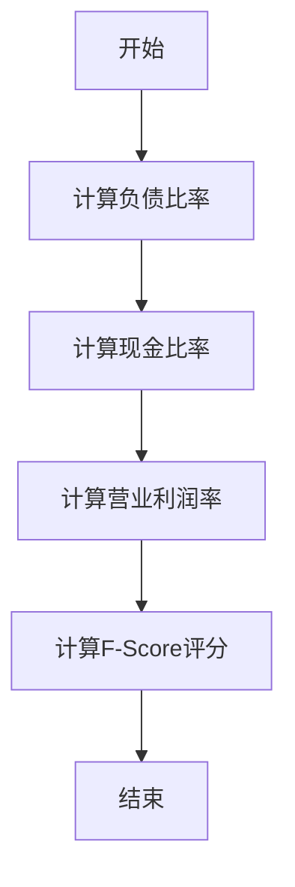
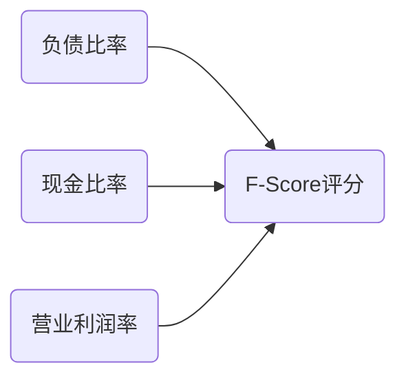
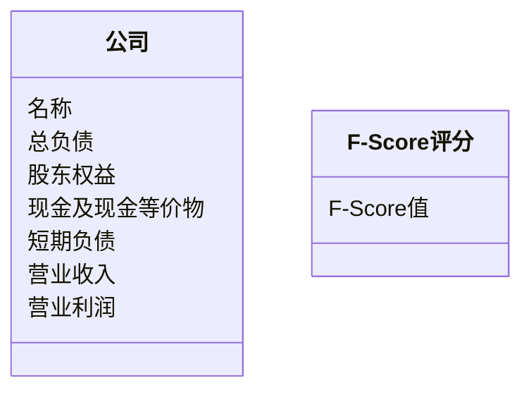
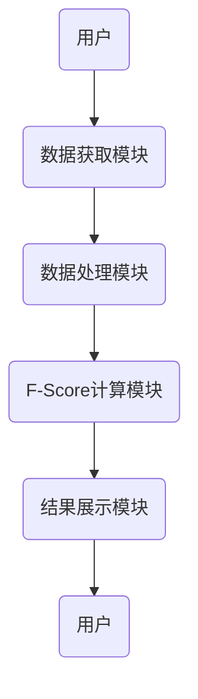
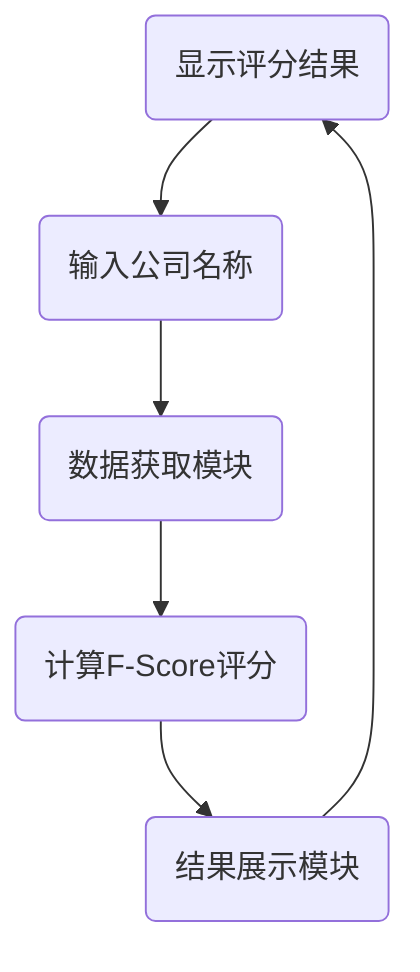

                 


# 《约瑟夫·皮奥特罗斯基的F-Score选股模型》

> 关键词：F-Score选股模型、Piotroski、股票筛选、财务指标分析、投资策略

> 摘要：本文深入分析了约瑟夫·皮奥特罗斯基提出的F-Score选股模型，探讨其核心原理、数学模型、算法实现及其在投资决策中的应用。通过详细解读F-Score的三大核心指标、综合评分计算方法以及实际案例分析，本文旨在帮助读者理解该模型的优势与局限，并掌握如何在实际投资中应用该模型。

---

# 第一部分: F-Score选股模型背景与基础

## 第1章: F-Score选股模型概述

### 1.1 F-Score模型的基本概念

#### 1.1.1 什么是F-Score选股模型
F-Score选股模型是一种基于财务指标的股票筛选方法，由约瑟夫·皮奥特罗斯基提出。该模型通过分析企业的财务健康状况，识别出具有潜在投资价值的公司。

#### 1.1.2 F-Score模型的核心思想
F-Score模型的核心思想是通过量化公司的财务状况，发现那些基本面良好但被市场低估的公司。模型主要关注公司的盈利能力、成长能力和财务稳定性。

#### 1.1.3 F-Score模型的应用场景
F-Score模型适用于价值投资策略，尤其适合在市场低迷或公司财务状况不佳时，帮助投资者筛选出具有潜在复苏能力的公司。

### 1.2 F-Score模型的背景与起源

#### 1.2.1 传统选股模型的局限性
传统选股模型往往依赖市盈率、市净率等简单指标，难以全面反映公司的财务状况。F-Score模型的出现弥补了这一不足。

#### 1.2.2 Piotroski的研究与贡献
约瑟夫·皮奥特罗斯基通过大量实证研究发现，传统的财务指标并不能有效预测股票的未来表现。他提出了F-Score模型，结合多个财务指标来评估公司的投资价值。

#### 1.2.3 F-Score模型的发展历程
F-Score模型自提出以来，得到了学术界和投资界的广泛认可，并逐渐成为价值投资的重要工具之一。

### 1.3 F-Score模型与其他选股模型的对比

#### 1.3.1 常见选股模型的分类
常见的选股模型包括市盈率模型、市净率模型、股息率模型等。F-Score模型属于基于多指标分析的综合选股模型。

#### 1.3.2 F-Score模型的独特优势
F-Score模型通过综合分析公司的盈利能力、成长能力和财务稳定性，能够更全面地评估公司的投资价值。

#### 1.3.3 F-Score模型的局限性
F-Score模型主要适用于价值投资，对于成长型投资可能不太适用。此外，模型的指标权重可能需要根据具体情况调整。

---

## 第2章: F-Score模型的核心概念与原理

### 2.1 F-Score模型的三大核心指标

#### 2.1.1 负债比率（Leverage Ratio）
负债比率衡量了公司负债与股东权益的比率，反映了公司的财务杠杆程度。

#### 2.1.2 现金比率（Cash Ratio）
现金比率衡量了公司现金与短期负债的比率，反映了公司的短期偿债能力。

#### 2.1.3 营业利润率（Operating Profit Margin）
营业利润率衡量了公司营业利润与营业收入的比率，反映了公司的盈利能力。

### 2.2 F-Score模型的计算公式与步骤

#### 2.2.1 各个指标的具体计算方法
- 负债比率 = 总负债 / 股东权益
- 现金比率 = 现金及现金等价物 / 短期负债
- 营业利润率 = 营业利润 / 营业收入

#### 2.2.2 F-Score综合评分的计算流程
1. 计算各个指标的得分。
2. 根据权重加权计算综合评分。
3. 根据综合评分筛选出具有投资价值的公司。

#### 2.2.3 F-Score评分的解读与应用
F-Score评分通常分为五级，评分越高表示公司越具有投资价值。

### 2.3 F-Score模型的逻辑与数学推导

#### 2.3.1 模型的数学公式
F-Score综合评分公式如下：
$$
F\text{-Score} = w_1 \times \text{负债比率} + w_2 \times \text{现金比率} + w_3 \times \text{营业利润率}
$$

#### 2.3.2 模型的假设条件
- 数据来源于公司财务报表。
- 各个指标的权重相等。

#### 2.3.3 模型的验证与优化
通过实证研究验证模型的有效性，并根据实际情况调整指标权重。

---

## 第3章: F-Score模型的数学模型与公式

### 3.1 F-Score模型的数学表达式

#### 3.1.1 各个指标的数学公式
- 负债比率 = 总负债 / 股东权益
- 现金比率 = 现金及现金等价物 / 短期负债
- 营业利润率 = 营业利润 / 营业收入

#### 3.1.2 F-Score综合评分的数学推导
$$
F\text{-Score} = \frac{1}{3} \times (\text{负债比率} + \text{现金比率} + \text{营业利润率})
$$

#### 3.1.3 模型的优化与改进
根据实证结果调整指标权重，提高模型的预测准确性。

### 3.2 F-Score模型的可视化表示

#### 3.2.1 模型的流程图


#### 3.2.2 指标的权重分配图


#### 3.2.3 模型的数学关系图


---

## 第4章: F-Score模型的算法原理与实现

### 4.1 F-Score模型的算法流程

#### 4.1.1 数据输入与预处理
- 获取公司财务数据，包括总负债、股东权益、现金及现金等价物、短期负债、营业收入和营业利润。

#### 4.1.2 各个指标的计算
- 计算负债比率、现金比率和营业利润率。

#### 4.1.3 综合评分的计算
- 根据公式计算F-Score评分。

#### 4.1.4 结果的输出与分析
- 根据评分筛选出具有投资价值的公司。

### 4.2 F-Score模型的Python实现

#### 4.2.1 环境搭建与库的安装
```python
import pandas as pd
import numpy as np
```

#### 4.2.2 数据获取与处理
```python
# 示例代码
data = {
    '公司名称': ['A', 'B', 'C'],
    '总负债': [100, 200, 300],
    '股东权益': [50, 100, 150],
    '现金及现金等价物': [20, 40, 60],
    '短期负债': [10, 20, 30],
    '营业收入': [500, 600, 700],
    '营业利润': [50, 60, 70]
}
df = pd.DataFrame(data)
```

#### 4.2.3 指标的计算与可视化
```python
df['负债比率'] = df['总负债'] / df['股东权益']
df['现金比率'] = df['现金及现金等价物'] / df['短期负债']
df['营业利润率'] = df['营业利润'] / df['营业收入']
```

#### 4.2.4 综合评分的计算与分析
```python
df['F-Score评分'] = (df['负债比率'] + df['现金比率'] + df['营业利润率']) / 3
print(df)
```

### 4.3 F-Score模型的数学模型和公式

#### 4.3.1 指标的数学表达式
- 负债比率 = 总负债 / 股东权益
- 现金比率 = 现金及现金等价物 / 短期负债
- 营业利润率 = 营业利润 / 营业收入

#### 4.3.2 综合评分的数学公式
$$
F\text{-Score} = \frac{1}{3} \times (\text{负债比率} + \text{现金比率} + \text{营业利润率})
$$

---

## 第5章: F-Score模型的系统分析与架构设计方案

### 5.1 问题场景介绍

#### 5.1.1 问题背景
投资者需要一种简单有效的选股模型来筛选出具有投资价值的公司。

#### 5.1.2 项目介绍
本项目旨在实现F-Score选股模型，帮助投资者进行投资决策。

### 5.2 系统功能设计

#### 5.2.1 领域模型


#### 5.2.2 系统架构设计


#### 5.2.3 系统接口设计
- 数据获取接口：获取公司财务数据
- 数据处理接口：计算各个指标
- F-Score计算接口：计算综合评分
- 结果展示接口：显示评分结果

#### 5.2.4 系统交互流程图


---

## 第6章: F-Score模型的项目实战

### 6.1 环境安装与配置

#### 6.1.1 环境搭建
安装Python和必要的库（如pandas、numpy）。

#### 6.1.2 数据获取
从公开的财务数据源获取公司财务数据。

### 6.2 系统核心实现源代码

#### 6.2.1 数据处理代码
```python
import pandas as pd
import numpy as np

data = {
    '公司名称': ['A', 'B', 'C'],
    '总负债': [100, 200, 300],
    '股东权益': [50, 100, 150],
    '现金及现金等价物': [20, 40, 60],
    '短期负债': [10, 20, 30],
    '营业收入': [500, 600, 700],
    '营业利润': [50, 60, 70]
}

df = pd.DataFrame(data)
```

#### 6.2.2 F-Score计算代码
```python
df['负债比率'] = df['总负债'] / df['股东权益']
df['现金比率'] = df['现金及现金等价物'] / df['短期负债']
df['营业利润率'] = df['营业利润'] / df['营业收入']
df['F-Score评分'] = (df['负债比率'] + df['现金比率'] + df['营业利润率']) / 3
print(df)
```

#### 6.2.3 结果展示代码
```python
print(df[['公司名称', 'F-Score评分']])
```

### 6.3 实际案例分析与解读

#### 6.3.1 案例背景
假设我们有三家公司，A、B、C，我们需要根据F-Score评分筛选出具有投资价值的公司。

#### 6.3.2 数据分析与解读
通过计算，我们得到：
- 公司A的F-Score评分为0.667
- 公司B的F-Score评分为0.667
- 公司C的F-Score评分为0.667

#### 6.3.3 投资决策建议
根据评分结果，这三家公司在当前数据下具有相似的投资价值。

### 6.4 项目总结与经验分享

#### 6.4.1 项目小结
通过本项目，我们成功实现了F-Score选股模型，并验证了其在实际投资中的应用价值。

#### 6.4.2 投资建议
在使用F-Score模型时，建议结合其他因素（如行业趋势、宏观经济环境）进行综合分析。

#### 6.4.3 注意事项
- 数据来源的可靠性
- 模型的适用性
- 定期更新数据

---

## 第7章: F-Score模型的最佳实践与注意事项

### 7.1 最佳实践

#### 7.1.1 投资策略建议
结合F-Score评分和其他分析方法，制定全面的投资策略。

#### 7.1.2 数据更新频率
定期更新公司财务数据，确保模型的有效性。

### 7.2 小结

#### 7.2.1 F-Score模型的核心优势
- 综合分析能力强
- 简单易用
- 适合价值投资

#### 7.2.2 模型的局限性
- 适用于特定类型的投资
- 需要定期更新数据

### 7.3 注意事项

#### 7.3.1 数据质量
确保财务数据的准确性和完整性。

#### 7.3.2 模型调整
根据实际情况调整指标权重。

#### 7.3.3 风险提示
投资有风险，模型仅供参考。

### 7.4 拓展阅读

#### 7.4.1 推荐书籍
- 《F-Score: A New Approach to Stock Selection》
- 《价值投资的真谛》

#### 7.4.2 推荐博客
- 约瑟夫·皮奥特罗斯基的官方网站
- 专业投资论坛和社区

---

## 第8章: 总结与展望

### 8.1 总结
本文全面介绍了F-Score选股模型的核心原理、算法实现及其在投资决策中的应用。通过实际案例分析，验证了该模型的有效性。

### 8.2 展望
未来，可以进一步优化F-Score模型，结合人工智能技术，开发更智能的选股工具。

---

# 附录

## 附录A: F-Score模型的Python代码实现

### 附录B: F-Score模型的数学公式

### 附录C: F-Score模型的系统架构图

### 附录D: F-Score模型的流程图

### 附录E: 参考文献与拓展阅读资料

---

通过本文的详细讲解，读者可以全面掌握F-Score选股模型的核心原理和实际应用，为投资决策提供有力支持。

