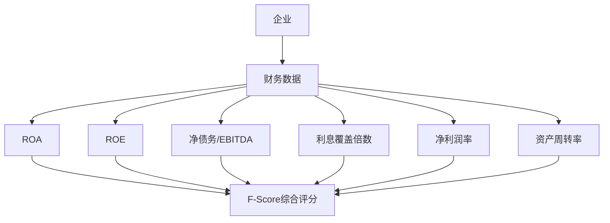
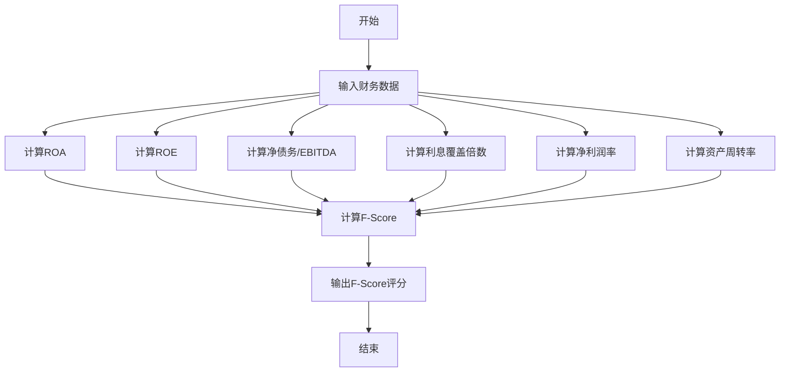
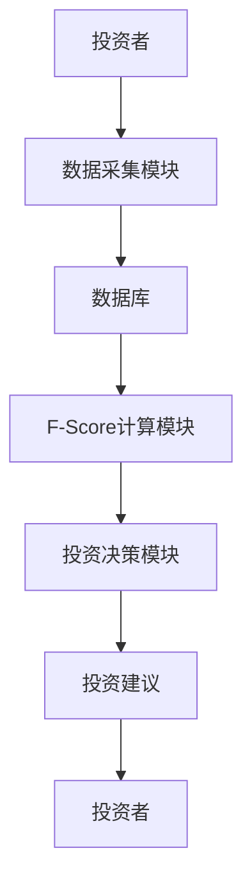

                 


# 约瑟夫·皮奥特罗斯基的基本面量化价值投资：F-Score应用

> 关键词：基本面量化投资，F-Score，约瑟夫·皮奥特罗斯基，财务健康评估，投资决策

> 摘要：本文深入探讨了约瑟夫·皮奥特罗斯基提出的F-Score指标在基本面量化价值投资中的应用。通过分析F-Score的核心概念、算法原理、系统架构以及项目实战，本文为投资者提供了一种基于财务健康状况评估的量化投资方法。通过详细讲解和案例分析，本文旨在帮助读者理解如何利用F-Score指标进行有效的投资决策。

---

## 第1章: 基本面量化投资概述

### 1.1 基本面量化投资的定义与特点

基本面量化投资是一种结合了传统基本面分析和现代量化方法的投资策略。它通过分析企业的财务数据、行业地位、市场表现等因素，利用数学模型和算法对企业的内在价值进行量化评估，从而指导投资决策。

- **定义**：基本面量化投资强调对企业基本面的深入分析，结合量化模型，筛选出具有投资价值的标的。
- **特点**：
  - 数据驱动：依赖财务数据和市场数据。
  - 模型化：通过数学模型进行分析和预测。
  - 量化决策：基于模型结果做出投资决策。

### 1.2 F-Score指标的起源与应用

F-Score是由约瑟夫·皮奥特罗斯基于20世纪80年代提出的，旨在通过量化企业的财务健康状况，帮助投资者识别具有长期投资价值的企业。

- **起源**：F-Score最初是为了评估企业的财务稳定性，帮助投资者在价值投资中筛选出优质标的。
- **应用**：F-Score广泛应用于股票投资、风险评估和企业估值等领域。

### 1.3 本章小结

本章介绍了基本面量化投资的基本概念和特点，重点阐述了F-Score指标的起源和应用，为后续章节奠定了基础。

---

## 第2章: F-Score指标的核心概念与原理

### 2.1 F-Score指标的构成与计算

F-Score基于六个核心指标，每个指标都反映了企业的不同财务健康状况。以下是F-Score的六个核心指标及其计算公式：

1. **ROA（资产回报率）**：
   $$ \text{ROA} = \frac{\text{净利润}}{\text{总资产}} $$
2. **ROE（股东权益回报率）**：
   $$ \text{ROE} = \frac{\text{净利润}}{\text{股东权益}} $$
3. **净债务/EBITDA**：
   $$ \text{净债务/EBITDA} = \frac{\text{净债务}}{\text{EBITDA}} $$
4. **利息覆盖倍数**：
   $$ \text{利息覆盖倍数} = \frac{\text{EBITDA}}{\text{利息支出}} $$
5. **净利润率**：
   $$ \text{净利润率} = \frac{\text{净利润}}{\text{营业收入}} $$
6. **资产周转率**：
   $$ \text{资产周转率} = \frac{\text{营业收入}}{\text{总资产}} $$

F-Score的综合评分公式为：
$$ \text{F-Score} = \frac{1}{6} \sum_{i=1}^{6} \text{指标值} $$

### 2.2 F-Score指标的属性特征对比

以下是F-Score与其他财务指标的对比分析：

| 指标 | F-Score | 其他指标（如Z-Score） |
|------|----------|-----------------------|
| 适用场景 | 企业财务健康评估 | 企业破产风险评估 |
| 计算方式 | 综合评分 | 单一指标评估 |
| 数据需求 | 需要多个财务指标 | 需要较少财务指标 |

### 2.3 F-Score的ER实体关系图



### 2.4 本章小结

本章详细介绍了F-Score的构成与计算方法，并通过对比分析和实体关系图，展示了F-Score与其他财务指标的差异和联系。

---

## 第3章: F-Score算法原理与实现

### 3.1 F-Score算法的流程图



### 3.2 F-Score算法的Python实现

```python
def calculate_f_score(roa, roe, net_debt_ebitda, interest_coverage, net_profit_margin, asset_turnover):
    # 计算F-Score评分
    score = 0
    if roa > 0:
        score += 1
    if roe > 0:
        score += 1
    if net_debt_ebitda < 2:
        score += 1
    if interest_coverage > 1.5:
        score += 1
    if net_profit_margin > 5:
        score += 1
    if asset_turnover > 0.5:
        score += 1
    return score

# 示例数据
roa = 0.1
roe = 0.15
net_debt_ebitda = 1.8
interest_coverage = 2.0
net_profit_margin = 6
asset_turnover = 0.6

# 计算F-Score评分
f_score = calculate_f_score(roa, roe, net_debt_ebitda, interest_coverage, net_profit_margin, asset_turnover)
print(f"企业的F-Score评分为：{f_score}")
```

### 3.3 本章小结

本章通过流程图和Python代码，详细讲解了F-Score算法的实现过程，展示了如何基于财务数据计算F-Score评分。

---

## 第4章: 系统分析与架构设计方案

### 4.1 问题场景介绍

本系统旨在为投资者提供基于F-Score的量化投资决策支持。系统将分析企业的财务数据，计算F-Score评分，并根据评分结果推荐投资标的。

### 4.2 系统功能设计

以下是系统的功能设计模块：

- **数据采集模块**：获取企业的财务数据。
- **F-Score计算模块**：基于财务数据计算F-Score评分。
- **投资决策模块**：根据F-Score评分推荐投资标的。

### 4.3 系统架构设计



### 4.4 系统接口设计

以下是系统的接口设计：

- **输入接口**：接收企业的财务数据。
- **输出接口**：输出企业的F-Score评分和投资建议。

### 4.5 本章小结

本章通过系统架构设计，展示了如何将F-Score指标应用于投资决策支持系统中，为投资者提供数据驱动的投资建议。

---

## 第5章: 项目实战

### 5.1 项目环境安装

需要安装以下Python库：

```bash
pip install pandas numpy matplotlib
```

### 5.2 核心实现代码

```python
import pandas as pd
import numpy as np

def calculate_f_score(roa, roe, net_debt_ebitda, interest_coverage, net_profit_margin, asset_turnover):
    score = 0
    if roa > 0:
        score += 1
    if roe > 0:
        score += 1
    if net_debt_ebitda < 2:
        score += 1
    if interest_coverage > 1.5:
        score += 1
    if net_profit_margin > 5:
        score += 1
    if asset_turnover > 0.5:
        score += 1
    return score

# 示例数据
data = {
    '公司': ['A', 'B', 'C'],
    'ROA': [0.1, 0.2, 0.05],
    'ROE': [0.15, 0.25, 0.1],
    '净债务/EBITDA': [1.8, 2.0, 1.5],
    '利息覆盖倍数': [2.5, 3.0, 1.8],
    '净利润率': [6, 7, 5],
    '资产周转率': [0.6, 0.7, 0.4]
}

df = pd.DataFrame(data)

# 计算F-Score评分
f_scores = []
for index, row in df.iterrows():
    f_score = calculate_f_score(
        row['ROA'],
        row['ROE'],
        row['净债务/EBITDA'],
        row['利息覆盖倍数'],
        row['净利润率'],
        row['资产周转率']
    )
    f_scores.append(f_score)

df['F-Score评分'] = f_scores

print(df)
```

### 5.3 项目小结

本章通过实际案例分析，展示了如何利用F-Score指标进行投资分析。代码实现展示了F-Score的应用过程，帮助读者更好地理解和应用。

---

## 第6章: 总结与展望

### 6.1 本章小结

本文深入探讨了约瑟夫·皮奥特罗斯基提出的F-Score指标在基本面量化价值投资中的应用。通过理论分析、算法实现和项目实战，展示了如何利用F-Score评估企业的财务健康状况，为投资者提供数据驱动的投资决策支持。

### 6.2 注意事项

- F-Score模型适用于长期投资，需结合市场环境和行业特点进行调整。
- 数据质量和完整性对F-Score的准确性至关重要。

### 6.3 拓展阅读

- 《The Valuevest Stockpicker's Guide to the Piotroski F-Score》
- 《量化投资：从基础到实战》

---

## 关键词标签

#F-Score #基本面量化投资 #约瑟夫·皮奥特罗斯基 #投资决策 #财务健康评估

