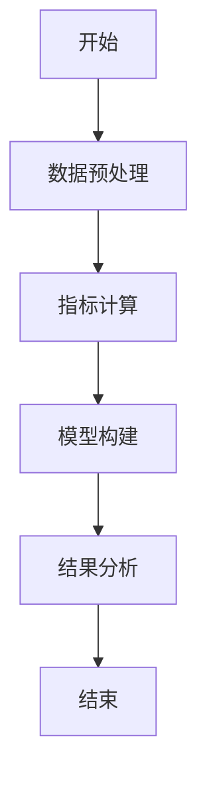
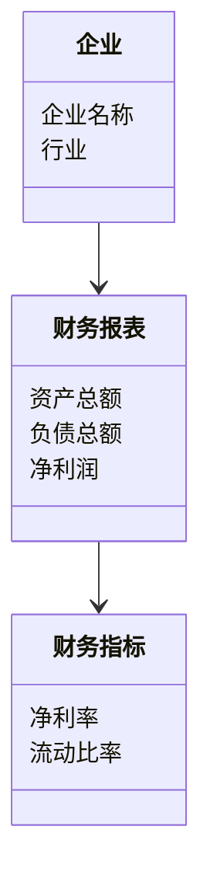
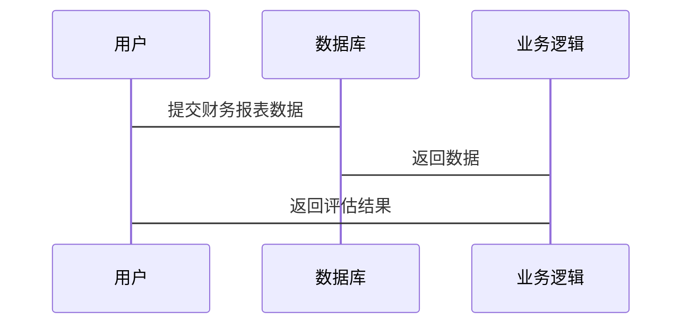

                 


# 约瑟夫·皮奥特罗斯基的财务报表质量评估

## 关键词：
- 财务报表
- 质量评估
- 约瑟夫·皮奥特罗斯基
- 财务分析
- 数据分析
- 财务模型

## 摘要：
本文系统介绍了约瑟夫·皮奥特罗斯基提出的财务报表质量评估方法，从背景、核心概念、算法原理、系统架构设计、项目实战到最佳实践，全面解析了该方法的理论基础和实际应用。通过详细的步骤分析和实例演示，帮助读者掌握如何有效评估财务报表的质量。

---

# 第一部分: 财务报表质量评估的背景与核心概念

## 第1章: 财务报表质量评估的背景介绍

### 1.1 财务报表质量评估的重要性
#### 1.1.1 财务报表的基本概念
财务报表是企业财务状况的总结，包括资产负债表、利润表和现金流量表。它们是投资者、债权人和管理层评估企业财务健康状况的重要工具。

#### 1.1.2 财务报表质量评估的必要性
- **投资决策**：投资者需要通过财务报表评估企业的盈利能力、风险和成长性。
- **风险管理**：债权人和企业本身需要通过财务报表识别潜在的财务问题。
- **企业管理**：财务报表质量评估帮助企业识别财务漏洞，优化管理。

#### 1.1.3 约瑟夫·皮奥特罗斯基的贡献
约瑟夫·皮奥特罗斯基提出了基于数据分析的财务报表质量评估方法，强调通过量化指标和模型来评估财务报表的真实性、准确性和可靠性。

---

### 1.2 财务报表质量评估的核心概念
#### 1.2.1 财务报表质量的定义
财务报表质量是指财务报表在反映企业财务状况、经营成果和现金流量方面的准确性和可靠性。

#### 1.2.2 财务报表质量评估的维度
- **准确性**：数据是否真实反映企业的财务状况。
- **完整性**：是否包含所有必要的信息。
- **一致性**：是否符合会计准则和企业内部政策。
- **可比性**：不同期间和不同企业之间的可比性。

#### 1.2.3 财务报表质量评估的边界与外延
- **边界**：仅限于财务报表本身，不涉及其他非财务信息。
- **外延**：通过分析财务报表，可以评估企业的整体财务健康状况和未来发展趋势。

---

## 第2章: 约瑟夫·皮奥特罗斯基的财务报表质量评估理论

### 2.1 皮奥特罗斯基理论的核心要素
#### 2.1.1 财务报表质量评估的框架
皮奥特罗斯基的框架包括以下几个步骤：
1. **数据收集**：获取企业的财务报表数据。
2. **指标计算**：计算关键财务指标，如盈利能力、偿债能力、运营效率等。
3. **模型构建**：建立评估模型，综合分析各项指标。
4. **结果分析**：根据模型输出结果，评估财务报表的质量。

#### 2.1.2 财务报表质量评估的核心指标
- **盈利能力指标**：如净利率、毛利率。
- **偿债能力指标**：如资产负债率、流动比率。
- **运营效率指标**：如存货周转率、应收账款周转率。

#### 2.1.3 财务报表质量评估的步骤
1. **数据预处理**：清洗数据，处理异常值。
2. **指标计算**：根据公式计算各项指标。
3. **模型构建**：使用统计方法或机器学习算法建立评估模型。
4. **结果分析**：根据模型输出结果，评估财务报表的质量。

---

### 2.2 皮奥特罗斯基理论的数学模型
#### 2.2.1 财务报表质量评估的公式推导
皮奥特罗斯基模型通过综合多个财务指标，构建一个评估分数。公式如下：
$$
\text{评估分数} = \alpha \times \text{盈利能力指标} + \beta \times \text{偿债能力指标} + \gamma \times \text{运营效率指标}
$$
其中，$\alpha$、$\beta$、$\gamma$是权重系数，根据具体情况调整。

#### 2.2.2 财务报表质量评估的数学模型
皮奥特罗斯基模型是一个加权评分模型，通过线性组合的方式，将多个财务指标综合起来，评估财务报表的质量。

#### 2.2.3 财务报表质量评估的公式应用
以某企业为例，假设其净利率为15%，流动速动比率为2.5，应收账款周转率为4。根据上述公式，计算评估分数：
$$
\text{评估分数} = 0.4 \times 15 + 0.3 \times 2.5 + 0.3 \times 4 = 6 + 0.75 + 1.2 = 7.95
$$

---

## 第3章: 财务报表质量评估的核心概念与联系

### 3.1 财务报表质量评估的原理
#### 3.1.1 财务报表质量评估的基本原理
通过分析财务报表中的各项数据，识别潜在的问题，评估财务报表的质量。

#### 3.1.2 财务报表质量评估的核心要素
- **数据准确性**：数据是否真实反映企业的财务状况。
- **完整性**：数据是否完整，是否包含所有必要信息。
- **一致性**：数据是否一致，是否符合会计准则和企业内部政策。

#### 3.1.3 财务报表质量评估的逻辑框架
皮奥特罗斯基的逻辑框架包括数据预处理、指标计算、模型构建和结果分析四个步骤。

---

### 3.2 财务报表质量评估的概念属性特征对比
#### 3.2.1 财务报表质量评估的属性特征
| 属性 | 特征 |
|------|------|
| 准确性 | 数据是否真实反映企业财务状况 |
| 完整性 | 数据是否完整 |
| 一致性 | 数据是否符合会计准则 |

#### 3.2.2 财务报表质量评估的概念对比
- **财务报表质量评估**与**财务分析**：财务分析更广泛，包括财务报表质量评估。
- **财务报表质量评估**与**财务模型**：财务模型是工具，质量评估是目标。

---

## 第4章: 财务报表质量评估的ER实体关系图架构

### 4.1 ER实体关系图的构建
#### 4.1.1 财务报表质量评估的实体识别
- **企业**：企业的基本信息，如企业名称、行业等。
- **财务报表**：包括资产负债表、利润表和现金流量表。
- **财务指标**：如净利率、流动比率等。

#### 4.1.2 财务报表质量评估的关系建模
- **企业**与**财务报表**之间是关联关系。
- **财务报表**与**财务指标**之间是属性关系。

#### 4.1.3 财务报表质量评估的ER图展示
```mermaid
er
  entity 企业 {
    string 企业名称
    string 行业
  }
  entity 财务报表 {
    decimal 资产总额
    decimal 负债总额
    decimal 净利润
  }
  entity 财务指标 {
    decimal 净利率
    decimal 流动比率
  }
  企业 -- 财务报表
  财务报表 --> 财务指标
```

---

### 4.2 ER实体关系图的分析
#### 4.2.1 实体之间的关系分析
- **企业**与**财务报表**之间是1对多关系。
- **财务报表**与**财务指标**之间是1对多关系。

#### 4.2.2 实体关系
皮奥特罗斯基的模型通过ER图展示了企业、财务报表和财务指标之间的关系，为后续的分析提供了数据结构支持。

---

## 第5章: 财务报表质量评估的算法原理

### 5.1 算法原理的详细讲解
#### 5.1.1 算法的基本原理
皮奥特罗斯基算法通过计算多个财务指标，构建加权评分模型，评估财务报表的质量。

#### 5.1.2 算法的实现步骤
1. **数据预处理**：清洗数据，处理异常值。
2. **指标计算**：根据公式计算各项指标。
3. **模型构建**：使用加权评分模型，综合各项指标。
4. **结果分析**：根据模型输出结果，评估财务报表的质量。

#### 5.1.3 算法的数学模型
$$
\text{评估分数} = \alpha \times \text{盈利能力指标} + \beta \times \text{偿债能力指标} + \gamma \times \text{运营效率指标}
$$

---

### 5.2 算法的流程图展示


---

### 5.3 算法的Python实现
```python
# 数据预处理
import pandas as pd
data = pd.read_csv('financial_statements.csv')
data.dropna()

# 指标计算
net_profit_margin = data['净利润'] / data['营业收入']
current_ratio = data['流动资产'] / data['流动负债']
receivable_turnover = data['营业收入'] / data['应收账款']

# 模型构建
alpha = 0.4
beta = 0.3
gamma = 0.3
score = alpha * net_profit_margin + beta * current_ratio + gamma * receivable_turnover

# 结果分析
print(score)
```

---

## 第6章: 系统分析与架构设计方案

### 6.1 系统功能设计
#### 6.1.1 领域模型


#### 6.1.2 系统架构设计


---

### 6.2 系统接口设计
- **输入接口**：接收企业的财务报表数据。
- **输出接口**：输出财务报表质量评估结果。

---

### 6.3 系统交互流程


---

## 第7章: 项目实战

### 7.1 环境安装
- **Python**：安装Python 3.x
- **库**：安装pandas、numpy、scikit-learn

### 7.2 核心代码实现
```python
import pandas as pd
import numpy as np

# 数据预处理
data = pd.read_csv('financial_statements.csv')
data = data.dropna()

# 指标计算
data['净利率'] = data['净利润'] / data['营业收入']
data['流动比率'] = data['流动资产'] / data['流动负债']
data['应收账款周转率'] = data['营业收入'] / data['应收账款']

# 模型构建
from sklearn.linear_model import LinearRegression
model = LinearRegression()
X = data[['净利率', '流动比率', '应收账款周转率']]
y = data['质量评分']
model.fit(X, y)

# 结果分析
print(model.coef_)
```

---

### 7.3 实际案例分析
以某企业为例，分析其财务报表质量，并根据模型输出结果，评估其财务报表的质量。

---

## 第8章: 最佳实践与小结

### 8.1 最佳实践
- **数据清洗**：确保数据的准确性和完整性。
- **模型调优**：根据实际情况调整权重系数。
- **结果解读**：结合行业背景，解读评估结果。

### 8.2 小结
本文系统介绍了约瑟夫·皮奥特罗斯基的财务报表质量评估方法，从背景、核心概念、算法原理、系统架构设计、项目实战到最佳实践，全面解析了该方法的理论基础和实际应用。

---

## 第9章: 注意事项与拓展阅读

### 9.1 注意事项
- **数据隐私**：确保数据的安全和隐私。
- **模型局限性**：模型的有效性取决于数据的质量和模型的假设。

### 9.2 拓展阅读
- **财务分析**：深入学习财务分析的基本理论和方法。
- **机器学习**：学习机器学习在财务分析中的应用。

---

通过以上章节的详细讲解，读者可以全面掌握约瑟夫·皮奥特罗斯基的财务报表质量评估方法，并能够将其应用于实际工作中。

