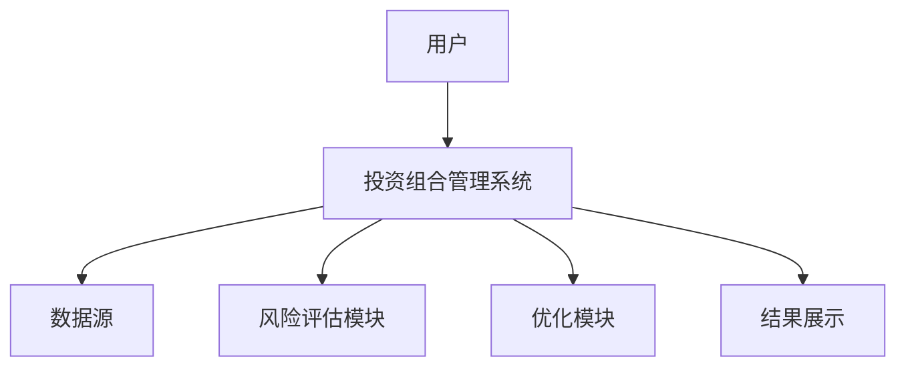

                 


# 《约翰·伯格的全球多元化投资理念》

---

## 关键词：投资、多元化、指数基金、风险管理、长期投资、资产配置、投资组合优化

---

## 摘要

本文深入探讨了约翰·伯格的全球多元化投资理念，分析其核心观点和实际应用。通过背景介绍、核心概念、算法原理、系统架构和项目实战等多维度的分析，揭示了多元化投资的优势和实现方法。文章结合技术语言，详细阐述了投资组合优化的数学模型和系统设计，为读者提供了从理论到实践的全面指导。

---

## 目录

1. [背景介绍](#背景介绍)
   - 1.1 投资的基本概念
   - 1.2 资本市场概述
   - 1.3 投资风险与收益

2. [约翰·伯格的投资理念](#约翰·伯格的投资理念)
   - 2.1 约翰·伯格的背景
   - 2.2 投资理念的核心要素
   - 2.3 多元化投资的优势

3. [多元化投资的算法原理](#多元化投资的算法原理)
   - 3.1 现代投资组合理论（MPT）
   - 3.2 投资组合优化的数学模型
   - 3.3 风险与收益的平衡

4. [投资组合管理系统设计](#投资组合管理系统设计)
   - 4.1 系统功能需求
   - 4.2 系统架构设计
   - 4.3 接口设计与交互流程

5. [项目实战：构建多元化投资组合](#项目实战：构建多元化投资组合)
   - 5.1 环境安装与数据准备
   - 5.2 投资组合优化实现
   - 5.3 实际案例分析与解读

---

## 1. 背景介绍

### 1.1 投资的基本概念

- **定义**：投资是指将资金投入某一项目或资产，期望在未来获得超过初始投入的收益。
- **重要性**：投资是个人和机构实现财富增长的重要手段，通过合理配置资产，投资者可以在不同经济环境下分散风险，提高收益。
- **基本原则**：长期性、分散性、风险管理。

### 1.2 资本市场概述

- **定义**：资本市场是提供长期资金融通的市场，包括股票市场、债券市场、基金市场等。
- **类型**：一级市场和二级市场，其中二级市场是投资者买卖现有证券的场所。
- **功能**：为企业融资，为投资者提供投资渠道，促进资本流动。

### 1.3 投资风险与收益

- **风险**：投资可能面临的本金损失或收益低于预期的情况。
- **收益**：来自资本增值、分红或利息收入。
- **风险与收益的平衡**：通过多元化投资降低特定风险，追求风险调整后的收益。

---

## 2. 约翰·伯格的投资理念

### 2.1 约翰·伯格的背景

- 约翰·伯格是投资界的传奇人物，以共同基金和指数基金的理念闻名。
- 他创立了先锋集团（Vanguard），推广低成本、被动型投资工具。
- 伯格强调长期投资和分散投资的重要性。

### 2.2 投资理念的核心要素

- **价值投资**：寻找被市场低估的股票，长期持有。
- **长期投资**：避免短期波动，关注企业的长期价值。
- **分散投资**：通过投资不同类型资产降低风险。

### 2.3 多元化投资的优势

- **分散风险**：通过投资不同资产类别、行业和地理区域，降低特定风险。
- **提高收益稳定性**：多元化投资有助于平滑市场波动，实现更稳定的收益。

---

## 3. 多元化投资的算法原理

### 3.1 现代投资组合理论（MPT）

- MPT由哈里·马科维茨提出，强调通过优化投资组合来最大化收益，同时最小化风险。
- 核心假设：资产收益符合正态分布，投资者为风险厌恶型。

### 3.2 投资组合优化的数学模型

- **目标函数**：最大化预期收益，最小化风险（方差）。
- **约束条件**：投资组合的总权重为1，资金不能超过预算。

公式：  
$$\text{Minimize } \sigma^2 \text{ subject to } \mu \geq \text{目标收益}$$

### 3.3 风险与收益的平衡

- **夏普比率**：衡量投资组合的风险调整后收益，公式：
$$\text{夏普比率} = \frac{E(r_p) - r_f}{\sigma_p}$$
- **波动率**：衡量资产收益的波动程度，公式：
$$\text{波动率} = \sqrt{\text{方差}}$$

---

## 4. 投资组合管理系统设计

### 4.1 系统功能需求

- **数据采集**：获取历史价格、收益数据。
- **风险评估**：计算波动率、夏普比率等指标。
- **组合优化**：根据目标收益优化投资组合。

### 4.2 系统架构设计



### 4.3 接口设计与交互流程

- **输入**：目标收益、可用资金。
- **输出**：最优投资组合配置。

---

## 5. 项目实战：构建多元化投资组合

### 5.1 环境安装与数据准备

- **工具**：Python、Pandas、NumPy、Plotly。
- **数据**：历史股票价格、指数基金数据。

### 5.2 投资组合优化实现

```python
import numpy as np
import pandas as pd

def portfolio_optimization(returns, weights):
    # 计算组合收益
    portfolio_return = np.dot(returns, weights)
    # 计算组合风险
    portfolio_variance = np.dot(weights.T, np.dot(returns.cov(), weights))
    return portfolio_return, np.sqrt(portfolio_variance)
```

### 5.3 实际案例分析与解读

- **案例**：构建股票和债券的组合。
- **分析**：计算夏普比率，选择最优权重。

---

## 结论

约翰·伯格的多元化投资理念通过长期投资和分散化降低了风险，提高了收益的稳定性。本文从理论到实践，详细阐述了其应用，为投资者提供了科学的指导。未来，随着市场的变化，投资组合优化算法将不断改进，为投资者创造更多价值。

---

## 注意事项

- 投资需谨慎，本文仅为理论指导，实际操作需结合市场情况。
- 数据分析工具的选择和使用需根据具体需求调整。

---

## 拓展阅读

- 马科维茨的《投资学精要》
- 伯格的《投资之道》
- 《Python金融计算》

--- 

**全文完**

