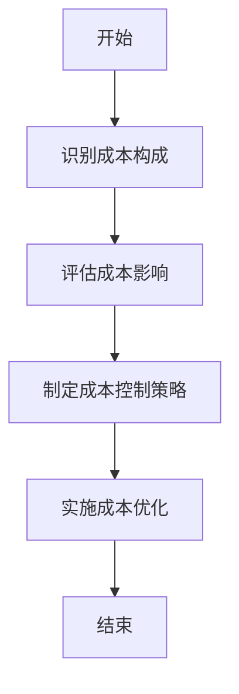
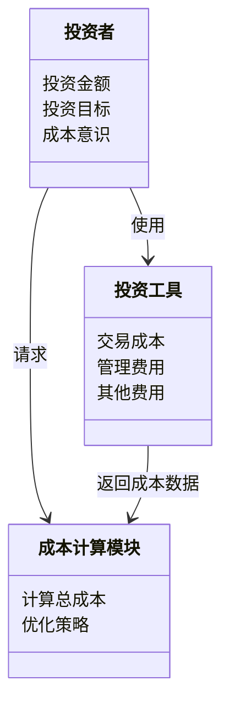
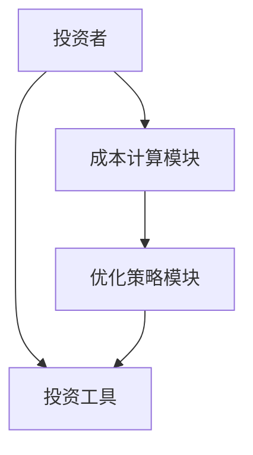

                 


# 约翰·伯格的成本意识：在零售投资者时代的重要性

---

## 关键词  
成本意识, 零售投资者, 约翰·伯格, 投资决策, 投资回报

---

## 摘要  
在零售投资者日益活跃的时代，成本意识已成为影响投资决策和长期回报的关键因素。本文深入探讨约翰·伯格的成本意识理论，分析其在零售投资中的应用价值，并结合实际案例，揭示如何通过成本优化实现更高效的收益目标。

---

## 第1章: 成本意识的定义与背景

### 1.1 成本意识的定义  
成本意识是指投资者在决策过程中对各项成本的敏感性和关注度，旨在通过合理控制成本，提升投资收益。  

#### 1.1.1 成本意识的基本概念  
- 成本意识的核心在于识别、评估和优化投资过程中产生的各项成本。  
- 成本意识要求投资者在决策时不仅关注收益，还要全面考虑成本的高低及其对整体回报的影响。  

#### 1.1.2 成本意识的核心要素  
- **成本构成**：包括交易成本、管理成本、税费等。  
- **成本与收益的关系**：成本是影响净收益的重要因素，过高的成本会侵蚀收益。  
- **成本控制的关键点**：通过优化交易策略、降低管理费用等方式实现成本控制。  

#### 1.1.3 成本意识在零售投资中的作用  
- 成本意识帮助零售投资者在有限的资金条件下最大化收益。  
- 成本意识是长期投资策略的重要组成部分，有助于实现稳健的财富增长。  

---

### 1.2 零售投资者的现状  
#### 1.2.1 零售投资者的特点  
- 零售投资者通常资金规模较小，但数量庞大。  
- 投资行为受情绪影响较大，容易出现非理性决策。  
- 对投资工具和市场的理解较为有限，需要依赖专业指导。  

#### 1.2.2 零售投资者面临的挑战  
- 信息不对称：零售投资者难以获得与机构投资者相当的信息资源。  
- 成本高昂：频繁交易和高佣金率增加了投资成本。  
- 风险控制不足：缺乏专业的风险管理工具和方法。  

#### 1.2.3 零售投资者的未来趋势  
- 随着金融市场的开放，零售投资者将获得更多投资机会。  
- 技术进步将降低投资门槛，提升零售投资者的成本意识。  

---

### 1.3 约翰·伯格与成本意识  
#### 1.3.1 约翰·伯格的生平简介  
- 约翰·伯格是美国著名投资家，创办了先锋集团（Vanguard Group）。  
- 他以低成本、指数投资的理念闻名，强调长期投资和成本控制的重要性。  

#### 1.3.2 约翰·伯格的成本意识理论  
- 伯格认为，长期投资回报主要由投资成本和市场走势决定。  
- 成本是影响投资回报的关键因素之一，尤其是对于零售投资者而言。  

#### 1.3.3 约翰·伯格的贡献与影响  
- 伯格的低成本投资理念推动了指数基金的普及。  
- 他的理论为零售投资者提供了简单有效的投资策略，帮助他们降低成本、实现稳健收益。  

---

### 1.4 成本意识的重要性  
#### 1.4.1 成本意识对零售投资者的意义  
- 成本意识是零售投资者制定投资策略的基础。  
- 通过成本优化，零售投资者可以提升投资效率，实现更高的净收益。  

#### 1.4.2 成本意识对投资决策的影响  
- 成本意识帮助投资者在不同投资工具中选择最优方案。  
- 成本意识促使投资者更加理性，减少非必要开支。  

#### 1.4.3 成本意识对长期投资回报的贡献  
- 长期来看，低成本投资策略能够显著提升净收益。  
- 成本意识是实现财富稳健增长的重要保障。  

---

## 第2章: 成本意识的核心概念与联系

### 2.1 成本意识的原理  
#### 2.1.1 成本意识的理论基础  
- 成本意识基于现代金融学的理论，强调成本与收益的平衡。  
- 成本意识要求投资者在决策时充分考虑各项成本因素。  

#### 2.1.2 成本意识的实现机制  
- 通过优化投资策略降低交易成本。  
- 通过选择低成本投资工具减少管理费用。  

#### 2.1.3 成本意识的数学模型  
$$ \text{总成本} = \text{交易成本} + \text{管理费用} + \text{其他费用} $$  

---

### 2.2 成本意识的属性特征对比  
#### 2.2.1 成本与收益的对比  
| 成本类型         | 收益影响           |
|------------------|-------------------|
| 交易成本         | 减少净收益         |
| 管理费用         | 影响收益增长       |
| 税费             | 可能增加或减少收益 |

#### 2.2.2 短期成本与长期成本的对比  
| 时间维度         | 成本类型           | 影响程度         |
|------------------|-------------------|------------------|
| 短期             | 交易成本           | 显著             |
| 长期             | 管理费用           | 累积影响较大      |

#### 2.2.3 显性成本与隐性成本的对比  
| 成本类型         | 定义               | 影响             |
|------------------|-------------------|------------------|
| 显性成本         | 如佣金、税费等     | 直接可计量       |
| 隐性成本         | 如时间成本、机会成本 | 难以直接计量     |

---

### 2.3 成本意识的ER实体关系图  
```mermaid
er
    Entity: 成本
    Entity: 收益
    Entity: 投资者
    Entity: 投资工具
    Relationship: 成本与收益的关系
    Relationship: 投资者与投资工具的关系
```

---

### 2.4 成本意识的Mermaid流程图  


---

## 第3章: 成本意识的算法原理

### 3.1 成本计算模型  
#### 3.1.1 成本计算公式  
$$ \text{总成本} = \sum (\text{交易成本} + \text{管理费用} + \text{其他费用}) $$  

#### 3.1.2 算法实现  
```python
def calculate_cost(transactions, management_fee, other_fees):
    total_cost = transactions * 0.005 + management_fee * 0.01 + other_fees
    return total_cost

# 示例
transactions = 10
management_fee = 1000
other_fees = 50
print(calculate_cost(transactions, management_fee, other_fees))
```

---

### 3.2 成本优化算法  
#### 3.2.1 算法原理  
- 通过减少交易频率降低交易成本。  
- 选择低成本投资工具降低管理费用。  

#### 3.2.2 算法实现  
```python
def optimize_cost(current_cost, target_cost):
    if current_cost > target_cost:
        return "减少交易频率或选择低成本工具"
    else:
        return "成本已优化，无需调整"

# 示例
current_cost = 150
target_cost = 120
print(optimize_cost(current_cost, target_cost))
```

---

## 第4章: 成本意识在零售投资中的数学模型

### 4.1 投资回报与成本的关系  
$$ \text{净收益} = \text{总收益} - \text{总成本} $$  

---

### 4.2 投资组合优化模型  
$$ \text{最优投资组合} = \argmin_{w} \left( w^T C w \right) $$  
其中，$C$ 是成本矩阵，$w$ 是投资权重向量。  

---

## 第5章: 系统分析与架构设计方案

### 5.1 系统功能设计  
#### 5.1.1 领域模型  


---

### 5.2 系统架构设计  


---

## 第6章: 项目实战

### 6.1 环境安装  
- 安装Python和相关库（如NumPy、Matplotlib）。  

---

### 6.2 核心代码实现  
```python
import numpy as np
import matplotlib.pyplot as plt

def calculate_total_cost(transactions, management_fee, other_fees):
    return transactions * 0.005 + management_fee * 0.01 + other_fees

def optimize_cost(transactions, management_fee, other_fees, target_return):
    total_cost = calculate_total_cost(transactions, management_fee, other_fees)
    if (total_cost / (transactions + management_fee + other_fees)) > target_return:
        return "成本过高，建议优化"
    else:
        return "成本合理，无需调整"

# 示例
transactions = 20
management_fee = 1500
other_fees = 70
target_return = 0.08

print(optimize_cost(transactions, management_fee, other_fees, target_return))
```

---

### 6.3 案例分析  
假设一位零售投资者有10万元资金，计划投资股票市场，年化收益目标为8%。  
- 交易成本：每次交易0.5%。  
- 管理费用：年化管理费率为1%。  
- 其他费用：年化其他费用为70元。  

计算总成本：$$ \text{总成本} = 10 \times 0.005 + 10000 \times 0.01 + 70 = 150 \text{元} $$  
净收益：$$ \text{净收益} = 10000 \times 0.08 - 150 = 790 \text{元} $$  

---

## 第7章: 最佳实践

### 7.1 小结  
- 成本意识是零售投资者实现稳健收益的重要工具。  
- 通过优化交易策略和选择低成本工具，可以显著降低投资成本。  

### 7.2 注意事项  
- 避免频繁交易，减少交易成本。  
- 定期评估投资组合的成本，及时优化。  

### 7.3 拓展阅读  
- 《约翰·伯格的投资哲学》  
- 《低成本投资策略》  

--- 

# 结语  
通过本文的深入分析，读者可以全面理解约翰·伯格的成本意识理论，并将其应用于实际投资决策中，从而在零售投资者时代实现更高效的收益目标。

