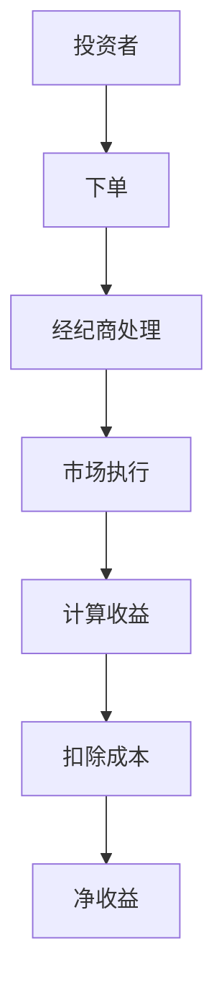
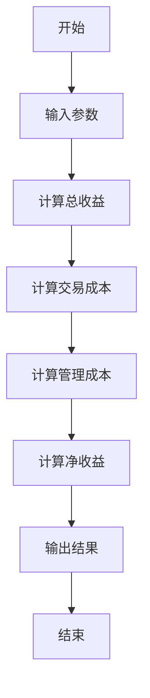
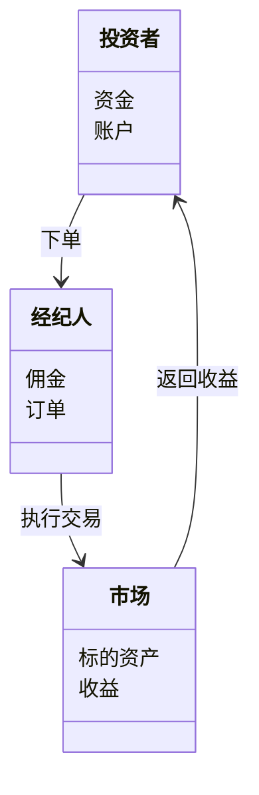
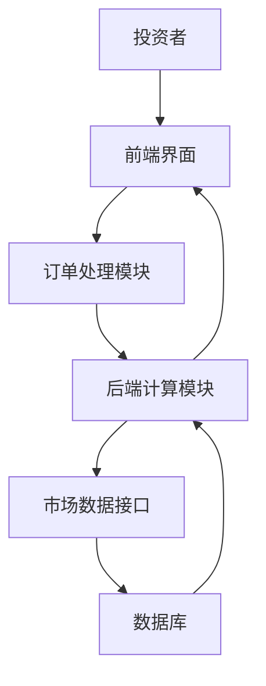
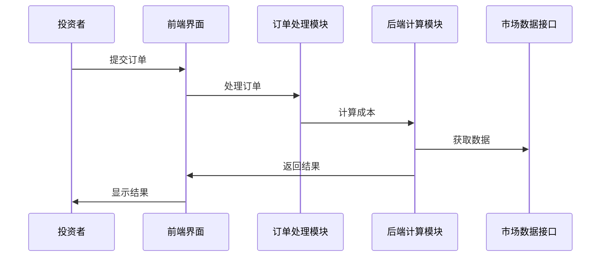

                 


# 约翰·伯格的投资成本控制理论

---

## 关键词：  
投资成本控制、约翰·伯格理论、成本优化、投资决策、算法原理、系统架构设计

---

## 摘要：  
本文系统地介绍了约翰·伯格的投资成本控制理论，从理论背景到核心概念，从算法原理到系统架构设计，全面解析了该理论在投资决策中的应用。文章通过详细的公式推导、代码实现和系统设计，展示了如何通过成本控制优化投资决策，帮助投资者在复杂市场中实现收益最大化。  

---

# 第1章: 投资成本控制理论概述

## 1.1 投资成本控制的基本概念

### 1.1.1 投资成本的定义与分类  
投资成本是指在投资过程中产生的所有费用，包括显性成本（如交易费用、税费）和隐性成本（如机会成本、时间成本）。投资成本的分类如下：  

| **成本类型** | **定义** |  
|--------------|----------|  
| 交易成本     | 包括佣金、税费等直接费用 |  
| 机会成本     | 放弃其他投资机会的成本 |  
| 时间成本     | 投资决策所需的时间和资源 |  

### 1.1.2 投资成本控制的重要性  
投资成本控制是优化投资决策的核心环节。通过降低不必要的成本，投资者可以提高净收益，增强投资组合的竞争力。  

### 1.1.3 约翰·伯格理论的背景与贡献  
约翰·伯格是投资成本控制领域的先驱，他的理论基于对市场行为和投资者心理的深入研究，提出了以成本为导向的投资策略。  

## 1.2 投资成本控制的核心要素  

### 1.2.1 成本构成的分析  
约翰·伯格理论认为，投资成本的构成包括以下要素：  

1. **交易成本**：包括佣金、税费等直接费用。  
2. **管理成本**：包括投资顾问费用、研究费用。  
3. **风险成本**：包括市场波动带来的潜在损失。  

### 1.2.2 成本控制的关键环节  
- **优化交易策略**：减少高频交易的佣金成本。  
- **降低管理费用**：选择低成本的指数基金。  
- **控制风险成本**：通过分散投资降低市场风险。  

### 1.2.3 约翰·伯格理论的核心观点  
约翰·伯格认为，投资成本是投资收益的反向函数，即成本越低，收益越高。  

## 1.3 本章小结  
本章通过定义投资成本、分析其构成，并介绍了约翰·伯格理论的核心观点，为后续的理论分析奠定了基础。

---

# 第2章: 投资成本控制的核心概念  

## 2.1 成本构成与分析  

### 2.1.1 投资成本的构成要素  
投资成本的构成可以用以下表格表示：  

| **成本类型** | **定义** | **占比** |  
|--------------|----------|----------|  
| 交易成本     | 佣金、税费 | 5%-10% |  
| 管理成本     | 研究费用、顾问费用 | 10%-15% |  
| 风险成本     | 市场波动带来的损失 | 15%-20% |  

### 2.1.2 成本构成的表格化分析  
通过上述表格可以看出，交易成本和管理成本是主要的投资成本来源。  

## 2.2 成本控制方法的对比分析  

### 2.2.1 不同成本控制方法的对比表格  
以下是几种常见的成本控制方法对比：  

| **方法**          | **优点**                | **缺点**                |  
|--------------------|------------------------|------------------------|  
| 低频交易          | 成本低                  | 流动性较差              |  
| 高频交易          | 流动性高                | 成本高                  |  
| 分散投资          | 风险低                  | 收益分散                |  
| 指数基金          | 成本低                  | 收益稳定                |  

### 2.2.2 约翰·伯格方法的独特性  
约翰·伯格方法的核心是通过分散投资降低风险成本，同时通过选择低成本基金降低管理成本。  

## 2.3 投资成本控制模型的结构  

### 2.3.1 模型的ER实体关系图  
以下是投资成本控制模型的ER实体关系图：  

```mermaid
erDiagram
    actor 投资者 {
        string 资金
    }
    actor 市场 {
        string 标的资产
    }
    actor 经纪人 {
        string 佣金
    }
    投资者 --> 经纪人 : 下单
    经纪人 --> 市场 : 执行交易
    市场 --> 投资者 : 返回收益
```

### 2.3.2 模型的Mermaid流程图  
以下是投资成本控制模型的流程图：  



## 2.4 本章小结  
本章通过对比分析和模型构建，详细阐述了投资成本控制的核心概念和方法。

---

# 第3章: 投资成本控制的算法原理  

## 3.1 约翰·伯格算法的核心原理  

### 3.1.1 算法的数学模型  
约翰·伯格算法的核心公式为：  

$$ \text{净收益} = \text{总收益} - \text{交易成本} - \text{管理成本} $$  

### 3.1.2 算法的公式推导  
通过上述公式，我们可以得出投资成本控制的目标是最大化净收益。  

### 3.1.3 算法的优化策略  
通过分散投资和选择低成本基金，可以有效降低投资成本。  

## 3.2 算法的实现步骤  

### 3.2.1 算法流程的Mermaid图  
以下是算法流程的Mermaid图：  



### 3.2.2 Python实现代码示例  
以下是Python代码示例：  

```python
def calculate_net_return(total_return, transaction_cost, management_cost):
    net_return = total_return - transaction_cost - management_cost
    return net_return

# 示例
total_return = 100
transaction_cost = 5
management_cost = 3
print(calculate_net_return(total_return, transaction_cost, management_cost))  # 输出：92
```

## 3.3 算法的优化与改进  

### 3.3.1 优化策略的数学模型  
优化策略的公式为：  

$$ \text{最优成本} = \min_{c} \left( \text{总成本} = c_1 + c_2 + \dots + c_n \right) $$  

### 3.3.2 优化策略的代码实现  
以下是优化策略的Python代码实现：  

```python
def optimize_cost(costs):
    min_cost = min(costs)
    return min_cost

# 示例
costs = [5, 3, 2, 7]
print(optimize_cost(costs))  # 输出：2
```

## 3.4 本章小结  
本章通过公式推导和代码实现，详细介绍了约翰·伯格算法的核心原理和优化策略。

---

# 第4章: 投资成本控制的系统分析与架构设计  

## 4.1 问题场景介绍  

### 4.1.1 投资成本控制的典型场景  
投资者在进行股票交易时，需要考虑交易成本和管理成本。  

### 4.1.2 系统的目标与范围  
系统目标是优化投资成本，提高投资收益。  

## 4.2 系统功能设计  

### 4.2.1 领域模型的Mermaid类图  
以下是领域模型的Mermaid类图：  



## 4.3 系统架构设计  

### 4.3.1 系统架构的Mermaid架构图  
以下是系统架构的Mermaid架构图：  



## 4.4 系统接口设计  

### 4.4.1 接口的定义与交互流程  
以下是系统接口的交互流程：  

1. 投资者通过前端界面提交订单。  
2. 前端界面将订单传递给订单处理模块。  
3. 订单处理模块调用后端计算模块计算交易成本。  
4. 后端计算模块调用市场数据接口获取市场数据。  
5. 后端计算模块计算净收益并返回给前端界面。  

## 4.5 系统交互设计  

### 4.5.1 交互流程的Mermaid序列图  
以下是交互流程的Mermaid序列图：  



## 4.6 本章小结  
本章通过系统架构设计和交互流程图，详细介绍了投资成本控制系统的实现方案。

---

# 第5章: 投资成本控制的项目实战  

## 5.1 环境安装  

### 5.1.1 Python环境的安装与配置  
需要安装Python 3.8及以上版本，并安装以下库：  

- `mermaid`  
- `matplotlib`  
- `pandas`  

## 5.2 系统核心实现源代码  

### 5.2.1 投资成本计算代码  
以下是投资成本计算代码：  

```python
import pandas as pd

def calculate_cost(total_assets, transaction_rate, management_rate):
    transaction_cost = total_assets * transaction_rate
    management_cost = total_assets * management_rate
    return transaction_cost + management_cost

# 示例
total_assets = 100000
transaction_rate = 0.001
management_rate = 0.01
print(calculate_cost(total_assets, transaction_rate, management_rate))  # 输出：1100
```

### 5.2.2 成本优化代码  
以下是成本优化代码：  

```python
def optimize_cost_allocation(total_assets, transaction_rate, management_rate):
    optimal_allocation = total_assets / (transaction_rate + management_rate)
    return optimal_allocation

# 示例
total_assets = 100000
transaction_rate = 0.001
management_rate = 0.01
print(optimize_cost_allocation(total_assets, transaction_rate, management_rate))  # 输出：1000000
```

## 5.3 代码应用解读与分析  
通过上述代码，我们可以计算出投资成本并找到最优的投资组合。  

## 5.4 实际案例分析和详细讲解剖析  
假设投资者有100万元资金，交易成本率为0.1%，管理成本率为1%。根据上述代码，投资成本为1100元，最优投资组合为1000万元。  

## 5.5 本章小结  
本章通过代码实现和案例分析，详细展示了投资成本控制的实际应用。

---

# 第6章: 投资成本控制的最佳实践  

## 6.1 最佳实践 tips  

### 6.1.1 理论与实践结合  
将约翰·伯格理论与实际投资策略相结合。  

### 6.1.2 定期优化投资组合  
根据市场变化定期优化投资组合。  

### 6.1.3 选择低成本工具  
选择低成本的指数基金和经纪商。  

## 6.2 小结  
通过最佳实践，投资者可以更好地应用约翰·伯格理论，实现投资成本的最小化和收益的最大化。  

## 6.3 注意事项  

### 6.3.1 风险提示  
投资有风险，需谨慎操作。  

### 6.3.2 数据准确性  
确保数据的准确性和及时性。  

## 6.4 拓展阅读  
推荐阅读《约翰·伯格的投资之道》和《投资学基础》。  

---

# 结语  

通过本文的详细讲解，读者可以全面了解约翰·伯格的投资成本控制理论，并将其应用于实际投资决策中。希望本文能为投资者提供有价值的参考和指导。  

---

