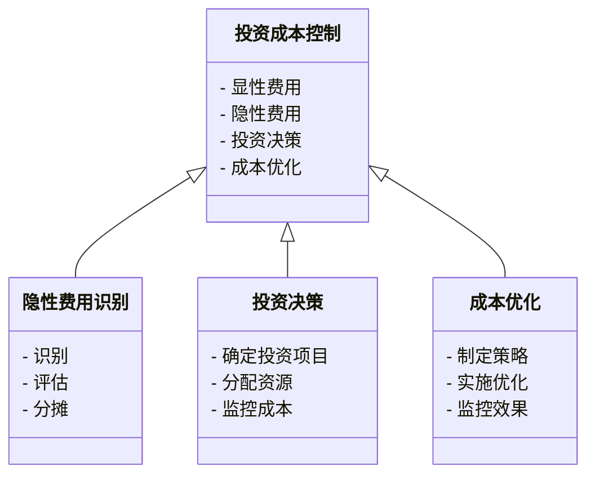
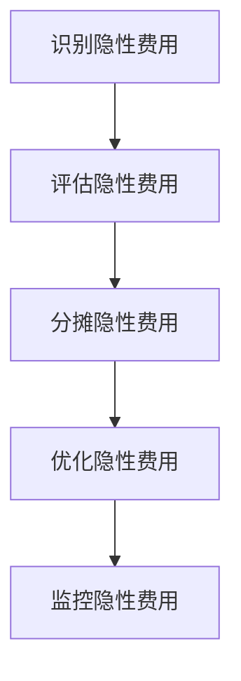
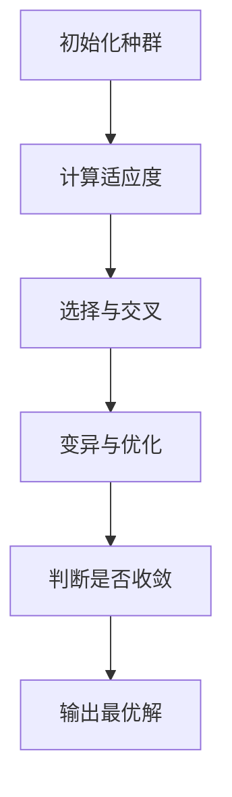
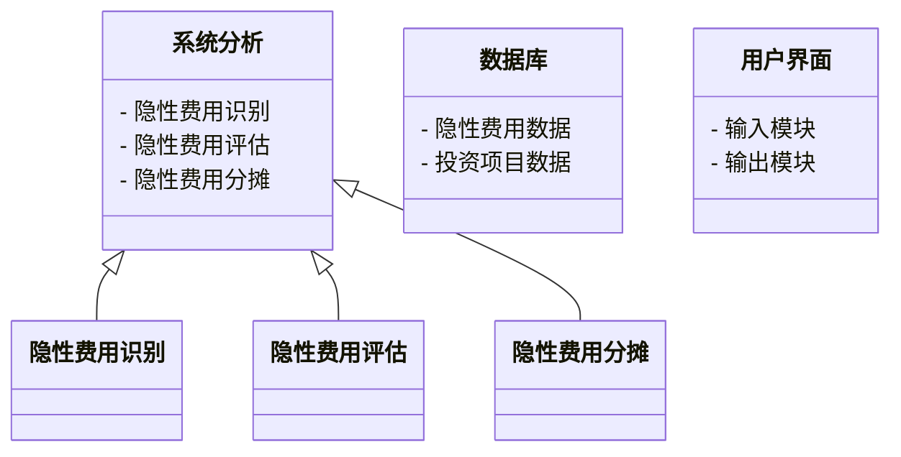
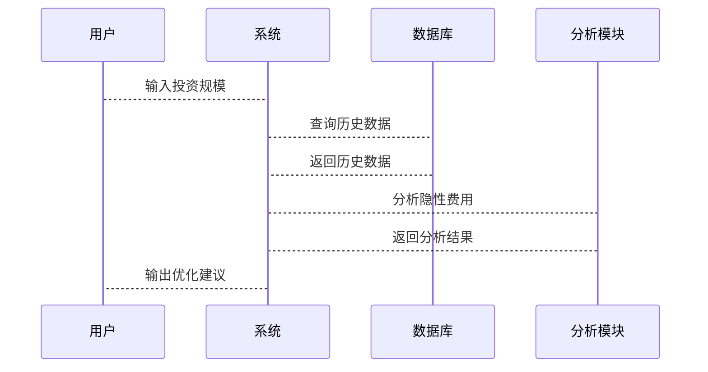

                 


# 约翰·伯格的投资成本控制：应对隐性费用上升的挑战

## 关键词
- 投资成本控制
- 隐性费用
- 投资决策
- 成本优化
- 数学模型
- 算法原理
- 系统架构

## 摘要
本文详细探讨了投资成本控制的背景、核心概念、数学模型、算法原理、系统架构设计及实际项目案例。通过分析隐性费用的形成机制、影响因素及其与投资决策的关系，结合数学优化模型和算法，提出了一套系统化的投资成本控制框架。文章还通过具体案例展示了如何在实际项目中应用这些理论和方法，为投资者和企业提供了一套应对隐性费用上升挑战的解决方案。

---

## 第一部分: 投资成本控制的背景与核心概念

### 第1章: 投资成本控制的背景与问题描述

#### 1.1 投资成本控制的定义与范围
##### 1.1.1 投资成本的基本概念
投资成本是指在投资活动中产生的所有费用，包括显性成本和隐性成本。显性成本是指可以直接量化的费用，如材料费、人工费等；隐性成本是指难以直接量化的费用，如机会成本、时间成本等。投资成本控制的目标是通过优化资源配置，降低整体投资成本，提高投资回报率。

##### 1.1.2 投资成本的分类与构成
投资成本可以分为以下几类：
- **显性成本**：直接可量化的费用，如原材料费、设备购置费等。
- **隐性成本**：间接或难以量化的费用，如机会成本、时间成本、管理成本等。
- **固定成本**：与投资活动无关，但必须支付的费用，如场地租赁费。
- **可变成本**：与投资活动的规模相关，如人工费、能源消耗费。

##### 1.1.3 隐性费用的定义与特点
隐性费用是指在投资活动中，由于信息不对称、市场波动、管理不善等原因，导致投资成本增加的费用。隐性费用的特点包括：
- 隐性费用难以量化，通常隐藏在整体成本中。
- 隐性费用的产生与投资决策的复杂性密切相关。
- 隐性费用的控制需要通过优化投资策略和管理流程来实现。

#### 1.2 隐性费用的上升趋势
##### 1.2.1 隐性费用的形成机制
隐性费用的形成机制包括以下几个方面：
1. **信息不对称**：投资者与项目方之间的信息不对称可能导致隐性费用的增加。
2. **市场波动**：市场价格的波动可能导致投资成本的隐性增加。
3. **管理不善**：管理流程的不完善可能导致隐性费用的积累。

##### 1.2.2 隐性费用上升的驱动因素
隐性费用上升的驱动因素包括：
- 投资项目的复杂性增加。
- 市场竞争加剧，导致隐性费用上升。
- 管理层对隐性费用的忽视。

##### 1.2.3 隐性费用对企业投资的影响
隐性费用对企业投资的影响主要体现在以下几个方面：
- 隐性费用的增加会降低投资项目的净收益。
- 隐性费用的上升可能导致投资决策的失误。
- 隐性费用的积累可能影响企业的长期发展。

#### 1.3 投资成本控制的必要性
##### 1.3.1 投资成本失控的后果
- 投资成本失控可能导致项目亏损。
- 投资成本失控可能影响企业的财务健康。
- 投资成本失控可能导致投资决策的失误。

##### 1.3.2 隐性费用对企业利润的侵蚀
隐性费用的侵蚀主要体现在以下几个方面：
- 隐性费用的增加会降低企业的利润率。
- 隐性费用的积累可能导致企业的财务压力增大。
- 隐性费用的上升可能影响企业的市场竞争力。

##### 1.3.3 投资成本控制的边界与外延
投资成本控制的边界包括：
- 投资成本控制的范围。
- 投资成本控制的主体。
- 投资成本控制的手段。

---

### 第2章: 投资成本控制的核心概念与联系

#### 2.1 隐性费用的核心原理
##### 2.1.1 隐性费用的识别与评估
隐性费用的识别与评估需要通过以下几个步骤：
1. **识别隐性费用的来源**：分析投资项目的各个阶段，识别可能产生隐性费用的环节。
2. **评估隐性费用的影响**：通过数据分析和模拟，评估隐性费用对投资回报的影响。
3. **量化隐性费用**：将隐性费用转化为可量化的指标。

##### 2.1.2 隐性费用与显性费用的对比
隐性费用与显性费用的对比可以通过以下表格进行：

| 费用类型 | 定义 | 特点 | 量化难度 |
|----------|------|------|----------|
| 显性费用 | 可直接量化的费用 | 直接相关，易于量化 | 低 |
| 隐性费用 | 难以量化的费用 | 间接相关，难以量化 | 高 |

##### 2.1.3 隐性费用的量化方法
隐性费用的量化方法包括：
1. **成本分摊法**：将隐性费用分摊到各个投资项目中。
2. **回归分析法**：通过回归分析，识别隐性费用的影响因素。
3. **模拟法**：通过模拟投资项目的运行，估算隐性费用。

#### 2.2 隐性费用与投资决策的关系
##### 2.2.1 投资决策中的隐性费用分析
投资决策中的隐性费用分析需要考虑以下几个方面：
- 投资项目的生命周期。
- 投资项目的规模和复杂性。
- 投资项目的市场环境。

##### 2.2.2 隐性费用对投资回报的影响
隐性费用对投资回报的影响可以通过以下公式表示：
$$ ROI = \frac{投资收益 - 总成本}{总成本} $$
其中，总成本包括显性费用和隐性费用。

##### 2.2.3 隐性费用的生命周期管理
隐性费用的生命周期管理包括以下几个阶段：
1. **识别阶段**：识别可能产生隐性费用的环节。
2. **评估阶段**：评估隐性费用的影响。
3. **控制阶段**：制定隐性费用控制策略。
4. **优化阶段**：优化隐性费用控制措施。

#### 2.3 投资成本控制的系统性框架
##### 2.3.1 投资成本控制的系统架构
投资成本控制的系统架构可以用以下类图表示：



##### 2.3.2 隐性费用的ER实体关系图
隐性费用的ER实体关系图可以用以下方式表示：

```mermaid
erd
    title 隐性费用 ER 图
    项目 (项目ID, 项目名称, 开始时间, 结束时间)
    成本类型 (成本ID, 成本名称, 成本类型)
    隐性费用 (费用ID, 项目ID, 费用金额, 费用时间)
    项目 --> 隐性费用
    成本类型 --> 隐性费用
```

##### 2.3.3 隐性费用的流程图分析
隐性费用的流程图可以用以下方式表示：



---

## 第三部分: 隐性费用的数学模型与算法原理

### 第3章: 隐性费用的数学模型

#### 3.1 隐性费用的量化模型
##### 3.1.1 隐性费用的线性回归模型
隐性费用的线性回归模型可以用以下公式表示：
$$ y = a x + b $$
其中，y为隐性费用，x为投资规模，a为回归系数，b为截距。

##### 3.1.2 隐性费用的非线性模型
隐性费用的非线性模型可以用以下公式表示：
$$ y = a x^2 + b x + c $$
其中，y为隐性费用，x为投资规模，a、b、c为回归系数。

##### 3.1.3 隐性费用的动态模型
隐性费用的动态模型可以用以下差分方程表示：
$$ y_{t+1} = a y_t + b x_t + c $$

#### 3.2 投资成本优化的数学公式
##### 3.2.1 投资成本最小化模型
投资成本最小化模型可以用以下线性规划公式表示：
$$ \min \sum_{i=1}^{n} c_i x_i $$
$$ \text{约束条件：} \sum_{i=1}^{n} x_i \leq X $$

##### 3.2.2 投资回报率最大化模型
投资回报率最大化模型可以用以下公式表示：
$$ \max \frac{\text{投资收益} - \text{总成本}}{\text{总成本}} $$

##### 3.2.3 隐性费用与投资决策的数学关系
隐性费用与投资决策的数学关系可以用以下公式表示：
$$ \text{隐性费用} = f(\text{投资规模}, \text{市场环境}, \text{管理效率}) $$

---

### 第4章: 隐性费用的算法原理

#### 4.1 隐性费用的优化算法
##### 4.1.1 隐性费用的线性规划算法
隐性费用的线性规划算法可以用以下步骤实现：
1. **建立目标函数**：$$ \min \sum_{i=1}^{n} c_i x_i $$
2. **建立约束条件**：$$ \sum_{i=1}^{n} x_i \leq X $$
3. **求解线性规划问题**：使用单纯形法等优化算法求解。

##### 4.1.2 隐性费用的动态规划算法
隐性费用的动态规划算法可以用以下步骤实现：
1. **确定状态变量**：$$ S_t = \{x_1, x_2, ..., x_t\} $$
2. **建立状态转移方程**：$$ S_{t+1} = S_t + x_{t+1} $$
3. **求解最优解**：通过动态规划方法求解最优投资规模。

##### 4.1.3 隐性费用的遗传算法
隐性费用的遗传算法可以用以下步骤实现：
1. **初始化种群**：随机生成一组投资规模的解。
2. **计算适应度**：根据目标函数计算每个解的适应度。
3. **选择与交叉**：根据适应度进行选择和交叉，生成新的种群。
4. **变异与优化**：对新种群进行变异优化，直到满足收敛条件。

#### 4.2 算法的实现与优化
##### 4.2.1 算法实现的步骤
1. **确定问题目标**：明确隐性费用优化的目标。
2. **选择优化算法**：根据问题特点选择合适的优化算法。
3. **实现算法**：编写代码实现优化算法。
4. **测试与验证**：通过测试用例验证算法的正确性。

##### 4.2.2 算法优化的策略
1. **参数优化**：调整算法的参数，如种群大小、交叉率等。
2. **局部优化**：在全局优化的基础上进行局部优化。
3. **并行计算**：利用并行计算加速算法的执行。

##### 4.2.3 算法的复杂度分析
隐性费用优化算法的复杂度分析需要考虑以下几个方面：
- 算法的时间复杂度。
- 算法的空间复杂度。
- 算法的收敛速度。

#### 4.3 算法的流程图
隐性费用优化算法的流程图可以用以下方式表示：



---

## 第四部分: 隐性费用的系统分析与架构设计

### 第5章: 隐性费用的系统分析

#### 5.1 问题场景介绍
隐性费用的系统分析需要考虑以下几个问题场景：
1. **投资项目的复杂性**：投资项目规模大、涉及部门多。
2. **市场环境的不确定性**：市场价格波动大、政策变化频繁。
3. **管理流程的不完善**：管理流程复杂、信息传递不畅。

#### 5.2 项目介绍
隐性费用的系统分析项目包括以下几个方面：
1. **项目目标**：建立隐性费用的系统分析模型。
2. **项目范围**：涵盖投资项目的全生命周期。
3. **项目团队**：包括项目经理、数据分析师、系统设计师等。

#### 5.3 系统功能设计
隐性费用的系统功能设计可以用以下类图表示：



---

### 第6章: 隐性费用的系统架构设计

#### 6.1 系统架构设计
隐性费用的系统架构设计可以用以下方式表示：


#### 6.2 系统接口设计
隐性费用的系统接口设计包括以下几个方面：
1. **输入接口**：用户输入投资项目的相关数据。
2. **输出接口**：系统输出隐性费用的分析结果。
3. **数据接口**：系统与数据库之间的数据交互。

#### 6.3 系统交互设计
隐性费用的系统交互设计可以用以下序列图表示：



---

## 第五部分: 隐性费用的项目实战

### 第7章: 隐性费用的项目实战

#### 7.1 环境安装
隐性费用的项目实战需要以下环境：
1. **编程语言**：Python 3.8+
2. **开发工具**：PyCharm、Jupyter Notebook
3. **依赖库**：numpy、pandas、scipy、matplotlib

#### 7.2 系统核心实现
隐性费用的系统核心实现包括以下几个方面：
1. **数据采集**：从数据库中采集投资项目的相关数据。
2. **数据分析**：对隐性费用进行识别和评估。
3. **数据可视化**：将分析结果可视化。

#### 7.3 代码应用解读与分析
隐性费用的代码实现可以用以下代码示例：

```python
import numpy as np
import pandas as pd
from scipy.optimize import linprog

# 线性规划模型
c = np.array([1, 1, 1])
A = np.array([[1, 0, 0], [0, 1, 0], [0, 0, 1]])
b = np.array([10, 20, 30])
result = linprog(c, A_ub=A, b_ub=b, method='highs')

# 遗传算法
def fitness(x):
    return -sum(c * x)

from scipy.optimize import GA

ga = GA(n_vars=3, n_bits=10, n_pop=50, max_iter=100)
ga.fit(fitness)
best = ga.best()
```

#### 7.4 实际案例分析
隐性费用的实际案例分析包括以下几个方面：
1. **案例背景**：某制造企业的投资成本控制。
2. **案例分析**：通过隐性费用的识别和评估，优化投资成本。
3. **案例总结**：总结隐性费用控制的经验和教训。

#### 7.5 项目小结
隐性费用的项目实战需要结合理论与实践，通过实际案例验证隐性费用控制的方法和策略。

---

## 第六部分: 隐性费用的最佳实践

### 第8章: 最佳实践

#### 8.1 小结
隐性费用的控制需要从以下几个方面入手：
1. **识别与评估**：准确识别隐性费用的来源和影响。
2. **优化与控制**：通过数学模型和优化算法，降低隐性费用。
3. **系统与流程**：建立完善的系统和流程，确保隐性费用的可控性。

#### 8.2 注意事项
隐性费用的控制需要注意以下几个方面：
1. **数据的准确性**：确保数据的准确性和完整性。
2. **模型的适用性**：选择适合的数学模型和优化算法。
3. **系统的可扩展性**：建立可扩展的系统架构，适应未来的发展需求。

#### 8.3 拓展阅读
隐性费用的控制需要结合企业的实际情况，不断优化和完善。以下是推荐的拓展阅读：
1. 《投资学基础》
2. 《成本控制与优化》
3. 《系统工程与优化》

---

## 总结
通过本文的详细探讨，我们可以看到，隐性费用的控制是投资成本控制的重要组成部分。通过建立数学模型、优化算法和系统架构，我们可以有效降低隐性费用，提高投资回报率。希望本文的分析和实践对读者在投资成本控制领域有所帮助。

