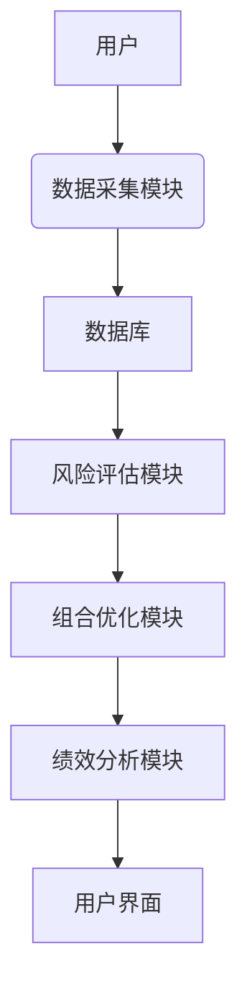
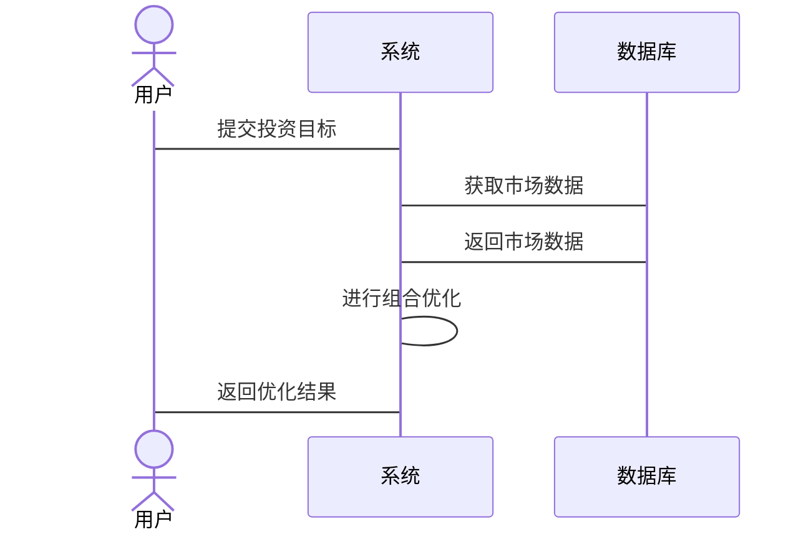
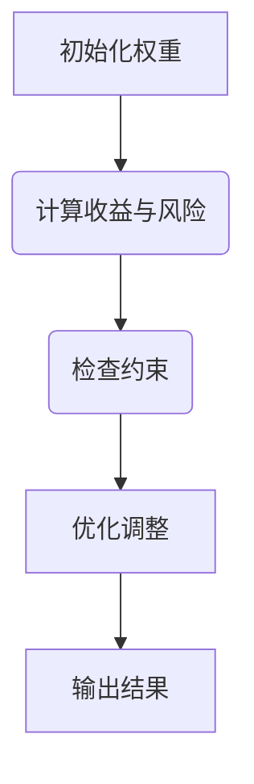

                 


```markdown
# 约翰·伯格的投资者教育：普及金融知识的重要性

## 关键词：
投资者教育，约翰·伯格，金融知识，投资策略，风险管理，资产配置，复利效应

## 摘要：
本文系统阐述了投资者教育的重要性，结合约翰·伯格的理论，分析了投资的基本原理、策略选择、风险管理及投资组合优化。通过数学模型和实际案例，深入探讨了投资者在金融市场的行为决策、资产配置优化和长期投资策略，旨在帮助读者提升金融素养，优化投资决策。

---

## 第四部分: 投资组合管理与优化

# 第4章: 投资组合管理的系统架构

## 4.1 投资组合管理的系统功能

### 4.1.1 系统功能概述
- 资产配置优化
- 风险评估与管理
- 绩效评估与反馈
- 市场数据处理与分析

### 4.1.2 功能模块设计
- 数据采集模块
- 风险评估模块
- 组合优化模块
- 绩效分析模块

## 4.2 系统架构设计

### 4.2.1 系统架构设计


### 4.2.2 数据流设计
- 数据输入：市场数据、资产价格、用户目标
- 数据处理：数据清洗、特征提取
- 数据输出：优化结果、风险评估报告

## 4.3 系统接口设计

### 4.3.1 接口设计
- API接口：数据接口、计算接口
- 接口文档：输入、输出、错误处理

## 4.4 系统交互流程



## 4.5 本章小结

---

# 第5章: 投资组合管理的数学模型与算法优化

## 5.1 投资组合管理的数学模型

### 5.1.1 现代投资组合理论（MPT）
- 均值-方差优化
- 投资者效用函数

### 5.1.2 数学公式
$$\text{目标函数：} \min_w \sigma^2(w)$$
$$\text{约束条件：} \sum_{i=1}^n w_i = 1, \quad w_i \geq 0$$

### 5.1.3 模型对比
| 模型 | 输入 | 输出 | 优势 |
|------|------|------|------|
| MPT  | 预期收益、协方差矩阵 | 最小方差组合 | 理论基础强 |
| 简单平均 | 无 | 等权重组合 | 易实现 |

## 5.2 投资组合优化算法

### 5.2.1 算法流程


### 5.2.2 Python实现
```python
import numpy as np
from scipy.optimize import minimize

# 定义目标函数
def objective(weights, covariance_matrix):
    return np.dot(weights.T, np.dot(covariance_matrix, weights))

# 约束条件
def constraint(weights, risk_asset):
    return weights[0] - risk_asset

# 求解优化问题
def portfolio_optimization(returns, covariance_matrix, risk_asset=0.5):
    n = len(weights)
    init_weights = np.array([1.0/n]*n)
    result = minimize(objective, init_weights, 
                     constraints={'type': 'eq', 'fun': constraint, 'args': (risk_asset,)},
                     bounds=[(0, 1) for _ in range(n)])
    return result.x

# 示例数据
returns = np.array([0.1, 0.12, 0.08])
covariance_matrix = np.array([[0.02, 0.01, 0.01],
                              [0.01, 0.03, 0.02],
                              [0.01, 0.02, 0.03]])
weights = portfolio_optimization(returns, covariance_matrix)
print(weights)
```

## 5.3 实证分析与案例研究

### 5.3.1 案例分析
- 数据来源：历史价格、市场数据
- 实证结果：最优权重分布、风险收益比

### 5.3.2 结果解读
- 组合波动性
- 收益与风险的平衡

## 5.4 本章小结

---

# 第六部分: 投资者的最佳实践

# 第6章: 投资组合管理的实践经验

## 6.1 投资组合管理的关键点

### 6.1.1 分散投资的重要性
- 股票、债券、现金的配置比例

### 6.1.2 长期投资的策略
- 定期定额投资
- 持有优质资产

## 6.2 投资者常见误区

### 6.2.1 过度交易
- 频繁买卖的弊端
- 交易成本的累积效应

### 6.2.2 追涨杀跌
- 市场高位追入的风险
- 低位恐慌抛售的损失

## 6.3 投资者教育的持续性

### 6.3.1 知识更新
- 市场环境变化
- 新的投资工具出现

### 6.3.2 实践反馈
- 投资组合的定期审视
- 投资策略的动态调整

## 6.4 本章小结

---

## 结论

通过系统地分析投资者教育的重要性和投资组合管理的核心内容，本文旨在帮助读者建立科学的投资理念，掌握有效的投资方法，避免常见误区，实现财富的稳健增长。约翰·伯格的教育理念强调长期投资和价值投资，这为投资者提供了宝贵的指导和启发。

---

## 参考文献

1. 约翰·伯格. (1991). 《The Little Book of Common Sense Investing》
2. 哈里·马科维茨. (1952). 《Portfolio Selection》
3. 约翰·特雷恩. (2001). 《机构投资者的共同基金投资》
4. 巴菲特. (2019). 《股东的信》
5. 理查德·费希尔. (2000). 《投资革命》
6. 罗伯特·希勒. (2005). 《非理性繁荣》
7. 李录. (2019). 《投资最重要的事》

---

## 致谢

感谢读者的耐心阅读，感谢约翰·伯格的智慧分享，感谢金融领域的每一位探索者。
```

