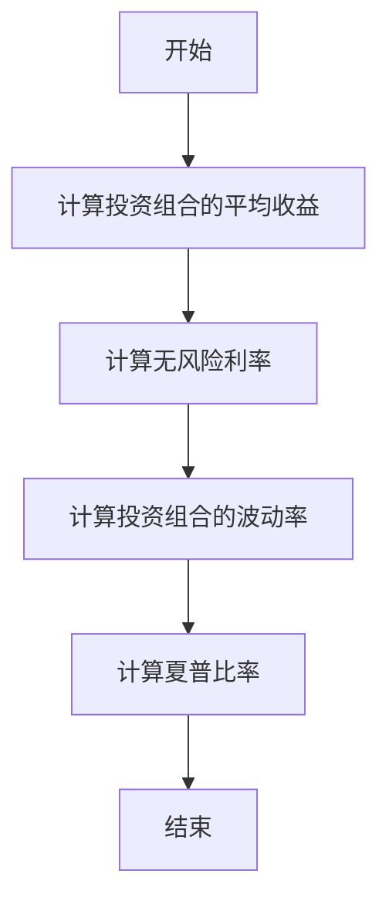
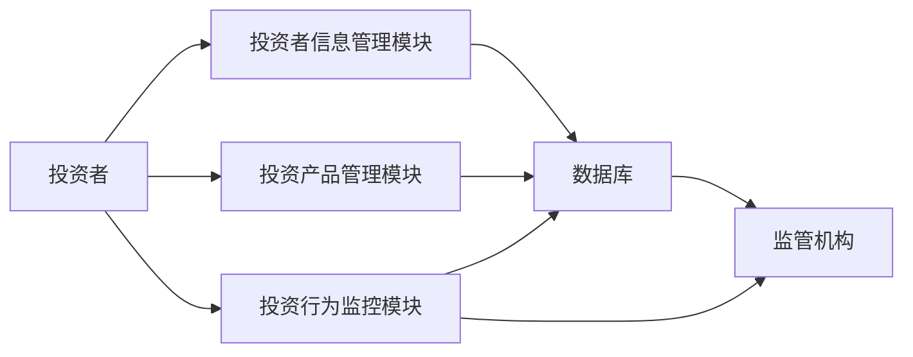

                 


# 约翰·伯格的投资者权益保护观

## 关键词：投资者权益保护，约翰·伯格，投资理论，风险管理，法律框架

## 摘要：  
约翰·伯格是投资领域的重要人物，他的投资者权益保护观强调透明度、公平性和长期价值。本文通过分析伯格的核心思想，结合法律框架、风险管理、系统架构和项目实战，系统化地探讨投资者权益保护的实现方法。

## 第一部分：投资者权益保护概述

### 第1章：投资者权益保护的背景与意义

#### 1.1 投资者权益保护的背景
- **1.1.1 投资者权益保护的定义与内涵**  
  投资者权益保护是指在投资活动中，确保投资者的合法权益不受侵害，包括知情权、参与权、收益权和监督权。

- **1.1.2 投资者权益保护的重要性**  
  投资者权益保护是维护市场公正、促进投资信心的重要基础，确保投资者在市场中的合法权益。

- **1.1.3 投资者权益保护的法律框架**  
  包括相关法律法规，如《证券法》和《公司治理准则》，确保投资者权益的法律保障。

#### 1.2 约翰·伯格的投资者权益保护观
- **1.2.1 约翰·伯格的生平与投资理念**  
  伯格是指数基金之父，强调长期投资和分散风险。

- **1.2.2 伯格的投资者权益保护思想**  
  伯格认为透明度和公平性是保护投资者权益的关键，反对过度复杂的金融产品。

- **1.2.3 伯格与现代投资理论的联系**  
  伯格的理论对现代投资组合理论和风险管理有重要影响。

### 第2章：投资者权益保护的核心概念

#### 2.1 投资者权益保护的核心要素
- **2.1.1 投资者权益保护的主体**  
  包括投资者、监管机构和金融机构。

- **2.1.2 投资者权益保护的客体**  
  包括投资产品、服务和市场行为。

- **2.1.3 投资者权益保护的主要内容**  
  包括知情权、收益权、参与权和监督权。

#### 2.2 投资者权益保护与相关概念的对比
- **2.2.1 投资者权益保护与投资风险**  
  保护投资者权益可以减少投资风险，但需要平衡。

- **2.2.2 投资者权益保护与投资收益**  
  公平的保护机制可以提高投资收益的可持续性。

- **2.2.3 投资者权益保护与投资监管**  
  监管是保护投资者权益的重要手段，但需避免过度监管。

#### 2.3 投资者权益保护的ER实体关系图

```mermaid
erDiagram
    actor 投资者 {
        <属性> 投资者ID
        <属性> 投资者名称
        <属性> 投资者类型
    }
    actor 监管机构 {
        <属性> 监管机构ID
        <属性> 监管机构名称
        <属性> 监管范围
    }
    actor 金融机构 {
        <属性> 金融机构ID
        <属性> 金融机构名称
        <属性> 金融机构类型
    }
    投资者 --> 监管机构 : 投诉与举报
    投资者 --> 金融机构 : 投资行为
    监管机构 --> 金融机构 : 监管与指导
```

## 第二部分：投资者权益保护的算法与数学模型

### 第3章：投资者权益保护的算法原理

#### 3.1 投资者权益保护的数学模型
- **夏普比率**：评估投资组合的风险调整后收益，公式为：
  $$ \text{夏普比率} = \frac{E(R_p) - R_f}{\sigma_p} $$
  其中，$E(R_p)$ 是投资组合的期望收益，$R_f$ 是无风险利率，$\sigma_p$ 是投资组合的波动率。

#### 3.2 夏普比率的实现步骤



#### 3.3 Python代码实现

```python
import numpy as np

def calculate_sharpe_ratio(returns, risk_free_rate):
    # 计算平均收益
    mean_return = np.mean(returns)
    # 计算波动率
    std_deviation = np.std(returns)
    # 计算夏普比率
    sharpe_ratio = (mean_return - risk_free_rate) / std_deviation
    return sharpe_ratio

# 示例数据
returns = np.random.normal(0.05, 0.1, 100)
risk_free_rate = 0.02
print("夏普比率:", calculate_sharpe_ratio(returns, risk_free_rate))
```

## 第三部分：系统分析与架构设计

### 第4章：系统功能设计

#### 4.1 投资者权益保护系统的功能模块

- **4.1.1 投资者信息管理**  
  包括投资者注册、信息更新和查询功能。

- **4.1.2 投资产品管理**  
  包括产品信息录入、维护和查询功能。

- **4.1.3 投资行为监控**  
  包括实时监控、异常行为预警和投诉处理。

#### 4.2 系统架构设计



## 第四部分：项目实战

### 第5章：构建投资者权益保护指数

#### 5.1 环境安装
- 安装Python和相关库：
  ```bash
  pip install numpy pandas matplotlib
  ```

#### 5.2 核心代码实现

```python
import pandas as pd
import numpy as np

def calculate_protection_index(dataframe):
    # 计算平均收益
    mean_return = dataframe['收益'].mean()
    # 计算波动率
    std_return = dataframe['收益'].std()
    # 计算保护指数
    protection_index = mean_return / std_return
    return protection_index

# 示例数据
data = {'收益': [0.05, 0.03, 0.04, 0.02, 0.06]}
df = pd.DataFrame(data)
print("保护指数:", calculate_protection_index(df))
```

#### 5.3 案例分析与解读
- 通过实际案例分析保护指数的意义，说明如何指导投资决策。

#### 5.4 项目小结
- 总结项目实施的经验和教训，提出改进建议。

## 第五部分：总结与展望

### 第6章：总结与展望

#### 6.1 全文总结
- 约翰·伯格的投资者权益保护观强调透明度和公平性，结合法律和风险管理，提供了系统化的保护方法。

#### 6.2 未来展望
- 结合人工智能和大数据技术，探索更智能的投资者权益保护机制。

#### 6.3 最佳实践 tips
- 定期审查投资协议，关注监管动态，选择透明的金融机构。

#### 6.4 小结
- 投资者权益保护是长期而重要的任务，需持续关注和改进。

---

通过以上结构，文章系统地探讨了约翰·伯格的投资者权益保护观，并结合实际案例和系统设计，提供了全面的技术分析和实践指导。

