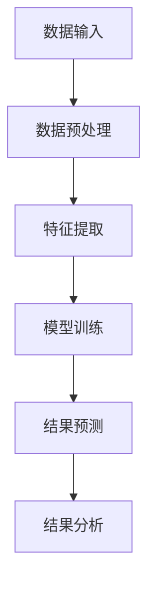
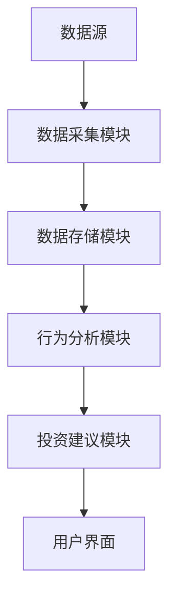
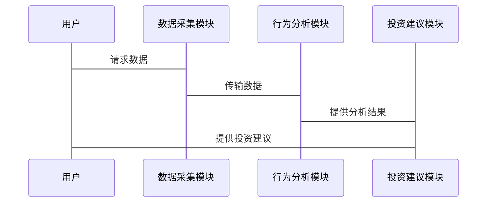

                 


# 约翰·伯格的投资者行为分析

## 关键词：
投资者行为分析，价值投资，约翰·伯格，行为金融学，投资策略

## 摘要：
本文深入分析约翰·伯格的投资者行为，探讨其投资理念、决策过程及对现代投资策略的影响。通过技术与行为分析的结合，揭示伯格的成功秘诀，为投资者提供实用的分析框架和工具。

---

## 第一部分：背景介绍

### 第1章：投资者行为分析概述

#### 1.1 投资者行为分析的背景
投资者行为分析是研究投资者在金融市场中的决策过程及其影响的学科。金融市场复杂多变，投资者的决策受到心理、环境和信息等多种因素的影响。投资者行为分析帮助我们理解这些决策背后的逻辑，优化投资策略。

#### 1.2 约翰·伯格的生平与投资理念
约翰·伯格是投资界的传奇，以价值投资闻名。他创立了先锋集团，倡导长期投资和分散投资。他的投资理念强调基本面分析和长期视角，认为市场波动为投资者提供了买入优质资产的机会。

#### 1.3 投资者行为分析的核心概念
投资者行为分析关注投资者的决策过程，包括信息处理、情绪影响和认知偏差。通过分析这些因素，可以识别和纠正非理性决策，提升投资效果。

#### 1.4 经典案例分析
伯格在职业生涯中多次成功预测市场崩盘，如互联网泡沫和2008年金融危机。他的决策展示了基本面分析和长期投资策略的有效性，为行为分析提供了丰富案例。

---

## 第二部分：核心概念与联系

### 第2章：投资者行为分析的核心概念

#### 2.1 投资者行为分析的原理
投资者行为受心理因素影响，如贪婪和恐惧导致非理性决策。理性与非理性行为对投资结果有显著影响，行为偏差如过度自信和从众心理影响决策质量。

#### 2.2 核心概念对比分析
通过对比不同投资策略和行为特征，分析其对结果的影响。例如，价值投资强调长期视角，而短期交易受市场情绪驱动。

#### 2.3 投资者行为的ER实体关系图
```mermaid
er
    entity 投资者 {
        id
        name
        年龄
        性别
        风险偏好
    }
    entity 投资行为 {
        id
        投资者id
        投资时间
        投资金额
        投资类型
    }
    entity 投资结果 {
        id
        投资行为id
        收益率
        风险程度
    }
```

---

## 第三部分：算法原理讲解

### 第3章：投资者行为分析的算法原理

#### 3.1 投资者行为分析的流程
数据收集与预处理、特征提取、模型训练、结果预测和分析。

#### 3.2 基于机器学习的行为分析算法


#### 3.3 算法实现代码
```python
import pandas as pd
from sklearn.model import LinearRegression

def value_analysis(data):
    # 特征提取
    features = data[['市盈率', '市净率', '股息率']]
    target = data['未来收益']
    
    # 模型训练
    model = LinearRegression()
    model.fit(features, target)
    
    return model

# 示例数据
data = {
    '市盈率': [15, 20, 18],
    '市净率': [2, 3, 1.5],
    '股息率': [2, 1.5, 3],
    '未来收益': [10, 8, 12]
}
df = pd.DataFrame(data)
model = value_analysis(df)
print(model.coef_)
```

数学模型：市盈率和市净率与收益的关系，使用线性回归模型预测。

---

## 第四部分：系统分析与架构设计

### 第4章：投资者行为分析系统的架构设计

#### 4.1 项目介绍
设计一个投资者行为分析系统，分析伯格的投资行为，提供行为分析工具。

#### 4.2 系统功能设计
- 数据采集模块：收集市场数据和投资者行为数据。
- 行为分析模块：识别行为模式，检测偏差。
- 投资建议模块：基于分析结果，提供投资建议。

#### 4.3 系统架构设计


#### 4.4 系统接口设计
- 数据接口：REST API，用于数据输入和输出。
- 用户接口：图形界面，展示分析结果。

#### 4.5 系统交互


---

## 第五部分：项目实战

### 第5章：投资者行为分析系统的实现

#### 5.1 环境安装
安装Python、Pandas、Scikit-learn和Mermaid工具。

#### 5.2 核心功能实现
实现数据采集、行为分析和投资建议功能，代码如下：

```python
import pandas as pd
from sklearn.linear_model import LinearRegression

def analyze_behavior(data):
    # 特征提取
    features = data[['市盈率', '市净率', '股息率']]
    target = data['未来收益']
    
    # 模型训练
    model = LinearRegression()
    model.fit(features, target)
    
    return model.predict(features)

# 示例数据
data = {
    '市盈率': [15, 20, 18],
    '市净率': [2, 3, 1.5],
    '股息率': [2, 1.5, 3],
    '未来收益': [10, 8, 12]
}
df = pd.DataFrame(data)
model = LinearRegression()
model.fit(df[['市盈率', '市净率', '股息率']], df['未来收益'])
predictions = model.predict(df[['市盈率', '市净率', '股息率']])
print("预测收益：", predictions)
```

#### 5.3 实际案例分析
分析伯格的经典投资案例，如互联网泡沫时期的决策，展示系统如何识别和预测。

---

## 第六部分：最佳实践与小结

### 第6章：最佳实践与小结

#### 6.1 小结
投资者行为分析对理解伯格的投资策略至关重要，结合技术方法可提升分析深度和效果。

#### 6.2 注意事项
- 数据质量影响分析结果。
- 算法选择需结合具体场景。
- 结果需结合市场环境解读。

#### 6.3 拓展阅读
推荐书籍和资源，深入学习投资者行为分析和价值投资。

---

通过以上分析，我们可以系统地理解约翰·伯格的投资行为，掌握投资者行为分析的技术方法，提升投资决策的科学性。

