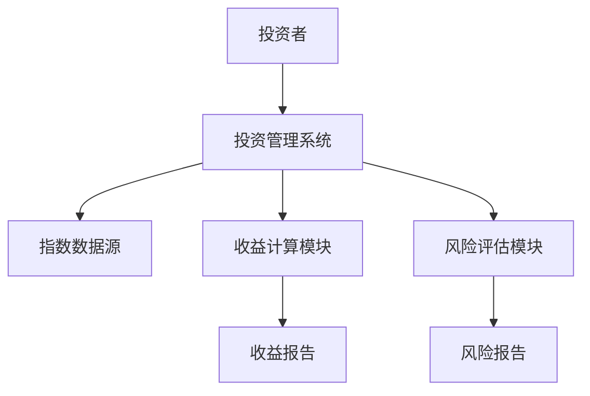

                 


# 约翰·伯格的指数基金投资理论

## 关键词：指数基金、被动投资、长期投资、分散投资、CAPM模型

## 摘要：指数基金作为一种重要的投资工具，近年来备受关注。本文深入探讨约翰·伯格的指数基金投资理论，从核心概念到实际应用，结合数学模型和系统架构，为读者提供全面的分析。通过本文，读者将了解指数基金的投资策略、算法原理以及实际操作方法，掌握如何在投资中应用这些理论。

---

## 第一部分：指数基金投资的背景

### 第1章：指数基金的基本概念

#### 1.1 指数基金的定义与特点

指数基金是一种被动管理型基金，其目标是复制特定市场指数的表现。它的核心在于跟踪指数，而非主动选择个股，因此具有以下特点：

- **广泛分散**：投资于多个股票或债券，降低单一资产的风险。
- **低成本**：被动管理费用较低，适合长期投资。
- **透明性**：投资者可以清晰了解基金的组成和投资比例。

指数基金的出现，改变了传统的主动投资模式，为投资者提供了更为稳健的选择。

#### 1.2 指数基金的历史发展

指数基金的历史可以追溯到20世纪70年代。1975年，第一只完全被动管理的指数基金在美国推出，标志着指数投资的开端。随着技术的进步和金融市场的成熟，指数基金逐渐普及，成为现代投资的重要组成部分。

#### 1.3 约翰·伯格的贡献

约翰·伯格是指数基金领域的先驱，他提出的理论奠定了指数投资的基础。伯格认为，长期来看，指数基金能够提供稳定的收益，同时风险较低。他的理论强调了分散投资和长期持有的重要性，为后来的指数基金发展提供了理论支持。

---

## 第二部分：指数基金的核心概念

### 第2章：指数基金的投资策略

#### 2.1 被动投资与主动投资

- **被动投资**：通过跟踪指数实现收益，费用低，风险分散。
- **主动投资**：依赖基金经理的选股能力，费用高，风险集中。

被动投资适合长期稳健的投资者，而主动投资则适合风险承受能力强的投资者。

#### 2.2 长期投资与短期投资

- **长期投资**：注重长期收益，忽略短期波动，适合指数基金。
- **短期投资**：追求短期收益，风险较高，不适合被动管理。

长期投资策略强调时间和复利的重要性，是指数基金的核心理念。

#### 2.3 分散投资与集中投资

- **分散投资**：通过投资多个资产降低风险。
- **集中投资**：将资金集中在少数资产上，风险高，收益潜力大。

分散投资是指数基金的核心策略，通过广泛分散降低市场风险。

---

## 第三部分：指数基金的算法原理

### 第3章：CAPM模型

#### 3.1 CAPM模型的基本原理

CAPM（资本资产定价模型）用于评估资产的预期收益，公式为：

$$ E(R_i) = R_f + \beta_i (E(R_m) - R_f) $$

其中，$E(R_i)$是资产的预期收益率，$R_f$是无风险利率，$\beta_i$是资产的贝塔系数，$E(R_m)$是市场预期收益率。

#### 3.2 指数基金的贝塔系数

指数基金的贝塔系数通常为1，表示其收益与市场同步波动。这使得指数基金的风险与市场风险一致，适合追求市场平均收益的投资者。

---

## 第四部分：指数基金的系统分析

### 第4章：系统架构设计

#### 4.1 系统功能设计

- **数据采集**：获取市场指数数据。
- **计算收益**：计算基金的收益和风险。
- **风险评估**：使用CAPM模型评估风险。

#### 4.2 系统架构图



---

## 第五部分：指数基金的项目实战

### 第5章：环境安装与核心代码实现

#### 5.1 环境安装

安装Python和必要的库：

```bash
pip install pandas numpy matplotlib
```

#### 5.2 核心代码实现

计算指数基金的收益和风险：

```python
import pandas as pd
import numpy as np

# 假设指数数据为df，包含'Adj Close'列
df['Returns'] = df['Adj Close'].pct_change()

# 计算平均回报率
average_return = df['Returns'].mean()

# 计算波动率
volatility = df['Returns'].std()

print(f"平均回报率：{average_return}")
print(f"波动率：{volatility}")
```

---

## 第六部分：指数基金的最佳实践

### 第6章：投资策略与风险管理

#### 6.1 投资策略

- **定投**：定期定额投资，分散风险。
- **长期持有**：避免频繁交易，减少费用和税收。

#### 6.2 风险管理

- **定期再平衡**：调整投资组合，保持目标比例。
- **避免过度分散**：合理配置资产，避免流动性风险。

---

## 第七部分：小结与拓展阅读

### 7.1 小结

约翰·伯格的指数基金投资理论为现代投资提供了重要的指导。通过被动投资、长期持有和分散投资，指数基金为投资者提供了稳健的收益和较低的风险。

### 7.2 拓展阅读

推荐书籍：《指数基金投资指南》、《投资学》。

---

通过本文的详细讲解，读者可以全面了解约翰·伯格的指数基金投资理论，并能够将其应用于实际投资中。指数基金作为一种重要的投资工具，值得每位投资者深入了解和应用。

