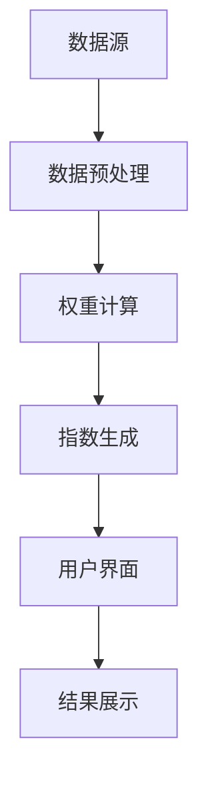

                 


# 约翰·伯格的指数基金构建原则

## 关键词：约翰·伯格、指数基金、被动投资、现代投资组合理论、CAPM、有效市场假说

## 摘要：本文深入探讨约翰·伯格的指数基金构建原则，从指数基金的基本概念、理论基础到实际算法实现，结合系统架构设计和项目实战，全面剖析指数基金的投资价值和构建方法。

---

## 第1章：指数基金的背景与核心概念

### 1.1 指数基金的定义与背景

#### 1.1.1 指数基金的基本概念
指数基金是一种被动管理型基金，其投资目标是跟踪特定市场指数的表现。通过投资指数中的成分股，投资者可以以较低的成本获得市场的平均收益。

#### 1.1.2 指数基金的历史发展
指数基金的概念最早由约翰·伯格在20世纪70年代提出，他创立了先锋集团，并推广了低成本指数基金。指数基金的发展经历了从最初的简单市值加权到如今多样化权重的方法。

#### 1.1.3 指数基金的核心特点
- **被动管理**：指数基金不主动选股，而是被动跟踪指数。
- **分散风险**：通过投资多个成分股分散投资风险。
- **低成本**：管理费用低，适合长期投资。

#### 1.1.4 指数基金与主动管理的对比
| 特性 | 指数基金 | 主动管理基金 |
|------|----------|--------------|
| 管理方式 | 被动跟踪指数 | 主动选股和择时 |
| 成本 | 低 | 高 |
| 风险 | 分散 | 较高 |

---

## 第2章：指数基金的核心原理

### 2.1 指数基金的构建原理

#### 2.1.1 指数基金的构建方法
指数基金的构建基于指数的成分股和权重。常见的构建方法包括市值加权和等权重加权。

- **市值加权**：按成分股的市值比例分配投资比例。
- **等权重加权**：每个成分股的投资比例相等。

#### 2.1.2 市值加权与等权重指数的比较
| 特性 | 市值加权 | 等权重加权 |
|------|----------|-------------|
| 风险分散 | 较好 | 更好 |
| 成本 | 较低 | 较低 |
| 收益 | 接近市场平均 | 可能超过市场平均 |

#### 2.1.3 指数成分股的选择标准
- **流动性**：选择流动性高的成分股。
- **市值**：通常选择大中市值的公司。
- **行业分布**：尽量覆盖广泛的行业。

### 2.2 指数基金的数学模型

#### 2.2.1 指数基金的计算公式
指数值的计算公式为：
$$
\text{指数值} = \sum_{i=1}^{n} w_i \times p_i
$$
其中，\( w_i \) 是成分股i的权重，\( p_i \) 是成分股i的价格。

#### 2.2.2 指数基金的权重分配方法
权重分配可以是市值加权、等权重或其他方法。以下是市值加权的计算步骤：
1. 计算每个成分股的市值。
2. 计算总市值。
3. 计算每个成分股的权重：\( w_i = \frac{\text{市值}_i}{\text{总市值}} \)。

### 2.3 指数基金的理论基础

#### 2.3.1 现代投资组合理论（MPT）
MPT认为，通过分散投资可以降低非系统性风险，指数基金通过投资多个成分股实现这一目标。

#### 2.3.2 资本资产定价模型（CAPM）
CAPM用于计算资产的预期收益：
$$
E(R_i) = R_f + \beta_i (R_m - R_f)
$$
其中，\( \beta_i \) 是成分股的贝塔系数，衡量其系统性风险。

#### 2.3.3 有效市场假说
有效市场假说认为市场价格反映所有可用信息，被动投资无法跑赢市场。

---

## 第3章：指数基金的算法与实现

### 3.1 指数基金的算法实现

#### 3.1.1 数据预处理
1. 数据清洗：处理缺失值和异常值。
2. 数据标准化：将数据转换为统一格式。

#### 3.1.2 权重计算
1. 计算每个成分股的市值。
2. 计算总市值。
3. 计算权重：\( w_i = \frac{\text{市值}_i}{\text{总市值}} \)。

#### 3.1.3 指数生成
1. 根据权重和价格计算指数值。
2. 计算指数的收益率。

#### 3.1.4 风险评估
使用夏普比率衡量风险调整后的收益：
$$
\text{夏普比率} = \frac{E(R_p) - R_f}{\sigma_p}
$$
其中，\( E(R_p) \) 是指数基金的预期收益，\( R_f \) 是无风险利率，\( \sigma_p \) 是指数基金的波动率。

#### 3.1.5 代码实现
以下是Python代码示例：
```python
import pandas as pd
import numpy as np

# 假设data为成分股的价格数据
data = pd.DataFrame({
    '股票A': [10, 20, 30],
    '股票B': [15, 25, 35],
    '股票C': [20, 30, 40]
})

# 计算市值加权指数
total = data.sum().sum()
weights = data.sum() / total
index_value = np.dot(weights, data.mean())
print(index_value)
```

---

## 第4章：指数基金的系统架构与设计

### 4.1 系统架构设计

#### 4.1.1 数据源
- 股票价格数据
- 市场指数数据

#### 4.1.2 计算引擎
- 数据预处理
- 权重计算
- 指数生成

#### 4.1.3 用户界面
- 数据可视化
- 结果展示

### 4.2 系统架构图


---

## 第5章：指数基金的项目实战

### 5.1 项目介绍
构建一个沪深300指数基金，跟踪沪深300指数的表现。

### 5.2 项目实战步骤

#### 5.2.1 环境安装
安装必要的Python库：
```bash
pip install pandas numpy matplotlib
```

#### 5.2.2 代码实现
```python
import pandas as pd
import numpy as np

# 加载沪深300指数数据
data = pd.read_csv('沪深300.csv')

# 计算市值加权指数
total = data.sum().sum()
weights = data.sum() / total
index_value = np.dot(weights, data.mean())
print(index_value)
```

#### 5.2.3 案例分析
分析沪深300指数基金的收益率和风险，比较其与主动管理基金的表现。

---

## 第6章：指数基金的最佳实践

### 6.1 最佳实践 tips
- 定期再平衡投资组合。
- 选择费用低的指数基金。
- 长期投资，避免频繁交易。

### 6.2 小结
指数基金通过被动跟踪市场指数，为投资者提供了低成本、低风险的投资方式。

### 6.3 注意事项
- 注意市场波动对指数基金的影响。
- 定期审查和调整投资组合。

### 6.4 拓展阅读
- 《投资学》（书籍）
- 约翰·伯格的《投资常识》

---

## 结语

通过本文的分析，读者可以深入了解约翰·伯格的指数基金构建原则，从理论到实践，掌握指数基金的投资策略和实现方法。指数基金作为现代投资的重要组成部分，将继续在投资领域发挥重要作用。

