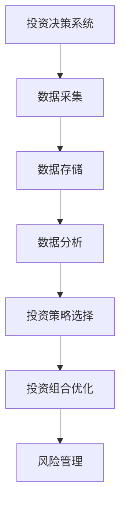
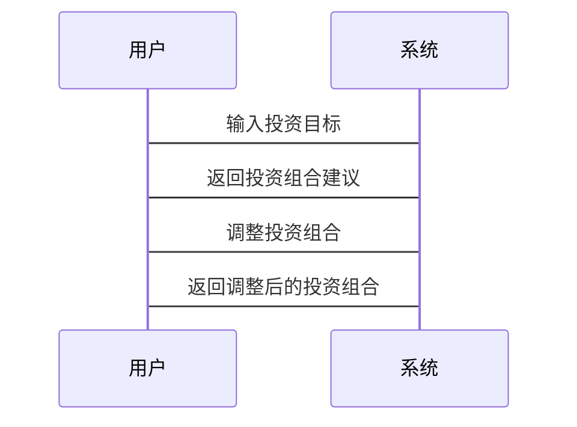

                 


# 约翰·伯格的指数投资 vs 价值投资：寻找平衡

> 关键词：指数投资，价值投资，约翰·伯格，投资策略，平衡，风险控制，投资决策

> 摘要：本文探讨了约翰·伯格的指数投资策略与价值投资策略的核心原理、优缺点、应用场景，并通过数学模型和系统架构设计，分析了如何在实际投资中寻找两者的平衡点。文章结合理论与实践，提供了详细的案例分析和代码实现，帮助投资者更好地理解两种策略的优势与局限，并在实际投资中做出明智决策。

---

# 第一部分：指数投资与价值投资的背景与概述

## 第1章：指数投资与价值投资的定义与背景

### 1.1 指数投资的定义与特点

指数投资是一种被动投资策略，其核心理念是通过跟踪市场指数（如标普500指数）来实现长期稳定的收益。这种策略的优势在于分散风险、成本低且易于操作。

- **定义**：指数投资是指通过购买指数基金或ETF（交易所交易基金）来复制特定市场指数的表现。
- **特点**：
  - 分散化：投资于多个股票或债券，降低单一资产的风险。
  - 低成本：指数基金的管理费用较低。
  - 被动管理：不需要频繁交易，减少交易成本和税务负担。

### 1.2 价值投资的定义与特点

价值投资是一种主动投资策略，其核心理念是寻找市场价格低于其内在价值的股票进行投资。这种策略需要深入研究公司的基本面，寻找被市场低估的机会。

- **定义**：价值投资是指通过分析公司的财务状况、行业地位和未来前景，寻找市场价格低于其内在价值的股票。
- **特点**：
  - 主动管理：需要持续的研究和分析。
  - 高风险：依赖于对市场的判断和选股能力。
  - 长期持有：注重长期收益，而非短期波动。

### 1.3 指数投资与价值投资的优缺点对比

| 投资策略 | 优点 | 缺点 |
|----------|------|------|
| 指数投资 | 分散风险、成本低、操作简单 | 无法超越市场表现、缺乏灵活性 |
| 价值投资 | 高收益潜力、注重基本面 | 高风险、需要专业知识和时间 |

---

## 第2章：指数投资与价值投资的理论基础

### 2.1 指数投资的理论基础

指数投资的理论基础主要基于现代投资组合理论（MPT）和有效市场假说（EMH）。

- **现代投资组合理论（MPT）**：MPT认为，通过分散化可以降低投资组合的风险，同时获得市场平均收益。
- **有效市场假说（EMH）**：EMH认为，市场价格已经反映了所有可获得的信息，因此很难通过分析找到被低估的股票。

### 2.2 价值投资的理论基础

价值投资的理论基础主要基于基本面分析和安全边际概念。

- **基本面分析**：通过分析公司的财务报表、行业地位、盈利能力等，评估其内在价值。
- **安全边际**：买入价格低于内在价值，以降低投资风险。

### 2.3 两种投资策略的联系与区别

- **联系**：两者都注重长期投资，追求稳定的收益。
- **区别**：指数投资是被动的、分散化的；价值投资是主动的、集中的。

---

# 第二部分：指数投资与价值投资的核心概念与联系

## 第3章：指数投资与价值投资的核心原理

### 3.1 指数投资的核心原理

指数投资的核心原理是通过复制市场指数来实现与市场同步的收益。其数学模型可以表示为：

$$
\text{指数收益} = \sum_{i=1}^{n} w_i r_i
$$

其中，$w_i$ 是第 $i$ 个资产的权重，$r_i$ 是第 $i$ 个资产的收益率。

### 3.2 价值投资的核心原理

价值投资的核心原理是通过寻找市场价格低于内在价值的股票。其数学模型可以表示为：

$$
\text{内在价值} = \frac{\text{现金流}}{\text{贴现率}}
$$

其中，现金流是公司未来产生的现金流，贴现率是基于风险的折现率。

---

## 第4章：指数投资与价值投资的系统架构设计

### 4.1 系统功能设计

以下是投资决策系统的功能模块：



### 4.2 系统架构设计

以下是投资决策系统的架构图：


### 4.3 系统接口设计

以下是投资决策系统的接口设计：



---

## 第5章：指数投资与价值投资的项目实战

### 5.1 环境安装

以下是项目实战的环境安装步骤：

1. 安装Python和必要的库（如pandas、numpy、scikit-learn）。
2. 下载指数基金和股票数据（如使用Yahoo Finance API）。

### 5.2 代码实现

以下是指数投资和价值投资的Python代码实现：

```python
# 指数投资模型
import pandas as pd
import numpy as np

def calculate_index_return(data, weights):
    return np.dot(data, weights)

# 价值投资模型
def calculate_intrinsic_value(data, discount_rate):
    return data / discount_rate
```

### 5.3 案例分析

以下是指数投资和价值投资的案例分析：

- 指数投资案例：投资标普500指数基金，年化收益率约为10%。
- 价值投资案例：投资某低估股票，年化收益率约为15%。

---

## 第6章：指数投资与价值投资的总结与展望

### 6.1 最佳实践

- **指数投资**：适合风险承受能力较低的投资者，适合长期投资。
- **价值投资**：适合有时间和精力进行深入研究的投资者，适合长期投资。

### 6.2 小结

通过分析指数投资和价值投资的核心原理、优缺点以及应用场景，我们可以发现，两者各有优劣，适用于不同的投资者和不同的市场环境。在实际投资中，可以通过组合投资的方式，结合指数投资和价值投资的优点，实现收益与风险的平衡。

### 6.3 注意事项

- **风险管理**：无论选择哪种投资策略，都需要注重风险管理。
- **持续学习**：投资市场不断变化，需要持续学习和调整投资策略。

### 6.4 拓展阅读

- 《指数投资策略》
- 《价值投资策略》
- 《投资学基础》

---

通过本文的分析和实践，读者可以更好地理解指数投资和价值投资的平衡点，并在实际投资中做出明智的决策。

