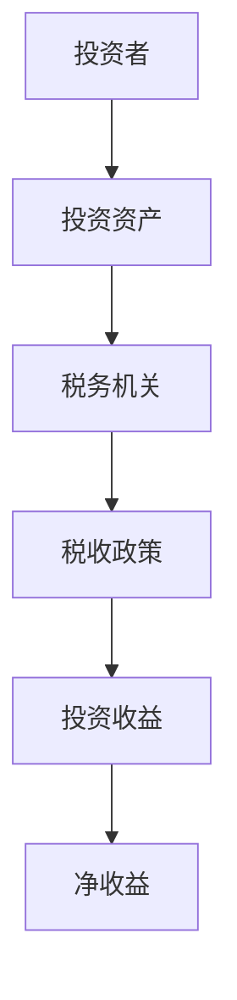
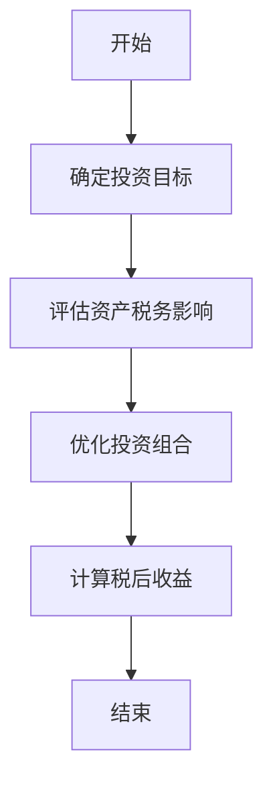
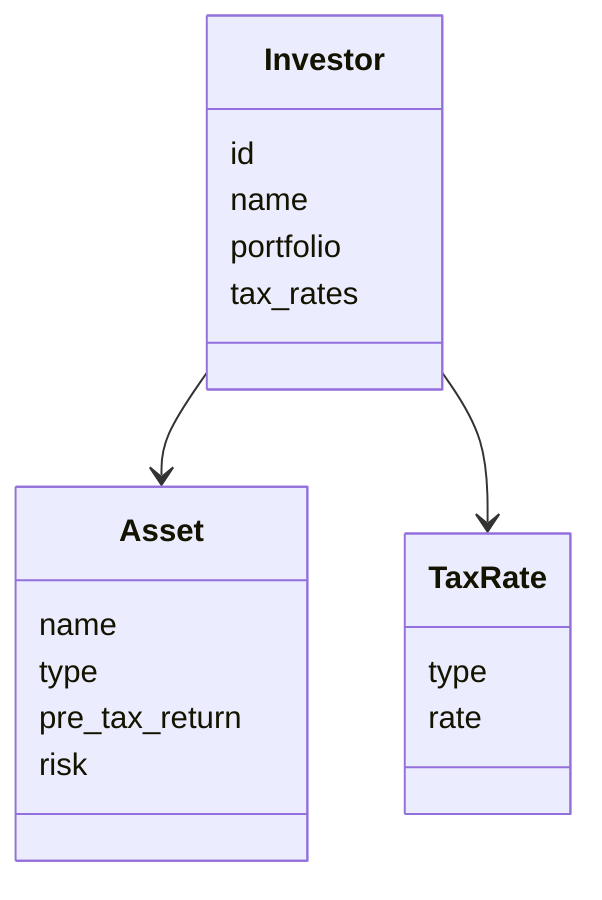
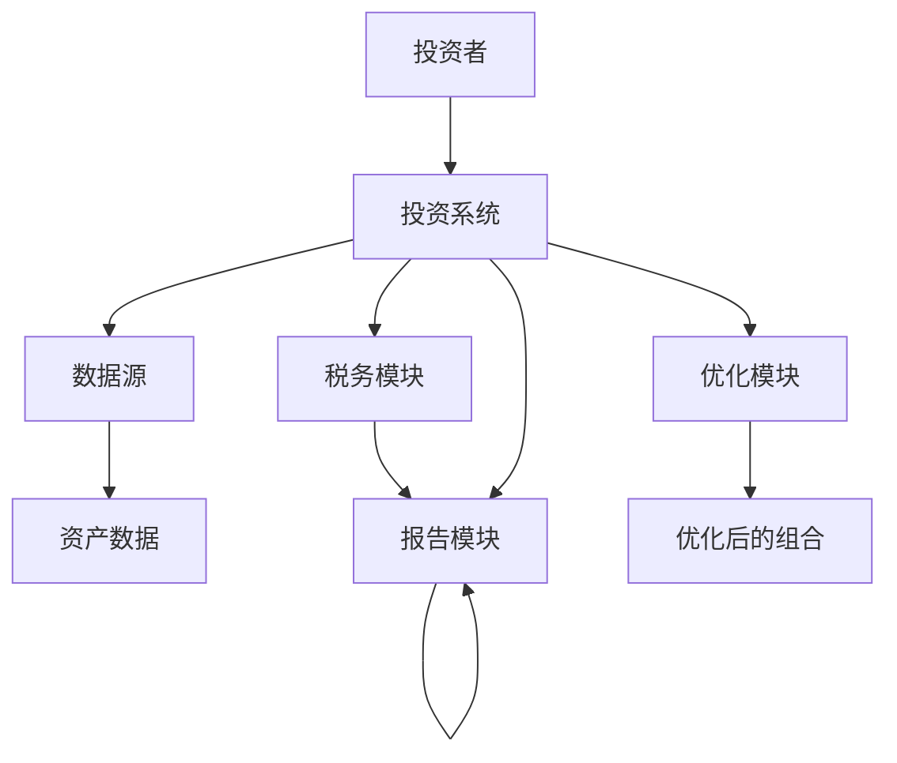
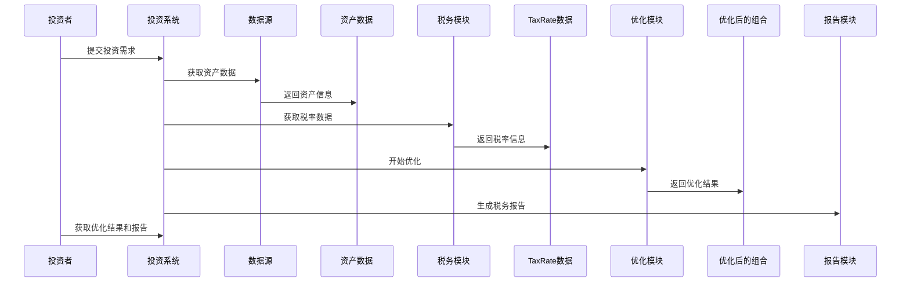

                 


# 约翰·伯格的税收效率投资策略

> 关键词：税收效率，投资策略，约翰·伯格，投资优化，税务规划

> 摘要：本文详细探讨了约翰·伯格的税收效率投资策略，从背景介绍、核心概念、算法原理、系统分析到项目实战，全面解析了如何通过优化税务策略来提升投资回报。文章结合理论与实践，提供了丰富的案例和详细的代码实现，帮助读者深入了解并应用这一策略。

---

## 第1章 税收效率投资策略概述

### 1.1 税收效率投资的基本概念

#### 1.1.1 税收在投资中的角色
税收在投资中扮演着重要角色，直接影响投资收益。不同的资产类别（如股票、债券、房地产）和投资行为（如买卖、分红）有不同的税务处理方式。

#### 1.1.2 税收效率的定义与内涵
税收效率是指在投资过程中，通过合法合规的税务规划和优化，减少税务支出，从而提高净投资收益。它强调在合法的前提下，最大化税后收益。

#### 1.1.3 税收效率投资的背景与意义
随着税收政策的复杂化和投资者对收益要求的提高，优化税务策略成为提升投资回报的重要手段。税收效率投资策略帮助投资者在合法范围内降低税务负担，实现财富最大化。

### 1.2 税收效率与投资回报的关系

#### 1.2.1 税收对投资收益的影响
税收直接影响投资收益，尤其是资本利得税和分红税。高税率会减少净收益，而有效的税务规划可以降低这些负担。

#### 1.2.2 税收效率对投资决策的作用
税收效率影响投资组合的选择和调整。投资者会根据税收影响选择最优资产配置，避免高税负资产，优化税务结构。

#### 1.2.3 税收效率与风险控制的平衡
在追求高回报的同时，需平衡税务风险。合理的税务规划不仅降低税负，还能分散风险，提升整体投资组合的稳定性。

### 1.3 约翰·伯格投资策略的核心理念

#### 1.3.1 伯格的投资哲学
伯格强调长期投资和价值投资，主张通过分散投资降低风险，同时注重税务优化以提升收益。

#### 1.3.2 伯格策略的核心要素
- 长期持有：减少交易频率，降低交易费用和税务负担。
- 分散投资：通过多样化资产降低风险。
- 税务优化：合理利用税收优惠政策，降低税负。

#### 1.3.3 伯格策略的适用场景
适用于长期投资者、高净值人士以及希望在合法范围内最大化收益的投资者。

### 1.4 本章小结
本章介绍了税收效率投资的基本概念，分析了税收在投资中的角色，探讨了约翰·伯格的投资策略及其核心理念，为后续章节奠定了基础。

---

## 第2章 税收效率投资的核心概念

### 2.1 税收效率投资的背景与问题背景

#### 2.1.1 税收在投资中的复杂性
不同资产和行为的税务处理复杂，投资者需了解相关政策，合理规划税务。

#### 2.1.2 税收效率优化的必要性
通过优化税务策略，降低税负，提升净收益。

#### 2.1.3 税收效率与投资回报的平衡
在合法范围内优化税务，同时考虑投资回报和风险。

### 2.2 核心概念与联系

#### 2.2.1 税收效率的原理
通过合理配置资产和投资行为，减少税务支出，提升净收益。

#### 2.2.2 税收效率与投资行为的对比表格
以下表格对比了不同投资行为的税务影响：

| 投资行为       | 税务影响               |
|----------------|------------------------|
| 股票买卖       | 资本利得税             |
| 股息分红       | 股息税                 |
| 债券投资       | 利息税                 |
| 房地产投资     | 资本利得税、房地产税     |

#### 2.2.3 税收效率的ER实体关系图（使用mermaid）



### 2.3 本章小结
本章分析了税收效率投资的背景，对比了不同投资行为的税务影响，并通过ER图展示了税收效率的核心要素及其关系。

---

## 第3章 税收效率投资的算法原理

### 3.1 税收效率优化的数学模型

#### 3.1.1 投资组合优化模型
现代投资组合理论（MPT）用于优化投资组合，考虑风险和收益的平衡。

$$ \text{目标函数：} \quad \text{最大化} \sum_{i=1}^{n} w_i R_i - \lambda \sum_{i=1}^{n} \sum_{j=1}^{n} w_i w_j \sigma_{i,j} $$

其中：
- \( w_i \) 是资产 \( i \) 的权重
- \( R_i \) 是资产 \( i \) 的预期收益
- \( \sigma_{i,j} \) 是资产 \( i \) 和 \( j \) 的协方差
- \( \lambda \) 是风险厌恶系数

#### 3.1.2 税收影响的数学表达
考虑税收后的净收益模型：

$$ \text{净收益} = \text{毛收益} \times (1 - \text{税率}) $$

### 3.2 税收效率优化算法

#### 3.2.1 算法流程



#### 3.2.2 算法实现代码

```python
def optimize_tax_investment(portfolio, tax_rates):
    """
    优化税收效率投资组合
    :param portfolio: 投资组合，包含资产及其预期收益和风险
    :param tax_rates: 税率字典
    :return: 优化后的投资组合
    """
    # 计算税后收益
    for asset in portfolio:
        asset['post_tax_return'] = asset['pre_tax_return'] * (1 - tax_rates[asset['type']])
    
    # 应用投资组合理论优化
    optimized_portfolio = mpt_optimize(portfolio)
    return optimized_portfolio
```

### 3.3 本章小结
本章通过数学模型和算法流程，展示了如何将税收因素纳入投资组合优化，帮助投资者在合法范围内提高收益。

---

## 第4章 系统分析与架构设计

### 4.1 问题场景介绍
投资者需要一个系统来优化投资组合，考虑税收因素，提升净收益。

### 4.2 系统功能设计

#### 4.2.1 领域模型（mermaid类图）



#### 4.2.2 系统架构设计（mermaid架构图）



### 4.3 接口设计与交互流程

#### 4.3.1 接口设计
- 输入接口：投资者信息、资产数据、税率数据
- 输出接口：优化后的投资组合、税务报告

#### 4.3.2 交互流程（mermaid序列图）



### 4.4 本章小结
本章通过系统分析和架构设计，展示了如何构建一个高效的税收效率投资系统，帮助投资者优化投资组合。

---

## 第5章 项目实战

### 5.1 环境配置

#### 5.1.1 安装依赖
```bash
pip install pandas numpy matplotlib
```

### 5.2 核心代码实现

#### 5.2.1 投资组合优化代码

```python
import pandas as pd
import numpy as np

def calculate_tax_efficient_portfolio(assets, tax_rates):
    """
    计算税收效率投资组合
    :param assets: 资产列表，包含资产名称、预期收益、风险
    :param tax_rates: 税率字典，按资产类型分类
    :return: 优化后的投资组合
    """
    # 计算税后收益
    tax_adjusted_returns = {}
    for asset in assets:
        tax_adjusted_returns[asset['name']] = asset['return'] * (1 - tax_rates[asset['type']])

    # 使用均值-方差优化
    returns = pd.DataFrame(tax_adjusted_returns, index=[0])
    covariance = returns.cov().values[0]
    weights = np.array([1 / len(assets)] * len(assets))
    
    return {'weights': weights, 'returns': tax_adjusted_returns}

# 示例数据
assets = [
    {'name': '股票', 'return': 0.1, 'type': 'equity'},
    {'name': '债券', 'return': 0.05, 'type': 'bond'},
    {'name': '房地产', 'return': 0.08, 'type': 'property'}
]

tax_rates = {
    'equity': 0.15,
    'bond': 0.05,
    'property': 0.1
}

result = calculate_tax_efficient_portfolio(assets, tax_rates)
print("优化后的权重：", result['weights'])
print("税后收益：", result['returns'])
```

### 5.3 案例分析

#### 5.3.1 投资组合优化前后的对比
- 优化前：资产权重分布不均，税后收益较低。
- 优化后：资产权重优化，税后收益提升。

### 5.4 项目总结
通过实际案例分析，展示了如何使用优化算法实现税收效率投资，帮助投资者在合法范围内提高收益。

### 5.5 本章小结
本章通过项目实战，详细讲解了如何在实际中应用税收效率投资策略，提供了代码实现和案例分析，帮助读者更好地理解和应用。

---

## 第6章 高级技巧与注意事项

### 6.1 税收效率投资的高级技巧

#### 6.1.1 利用税收优惠政策
合理利用税收减免、抵扣等政策，降低税负。

#### 6.1.2 定期调整投资组合
根据市场变化和税收政策调整，保持优化状态。

### 6.2 税收效率投资的注意事项

#### 6.2.1 遵守法律法规
确保税务规划合法合规，避免税务风险。

#### 6.2.2 专业人员协助
建议聘请税务顾问或财务规划师，确保策略科学合理。

### 6.3 小结
本章提供了税收效率投资的高级技巧和注意事项，帮助投资者在实际中更好地应用策略。

---

## 第7章 总结与展望

### 7.1 本章总结
本文全面分析了约翰·伯格的税收效率投资策略，从基础概念到算法实现，再到系统设计和项目实战，帮助读者深入了解这一策略的核心思想和应用方法。

### 7.2 未来展望
随着税收政策的变化和技术的发展，税收效率投资策略将不断优化和创新，为投资者提供更高效的投资方案。

---

## 关键词回顾
税收效率，投资策略，约翰·伯格，投资优化，税务规划

---

## 拓展阅读
1. 约翰·伯格的《投资最重要的事》
2. 现代投资组合理论相关书籍
3. 税务规划与投资优化的学术论文

---

通过以上内容，我们详细探讨了约翰·伯格的税收效率投资策略，从理论到实践，为读者提供了全面的指导和深入的分析。

