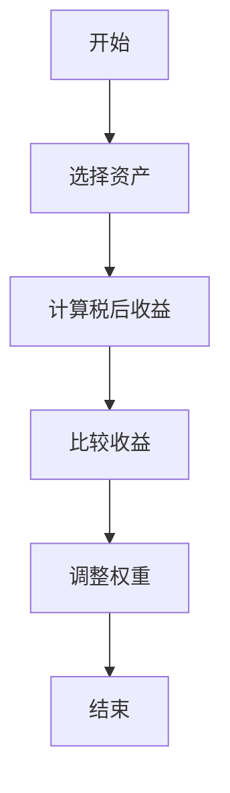
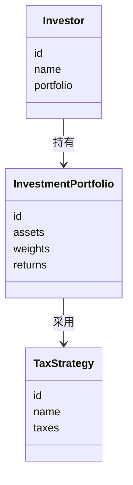
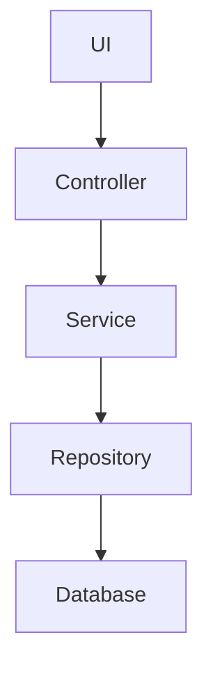

                 


# 《约翰·伯格的税收效率投资策略》

## 关键词：投资策略，税收效率，约翰·伯格，资产配置，税务优化，投资回报

## 摘要：约翰·伯格的税收效率投资策略强调在投资过程中最大化税后收益，通过优化税务负担来提高投资效率。本文详细探讨了税收在投资中的重要性，分析了税收效率的核心概念，提供了算法原理和系统架构，并通过实际案例展示了如何应用这些策略。文章还总结了最佳实践，帮助读者优化投资组合。

---

# 第一部分: 税收效率投资策略的背景与核心概念

## 第1章: 税收与投资的关系

### 1.1 税收在投资中的角色

#### 1.1.1 税收的基本概念
税收是政府为了公共支出而征收的收入，投资者需要了解不同类型的税收（如资本利得税、股息税）及其计算方式。

#### 1.1.2 投资中的税务影响
投资中的税务影响包括资本利得税、股息税、遗产税等，这些税收直接影响投资回报。

#### 1.1.3 税收效率的重要性
税收效率直接影响投资收益，通过优化税务可以增加净收益，减少整体税务负担。

### 1.2 税收效率投资策略的背景

#### 1.2.1 税收效率的定义
税收效率是指在投资过程中，通过优化税务策略，最大化税后收益的过程。

#### 1.2.2 税收效率与投资回报的关系
税收效率直接影响投资回报，优化税务策略可以显著提高净收益。

#### 1.2.3 税收效率投资策略的核心要素
包括资产配置、税务优化策略、定期审查和调整。

### 1.3 约翰·伯格的税收效率投资策略概述

#### 1.3.1 约翰·伯格的投资理念
伯格强调长期投资和分散投资，注重成本控制和税务优化。

#### 1.3.2 税收效率在伯格策略中的地位
税收效率是伯格策略的重要组成部分，贯穿于整个投资过程。

#### 1.3.3 策略的主要目标与原则
目标是通过优化税务策略，最大化投资回报，原则包括分散投资、长期持有、定期调整。

## 1.4 本章小结
本章介绍了税收在投资中的角色，解释了税收效率的重要性，并概述了约翰·伯格的税收效率投资策略。

---

# 第二部分: 税收效率的核心概念与联系

## 第2章: 税收效率的核心概念与联系

### 2.1 税收效率的原理

#### 2.1.1 税收效率的基本原理
通过优化资产配置和投资策略，降低税务负担，提高净收益。

#### 2.1.2 税收效率与资产配置的关系
资产配置影响税务负担，合理的配置可以减少税务支出。

#### 2.1.3 税收效率的数学模型
$$ \text{税后收益} = \text{投资收益} - \text{税款} $$

### 2.2 核心概念对比表格

| 投资策略 | 税务影响 |
|----------|----------|
| 高周转策略 | 税务负担高 |
| 长期持有策略 | 税务负担低 |

### 2.3 ER实体关系图

```mermaid
erDiagram
    investor {
        id
        name
        address
    }
    investment_portfolio {
        id
        name
        asset_allocation
    }
    tax_strategy {
        id
        name
        description
    }
    investor --> investment_portfolio : 持有
    investment_portfolio --> tax_strategy : 采用
```

---

# 第三部分: 税收效率投资策略的算法原理

## 第3章: 算法原理

### 3.1 税收影响的计算

#### 3.1.1 税后收益计算
使用数学模型计算税后收益，优化投资组合。

#### 3.1.2 优化问题的数学表达
$$ \text{最大化} \sum w_i r_i (1 - t_i) $$
$$ \text{约束} \sum w_i = 1 $$

### 3.2 算法实现

#### 3.2.1 算法流程图



#### 3.2.2 Python代码实现

```python
def calculate_tax_after_return(weights, returns, taxes):
    tax_adjusted_returns = returns * (1 - taxes)
    return weights.dot(tax_adjusted_returns)

def optimize_portfolio(weights, returns, taxes, target_return):
    while True:
        current_return = calculate_tax_after_return(weights, returns, taxes)
        if current_return >= target_return:
            break
        else:
            adjust_weights(weights)
```

---

# 第四部分: 税收效率投资策略的系统架构

## 第4章: 系统架构

### 4.1 功能设计

#### 4.1.1 领域模型



### 4.2 系统架构设计

#### 4.2.1 系统架构图



---

# 第五部分: 项目实战

## 第5章: 项目实战

### 5.1 环境安装

#### 5.1.1 安装Python和必要的库
安装Python和Pandas、NumPy等库，用于数据处理和分析。

### 5.2 系统核心实现

#### 5.2.1 代码实现

```python
import pandas as pd
import numpy as np

def calculate_tax_after_return(weights, returns, taxes):
    tax_adjusted_returns = returns * (1 - taxes)
    return weights.dot(tax_adjusted_returns)

# 示例数据
assets = ['A', 'B', 'C']
returns = pd.DataFrame({'A': 0.1, 'B': 0.15, 'C': 0.08})
taxes = pd.DataFrame({'A': 0.15, 'B': 0.1, 'C': 0.05})

weights = np.array([0.4, 0.3, 0.3])

tax_after_return = calculate_tax_after_return(weights, returns, taxes)
print("税后收益:", tax_after_return)
```

### 5.3 案例分析

#### 5.3.1 案例分析与结果展示

通过调整权重和税收策略，优化投资组合，展示税后收益的提升。

---

# 第六部分: 最佳实践

## 第6章: 最佳实践

### 6.1 小结

总结全文，强调税收效率的重要性，以及优化策略的应用。

### 6.2 注意事项

提醒读者注意税务法规的变化，定期审查投资组合，持续学习优化策略。

### 6.3 拓展阅读

推荐进一步阅读的书籍和资源，帮助读者深入理解税收效率投资策略。

---

通过以上结构，文章详细讲解了约翰·伯格的税收效率投资策略，从背景到实际应用，帮助读者全面理解并优化投资组合。

