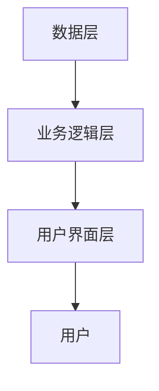

                 


# 约翰·伯格的长期投资回报预期

> 关键词：长期投资回报，约翰·伯格，投资策略，风险管理，资本预算

> 摘要：本文深入分析了约翰·伯格的长期投资回报预期，探讨了投资回报的核心概念、计算方法、系统架构以及实际应用。通过详细的数学模型和案例分析，揭示了长期投资的潜在回报与风险之间的平衡点，为投资者提供了实用的策略和建议。

---

# 第一部分: 长期投资回报预期的背景与基础

## 第1章: 投资的基本概念

### 1.1 投资的定义与分类

#### 1.1.1 投资的定义

投资是将资金投入到某个资产或项目中，期望在未来获得超过初始投入的收益。投资的核心在于通过时间的推移和价值的增值，实现财富的增长。

#### 1.1.2 投资的分类

- **短期投资**：持有时间较短，通常在1年以内，主要目标是通过价格波动获利。
- **长期投资**：持有时间较长，通常超过5年，目标是通过资产增值和复利效应实现收益。

#### 1.1.3 长期投资的特点

- **时间跨度长**：长期投资注重资产的长期增值潜力。
- **风险分散**：通过分散投资降低风险。
- **复利效应**：长期持有可以充分利用复利效应，实现收益的指数级增长。

### 1.2 约翰·伯格的投资理念

#### 1.2.1 约翰·伯格的生平简介

约翰·伯格（John Bogle）是美国著名投资者， Vanguard 集团的创始人。他以倡导指数基金和价值投资理念闻名，强调长期投资和风险管理。

#### 1.2.2 长期投资的核心思想

- **价值投资**：买入低于其内在价值的资产，长期持有。
- **分散投资**：通过多样化投资降低风险。
- **耐心投资**：长期持有优质资产，避免频繁交易。

#### 1.2.3 投资与风险管理的关系

风险管理是投资成功的关键。通过合理的资产配置和分散投资，可以降低投资组合的整体风险，同时追求长期稳定的回报。

---

## 第2章: 长期投资回报的背景分析

### 2.1 经济周期与投资回报

#### 2.1.1 经济周期的定义

经济周期分为衰退、复苏、增长和衰退四个阶段。在不同的经济周期中，投资回报的表现也会有所不同。

#### 2.1.2 不同经济周期下的投资策略

- **衰退期**：注重防御性资产，如债券和现金。
- **复苏期**：逐步增加股票配置。
- **增长期**：积极投资股票和高风险资产。
- **衰退期**：转向防御性资产。

#### 2.1.3 长期投资在经济周期中的表现

长期投资能够平滑经济周期的波动，通过分散投资和长期持有，降低短期波动的影响，实现稳定的回报。

### 2.2 资本市场与投资回报

#### 2.2.1 资本市场的基本概念

资本市场包括股票市场和债券市场，是投资者进行资产配置的主要场所。

#### 2.2.2 股票市场的波动性与回报率

股票市场具有较高的波动性，但长期回报率较高。通过长期持有优质股票，可以实现稳定的收益。

#### 2.2.3 债券市场的风险与收益

债券市场风险较低，回报稳定。在经济衰退期，债券通常表现较好。

### 2.3 约翰·伯格的投资哲学

#### 2.3.1 价值投资的核心理念

价值投资强调买入低于其内在价值的资产，长期持有，等待价值回归。

#### 2.3.2 长期持有与分散投资

通过长期持有和分散投资，降低投资组合的整体风险，实现稳定的回报。

#### 2.3.3 投资组合的构建原则

- **分散化**：避免过度集中于某一种资产。
- **低成本**：选择费用低的基金或指数基金。
- **长期持有**：避免频繁交易，减少成本和风险。

---

# 第二部分: 长期投资回报预期的核心概念

## 第3章: 投资回报的计算与分析

### 3.1 投资回报的计算方法

#### 3.1.1 单利与复利的计算

- **单利**：只计算本金的利息，公式为：$$利息 = P \times r \times t$$
- **复利**：计算本金和利息的总和，公式为：$$A = P \times (1 + r)^n$$

#### 3.1.2 净现值（NPV）的计算公式

净现值是指未来现金流的现值与初始投资的差额，公式为：$$NPV = \sum_{t=1}^{n} \frac{CF_t}{(1 + r)^t} - 初始投资$$

#### 3.1.3 内部收益率（IRR）的计算公式

内部收益率是使净现值为零的折现率，公式为：$$0 = \sum_{t=1}^{n} \frac{CF_t}{(1 + IRR)^t} - 初始投资$$

### 3.2 投资回报的风险调整

#### 3.2.1 风险调整后的回报率

通过调整风险溢价，计算风险调整后的回报率。公式为：$$风险调整后回报率 = 预期回报率 - 风险溢价$$

#### 3.2.2 风险溢价的计算

风险溢价是投资者因承担风险而要求的额外回报，通常基于市场风险溢价。

#### 3.2.3 风险与收益的平衡

通过平衡风险和收益，选择合适的投资组合，实现长期稳定的回报。

---

## 第4章: 长期投资回报的数学模型

### 4.1 投资回报的数学公式

#### 4.1.1 投资回报率的计算公式

$$回报率 = \frac{最终价值 - 初始价值}{初始价值} \times 100\%$$

#### 4.1.2 复利计算公式

$$A = P \times (1 + r)^n$$

### 4.2 投资组合的优化模型

#### 4.2.1 投资组合的优化目标

最大化回报率，最小化风险。

#### 4.2.2 投资组合的优化方法

使用现代投资组合理论（MPT）进行优化，通过调整资产配置实现最优回报。

---

# 第三部分: 系统分析与架构设计方案

## 第5章: 投资回报预期的系统架构设计

### 5.1 问题场景介绍

#### 5.1.1 问题背景

投资者需要通过系统化的分析和计算，制定长期投资策略。

#### 5.1.2 项目介绍

构建一个投资回报预期的系统，帮助投资者进行长期投资决策。

### 5.2 系统功能设计

#### 5.2.1 系统功能模块

- 数据输入模块：接收初始投资、投资期限、预期回报率等参数。
- 计算引擎模块：计算投资回报率、净现值、内部收益率等指标。
- 结果展示模块：以图表形式展示投资回报预期。

#### 5.2.2 系统架构设计

使用分层架构，包括数据层、业务逻辑层和用户界面层。

### 5.3 系统架构图



---

# 第四部分: 项目实战

## 第6章: 投资回报预期的项目实战

### 6.1 环境安装

#### 6.1.1 安装Python

安装Python 3.9及以上版本，确保环境满足要求。

#### 6.1.2 安装相关库

安装numpy和pandas库，用于数据计算和处理。

### 6.2 系统核心实现源代码

#### 6.2.1 计算投资回报率的代码

```python
import numpy as np
import pandas as pd

def calculate_return(principal, rate, years):
    return principal * (1 + rate) ** years
```

#### 6.2.2 计算净现值的代码

```python
def calculate_npv(cash_flows, rate):
    return np.npv(rate, *cash_flows)
```

### 6.3 代码应用解读与分析

#### 6.3.1 投资回报率的计算

通过上述代码，用户可以计算出不同投资期限下的回报率，帮助制定长期投资策略。

#### 6.3.2 净现值的计算

净现值帮助投资者评估项目的可行性，为投资决策提供依据。

### 6.4 实际案例分析

#### 6.4.1 案例背景

某投资者计划投资100万元，预期年回报率为8%，投资期限为10年。

#### 6.4.2 计算过程

使用代码计算投资回报率和净现值，得出投资预期。

### 6.5 项目小结

通过实际案例分析，验证了系统设计的有效性和实用性，为投资者提供了有力的工具。

---

# 第五部分: 最佳实践与总结

## 第7章: 长期投资回报预期的总结与展望

### 7.1 投资策略总结

- **长期持有**：通过时间的推移实现财富增长。
- **分散投资**：降低投资风险。
- **风险管理**：合理配置资产，避免过度风险。

### 7.2 风险管理技巧

- **定期评估**：定期检查投资组合，调整配置。
- **避免过度交易**：减少交易成本和税务负担。
- **关注长期目标**：忽略短期波动，保持长期投资策略。

### 7.3 拓展阅读

- 《价值投资实战手册》
- 《投资学基础》

---

通过以上分析，我们可以看到，长期投资回报预期是一个复杂但极具回报的领域。通过系统化的分析和实践，投资者可以制定有效的策略，实现财富的长期增长。

