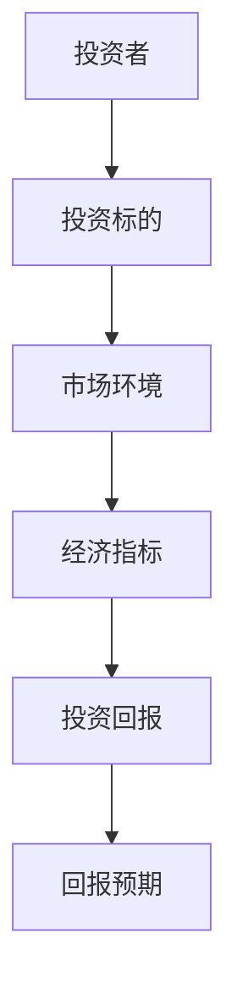
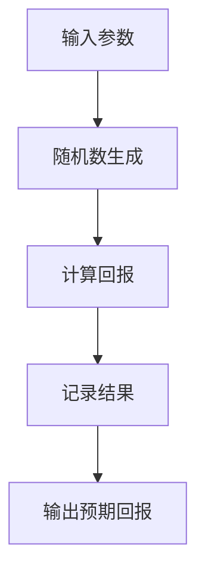
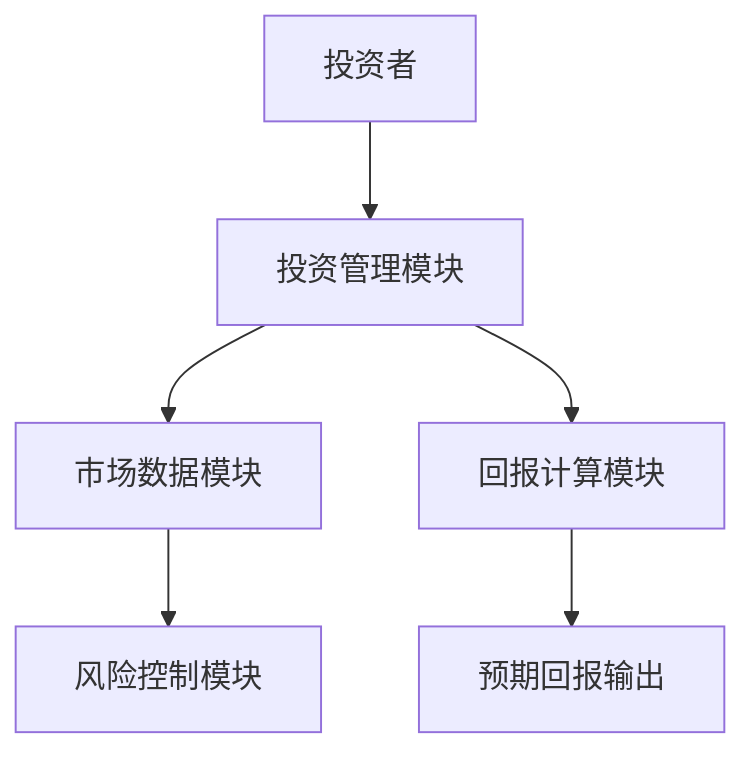
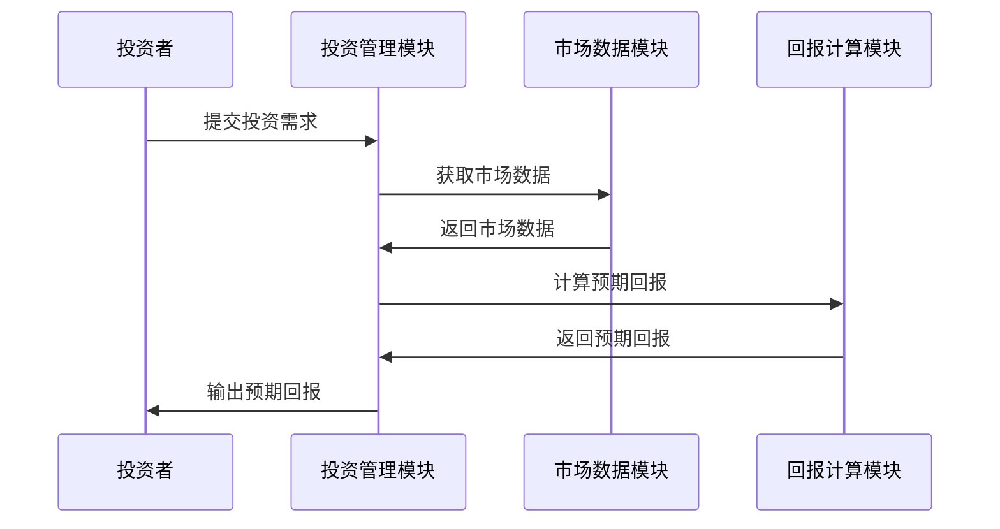

                 


# 约翰·伯格的长期投资回报预期设定

## 关键词：投资回报、长期投资、约翰·伯格、投资策略、风险控制、预期设定

## 摘要：本文深入探讨了约翰·伯格的长期投资回报预期设定方法，从投资的基本概念到具体的算法原理，再到实际的系统设计和项目实战，全面解析了如何科学合理地设定长期投资回报预期。

---

# 第一部分: 长期投资回报预期设定的背景与基础

## 第1章: 投资回报预期设定的背景与基础

### 1.1 投资的基本概念与重要性
#### 1.1.1 投资的定义与分类
- **定义**: 投资是指将资金投入到某个项目或资产中，以期在未来获得收益或资本增值的行为。
- **分类**: 
  - 股票投资、债券投资、房地产投资等。
  - 长期投资与短期投资。

#### 1.1.2 长期投资的核心特征
- **时间跨度**: 长期投资通常指持有期限在3年以上。
- **目标**: 实现资产的长期增值，注重价值投资而非短期交易。
- **风险与收益**: 长期投资通常伴随着较高的风险，但预期收益也较高。

#### 1.1.3 投资回报预期设定的必要性
- 投资者需要明确自己的投资目标和风险承受能力。
- 通过设定合理的回报预期，避免盲目投资和过度冒险。

### 1.2 约翰·伯格与长期投资理念
#### 1.2.1 约翰·伯格的生平简介
- 约翰·伯格是美国著名投资家，被誉为“价值投资之父”。
- 他是伯克希尔哈撒韦公司创始人，长期践行价值投资理念。

#### 1.2.2 伯格的投资哲学与方法
- **价值投资**: 寻找市场低估的优质企业，长期持有。
- **安全边际**: 在投资时留有一定的安全边际，以降低风险。

#### 1.2.3 伯格对长期投资回报的贡献
- 提出了“市场先生”理论，强调市场短期波动不可预测。
- 强调长期投资的重要性，避免短期市场波动的干扰。

### 1.3 长期投资回报的定义与特点
#### 1.3.1 长期投资的定义
- 长期投资是指投资者将资金投入某个资产或项目，并在较长的时间内持有，以获得资本增值或收益。

#### 1.3.2 长期投资回报的核心特点
- 投资回报与时间密切相关。
- 长期投资回报受到宏观经济、行业周期和公司基本面的影响。

#### 1.3.3 长期投资与短期投资的对比
| 特性          | 长期投资                | 短期投资                |
|---------------|-------------------------|-------------------------|
| 时间跨度      | 3年以上                | 1年以内                |
| 收益来源      | 资本增值为主            | 利息、股息、资本增值    |
| 风险承受能力  | 较高                   | 较低                   |
| 投资策略      | 价值投资、分散投资      | 技术分析、趋势交易      |

### 1.4 长期投资回报预期设定的背景
#### 1.4.1 经济周期对投资回报的影响
- 经济周期包括复苏、繁荣、衰退、萧条四个阶段，不同阶段的投资回报预期不同。

#### 1.4.2 市场波动与投资预期的关系
- 市场波动会影响短期回报，但长期回报主要取决于资产本身的价值。

#### 1.4.3 投资者行为对回报预期的影响
- 投资者情绪（贪婪和恐惧）会影响市场定价，进而影响回报预期。

### 1.5 本章小结
- 介绍了投资的基本概念和长期投资的核心特征。
- 重点阐述了约翰·伯格的长期投资理念及其对投资回报的贡献。
- 强调了长期投资回报预期设定的重要性和背景。

---

# 第二部分: 投资回报预期设定的核心概念与联系

## 第2章: 投资回报预期设定的核心概念

### 2.1 投资回报预期设定的原理
#### 2.1.1 投资回报的计算方法
- **单利计算**: 按照固定利率计算的利息。
- **复利计算**: 资金在每个计息期产生的利息再加入本金，以此类推。

#### 2.1.2 投资回报预期的形成机制
- 市场利率、资产质量、宏观经济环境等因素共同作用。

#### 2.1.3 预期与实际回报的关系
- 预期回报是投资者对未来的估计，实际回报受多种因素影响。

### 2.2 核心概念对比分析
#### 2.2.1 投资回报与风险的关系
- 高风险投资通常预期回报更高，但风险也更大。

#### 2.2.2 预期回报与市场实际回报的差异
- 预期回报是理论上的目标，实际回报受市场波动影响。

#### 2.2.3 不同投资策略的回报预期对比
| 策略          | 预期回报          |
|---------------|-------------------|
| 价值投资      | 中高              |
| 股票投资      | 高                |
| 债券投资      | 中                |
| 房地产投资    | 中高              |

### 2.3 投资回报预期的ER实体关系图


---

# 第三部分: 投资回报预期设定的算法原理

## 第3章: 投资回报预期设定的算法原理

### 3.1 现代投资组合理论（MPT）与CAPM模型
#### 3.1.1 MPT的核心思想
- 通过分散投资降低风险，实现收益最大化。

#### 3.1.2 CAPM模型的公式推导
$$ E(r_i) = r_f + \beta_i (E(r_m) - r_f) $$

其中：
- \( E(r_i) \)：资产i的预期收益率
- \( r_f \)：无风险利率
- \( \beta_i \)：资产i的贝塔系数
- \( E(r_m) \)：市场预期收益率

#### 3.1.3 MPT与CAPM的对比
| 对比维度      | MPT                          | CAPM                          |
|---------------|------------------------------|-------------------------------|
| 核心思想      | 分散化投资降低风险          | 资产定价模型                   |
| 应用场景      | 投资组合优化                | 单一资产定价                  |

### 3.2 投资回报预期的蒙特卡洛模拟
#### 3.2.1 蒙特卡洛模拟的基本原理
- 通过随机数模拟市场波动，计算不同情景下的投资回报。

#### 3.2.2 投资回报预期的模拟流程


#### 3.2.3 蒙特卡洛模拟的代码实现
```python
import numpy as np

def monte_carlo_simulation(initial_investment, num_simulations, num_periods, return_mean, return_stdev):
    returns = np.random.normal(return_mean, return_stdev, (num_simulations, num_periods))
    final_values = initial_investment * (1 + returns).cumprod()[:, -1]
    return final_values.mean()

# 示例参数
initial_investment = 10000
num_simulations = 10000
num_periods = 10
return_mean = 0.07
return_stdev = 0.15

expected_return = monte_carlo_simulation(initial_investment, num_simulations, num_periods, return_mean, return_stdev)
print(f"Expected return after {num_periods} years: ${expected_return:.2f}")
```

---

## 3.3 投资回报预期的系统分析与架构设计

### 3.3.1 问题场景介绍
- 投资者希望根据市场数据和历史表现，设定合理的长期投资回报预期。

### 3.3.2 系统功能设计
#### 3.3.2.1 领域模型


#### 3.3.2.2 系统架构设计


### 3.3.3 系统交互流程


---

## 3.4 项目实战

### 3.4.1 环境安装
- **Python 3.8及以上版本**
- 安装必要的库：
  ```bash
  pip install numpy pandas matplotlib
  ```

### 3.4.2 核心实现代码
```python
import numpy as np
import matplotlib.pyplot as plt

def calculate_expected_return(initial_investment, num_periods, return_rate):
    return initial_investment * (1 + return_rate) ** num_periods

# 示例计算
initial_investment = 10000
num_periods = 10
return_rate = 0.07

expected_return = calculate_expected_return(initial_investment, num_periods, return_rate)
print(f"Expected return after {num_periods} years: ${expected_return:.2f}")

# 绘制回报曲线
years = np.arange(0, num_periods + 1)
returns = initial_investment * (1 + return_rate) ** years
plt.plot(years, returns)
plt.xlabel('Years')
plt.ylabel('Value')
plt.title('Long-term Investment Growth')
plt.show()
```

### 3.4.3 案例分析
- **案例背景**: 投资者投入10000美元，预期年回报率7%，投资期限10年。
- **计算结果**: 
  - 预期最终价值: $24,157.27
  - 年均复合增长率: 7%

### 3.4.4 小结
- 通过实际案例展示了如何设定和计算长期投资回报预期。
- 强调了复利计算和时间价值的重要性。

---

## 3.5 最佳实践与注意事项
### 3.5.1 长期投资的注意事项
- **分散投资**: 避免过度集中风险。
- **定期审视**: 根据市场变化和个人财务状况调整投资策略。
- **耐心持有**: 避免频繁交易，降低交易成本和税务负担。

### 3.5.2 风险提示
- 长期投资不保证收益，市场波动可能导致实际回报低于预期。
- 需要根据个人风险承受能力和财务目标制定合理的投资策略。

### 3.5.3 拓展阅读
- 《投资学》：深入理解投资学的基本理论和模型。
- 《巴菲特致股东的信》：学习长期投资的理念和实践。

---

# 结语

通过本文的详细讲解，读者可以全面理解约翰·伯格的长期投资回报预期设定方法，并能够将其应用到实际投资中。无论是理论分析还是系统设计，长期投资回报预期的设定都需要投资者具备扎实的理论基础和实际操作能力。希望本文能为投资者提供有价值的参考和指导。

