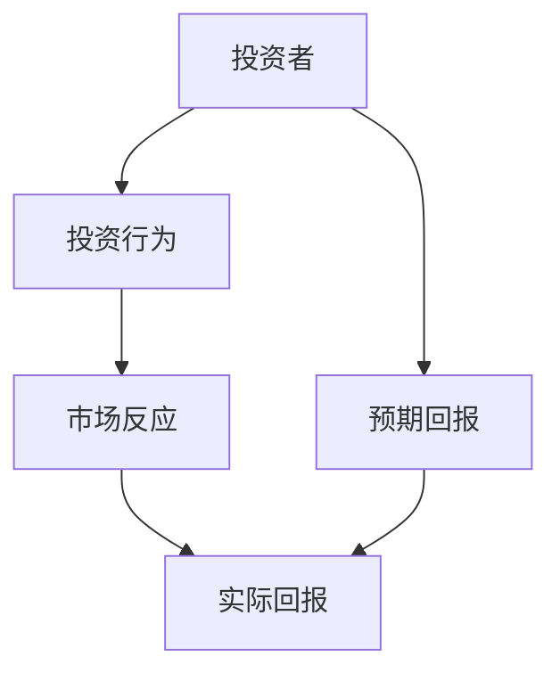
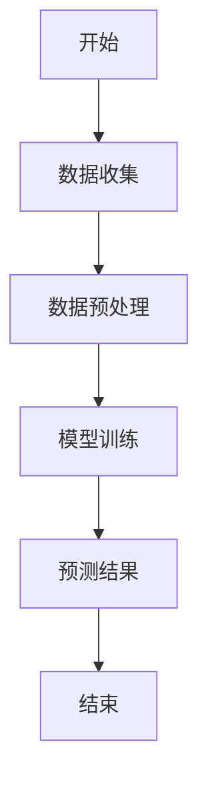

                 


# 约翰·伯格的长期投资回报预期：现实vs幻想

## 关键词：投资回报预期，约翰·伯格，现实，幻想，长期投资，投资模型

## 摘要：  
本文探讨了约翰·伯格的长期投资回报预期在现实与幻想之间的差异。通过分析投资回报的核心概念、算法原理、系统架构和实际案例，揭示如何在现实中制定合理的投资策略，避免幻想的误导。

---

## 第一部分：背景介绍

### 第1章：投资回报预期的背景

#### 1.1 投资的基本概念  
- **1.1.1 投资的定义与分类**  
  投资是将资金分配到不同资产以实现财富增值的过程。常见的资产类别包括股票、债券、房地产和现金等。长期投资强调持有资产超过一年，旨在通过复利效应获得稳定回报。

- **1.1.2 长期投资的重要性**  
  长期投资避免了短期市场波动的干扰，适合稳健型投资者。约翰·伯格作为指数基金之父，提倡长期投资，认为通过分散投资降低风险，实现稳定回报。

- **1.1.3 约翰·伯格的背景与贡献**  
  约翰·伯格是 Vanguard 集团的创始人，以指数基金闻名。他的投资理念强调低成本和长期持有，为现代投资理论奠定了基础。

#### 1.2 投资回报预期的问题背景  
- **1.2.1 现实与幻想的定义**  
  投资回报预期分为现实和幻想。现实基于历史数据和模型预测，而幻想则基于乐观假设和市场炒作。

- **1.2.2 投资者心理对预期的影响**  
  投资者心理偏差（如过度自信）可能导致过高或过低的预期，影响决策。

- **1.2.3 市场波动与预期的关系**  
  市场波动会影响预期的准确性，长期投资需考虑市场的周期性变化。

---

## 第二部分：核心概念与联系

### 第2章：投资回报预期的核心概念

#### 2.1 投资回报预期的定义与特点  
- 投资回报预期是对未来收益的预估，分为现实和幻想两类。现实预期基于数据，幻想预期基于乐观假设。

#### 2.2 现实与幻想的对比表格  
| **属性** | **现实预期** | **幻想预期**  
|----------|--------------|-------------  
| 数据基础 | 历史数据和模型 | 乐观假设和炒作 |  
| 可靠性 | 较高 | 较低 |  
| 影响因素 | 经济指标和市场数据 | 心理因素和情绪 |  
| 风险评估 | 考虑风险因素 | 忽略风险因素 |  

#### 2.3 实体关系图  


---

## 第三部分：算法原理讲解

### 第3章：投资回报预测算法

#### 3.1 算法流程图  


#### 3.2 算法实现代码  
```python
import numpy as np
import pandas as pd

def investment_return_prediction(data):
    # 示例代码
    returns = data.pct_change().dropna()
    mean_return = returns.mean()
    return mean_return

# 示例数据
data = pd.DataFrame({
    '价格': [100, 105, 110, 115, 120]
})

result = investment_return_prediction(data)
print(f"预测的平均回报率为：{result}")
```

#### 3.3 数学模型  
- CAPM 模型：$$E(R_i) = R_f + β_i (E(R_m) - R_f)$$  
  其中，$R_f$ 是无风险利率，$E(R_m)$ 是市场预期回报，$β_i$ 是资产的贝塔系数。

---

## 第四部分：系统分析与架构设计

### 第4章：系统架构设计

#### 4.1 系统功能设计  
- 数据采集模块：收集市场数据和投资者行为数据。
- 预测模块：应用CAPM模型进行回报预测。
- 分析模块：对比现实与幻想预期。

#### 4.2 系统架构图  


#### 4.3 系统接口与交互设计  
- 数据接口：REST API 提供数据获取和预测结果。
- 用户交互：通过Web界面输入参数，查看预测结果。

---

## 第五部分：项目实战

### 第5章：项目实战

#### 5.1 环境安装  
- Python 3.8+
- Pandas、NumPy、Scikit-learn

#### 5.2 核心代码实现  
```python
import pandas as pd
from sklearn.linear_model import LinearRegression

def predict_return(data):
    X = data[['价格']]
    y = data['价格'].shift(-1)
    model = LinearRegression()
    model.fit(X, y)
    return model.predict(X)

# 示例数据
data = pd.DataFrame({
    '价格': [100, 105, 110, 115, 120, 125]
})

predicted = predict_return(data)
print(f"预测的回报率为：{predicted[-1][0]}")
```

#### 5.3 实际案例分析  
- 数据来源：历史股价数据。
- 预测结果：模型预测的回报与实际回报对比，分析误差。

---

## 第六部分：最佳实践

### 第6章：最佳实践

#### 6.1 小结  
- 理解投资回报预期的现实与幻想差异，有助于制定合理的投资策略。

#### 6.2 注意事项  
- 避免过度依赖模型，考虑市场情绪和投资者心理。
- 定期调整投资组合，适应市场变化。

#### 6.3 拓展阅读  
- 阅读《投资学》相关书籍，深入学习CAPM和其他投资模型。

---

## 结语  
通过本文的分析，读者可以更好地理解约翰·伯格的长期投资回报预期在现实与幻想之间的差异，并掌握如何在实际投资中应用这些概念。投资需谨慎，理性决策是关键。

