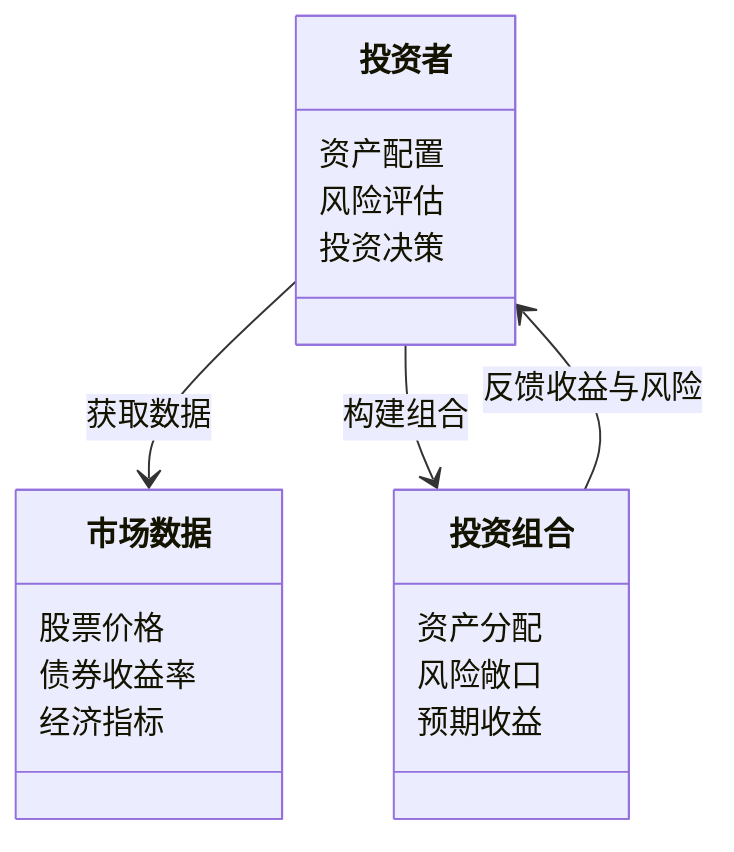
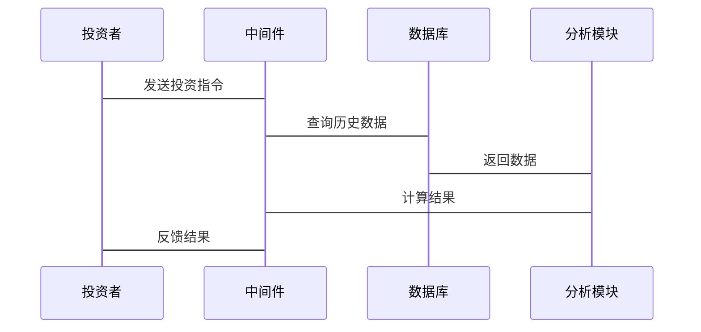

                 


# 约翰·伯格的长期投资观：应对退休年龄延长的挑战

---

## 关键词

- 长期投资观
- 退休年龄延长
- 投资策略
- 风险管理
- 投资组合优化

---

## 摘要

退休年龄的延长给个人财务规划带来了新的挑战，长期投资观的重要性日益凸显。本文通过分析约翰·伯格的投资理念，探讨如何在退休年龄延长的背景下，通过科学的投资策略和风险管理，实现财务稳健增长。文章结合数学模型、系统架构和实际案例，为读者提供一套可行的长期投资解决方案。

---

## 第1章：长期投资观的背景与核心概念

### 1.1 长期投资观的背景介绍

#### 1.1.1 退休年龄延长的背景与挑战

随着社会的发展和医疗技术的进步，退休年龄延长已成为全球趋势。根据世界银行的数据，全球平均退休年龄在过去几十年中逐步推迟。这一变化对个人财务规划提出了更高的要求。退休年龄的延长意味着个人需要在更长的时间内维持生活质量，这要求我们重新审视传统的投资策略。

退休年龄延长带来的主要挑战包括：

- **收入来源减少**：传统上依赖雇主养老金的模式已不足以应对更长的退休生活。
- **通货膨胀影响**：长期的通货膨胀会侵蚀投资收益的实际价值。
- **寿命不确定性**：寿命的延长使得投资需要具备更大的灵活性和适应性。

#### 1.1.2 长期投资观的核心概念

长期投资观是一种以时间为基础的投资理念，强调通过长期持有优质资产，实现资产的稳健增值。其核心在于通过分散投资、资产配置和风险管理，降低短期波动对投资组合的影响，从而在长期实现稳定的收益。

### 1.2 长期投资观的核心概念与联系

#### 1.2.1 核心概念原理

长期投资观的核心在于通过复利效应实现资产的长期增值。复利效应是指投资收益再投资后产生的额外收益，随着时间的推移，这种效应会呈指数级增长。

公式表示为：
$$
A = P \times (1 + r)^n
$$

其中：
- \( A \) 为终值
- \( P \) 为本金
- \( r \) 为年化收益率
- \( n \) 为投资年数

通过长期持有优质资产，复利效应将帮助投资者在退休时积累足够的财富。

#### 1.2.2 核心概念属性特征对比表格

| 概念            | 特性               | 描述                                   |
|-----------------|--------------------|----------------------------------------|
| 投资期限        | 长期               | 投资期限超过10年，甚至更长             |
| 资产配置         | 多元化             | 通过分散投资降低风险，追求稳定收益     |
| 风险管理         | 系统化             | 通过定期调整投资组合应对市场变化       |
| 复利效应         | 指数增长           | 时间越长，复利效应越显著               |

#### 1.2.3 ER实体关系图架构的 Mermaid 流程图

```mermaid
erd
actor 投资者
actor 理财顾问
actor 市场
database 投资组合
database 市场数据
database 风险评估

investor --> 投资组合: 选择投资策略
market --> 市场数据: 提供市场数据
理财顾问 --> 风险评估: 评估投资风险
投资组合 --> 风险评估: 反馈投资组合风险
理财顾问 --> 投资组合: 调整投资组合
```

---

## 第2章：约翰·伯格的投资理念与策略

### 2.1 约翰·伯格的投资哲学

#### 2.1.1 投资哲学的核心思想

约翰·伯格是 Vanguard 集团的创始人，他的投资哲学强调低成本、分散化和长期持有。他认为，市场的波动性是短期的，而优质资产的长期价值终将体现。

#### 2.1.2 投资哲学与长期投资观的联系

伯格的投资哲学与长期投资观高度契合。他认为，通过分散化投资和长期持有，可以有效降低投资风险，同时最大化复利效应。

#### 2.1.3 投资哲学的实际应用

伯格强调避免频繁交易和追求短期收益。他认为，投资者应关注企业的基本面，选择具有长期竞争优势的公司进行投资。

### 2.2 约翰·伯格的投资策略

#### 2.2.1 资产配置策略

伯格主张通过资产配置分散投资风险。他建议投资者将资产分配到股票、债券、房地产等多种资产类别中，以平衡风险和收益。

#### 2.2.2 风险管理策略

伯格认为，风险管理是投资成功的关键。他建议投资者定期评估投资组合的风险，并根据市场变化进行调整。

#### 2.2.3 长期持有策略

伯格强调长期持有优质资产。他认为，短期市场的波动不应影响长期的投资决策，优质资产的长期表现将优于短期交易。

---

## 第3章：长期投资观的数学模型与算法原理

### 3.1 投资组合优化的数学模型

#### 3.1.1 均值-方差优化模型

马科维茨在1952年提出的均值-方差优化模型是投资组合优化的基础。该模型旨在在给定风险水平下，寻找收益最大的投资组合，或在给定收益下，寻找风险最小的投资组合。

公式表示为：
$$
\min \sigma^2 \quad \text{subject to} \quad \mu = \text{target return}
$$

其中：
- \( \sigma^2 \) 为投资组合的方差（风险）
- \( \mu \) 为投资组合的预期收益

#### 3.1.2 Markowitz 有效前沿

Markowitz 有效前沿是指在给定风险水平下，能够提供最高预期收益的所有投资组合的集合。有效前沿的形状表明，随着风险的增加，预期收益也随之增加。

### 3.2 投资组合风险与收益的算法原理

#### 3.2.1 风险调整后的收益模型

风险调整后的收益模型通过调整资产的预期收益，以反映其风险水平。常用的风险调整指标包括夏普比率和特雷纳比率。

夏普比率公式：
$$
\text{夏普比率} = \frac{\mu_p - \mu_f}{\sigma_p}
$$

其中：
- \( \mu_p \) 为投资组合的预期收益
- \( \mu_f \) 为无风险收益率
- \( \sigma_p \) 为投资组合的波动率

---

## 第4章：长期投资观的系统分析与架构设计

### 4.1 投资系统问题场景介绍

#### 4.1.1 退休年龄延长带来的投资挑战

退休年龄的延长要求投资者在更长的时间内维持资产的稳健增长。这需要投资系统具备灵活性和适应性，以应对市场变化和长寿风险。

#### 4.1.2 系统功能设计的领域模型 Mermaid 类图



### 4.2 投资系统架构设计

#### 4.2.1 系统架构设计的 Mermaid 架构图


#### 4.2.2 系统接口设计

- **投资者接口**：接收投资指令和反馈结果。
- **数据库接口**：存储和检索投资组合数据。
- **分析模块接口**：计算投资组合的风险和收益。

#### 4.2.3 系统交互的 Mermaid 序列图



---

## 第5章：长期投资观的项目实战

### 5.1 环境安装与配置

#### 5.1.1 投资分析工具的安装

常用的投资分析工具包括 Python 的 pandas 和 numpy 库，以及可视化工具 matplotlib。

#### 5.1.2 数据获取与处理

可以通过 Yahoo Finance 等平台获取股票数据，并使用 pandas 进行数据清洗和处理。

#### 5.1.3 投资模拟环境的搭建

使用 Python 的 backtrader 库搭建投资模拟环境，模拟不同投资策略下的收益与风险。

### 5.2 投资组合优化的实现

#### 5.2.1 投资组合优化的 Python 源代码

```python
import numpy as np
import pandas as pd

# 示例数据：假设我们有两只股票的数据
returns = pd.DataFrame({
    '股票A': [0.1, 0.05, 0.08, 0.02, 0.04],
    '股票B': [0.08, 0.06, 0.02, 0.03, 0.05]
})

# 计算协方差矩阵
cov_matrix = returns.cov()

# 计算马科维茨优化
def portfolio_optimization(returns, cov_matrix, target_return):
    n = len(cov_matrix.columns)
    ones = np.array([1] * n)
    inv_cov = np.linalg.inv(cov_matrix)
    w = inv_cov.dot(ones) / (ones.T.dot(inv_cov).dot(ones))
    return w

weights = portfolio_optimization(returns, cov_matrix, target_return=0.05)
print("最优权重:", weights)
```

#### 5.2.2 代码应用解读与分析

上述代码通过计算投资组合的协方差矩阵，求解出最优资产配置权重。这可以帮助投资者在给定的风险水平下，获得最佳的预期收益。

#### 5.2.3 投资组合优化的实际案例分析

假设我们有两只股票，通过优化模型计算出最优权重后，可以模拟投资组合在不同市场情况下的表现。

---

## 第6章：长期投资观的最佳实践与风险管理

### 6.1 投资中的

---

### 6.1.1 风险管理

---

### 6.1.2 资产配置

---

### 6.1.3 长期持有策略

---

### 6.2 投资组合优化中的注意事项

---

### 6.3 项目小结

---

### 6.4 拓展阅读

---

## 总结

通过本文的分析，我们可以看到，约翰·伯格的长期投资观为我们提供了一种应对退休年龄延长的有效方法。通过科学的资产配置、风险管理

