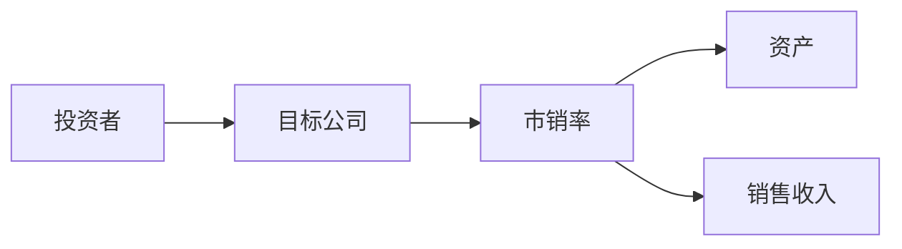
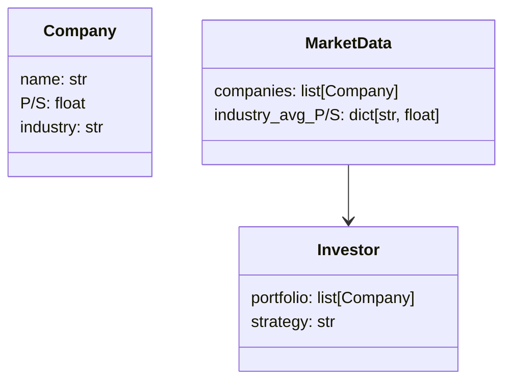

                 


# 约翰·内夫的低市销率投资：另一种价值投资视角

## 关键词：
- 约翰·内夫
- 低市销率投资
- 价值投资
- 投资策略
- 市销率
- 投资决策
- 股票分析

## 摘要：
本文深入探讨了约翰·内夫的低市销率投资策略，分析其与其他价值投资方法的区别，详细介绍其理论基础、核心指标、筛选算法及实际应用案例。通过系统架构设计和项目实战，展示了如何将低市销率投资理念应用于实际投资决策中，提供了最佳实践和投资注意事项，帮助读者在复杂的投资环境中做出明智决策。

---

## 第1章: 低市销率投资的背景与定义

### 1.1 低市销率投资的定义与特点
#### 1.1.1 低市销率投资的定义
低市销率投资是一种基于市销率（P/S）的价值投资策略，旨在寻找被市场低估的公司。市销率是股票价格与销售收入的比率，反映公司销售效率。

#### 1.1.2 低市销率投资的核心特点
- **低估值**：市销率低于行业平均水平。
- **高稳定性**：公司财务状况稳健，销售收入稳定。
- **高回报潜力**：通过长期持有获得资本增值。

#### 1.1.3 低市销率投资与传统价值投资的区别
- **核心指标**：传统价值投资关注市盈率和市净率，而低市销率投资关注市销率。
- **适用场景**：适用于高成长性和周期性行业的公司。

### 1.2 低市销率投资的背景与现状
#### 1.2.1 投资市场的现状分析
当前市场波动加剧，传统估值指标失效，投资者寻求新的方法。

#### 1.2.2 低市销率投资的兴起背景
随着经济周期变化，低市销率投资逐渐受到关注，特别是在科技和消费领域。

#### 1.2.3 约翰·内夫的低市销率投资理念
内夫强调长期投资，寻找低估公司，避免短期波动。

### 1.3 低市销率投资的核心要素
#### 1.3.1 市销率（P/S）的定义与计算
$$\text{市销率} = \frac{\text{股票价格}}{\text{销售收入}}$$

#### 1.3.2 低市销率投资的筛选标准
- 市销率低于行业平均值。
- 公司具有稳定的销售收入。

#### 1.3.3 低市销率投资的边界与外延
低市销率投资专注于短期估值，结合长期增长潜力。

---

## 第2章: 低市销率投资的核心概念与联系

### 2.1 低市销率投资的核心概念
#### 2.1.1 市销率（P/S）的计算公式
$$\text{市销率} = \frac{\text{股价}}{\text{销售收入}}$$

#### 2.1.2 市盈率（P/E）与市净率（P/B）的对比
| 指标 | 计算公式 | 适用场景 |
|------|-----------|----------|
| P/E  | 股价/净利润 | 利润驱动型公司 |
| P/B  | 股价/净资产 | 资产密集型公司 |
| P/S  | 股价/销售收入 | 销售驱动型公司 |

#### 2.1.3 低市销率投资的三大核心指标
- 市销率（P/S）
- 销售收入增长率
- 净利润

### 2.2 核心概念的对比分析
#### 2.2.1 市销率与市盈率的对比表格
| 指标 | 优点 | 缺点 |
|------|-------|------|
| P/S  | 反映销售效率 | 不考虑盈利能力 |
| P/E  | 反映盈利能力 | 不反映销售能力 |

#### 2.2.2 低市销率投资与其他投资策略的对比表格
| 战略 | 焦点 | 适用场景 |
|------|-------|----------|
| 市值投资 | 总市值 | 多行业 |
| 市盈率投资 | 盈利能力 | 利润驱动型公司 |
| 低市销率投资 | 销售效率 | 销售驱动型公司 |

### 2.3 低市销率投资的实体关系图


---

## 第3章: 低市销率投资的算法原理

### 3.1 低市销率投资的筛选算法
#### 3.1.1 算法的输入与输出
- 输入：股票数据、行业平均市销率
- 输出：潜在投资标的列表

#### 3.1.2 算法的步骤与流程
1. 收集目标公司的市销率数据。
2. 计算行业平均市销率。
3. 筛选市销率低于行业平均的公司。

#### 3.1.3 算法的优化与改进
动态调整筛选标准，结合其他指标如ROE。

### 3.2 低市销率投资的数学模型

#### 3.2.1 数学模型与公式
$$\text{筛选标准} = \text{市销率} < \text{行业平均市销率}$$

#### 3.2.2 算法的流程图


### 3.3 低市销率投资的代码实现

#### 3.3.1 核心代码
```python
import pandas as pd

def low_p_to_s_ratio(df, industry_avg):
    return df[df['P/S'] < industry_avg]
```

#### 3.3.2 代码应用与解读
1. 数据收集：获取目标公司的市销率数据。
2. 行业平均计算：确定行业平均市销率。
3. 筛选：应用函数筛选低市销率股票。

---

## 第4章: 低市销率投资的系统分析与架构设计方案

### 4.1 系统功能设计
#### 4.1.1 领域模型类图


#### 4.1.2 系统架构图


---

## 第5章: 低市销率投资的项目实战

### 5.1 环境安装与配置
安装必要的库：Pandas、NumPy。

### 5.2 核心代码实现
```python
import pandas as pd

# 示例数据
data = {
    'Company': ['A', 'B', 'C'],
    'P/S': [0.5, 0.8, 1.2],
    'Industry': ['Technology', 'Technology', 'Technology']
}

df = pd.DataFrame(data)
industry_avg = df[df['Industry'] == 'Technology']['P/S'].mean()

# 筛选结果
result = df[df['P/S'] < industry_avg]
print(result)
```

### 5.3 案例分析与解读
案例：筛选某行业的低市销率公司，输出结果并解释。

### 5.4 项目小结
通过实际案例，验证算法的有效性，总结经验教训。

---

## 第6章: 低市销率投资的最佳实践与小结

### 6.1 小结
总结低市销率投资的核心概念、筛选方法及实际应用。

### 6.2 投资注意事项
- 定期调整投资组合。
- 结合其他指标进行综合分析。

### 6.3 拓展阅读
推荐相关书籍和资源，供读者深入学习。

---

## 结语
通过本文的详细分析，读者可以全面理解约翰·内夫的低市销率投资策略，并在实际投资中应用这些方法，实现稳健的投资回报。

