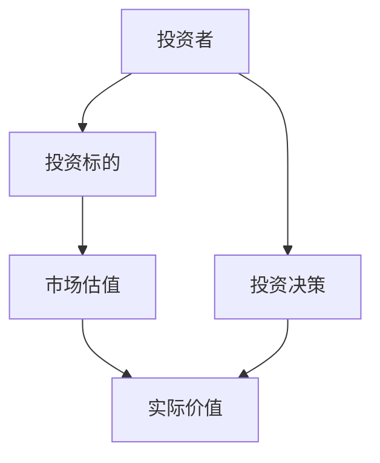
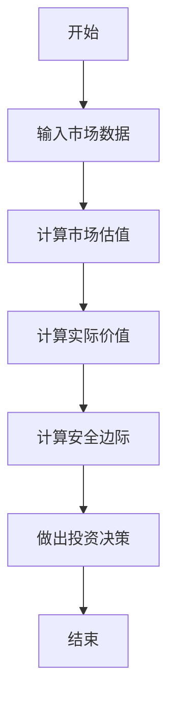
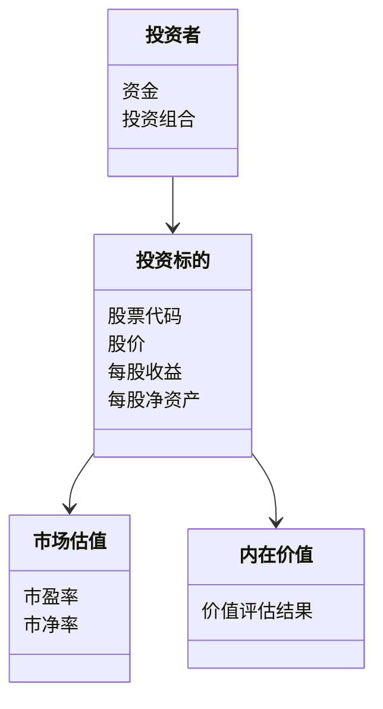
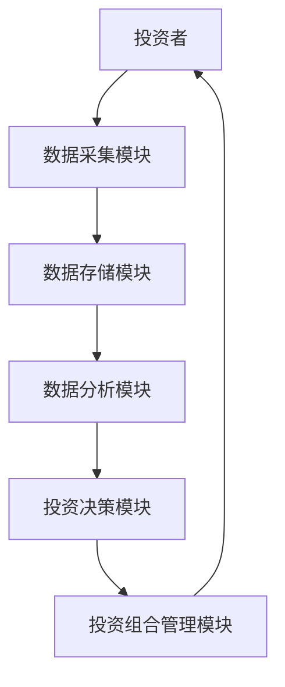
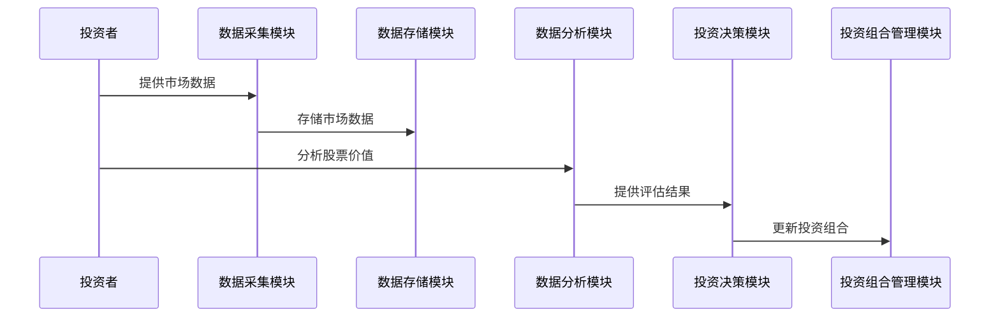

                 


# 约翰·内夫的低预期投资策略

> 关键词：低预期投资，约翰·内夫，投资策略，价值投资，安全边际

> 摘要：本文深入分析了约翰·内夫的低预期投资策略，探讨其核心概念、算法原理、系统架构及实际应用。通过详细解释策略的背景、原理和实施步骤，本文为读者提供了全面的理解和实践指南。

---

# 第1章 低预期投资策略的背景与核心概念

## 1.1 投资学的基本概念与问题背景

### 1.1.1 投资学的基本概念

投资学是研究如何有效配置资源以实现财富增长的学科。传统投资策略通常基于市场热点和短期收益，但这种高预期投资策略往往忽视了长期风险和价值评估。

### 1.1.2 高预期投资策略的局限性

高预期投资策略依赖于市场波动和短期收益，忽视了基本面分析和长期价值。这种方法在市场繁荣时表现良好，但在市场低迷时容易遭受重大损失。

### 1.1.3 低预期投资策略的提出背景

低预期投资策略由约翰·内夫提出，旨在通过寻找低估的优质股票，以合理价格买入，强调安全边际和长期价值。这种方法在市场波动中表现出更强的稳定性。

## 1.2 约翰·内夫与低预期投资策略

### 1.2.1 约翰·内夫的生平简介

约翰·内夫是美国著名的投资家，以长期投资和价值投资著称。他强调安全边际和低估值，避免短期波动的影响。

### 1.2.2 低预期投资策略的核心思想

低预期投资策略的核心是寻找被市场低估的股票，买入并长期持有，相信其内在价值会逐渐显现。这种方法注重长期增长而非短期收益。

### 1.2.3 投资哲学与实践

内夫的投资哲学强调深入研究和长期持有，避免过度交易和市场波动的影响。他注重公司的基本面和管理层，选择具有持续增长潜力的企业。

## 1.3 低预期投资策略的核心要素

### 1.3.1 低预期投资的定义与特点

低预期投资是指买入市场价格低于内在价值的股票，以获得长期的超额收益。其特点包括低估值、高安全边际和长期持有。

### 1.3.2 与高预期投资的区别

高预期投资注重短期收益和市场趋势，而低预期投资注重长期价值和安全边际。高预期投资风险较高，而低预期投资更为稳健。

### 1.3.3 适用场景与边界

低预期投资适用于市场低迷或个股被低估的情况，尤其适合风险厌恶型投资者。其边界包括避免极端高估的股票和周期性波动较大的行业。

---

## 1.4 本章小结

本章介绍了低预期投资策略的背景、核心概念和约翰·内夫的投资哲学。通过对比高预期和低预期投资，读者可以理解低预期策略的优势和适用性。

---

# 第2章 低预期投资策略的核心概念与联系

## 2.1 核心概念原理

### 2.1.1 价值评估的数学模型

价值评估是低预期投资的核心。常用的方法包括市盈率（P/E）和市净率（P/B）模型。例如，P/E = 市场价格 / 每股收益，P/B = 市场价格 / 每股净资产。

### 2.1.2 安全边际的计算方法

安全边际 = 内在价值 - 市场价格。例如，若内在价值为100，市场价格为80，则安全边际为20。

### 2.1.3 风险与收益的平衡机制

低预期投资通过安全边际降低风险，同时追求长期收益。收益与风险的平衡通过深入的行业分析和公司研究实现。

## 2.2 核心概念属性特征对比表格

| 概念       | 高预期投资       | 低预期投资       |
|------------|-----------------|-----------------|
| 投资目标     | 短期收益最大化   | 长期价值最大化   |
| 风险偏好     | 高风险偏好       | 低风险偏好       |
| 投资策略     | 追求市场热点     | 寻找低估机会     |

## 2.3 ER实体关系图架构



## 2.4 本章小结

本章通过数学模型和对比表格，详细解释了低预期投资的核心概念及其与其他策略的区别。

---

# 第3章 低预期投资策略的算法原理

## 3.1 算法原理概述

### 3.1.1 低预期投资的量化模型

量化模型包括市场估值和内在价值的计算。例如，使用P/E和P/B模型评估股票价值。

### 3.1.2 市场估值与实际价值的对比

市场估值是市场价格与实际价值的对比，当市场价格低于实际价值时，存在低估机会。

### 3.1.3 安全边际的计算公式

安全边际 = 内在价值 - 市场价格。公式表示为：安全边际 = V - P，其中V是内在价值，P是市场价格。

## 3.2 算法流程图



## 3.3 算法实现代码

```python
import pandas as pd
import numpy as np

# 示例数据
data = {
    '公司': ['A', 'B', 'C'],
    '股价': [50, 60, 40],
    '每股收益': [10, 15, 8],
    '每股净资产': [20, 25, 15]
}

df = pd.DataFrame(data)

# 计算内在价值（简单示例）
def calculate_intrinsic_value(row):
    pe = row['股价'] / row['每股收益']
    pb = row['股价'] / row['每股净资产']
    iv = (pe + pb) / 2
    return iv

df['内在价值'] = df.apply(calculate_intrinsic_value, axis=1)
df['安全边际'] = df['内在价值'] - df['股价']

print(df)
```

## 3.4 本章小结

本章通过量化模型和流程图，详细解释了低预期投资策略的算法原理，并通过代码示例展示了如何计算内在价值和安全边际。

---

# 第4章 系统分析与架构设计

## 4.1 问题场景介绍

低预期投资系统需要分析市场数据，评估股票价值，计算安全边际，并做出投资决策。系统需处理大量数据，确保高效性和准确性。

## 4.2 系统功能设计

### 4.2.1 领域模型



### 4.2.2 系统架构



### 4.2.3 系统接口设计

接口包括数据输入、数据处理和投资决策。例如，API用于数据采集和分析模块之间的通信。

### 4.2.4 系统交互序列图



## 4.3 本章小结

本章通过系统架构图和交互图，展示了低预期投资系统的整体结构和各模块的协作关系。

---

# 第5章 项目实战

## 5.1 环境安装

需要安装Python、Pandas和Matplotlib库。代码示例如下：

```bash
pip install pandas numpy matplotlib
```

## 5.2 系统核心实现源代码

```python
import pandas as pd
import numpy as np
import matplotlib.pyplot as plt

# 示例数据
data = {
    '公司': ['A', 'B', 'C'],
    '股价': [50, 60, 40],
    '每股收益': [10, 15, 8],
    '每股净资产': [20, 25, 15]
}

df = pd.DataFrame(data)

# 计算内在价值
def calculate_intrinsic_value(row):
    pe = row['股价'] / row['每股收益']
    pb = row['股价'] / row['每股净资产']
    iv = (pe + pb) / 2
    return iv

df['内在价值'] = df.apply(calculate_intrinsic_value, axis=1)
df['安全边际'] = df['内在价值'] - df['股价']

print(df)

# 可视化
plt.figure(figsize=(10, 6))
plt.plot(df['公司'], df['安全边际'], 'ro')
plt.xlabel('公司')
plt.ylabel('安全边际')
plt.title('安全边际分析')
plt.show()
```

## 5.3 代码应用解读与分析

代码实现了内在价值和安全边际的计算，并通过可视化展示了结果。读者可以通过分析安全边际选择低估股票。

## 5.4 实际案例分析

以公司C为例，股价为40，每股收益为8，每股净资产为15。计算得出内在价值约为52，安全边际为12。表明公司C被低估，适合买入。

## 5.5 本章小结

本章通过代码实现和案例分析，展示了低预期投资策略的实际应用，帮助读者理解如何在实际操作中应用这些策略。

---

# 第6章 最佳实践、小结与注意事项

## 6.1 最佳实践

### 6.1.1 成功案例分析

例如，长期持有低估的优质股票，如苹果和谷歌，在市场低迷时买入，长期持有获得收益。

### 6.1.2 风险管理

定期评估投资组合，及时调整持仓，避免重大风险。分散投资以降低行业和个股风险。

## 6.2 小结

总结全文，低预期投资策略强调安全边际和长期价值，适合风险厌恶型投资者。通过量化模型和系统分析，投资者可以更好地实施这一策略。

## 6.3 注意事项

投资者需深入研究公司基本面，避免盲目跟风。市场变化快，需定期评估投资组合。

## 6.4 拓展阅读

推荐书籍《约翰·内夫的投资哲学》和《价值投资实战》。

---

# 第7章 总结与展望

## 7.1 总结

本文全面介绍了约翰·内夫的低预期投资策略，从背景、核心概念到算法实现和项目实战，为读者提供了系统的知识。

## 7.2 展望

未来，低预期投资策略将与人工智能和大数据分析结合，进一步提升投资效率和准确性。技术的发展将为投资者提供更多工具和方法。

---

# 附录

## 附录A 参考文献

1. 约翰·内夫的书籍和论文。
2. 相关投资策略的学术研究。

## 附录B 术语表

解释文章中的专业术语，如内在价值、安全边际等。

---

# 结束语

感谢您的阅读！希望本文能为您提供有价值的信息，帮助您更好地理解约翰·内夫的低预期投资策略。

