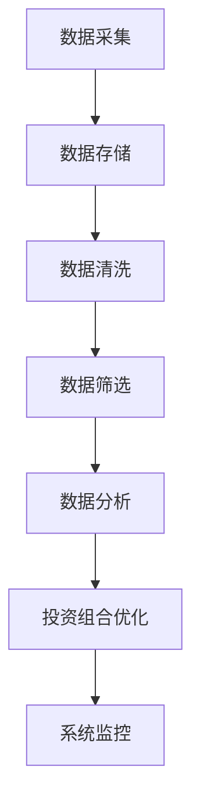
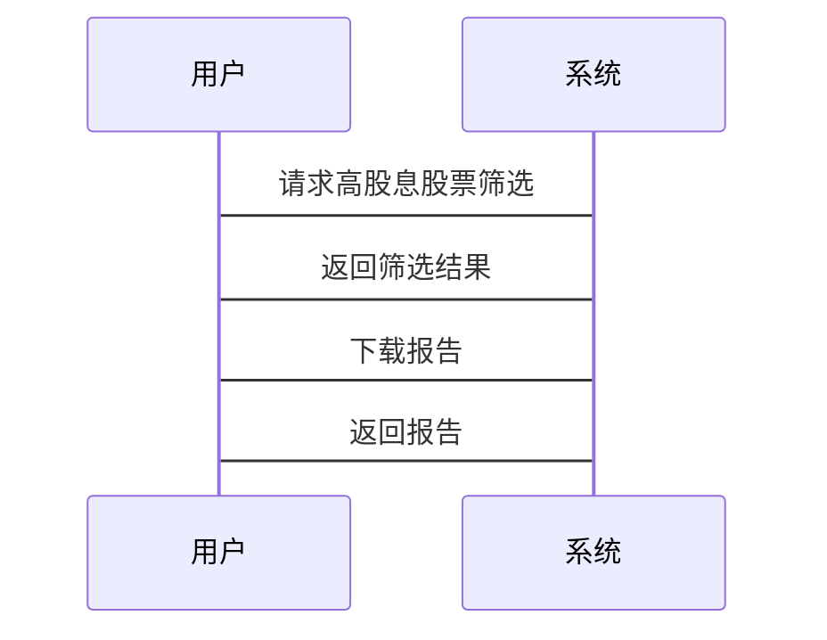

                 


# 约翰·内夫的高股息价值投资策略

> 关键词：高股息股票、价值投资、投资策略、约翰·内夫、股息率

> 摘要：本文深入分析了约翰·内夫的高股息价值投资策略，探讨了其投资理念、高股息股票的筛选标准、投资组合的构建方法以及系统化的投资分析过程。文章从理论到实践，结合具体案例和系统设计，为读者提供了全面的理解和应用指南。

---

## 第一部分: 约翰·内夫的高股息价值投资策略概述

### 第1章: 投资理念与背景

#### 1.1 价值投资的起源与发展

##### 1.1.1 价值投资的定义与核心要素

价值投资是一种以基本面分析为基础的投资策略，其核心在于寻找市场价格低于其内在价值的股票。核心要素包括：

- **内在价值**：股票的长期盈利能力决定其价值。
- **安全边际**：买入价格低于内在价值，以降低风险。
- **长期视角**：关注企业的长期表现而非短期波动。

##### 1.1.2 约翰·内夫的投资哲学

约翰·内夫是价值投资的重要代表人物，他的投资哲学可以总结为：

- **低估值**：寻找市场价格低于内在价值的股票。
- **高股息**：重视股息回报，关注股息率和股息增长能力。
- **长期持有**：避免频繁交易，长期持有优质股票。

##### 1.1.3 高股息投资的背景与现状

高股息投资策略在市场低迷或利率较低的环境下表现尤为突出，因为高股息股票能够为投资者提供稳定的现金流。当前，随着全球老龄化加剧和低利率环境的持续，高股息股票受到越来越多投资者的关注。

#### 1.2 约翰·内夫的生平与投资成就

##### 1.2.1 约翰·内夫的个人经历

约翰·内夫（John Neff）是美国著名的投资经理，曾管理温莎基金（Windsor Fund）长达31年，创造了卓越的投资业绩。他以高股息股票投资闻名，强调低估值和稳定的股息回报。

##### 1.2.2 温莎基金的投资历程

温莎基金在内夫的管理下，年均收益率超过市场平均水平，尤其是在1970年代的石油危机期间，基金表现尤为出色。这得益于内夫对高股息股票的精选策略。

##### 1.2.3 高股息投资策略的形成

内夫的高股息投资策略并非一蹴而就，而是经过长期实践总结出来的。他发现，高股息股票往往具有较高的安全边际和较低的估值，能够在市场波动中为投资者提供稳定回报。

---

### 第2章: 高股息股票的核心特征

#### 2.1 高股息股票的定义与分类

##### 2.1.1 高股息股票的定义

高股息股票是指股息率较高，能够为投资者提供稳定现金流的股票。通常，股息率超过市场平均水平的股票可以被视为高股息股票。

##### 2.1.2 高股息股票的分类

高股息股票可以分为以下几类：

- **成熟型**：行业龙头，盈利能力稳定，股息率较高。
- **增长型**：公司处于成长期，股息率可能较低，但具有较高的增长潜力。
- **周期性**：行业波动较大，但在特定周期内股息率较高。

##### 2.1.3 高股息股票与普通股票的区别

高股息股票与普通股票的主要区别在于股息率和投资策略。高股息股票注重股息回报，而普通股票更关注资本增值。

#### 2.2 高股息股票的核心特征

##### 2.2.1 股息率的计算与分析

股息率的计算公式为：

$$
\text{股息率} = \frac{\text{每股股息}}{\text{股价}}
$$

高股息股票通常要求股息率在5%以上。例如，某股票股价为20元，每股股息为1元，股息率为5%。

##### 2.2.2 股息增长能力的评估

股息增长能力是高股息股票的重要特征。公司应具备稳定的盈利能力和良好的股息增长记录。例如，过去五年中，某公司每年股息增长率均超过5%，说明其股息增长能力较强。

##### 2.2.3 股东权益与盈利能力的关系

股东权益是公司净资产的体现，盈利能力强的公司通常能够提供较高的股息回报。例如，某公司净利润增长稳定，且分红比例较高，说明其股东权益与盈利能力密切相关。

---

### 第3章: 高股息股票的筛选标准

#### 3.1 股息率的筛选标准

##### 3.1.1 合理股息率的范围

股息率通常在5%~10%之间的股票被视为高股息股票。例如，某股票股价为10元，每股股息为0.5元，股息率为5%。

##### 3.1.2 股息率与股价波动的关系

高股息股票通常具有较低的股价波动性，因为它们往往属于成熟行业，具有较高的稳定性。例如，公用事业和金融行业的股票通常股息率较高且波动较小。

#### 3.2 股息增长能力的评估

##### 3.2.1 股息增长率的计算

股息增长率的计算公式为：

$$
\text{股息增长率} = \frac{\text{当年股息} - \text{上年股息}}{\text{上年股息}}
$$

例如，某公司去年股息为1元，今年股息为1.05元，股息增长率为5%。

##### 3.2.2 股息增长的可持续性分析

股息增长的可持续性取决于公司的盈利能力和股息政策。例如，某公司过去五年股息增长率均超过5%，且净利润增长稳定，说明其股息增长具有较高的可持续性。

#### 3.3 财务指标的综合评估

##### 3.3.1 净利润与股息支付率的关系

净利润是公司盈利能力的体现，股息支付率是股息与净利润的比例。例如，某公司净利润为10亿元，股息为5亿元，股息支付率为50%。

##### 3.3.2 负债率与财务健康状况的评估

负债率是公司负债与资产的比例，低负债率通常意味着财务健康。例如，某公司负债率为30%，说明其财务状况较为稳健。

##### 3.3.3 资产周转率与公司运营效率的分析

资产周转率是公司销售收入与平均资产总额的比例，高资产周转率说明公司运营效率较高。例如，某公司资产周转率为2，说明其资产使用效率较高。

---

### 第4章: 高股息股票的投资组合构建

#### 4.1 投资组合的目标与策略

##### 4.1.1 投资组合的目标设定

高股息股票投资组合的目标是实现稳定的股息收益和资本增值。例如，投资者可以通过配置高股息股票，每年获得5%~10%的股息收益。

##### 4.1.2 高股息股票在组合中的角色

高股息股票在投资组合中通常起到稳定收益的作用。例如，投资者可以在组合中配置一定比例的高股息股票，以降低整体波动性。

#### 4.2 资产配置与风险控制

##### 4.2.1 不同资产类别在组合中的权重分配

高股息股票在组合中的权重通常为30%~50%，其余部分可以配置债券、现金等其他资产。例如，投资者可以将60%的资金用于高股息股票，20%用于债券，20%用于现金。

##### 4.2.2 风险管理的策略与工具

风险管理是高股息股票投资的重要环节。投资者可以通过分散投资、设置止损位等方法来控制风险。例如，当某只股票跌幅超过10%，投资者可以选择卖出。

##### 4.2.3 个股与行业分散化的应用

分散化是降低风险的重要策略。例如，投资者可以配置多个行业的高股息股票，以避免单一行业风险的影响。

---

### 第5章: 高股息股票投资的系统化分析

#### 5.1 数据收集与处理

##### 5.1.1 数据来源的选择

数据来源包括金融数据库（如FactSet、Morningstar）和公司财报。例如，投资者可以通过FactSet获取高股息股票的详细数据。

##### 5.1.2 数据清洗与预处理

数据清洗包括去除缺失值、异常值等。例如，某股票的历史股息数据存在缺失，需要进行插值处理。

##### 5.1.3 数据存储与管理

数据可以存储在数据库中，便于后续分析。例如，投资者可以使用MySQL或MongoDB来存储股票数据。

#### 5.2 高股息股票筛选的算法实现

##### 5.2.1 筛选标准的逻辑框架

高股息股票筛选的逻辑框架如下：

1. 筛选股息率大于5%的股票。
2. 筛选过去五年股息增长率大于3%的股票。
3. 筛选负债率小于50%的股票。
4. 筛选净利润同比增长率大于5%的股票。

##### 5.2.2 数据分析的Python代码实现

以下是Python代码示例：

```python
import pandas as pd

# 假设df为股票数据，包含'股息率'、'股息增长率'、'负债率'、'净利润增长率'等字段

# 筛选股息率大于5%的股票
df = df[df['股息率'] > 5]

# 筛选过去五年股息增长率大于3%的股票
df = df[df['股息增长率'] > 3]

# 筛选负债率小于50%的股票
df = df[df['负债率'] < 50]

# 筛选净利润同比增长率大于5%的股票
df = df[df['净利润增长率'] > 5]

# 输出筛选结果
print(df)
```

##### 5.2.3 算法的优化与改进

算法优化包括增加更多的筛选条件，例如引入市盈率（P/E）和市净率（P/B）等指标。例如，筛选市盈率低于市场平均水平的股票。

#### 5.3 投资组合优化的数学模型

##### 5.3.1 Markowitz有效前沿理论

Markowitz有效前沿理论是投资组合优化的重要理论，其核心在于通过分散化降低风险。以下是Markowitz有效前沿的公式：

$$
\text{最优组合} = \argmin_{w} \left( \sigma^2 \right) \quad \text{在} \quad \sum_{i=1}^{n} w_i = 1
$$

其中，\( \sigma^2 \) 表示组合的方差，\( w_i \) 表示各资产的权重。

##### 5.3.2 风险调整后的收益最大化模型

风险调整后的收益最大化模型旨在在风险可控的前提下，实现收益的最大化。公式如下：

$$
\text{最优组合} = \argmax_{w} \left( \mu \cdot w \right) \quad \text{在} \quad w \cdot \Sigma \cdot w^T = \sigma^2_{\text{目标}}
$$

其中，\( \mu \) 表示收益向量，\( \Sigma \) 表示协方差矩阵，\( \sigma^2_{\text{目标}} \) 表示目标风险。

##### 5.3.3 约束条件下的优化问题

在实际投资中，投资者需要考虑多种约束条件，例如流动性约束、税收约束等。例如，投资者可以设定组合中高股息股票的比例不超过50%，以避免过度集中风险。

---

### 第6章: 高股息股票投资的案例分析

#### 6.1 案例介绍

##### 6.1.1 投资背景

假设当前市场环境下，某投资者希望构建一个高股息股票投资组合，以实现稳定的股息收益和资本增值。

##### 6.1.2 投资目标

投资者希望在10年内实现年化收益率8%，并通过高股息股票投资组合实现这一目标。

#### 6.2 数据分析与筛选

##### 6.2.1 数据来源

投资者可以从金融数据库中获取高股息股票的数据，包括股息率、股息增长率、负债率等指标。

##### 6.2.2 筛选过程

投资者可以根据筛选标准，逐步筛选出符合条件的高股息股票。例如：

1. 筛选股息率大于5%的股票。
2. 筛选过去五年股息增长率大于3%的股票。
3. 筛选负债率小于50%的股票。
4. 筛选净利润同比增长率大于5%的股票。

#### 6.3 投资组合构建

##### 6.3.1 资产配置

假设投资者决定将60%的资金用于高股息股票，20%用于债券，20%用于现金。

##### 6.3.2 风险管理

投资者可以设置止损位，例如当某只股票跌幅超过10%，立即卖出该股票。

#### 6.4 投资组合表现分析

##### 6.4.1 短期表现

假设投资组合在第一年表现良好，股息收益为6%，资本增值为3%。

##### 6.4.2 长期表现

假设投资组合在10年内的年化收益率为8%，符合投资者的目标。

---

### 第7章: 高股息股票投资的系统设计

#### 7.1 系统架构设计

##### 7.1.1 系统功能模块

高股息股票投资系统主要包括数据采集、筛选、分析、监控等功能模块。

##### 7.1.2 系统架构图

以下是系统架构的Mermaid图：



##### 7.1.3 系统接口设计

系统接口包括数据接口、用户界面、报告生成接口等。

##### 7.1.4 系统交互设计

以下是系统交互的Mermaid序列图：



#### 7.2 核心算法实现

##### 7.2.1 数据分析算法

以下是数据分析的Python代码示例：

```python
import pandas as pd
import numpy as np

# 假设df为股票数据，包含'股息率'、'股息增长率'、'负债率'等字段

# 筛选股息率大于5%的股票
mask = df['股息率'] > 5
df = df[mask]

# 筛选过去五年股息增长率大于3%的股票
mask = df['股息增长率'] > 3
df = df[mask]

# 筛选负债率小于50%的股票
mask = df['负债率'] < 50
df = df[mask]

# 输出筛选结果
print(df)
```

##### 7.2.2 投资组合优化算法

以下是投资组合优化的Python代码示例：

```python
import numpy as np
from scipy.optimize import minimize

# 假设returns为股票的预期收益率矩阵，cov为协方差矩阵

# 定义目标函数
def objective(weight, returns, cov):
    return np.dot(weight.T, returns)

# 定义约束条件
def constraint1(weight):
    return np.sum(weight) - 1

# 定义优化问题
cons = {'type': 'eq', 'fun': constraint1}

# 使用SLSQP求解器优化问题
result = minimize(objective, np.ones(len(returns)) / len(returns), method='SLSQP', constraints=cons)

# 输出最优权重
print(result.x)
```

---

### 第8章: 总结与展望

#### 8.1 总结

本文深入分析了约翰·内夫的高股息价值投资策略，探讨了其投资理念、高股息股票的筛选标准、投资组合的构建方法以及系统化的投资分析过程。通过案例分析和系统设计，为读者提供了全面的理解和应用指南。

#### 8.2 展望

未来，高股息股票投资策略将继续在市场中发挥重要作用。随着技术的进步，投资者可以通过更 sophisticated的算法和系统，进一步优化投资组合，提高收益并降低风险。

---

### 最佳实践 Tips

- **长期持有**：高股息股票投资需要长期持有，避免频繁交易。
- **分散投资**：通过分散投资降低风险。
- **定期调整**：定期评估投资组合，根据市场变化进行调整。
- **关注基本面**：高股息股票的投资需要关注公司的基本面，包括盈利能力、财务状况等。

通过本文的分析，读者可以更好地理解和应用约翰·内夫的高股息价值投资策略，实现稳健的投资收益。

