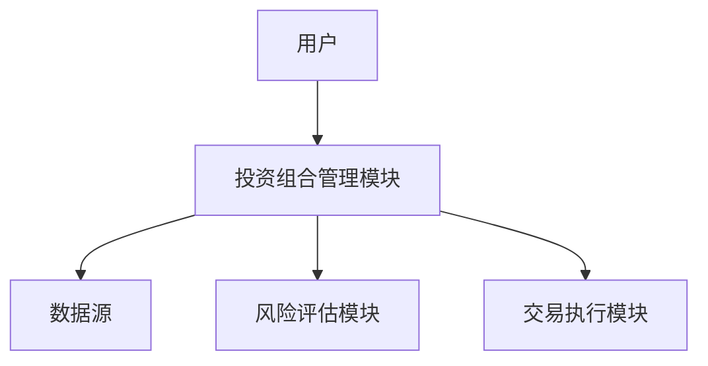

                 


# 约翰·博格尔的指数化价值投资：被动投资的价值取向

**关键词**：指数化投资、被动投资、约翰·博格尔、价值投资、风险管理

**摘要**：本文深入探讨了约翰·博格尔在指数化投资领域的贡献及其价值取向。通过分析指数化投资的背景、理论基础、策略与实践、风险管理等方面，揭示了指数化投资的内在逻辑和实际应用。文章结合数学公式、图表和实例，为读者提供了全面而深入的理解。

---

## 第1章：指数化投资的背景与定义

### 1.1 指数化投资的背景

#### 1.1.1 传统投资方式的局限性
传统投资方式依赖于主动管理，投资者试图通过选股或市场 timing 来获取超额收益。然而，这种方式存在以下问题：
- 高昂的交易成本和管理费用
- 市场 timing 的难度
- 主动管理者的业绩不确定性

#### 1.1.2 现代金融理论的发展
现代金融理论的发展为被动投资提供了理论基础，尤其是有效市场假说（EMH）和资本资产定价模型（CAPM）。这些理论表明，市场通常是有效的，被动投资能够获得市场的平均收益。

#### 1.1.3 索罗斯与巴菲特的投资理念对比
索罗斯的主动投资理念强调寻找市场错位和短期套利机会，而巴菲特的价值投资理念强调长期持有优质股票。相比之下，博格尔的指数化投资理念更加注重长期、分散和低成本。

### 1.2 指数化投资的定义与特点

#### 1.2.1 指数化投资的定义
指数化投资是一种通过跟踪特定市场指数（如标普500）来构建投资组合的投资策略，旨在获得市场平均收益。

#### 1.2.2 指数化投资的核心特点
- **分散化**：通过持有指数中的所有成分股，降低非系统性风险。
- **低成本**：指数基金的管理费用通常低于主动管理型基金。
- **被动管理**：不主动调整投资组合，仅定期再平衡。

#### 1.2.3 指数化投资与主动投资的区别
| **方面** | **指数化投资** | **主动投资** |
|----------|----------------|---------------|
| 管理方式 | 被动跟踪指数    | 主动选股      |
| 成本     | 低              | 高            |
| 风险     | 低              | 高            |
| 收益     | 市场平均收益     | 追求超额收益  |

### 1.3 约翰·博格尔与指数化投资

#### 1.3.1 约翰·博格尔的生平简介
约翰·博格尔（John C. Bogle）是指数化投资的倡导者，被誉为“指数基金之父”。他在 Vanguard 集团工作期间，推动了第一只低成本指数基金的诞生。

#### 1.3.2 博格尔对指数化投资的贡献
博格尔的贡献包括：
- 创立 Vanguard 集团
- 推出第一只指数基金（Vanguard 500 Index Fund）
- 提倡低成本、分散化的投资理念

#### 1.3.3 博格尔的投资理念与价值取向
博格尔的价值取向体现在以下几点：
- 长期投资：相信市场回归均值，反对短期投机。
- 分散化：通过持有广泛分散的资产降低风险。
- 低成本：认为高昂的费用会侵蚀长期收益。

### 1.4 本章小结
本章介绍了指数化投资的背景、定义和特点，并详细阐述了约翰·博格尔的贡献及其价值取向。指数化投资作为一种被动投资策略，通过分散化和低成本，为投资者提供了稳定的投资回报。

---

## 第2章：指数化投资的理论基础

### 2.1 有效市场假说

#### 2.1.1 有效市场假说的定义
有效市场假说（EMH）认为，市场的价格反映了所有可获得的信息，因此，投资者无法通过分析信息获得超额收益。

#### 2.1.2 有效市场假说的分类
| **类别**         | **描述**                               |
|------------------|--------------------------------------|
| 弱有效市场       | 价格反映历史信息                     |
| 半强有效市场       | 价格反映公开信息                     |
| 强有效市场       | 价格反映所有信息，包括内部信息       |

#### 2.1.3 有效市场假说对指数化投资的影响
在强有效市场下，指数化投资能够获得市场的平均收益，而主动投资难以持续跑赢市场。

### 2.2 资本资产定价模型（CAPM）

#### 2.2.1 CAPM的定义
CAPM 是一个用于估计资产期望收益的模型，考虑了系统性风险和无风险利率。

#### 2.2.2 CAPM的公式推导
$$
E(r) = R_f + \beta \times (R_m - R_f)
$$
其中：
- \( E(r) \)：资产的期望收益
- \( R_f \)：无风险利率
- \( \beta \)：资产的系统性风险系数
- \( R_m \)：市场收益

#### 2.2.3 CAPM在指数化投资中的应用
指数基金的 β 系数为 1，意味着其收益与市场一致，符合 CAPM 的预测。

### 2.3 指数基金的运作机制

#### 2.3.1 指数基金的构成
指数基金由成分股构成，成分股的选择基于特定的指数（如标普500）。

#### 2.3.2 指数基金的管理方式
指数基金通过被动跟踪指数，定期再平衡投资组合。

#### 2.3.3 指数基金的成本优势
指数基金的管理费用通常低于主动管理型基金，因为其管理方式简单。

### 2.4 本章小结
本章从理论基础出发，分析了有效市场假说和 CAPM 模型对指数化投资的影响，解释了指数基金的运作机制及其成本优势。

---

## 第3章：指数化投资的策略与实践

### 3.1 被动投资与主动投资的比较

#### 3.1.1 被动投资的定义与特点
被动投资通过跟踪指数获得市场平均收益，具有低成本和低风险的特点。

#### 3.1.2 主动投资的定义与特点
主动投资通过选股和市场 timing 追求超额收益，具有高成本和高风险的特点。

#### 3.1.3 两者的优缺点对比
| **方面**         | **被动投资**               | **主动投资**               |
|------------------|---------------------------|---------------------------|
| 成本             | 低                       | 高                         |
| 风险             | 低                       | 高                         |
| 收益             | 市场平均收益              | 追求超额收益              |
| 管理方式         | 被动跟踪                 | 主动管理                   |

### 3.2 指数基金的选择与配置

#### 3.2.1 指数基金的分类
指数基金可以根据跟踪的指数（如标普500、道琼斯指数）或地域（如国内、国际）进行分类。

#### 3.2.2 如何选择合适的指数基金
选择指数基金时，应考虑以下因素：
- 跟踪误差：指数基金的实际收益与指数收益的偏离程度。
- 管理费用：选择费用低的指数基金。
- 成分股数量：成分股越多，分散化效果越好。

#### 3.2.3 指数基金的配置比例
根据投资者的风险承受能力和投资目标，合理配置指数基金的比例。

### 3.3 长期投资与复利效应

#### 3.3.1 长期投资的重要性
长期投资能够摊低成本，减少市场波动的影响。

#### 3.3.2 复利效应的数学模型
$$
FV = P \times (1 + r)^n
$$
其中：
- \( FV \)：终值
- \( P \)：本金
- \( r \)：年化收益率
- \( n \)：投资年数

#### 3.3.3 复利效应在指数化投资中的应用
通过长期持有指数基金，投资者能够最大化复利效应，获得稳定的收益。

### 3.4 本章小结
本章分析了被动投资与主动投资的优缺点，讨论了指数基金的选择与配置策略，并强调了长期投资与复利效应的重要性。

---

## 第4章：指数化投资的风险管理

### 4.1 投资组合的风险与收益

#### 4.1.1 风险的定义与分类
风险可以分为系统性风险（市场风险）和非系统性风险（特定风险）。

#### 4.1.2 风险与收益的权衡
收益与风险通常是正相关的，高收益意味着高风险。

#### 4.1.3 风险调整后的收益评估
使用夏普比率（Sharpe Ratio）评估风险调整后的收益：
$$
S = \frac{E(r_i) - R_f}{\sigma_i}
$$
其中：
- \( E(r_i) \)：投资组合的期望收益
- \( R_f \)：无风险利率
- \( \sigma_i \)：投资组合的收益标准差

### 4.2 指数基金的风险来源

#### 4.2.1 市场风险
市场整体波动对指数基金的影响。

#### 4.2.2 利率风险
利率上升会导致债券价格下跌，影响指数基金的收益。

#### 4.2.3 通货膨胀风险
通货膨胀会侵蚀货币购买力，影响指数基金的实际收益。

### 4.3 风险管理策略

#### 4.3.1 分散化投资
通过投资多样化的资产降低非系统性风险。

#### 4.3.2 定期再平衡
定期调整投资组合，保持与目标指数一致。

#### 4.3.3 使用期权对冲
通过期权等衍生工具对冲系统性风险。

### 4.4 本章小结
本章分析了指数化投资的风险来源，并提出了风险管理策略，包括分散化投资、定期再平衡和使用衍生工具对冲风险。

---

## 第5章：指数化投资的实践与应用

### 5.1 指数化投资的系统架构

#### 5.1.1 系统功能设计
- 数据采集：获取指数成分股的实时数据。
- 投资组合构建：根据指数成分股构建投资组合。
- 风险评估：计算投资组合的风险指标。
- 交易执行：执行买卖指令。

#### 5.1.2 系统架构设计


### 5.2 指数化投资的代码实现

#### 5.2.1 环境安装
- 安装 Python 和相关库（如 pandas、numpy）。

#### 5.2.2 核心代码实现
```python
import pandas as pd
import numpy as np

# 数据获取
data = pd.read_csv('index_data.csv')

# 投资组合构建
weights = np.array([1/len(data.columns)] * len(data.columns))
portfolio_value = np.dot(data, weights)

# 风险评估
portfolio_variance = np.cov(data.values.T)
portfolio_std = np.sqrt(portfolio_variance)
```

#### 5.2.3 代码应用解读
上述代码实现了指数化投资的核心功能，包括数据获取、投资组合构建和风险评估。

### 5.3 指数化投资的案例分析

#### 5.3.1 案例背景
以标普500指数为例，构建一个指数基金的投资组合。

#### 5.3.2 实际操作步骤
1. 获取标普500指数成分股数据。
2. 计算各成分股的权重。
3. 构建投资组合并计算收益和风险。

### 5.4 本章小结
本章通过系统架构和代码实现，展示了指数化投资的实际应用，并通过案例分析验证了其可行性和有效性。

---

## 第6章：指数化投资的未来趋势

### 6.1 指数化投资的智能化

#### 6.1.1 智能投资工具的崛起
人工智能和大数据技术的应用，使得投资决策更加智能化。

#### 6.1.2 智能化投资的优势
- 高效的数据处理能力
- 精准的市场预测能力
- 自动化的投资决策

### 6.2 指数化投资的量化策略

#### 6.2.1 量化投资的定义
量化投资是一种基于数学模型的投资策略，利用算法进行交易决策。

#### 6.2.2 量化投资的优势
- 理性决策
- 高效执行
- 低人为干扰

### 6.3 指数化投资的ESG投资

#### 6.3.1 ESG投资的定义
ESG投资是指在投资决策中考虑环境、社会和公司治理因素。

#### 6.3.2 ESG指数基金的优势
- 符合社会责任投资理念
- 降低投资风险
- 提高长期收益潜力

### 6.4 本章小结
本章展望了指数化投资的未来趋势，包括智能化、量化策略和ESG投资，预测了这些趋势对投资行业的影响。

---

## 第7章：总结与展望

### 7.1 总结
指数化投资作为一种被动投资策略，以其低成本、分散化和长期稳定的特点，逐渐成为主流投资方式。约翰·博格尔的贡献为指数化投资奠定了理论和实践基础。

### 7.2 投资建议
- 长期持有指数基金
- 分散化投资以降低风险
- 定期再平衡投资组合

### 7.3 未来展望
随着技术的进步和市场的变化，指数化投资将继续发展，智能化和量化策略将变得更加重要。

### 7.4 本章小结
本章总结了全文的主要内容，并对未来的发展趋势进行了展望，为投资者提供了宝贵的建议。

---

## 附录：指数化投资相关资源

### A.1 术语表
- **指数化投资**：通过跟踪特定市场指数进行投资。
- **被动投资**：不主动管理投资组合。
- **CAPM**：资本资产定价模型。

### A.2 数据来源与工具推荐
- 数据来源：Yahoo Finance、Bloomberg。
- 工具推荐：Python、R、Excel。

### A.3 案例分析
- 案例：构建一个跟踪标普500指数的指数基金。

---

通过以上结构和内容，本文全面分析了约翰·博格尔的指数化价值投资理念，揭示了其在被动投资中的重要地位，并为投资者提供了实践指导和未来展望。

