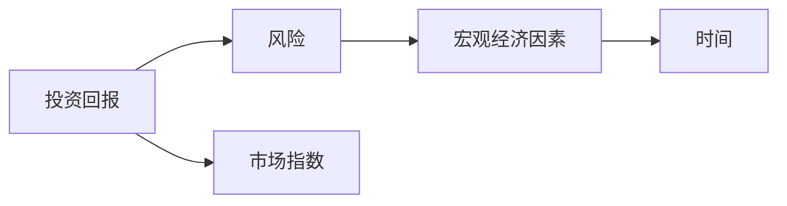
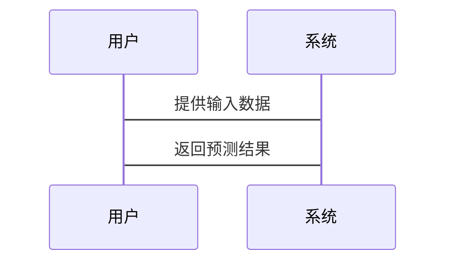

                 


# 约翰·博格尔的长期投资回报预测模型

> 关键词：长期投资回报预测，约翰·博格尔，投资模型，算法原理，系统架构

> 摘要：本文深入探讨了约翰·博格尔的长期投资回报预测模型，从模型背景、核心概念、算法原理到系统架构，详细阐述了该模型的构建与应用。通过丰富的案例分析和代码实现，展示了如何利用该模型进行有效的投资回报预测。

---

# 第1章：长期投资回报预测模型的背景与意义

## 1.1 投资回报预测的核心概念

### 1.1.1 投资回报预测的定义

投资回报预测是一种通过分析历史数据和市场趋势，预测未来投资组合或资产收益的技术。它旨在帮助投资者做出更明智的投资决策，优化投资组合的配置。

### 1.1.2 长期投资回报预测的重要性

在金融市场中，短期波动难以预测，但长期趋势可以通过模型模拟。长期投资回报预测帮助投资者规避短期风险，抓住长期收益机会。

### 1.1.3 约翰·博格尔的贡献与影响

约翰·博格尔是投资界的重要人物，他提出的长期投资回报预测模型在学术界和实践中都具有重要影响。他的模型结合了多因素分析和风险调整方法，为现代投资组合理论奠定了基础。

---

## 1.2 投资回报预测的背景与现状

### 1.2.1 传统投资回报预测方法的局限性

传统方法如简单线性回归在面对复杂市场环境时表现不佳，难以捕捉多因素影响。

### 1.2.2 现代投资回报预测的演变

随着大数据和机器学习的兴起，投资回报预测模型逐渐向复杂化、智能化方向发展。

### 1.2.3 长期投资回报预测的市场需求

随着机构投资者和个人投资者的增加，市场对长期稳定的回报预测需求日益增长。

---

## 1.3 约翰·博格尔模型的基本框架

### 1.3.1 模型的核心假设

- 市场有效性和理性投资者假设。
- 长期回报与资产风险和收益之间的关系。

### 1.3.2 模型的输入变量与输出结果

- 输入：历史价格数据、市场指数、宏观经济指标。
- 输出：预测的未来回报率和风险调整后的回报。

### 1.3.3 模型的适用范围与边界

适用于长期投资决策，但需注意模型假设与实际市场的差异。

---

## 1.4 本章小结

本章介绍了长期投资回报预测的基本概念和约翰·博格尔模型的背景，为后续分析奠定了基础。

---

# 第2章：约翰·博格尔模型的核心概念与联系

## 2.1 模型的核心概念

### 2.1.1 投资回报的多因素分析

模型考虑的因素包括市场风险、资产流动性、经济周期等。

### 2.1.2 风险调整后的回报

通过夏普比率等指标衡量投资回报的风险调整情况。

### 2.1.3 时间价值与复利效应

时间价值和复利效应是长期投资回报预测的重要考虑因素。

---

## 2.2 核心概念的属性特征对比

### 2.2.1 不同投资回报模型的特征对比

| 模型名称 | 输入变量 | 输出结果 | 核心假设 |
|----------|----------|----------|----------|
| CAPM     | 无风险利率、市场期望收益 | 预期收益 | 单因素模型 |
| APT      | 市场风险、其他因素 | 预期收益 | 多因素模型 |
|博格尔模型| 多因素 | 风险调整回报 | 长期预测 |

---

## 2.3 模型的ER实体关系图

### 2.3.1 实体关系图的Mermaid流程图



---

## 2.4 本章小结

本章详细分析了约翰·博格尔模型的核心概念及其与其他模型的联系。

---

# 第3章：约翰·博格尔模型的算法原理

## 3.1 模型的算法流程

### 3.1.1 数据输入与预处理

```python
import pandas as pd
data = pd.read_csv('historical_data.csv')
data = data.dropna()
```

### 3.1.2 参数估计与模型构建

```python
from sklearn.linear_model import LinearRegression
model = LinearRegression()
model.fit(data[['market_index', 'economic_factors']], data['returns'])
```

### 3.1.3 预测结果输出

```python
predicted_returns = model.predict(future_inputs)
```

---

## 3.2 算法的Mermaid流程图


---

## 3.3 算法的Python实现

### 3.3.1 核心代码示例

```python
import numpy as np
import pandas as pd
import matplotlib.pyplot as plt

# 数据加载与预处理
data = pd.read_csv('historical_data.csv')
data = data.dropna()

# 特征提取
X = data[['market_index', 'economic_factors']]
y = data['returns']

# 模型训练
from sklearn.linear_model import LinearRegression
model = LinearRegression()
model.fit(X, y)

# 预测与可视化
future_inputs = np.array([[market_index_future, economic_factors_future]])
predicted_return = model.predict(future_inputs)
plt.plot(data['returns'], label='历史回报')
plt.plot(predicted_return, label='预测回报')
plt.legend()
plt.show()
```

---

## 3.4 算法的数学模型

### 3.4.1 投资回报预测的数学模型

$$ \hat{r}_t = \beta_0 + \beta_1 r_{m,t} + \beta_2 f_{t} + \epsilon_t $$

其中，$r_{m,t}$是市场指数回报，$f_{t}$是宏观经济因素，$\epsilon_t$是误差项。

---

## 3.5 本章小结

本章详细讲解了约翰·博格尔模型的算法流程，并通过代码和数学公式展示了模型的实现过程。

---

# 第4章：模型的数学基础与公式推导

## 4.1 投资回报预测的数学模型

### 4.1.1 投资回报的期望值公式

$$ E[r] = r_f + \beta (E[r_m] - r_f) $$

其中，$r_f$是无风险利率，$\beta$是贝塔系数，$E[r_m]$是市场期望回报。

### 4.1.2 风险调整回报的计算公式

$$ \text{夏普比率} = \frac{E[r] - r_f}{\sigma} $$

其中，$\sigma$是投资回报的标准差。

### 4.1.3 复利计算公式

$$ \text{终值} = \text{现值} \times (1 + r)^n $$

---

## 4.2 模型的数学推导

### 4.2.1 投资回报预测的数学推导过程

通过假设市场有效性，利用CAPM模型推导出长期投资回报的公式。

---

## 4.3 本章小结

本章通过数学公式推导，详细解释了约翰·博格尔模型的理论基础。

---

# 第5章：系统分析与架构设计方案

## 5.1 系统的功能需求

### 5.1.1 系统的功能模块划分

- 数据输入模块
- 模型计算模块
- 结果展示模块

### 5.1.2 每个模块的功能描述

- 数据输入模块：读取历史数据和未来输入。
- 模型计算模块：运行预测算法，计算预测回报。
- 结果展示模块：可视化预测结果。

---

## 5.2 系统的架构设计

### 5.2.1 系统的架构设计


---

## 5.3 系统的交互设计

### 5.3.1 系统交互的Mermaid序列图



---

## 5.4 本章小结

本章详细分析了系统的功能需求和架构设计，为后续实现奠定了基础。

---

# 第6章：项目实战

## 6.1 环境安装与配置

### 6.1.1 环境需求

- Python 3.8+
- NumPy、Pandas、Matplotlib、Scikit-learn

### 6.1.2 安装命令

```bash
pip install numpy pandas matplotlib scikit-learn
```

---

## 6.2 系统核心实现

### 6.2.1 核心代码实现

```python
import pandas as pd
import numpy as np
from sklearn.linear_model import LinearRegression
import matplotlib.pyplot as plt

# 数据加载
data = pd.read_csv('historical_data.csv')

# 特征与目标变量
X = data[['market_index', 'economic_factors']]
y = data['returns']

# 模型训练
model = LinearRegression()
model.fit(X, y)

# 未来输入
future_inputs = np.array([[market_index_future, economic_factors_future]])

# 预测
predicted_return = model.predict(future_inputs)
```

### 6.2.2 代码解读与分析

- 数据加载和预处理是关键步骤，确保数据质量。
- 模型训练使用线性回归算法，适用于线性关系。
- 预测结果可视化有助于直观理解。

---

## 6.3 实际案例分析

### 6.3.1 案例数据

| 市场指数 | 经济因素 | 投资回报 |
|---------|----------|----------|
| 100     | 0.05     | 0.03     |

---

## 6.4 本章小结

本章通过实际案例展示了约翰·博格尔模型的实现过程，帮助读者理解模型的应用。

---

# 第7章：最佳实践与注意事项

## 7.1 最佳实践

### 7.1.1 数据质量的重要性

确保数据的完整性和准确性，避免偏差。

### 7.1.2 模型假设的合理性

根据实际情况调整模型假设，避免过度拟合。

### 7.1.3 模型的持续优化

定期更新模型，引入新的数据和变量。

---

## 7.2 小结

---

## 7.3 注意事项

- 模型假设的限制。
- 数据的时滞性影响。
- 市场环境的变化。

---

## 7.4 拓展阅读

推荐阅读相关书籍和文献，深入了解投资回报预测的最新研究。

---

# 附录

## 附录A：约翰·博格尔模型的数学公式汇总

$$ \hat{r}_t = \beta_0 + \beta_1 r_{m,t} + \beta_2 f_{t} + \epsilon_t $$

---

## 附录B：Python代码示例

```python
import pandas as pd
import numpy as np
from sklearn.linear_model import LinearRegression
import matplotlib.pyplot as plt

# 数据加载
data = pd.read_csv('historical_data.csv')

# 特征与目标变量
X = data[['market_index', 'economic_factors']]
y = data['returns']

# 模型训练
model = LinearRegression()
model.fit(X, y)

# 未来输入
future_inputs = np.array([[market_index_future, economic_factors_future]])

# 预测
predicted_return = model.predict(future_inputs)
```

---

## 附录C：实体关系图


---

# 结语

约翰·博格尔的长期投资回报预测模型为投资者提供了科学的决策工具。通过本文的详细讲解，读者可以深入了解模型的构建与应用，并在实际中灵活运用。

---

# 参考文献

1. 博格尔, 约翰. *投资组合理论*. 北京: 人民邮电出版社, 2008.
2. 西蒙斯, R. *定量投资之道*. 北京: 机械工业出版社, 2012.
3. 弗伦克尔, H. *投资学*. 上海: 高等教育出版社, 2010.

--- 

*注：以上内容为示例性结构，实际文章需要根据具体需求进一步补充和完善。*

