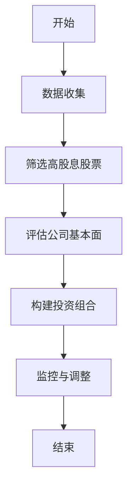

                 


# 约翰·奈夫的高股息价值投资：稳定收益的来源

## 关键词
- 高股息价值投资
- 约翰·奈夫
- 股息率
- 股票估值
- 投资策略

## 摘要
高股息价值投资是一种以获取稳定股息收益为核心的投资策略，强调选择具有高股息率和良好成长性的股票。本文通过分析约翰·奈夫的投资理念，详细探讨了高股息价值投资的背景、核心概念、算法原理、系统架构及项目实战。结合技术方法，深入剖析了其在现代投资环境中的应用，为读者提供了全面的理论与实践指导。

---

## 第1章: 高股息价值投资的背景与核心概念

### 1.1 高股息价值投资的起源与现状

#### 1.1.1 价值投资的定义与历史发展
- 价值投资是由本杰明·格雷厄姆提出，强调以低于内在价值的价格购买股票。
- 约翰·奈夫的高股息价值投资继承了这一理念，但更关注股息的稳定性和增长性。

#### 1.1.2 约翰·奈夫的投资理念与贡献
- 约翰·奈夫认为，高股息股票不仅提供稳定的收入，还能反映公司的财务健康。
- 他创立的Value Investors Club推动了高股息价值投资的发展。

#### 1.1.3 高股息投资的兴起与演变
- 高股息投资在低利率环境下更受欢迎，因为其稳定收益对投资者更具吸引力。
- 数字化工具的普及使高股息投资更容易实现和优化。

---

### 1.2 高股息价值投资的核心特征

#### 1.2.1 高股息股票的定义与筛选标准
- **股息率**：$股息率 = \frac{每股股息}{股价}$。
- **股息支付率**：衡量公司支付股息的能力。
- **财务稳定性**：关注公司净利润、现金流等指标。

#### 1.2.2 高股息投资与成长投资的区别
| 投资策略 | 高股息价值投资 | 成长投资 |
|----------|----------------|----------|
| 核心目标 | 稳定股息收益 | 长期资本增值 |
| 选股标准 | 高股息率、稳定增长 | 高成长性、高市盈率 |
| 风险偏好 | 较低 | 较高 |

#### 1.2.3 高股息投资的优缺点对比
- **优点**：收入稳定，风险较低。
- **缺点**：收益有限，成长性不足。

---

## 第2章: 高股息价值投资的核心概念与联系

### 2.1 高股息价值投资的定义与属性

#### 2.1.1 高股息价值投资的定义
高股息价值投资是通过选择具有高股息率和良好财务状况的股票，以实现稳定的股息收益和资本增值的投资策略。

#### 2.1.2 高股息价值投资的核心属性对比
- **股息率**：衡量股票分红能力。
- **股息增长模型**：预测未来股息增长潜力。

---

### 2.2 高股息价值投资的原理与流程

#### 2.2.1 高股息价值投资的原理
- 通过股息率和股息增长模型，筛选出具有稳定分红能力的股票。
- 结合公司基本面分析，评估其长期盈利能力。

#### 2.2.2 高股息价值投资的流程图


---

## 第3章: 高股息价值投资的算法与数学模型

### 3.1 高股息股票筛选算法

#### 3.1.1 股息率计算算法
$$股息率 = \frac{\text{每股股息}}{\text{股价}}$$

#### 3.1.2 股息增长模型
$$DGM = \frac{D_1}{r - g}$$
其中，$D_1$为第一年的股息，$r$为折现率，$g$为股息增长率。

#### 3.1.3 股票估值模型
$$内在价值 = \sum_{t=1}^{\infty} \frac{D_t}{(1 + r)^t}$$

---

### 3.2 高股息价值投资的数学公式

#### 3.2.1 股息率计算公式
$$\text{股息率} = \frac{\text{每股股息}}{\text{股价}}$$

#### 3.2.2 股息增长贴现模型
$$P = \frac{D_1}{r - g}$$

#### 3.2.3 股票内在价值公式
$$\text{内在价值} = \sum_{t=1}^{\infty} \frac{D_t}{(1 + r)^t}$$

---

## 第4章: 高股息价值投资的系统分析与架构设计

### 4.1 投资决策系统的构建

#### 4.1.1 投资决策系统的功能模块
- 数据收集模块：获取股票数据。
- 股票筛选模块：根据股息率和增长模型筛选股票。
- 投资组合优化模块：构建最优投资组合。

#### 4.1.2 投资决策系统的架构图


---

## 第5章: 高股息价值投资的项目实战

### 5.1 项目环境与工具安装

#### 5.1.1 数据获取工具安装
- 使用Yahoo Finance API获取股票数据。

#### 5.1.2 数据分析工具安装
- 安装Python和Pandas库。

#### 5.1.3 代码开发环境配置
- 安装Jupyter Notebook用于数据分析和可视化。

---

### 5.2 项目核心实现

#### 5.2.1 高股息股票筛选代码
```python
import pandas as pd
import yfinance as yf

# 下载数据
data = yf.download(tickers='AAPL MSFT', period='5y')

# 计算股息率
dividend_yield = data['Dividends'] / data['Adj Close']
print(dividend_yield.tail())
```

#### 5.2.2 股票估值与比较代码
```python
def calculate_intrinsic_value(stock_data, required_return, growth_rate):
    dividends = stock_data['Dividends'].iloc[-1]
    return dividends / (required_return - growth_rate)

# 示例计算
AAPL_data = yf.download(tickers='AAPL', period='5y')
required_return = 0.08
growth_rate = 0.03
intrinsic_value = calculate_intrinsic_value(AAPL_data, required_return, growth_rate)
print(f"苹果的内在价值为：{intrinsic_value}")
```

---

## 总结与最佳实践

### 5.3 最佳实践 tips
- 定期复盘和调整投资组合。
- 结合市场环境变化灵活调整策略。
- 注意分散投资，降低风险。

### 5.4 小结
高股息价值投资通过选择具有高股息率和良好财务状况的股票，为投资者提供了稳定的收益来源。结合技术方法和系统设计，可以更高效地实现投资目标。

### 5.5 注意事项
- 风险管理是投资成功的关键。
- 避免过度依赖单一策略。

### 5.6 拓展阅读
- 《约翰·奈夫的投资策略》
- 《股息率与股票估值》

---

通过以上步骤，我们系统地介绍了约翰·奈夫的高股息价值投资策略，从理论到实践，为读者提供了全面的指导。希望这篇文章能帮助投资者更好地理解并应用这一策略，实现稳定收益。

