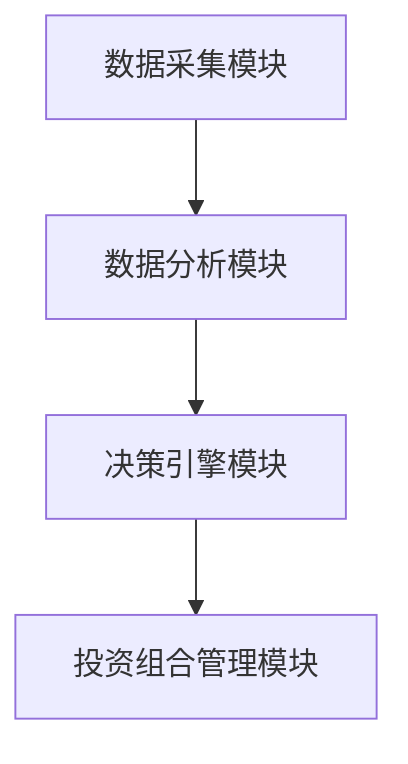

                 


# 约翰·汤普金斯的耐心型价值投资：长期持有创造价值

## 关键词：价值投资，耐心型投资，长期持有，投资策略，系统架构设计

## 摘要：本文详细探讨了约翰·汤普金斯提出的耐心型价值投资理念，通过分析其核心概念、策略和系统架构，帮助读者理解如何通过长期持有创造价值。文章结合理论与实践，提供了丰富的案例分析和系统设计，帮助投资者在复杂市场中实现稳健收益。

---

## 第1章：价值投资的基本概念

### 1.1 投资的基本问题

投资是将资金投入特定资产或项目以获取未来收益的过程。在众多投资策略中，价值投资以其独特的视角和长期持有策略，成为投资者关注的焦点。耐心型投资强调通过深入分析企业的内在价值，选择优质标的并长期持有，以应对市场的短期波动，实现稳健收益。

#### 问题背景与解决

在当前市场环境中，投资者面临信息过载、市场波动加剧等挑战。传统的短期交易策略往往难以应对市场的不确定性，而耐心型价值投资通过长期持有优质资产，减少市场波动对投资组合的影响，帮助投资者实现财富的稳健增长。

#### 核心概念与术语

- **内在价值**：企业未来现金流的现值，是价值投资的核心评估标准。
- **安全边际**：买入价格低于内在价值的部分，确保投资的安全性。
- **竞争优势**：企业在市场中的独特优势，决定其长期盈利能力。

#### 概念结构与核心要素

- **内在价值**：基于企业未来现金流的折现计算。
- **安全边际**：买入价格与内在价值的差距。
- **竞争优势**：企业的核心竞争力，包括成本优势、品牌影响力等。

---

## 第2章：价值投资的核心理念

### 2.1 价值投资的基本原理

价值投资的核心在于识别市场低估的资产，并长期持有。以下是价值投资的核心要素：

1. **基本面分析**：通过分析企业的财务状况、盈利能力、成长潜力等因素，评估其内在价值。
2. **安全边际**：买入价格低于内在价值，为投资提供安全空间。
3. **市场先生**：市场的波动性是投资机会的来源，投资者应利用市场的非理性行为。

#### 数学模型与公式

内在价值的计算通常基于未来现金流的折现。以下是一个简化的模型：

$$
\text{内在价值} = \sum_{t=1}^{n} \frac{\text{现金流}_t}{(1 + r)^t} + \text{终值} / (1 + r)^n
$$

其中，\( r \) 是折现率，\( n \) 是预测的年数。

---

## 第3章：耐心型投资策略

### 3.1 长期持有的策略与方法

耐心型投资强调长期持有优质资产，避免频繁交易。以下是其实现方法：

1. **选择长期持有的标的**：寻找具有强大竞争优势、稳定财务状况和良好治理的企业。
2. **安全边际**：确保买入价格低于内在价值，降低投资风险。
3. **风险管理**：通过分散投资和定期评估，控制投资组合的风险。

#### 投资组合管理

- **分散投资**：通过投资多个行业和资产类别，降低投资风险。
- **定期评估**：定期检查投资组合，确保其与投资目标一致。

---

## 第4章：系统分析与架构设计

### 4.1 投资决策系统的架构

为了实现耐心型价值投资，构建一个高效的投资决策系统至关重要。以下是系统的关键模块：

1. **数据采集模块**：收集企业的财务数据、市场信息等。
2. **数据分析模块**：对数据进行处理和分析，评估企业的内在价值。
3. **决策引擎模块**：根据分析结果，生成投资建议。

#### 系统架构设计

系统架构采用模块化设计，各模块之间通过接口进行通信。以下是系统的架构图：



---

## 第5章：项目实战与案例分析

### 5.1 实战指导

#### 环境安装与数据准备

1. **工具安装**：安装数据分析工具，如Python、Pandas等。
2. **数据获取**：从可靠的来源获取企业的财务数据。

#### 核心算法实现

以下是基于价值投资的选股算法：

```python
def calculate_intrinsic_value(fcf, growth_rate, discount_rate):
    # 计算未来现金流的现值
    pv = 0
    for i in range(5):
        pv += fcf * (1 + growth_rate) ** i / (1 + discount_rate) ** (i + 1)
    # 加上终值
    pv += fcf * (1 + growth_rate) ** 5 / (1 + discount_rate) ** 5 * 1.1
    return pv

# 示例计算
fcf = 100
growth_rate = 0.1
discount_rate = 0.08
intrinsic_value = calculate_intrinsic_value(fcf, growth_rate, discount_rate)
print(f"内在价值：{intrinsic_value:.2f}")
```

---

## 第6章：总结与展望

耐心型价值投资通过长期持有优质资产，帮助投资者在波动的市场中实现稳健收益。通过系统的分析和实战指导，投资者可以更好地理解和应用这一策略。未来，随着技术的进步，价值投资的方法将更加多样化，为投资者提供更多的机会。

---

通过以上内容，我们详细探讨了约翰·汤普金斯的耐心型价值投资理念，结合理论与实践，为读者提供了深入的指导和实用的案例分析。希望这篇文章能帮助投资者在长期投资中找到正确的方向，实现财富的稳健增长。

