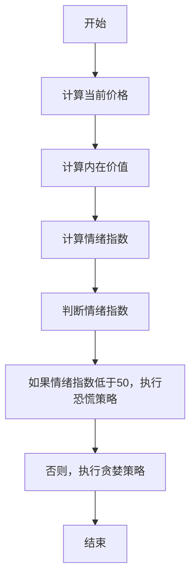
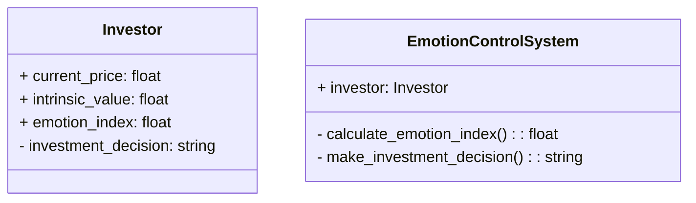
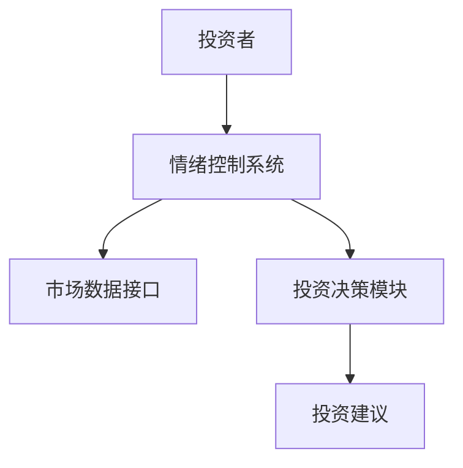

                 


# 约翰·聂夫的价值投资者情绪控制

---

## 关键词：
- 价值投资、情绪控制、约翰·聂夫、投资策略、风险管理、投资者心理学

---

## 摘要：
本文深入探讨了约翰·聂夫作为价值投资大师，如何通过情绪控制来实现长期稳定的投资收益。文章从价值投资的核心理念出发，分析投资者情绪对决策的影响，结合聂夫的投资策略，提出了一系列情绪管理的方法和系统性框架。通过具体案例和算法模型，本文为投资者提供了一套科学的情绪控制体系，帮助他们在复杂多变的市场中做出理性决策。

---

## 第1章: 价值投资的核心理念

### 1.1 价值投资的定义与特点

#### 1.1.1 价值投资的定义
价值投资是一种以基本面分析为基础的投资策略，旨在通过识别市场价格与内在价值之间的差异，寻找被低估的投资标的。其核心在于长期持有优质资产，而非短期价格波动。

#### 1.1.2 价值投资的核心特点
- **长期视角**：注重长期收益，而非短期价格波动。
- **基本面分析**：基于企业的财务状况、行业地位和管理团队进行评估。
- **安全边际**：追求价格低于内在价值的投资标的。
- **逆向思维**：在市场恐慌时寻找机会，在市场狂热时保持冷静。

#### 1.1.3 价值投资与其它投资策略的区别
- **区别于趋势投资**：趋势投资者关注价格走势，而价值投资者关注内在价值。
- **区别于成长投资**：成长投资者追求高增长企业，而价值投资者追求低估企业。

---

### 1.2 约翰·聂夫的投资理念

#### 1.2.1 约翰·聂夫的生平简介
约翰·聂夫（John Neff）是美国著名的价值投资者，曾担任 Vanguard Windsor基金的经理，创造了长达30年的卓越投资业绩，年复合收益率超过19%。

#### 1.2.2 约翰·聂夫的价值投资哲学
- **低估买入**：寻找市场价格低于内在价值的企业。
- **长期持有**：避免频繁交易，降低交易成本。
- **分散投资**：通过多样化降低风险。

#### 1.2.3 约翰·聂夫的投资策略
- **低市盈率选股**：偏好市盈率低于市场平均水平的企业。
- **注重安全边际**：确保买入价格远低于内在价值。

---

### 1.3 情绪控制在投资中的重要性

#### 1.3.1 情绪对投资决策的影响
- **贪婪与恐惧**：投资者在市场繁荣时过度买入，在市场下跌时恐慌卖出。
- **从众心理**：跟随市场潮流，忽视独立分析。
- **过度自信**：低估市场风险，高估自身判断能力。

#### 1.3.2 约翰·聂夫如何管理投资情绪
- **长期视角**：专注于企业的内在价值，而非短期价格波动。
- **纪律性**：严格执行投资计划，避免情绪化决策。
- **持续学习**：通过不断学习和分析提升自己的判断能力。

#### 1.3.3 情绪控制对投资成功的关键作用
- **减少失误**：避免因情绪波动导致的非理性决策。
- **抓住机会**：在市场恐慌时买入低估资产。
- **稳定收益**：通过情绪控制实现长期稳定的收益。

---

## 第2章: 投资者情绪分析与管理

### 2.1 投资者情绪的分类与影响

#### 2.1.1 投资者情绪的分类
- **乐观情绪**：市场繁荣时的过度买入。
- **悲观情绪**：市场下跌时的恐慌抛售。
- **过度自信**：高估自身判断能力。
- **恐惧与贪婪**：市场的基本情绪驱动力。

#### 2.1.2 情绪对投资决策的具体影响
- **决策失误**：情绪化决策导致的错误投资。
- **交易成本增加**：频繁交易增加佣金和税收成本。
- **错失机会**：因恐惧错过低价买入机会。

#### 2.1.3 约翰·聂夫的情绪管理策略
- **长期视角**：关注企业的内在价值，而非短期价格波动。
- **纪律性**：严格执行投资计划，避免情绪化决策。
- **风险管理**：通过分散投资和严格止损控制风险。

---

### 2.2 理解市场波动的本质

#### 2.2.1 市场波动的来源
- **经济周期**：经济波动影响企业盈利和市场估值。
- **市场情绪**：投资者情绪推动市场价格波动。
- **信息不对称**：市场信息的不透明性导致价格波动。

#### 2.2.2 市场波动对投资者情绪的影响
- **短期波动引发恐慌**：市场价格的短期波动可能导致投资者恐慌性抛售。
- **长期波动的迷惑性**：短期波动可能掩盖长期趋势。

#### 2.2.3 理解波动与情绪的关系
- **波动是市场的常态**：投资者应接受市场的波动性。
- **情绪是波动的催化剂**：投资者情绪推动市场波动。

---

## 第3章: 情绪控制的核心原则

### 3.1 建立个人投资目标

#### 3.1.1 投资目标的设定
- **明确投资目标**：确定是追求资本增值还是稳定收益。
- **设定合理预期**：根据自身风险承受能力设定收益目标。

#### 3.1.2 目标与情绪管理的关系
- **目标导向**：投资目标帮助投资者保持理性。
- **目标调整**：根据市场变化和自身情况调整目标。

#### 3.1.3 保持目标的稳定性
- **定期回顾目标**：评估目标的合理性和实现的可能性。
- **避免过度调整**：避免因情绪波动频繁调整目标。

---

### 3.2 风险管理与情绪控制

#### 3.2.1 风险管理的基本原则
- **分散投资**：通过多样化降低风险。
- **严格止损**：设定止损点以控制损失。
- **风险与收益匹配**：根据风险承受能力选择投资标的。

#### 3.2.2 风险管理如何影响情绪
- **降低焦虑**：通过风险管理减少市场波动带来的焦虑。
- **增强信心**：合理的风险管理策略增强投资者信心。

#### 3.2.3 如何通过风险管理控制情绪
- **设定止损点**：避免情绪化决策导致的重大损失。
- **定期评估风险**：根据市场变化和自身情况调整风险管理策略。

---

## 第4章: 情绪控制的算法实现

### 4.1 投资者情绪指数计算

#### 4.1.1 情绪指数的定义
- 情绪指数是衡量市场参与者情绪的指标，通常基于市场数据计算。

#### 4.1.2 情绪指数计算公式
$$
\text{情绪指数} = \frac{\text{当前价格}}{\text{内在价值}} \times 100
$$

#### 4.1.3 情绪指数的分类
- **恐慌指数**：情绪指数低于50，表示市场恐慌。
- **正常指数**：情绪指数在50-70之间，表示市场正常。
- **贪婪指数**：情绪指数高于70，表示市场贪婪。

---

### 4.2 情绪控制的算法实现

#### 4.2.1 算法流程图


#### 4.2.2 Python代码实现
```python
def calculate_emotion_index(current_price, intrinsic_value):
    emotion_index = (current_price / intrinsic_value) * 100
    return emotion_index

def emotion_control_algorithm(current_price, intrinsic_value):
    emotion_index = calculate_emotion_index(current_price, intrinsic_value)
    if emotion_index < 50:
        print("恐慌状态，建议买入")
    elif emotion_index > 70:
        print("贪婪状态，建议卖出")
    else:
        print("市场正常，建议持有")
```

---

## 第5章: 系统分析与架构设计

### 5.1 系统功能设计

#### 5.1.1 领域模型类图


#### 5.1.2 系统架构设计


---

## 第6章: 项目实战

### 6.1 模拟投资环境

#### 6.1.1 环境配置
- 数据源：历史价格数据和财务数据。
- 工具：Python编程环境，数据可视化工具。

#### 6.1.2 情绪指数计算
```python
import pandas as pd
import numpy as np

def calculate_emotion_index(data):
    data['emotion_index'] = (data['current_price'] / data['intrinsic_value']) * 100
    return data

# 示例数据
data = pd.DataFrame({
    'current_price': [50, 60, 70],
    'intrinsic_value': [60, 60, 60]
})

result = calculate_emotion_index(data)
print(result)
```

---

## 第7章: 最佳实践与小结

### 7.1 小结
- 情绪控制是价值投资成功的关键。
- 通过长期视角、纪律性和风险管理实现情绪控制。

### 7.2 注意事项
- 避免过度自信，保持理性分析。
- 定期回顾投资目标，及时调整策略。

### 7.3 拓展阅读
- 约翰·聂夫的经典投资著作。
- 投资心理学相关书籍。

---

## 总结
通过本文的分析，读者可以全面理解约翰·聂夫的价值投资理念，掌握情绪控制的核心方法，并通过实际案例和算法实现提升自己的投资能力。情绪控制不仅是一种投资策略，更是一种生活智慧。

