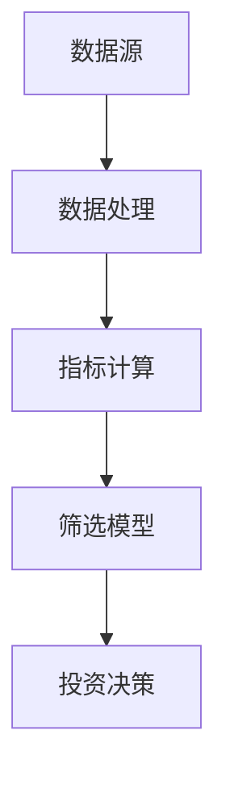

                 


# 约翰·聂夫的低市净率投资：简单有效的价值筛选

> 关键词：低市净率投资、约翰·聂夫、价值投资、市净率、投资策略

> 摘要：本文详细探讨了约翰·聂夫的低市净率投资方法，从其背景、核心概念到实际应用，系统性地分析了低市净率投资的原理、指标筛选、数学模型构建以及实际案例。通过本文的学习，读者可以掌握低市净率投资的核心要义，学会如何通过量化指标筛选出具有投资价值的股票。

---

## 第一部分: 低市净率投资的背景与核心概念

### 第1章: 低市净率投资的背景介绍

#### 1.1 什么是低市净率投资
低市净率投资是一种以市净率（P/B）为核心筛选指标的价值投资策略，旨在通过寻找被市场低估的股票，实现长期稳健的投资收益。市净率是股票的市场价格与每股净资产的比率，反映了市场对公司资产价值的评估。

#### 1.2 低市净率投资的起源与发展
低市净率投资的理念源于价值投资，其核心思想是寻找市场价格低于内在价值的股票。约翰·聂夫是这一领域的杰出代表，他在任职富达低价证券信托基金经理期间，通过坚持低市净率投资策略，创造了长期稳定的超额收益。

#### 1.3 约翰·聂夫的投资理念
约翰·聂夫认为，市场常常低估某些公司的内在价值，而这些公司往往具有稳定的盈利能力、健康的财务状况和强大的竞争优势。他强调通过长期持有优质资产，避免短期市场波动的干扰，从而实现投资目标。

---

### 第2章: 低市净率投资的核心概念

#### 2.1 市净率的定义与计算
市净率（P/B）= 股票市场价格 / 每股净资产

- **股票市场价格**：市场上交易的股票价格。
- **每股净资产**：公司每股股票对应的净资产价值。

#### 2.2 低市净率投资的逻辑
低市净率投资的核心逻辑是：寻找市场价格低于资产价值的公司，这些公司具有较大的安全边际，能够抵御市场波动的风险。

#### 2.3 低市净率投资与其他策略的对比
- **与成长投资的对比**：成长投资关注高增长潜力，而低市净率投资关注低估的价值。
- **与股息投资的对比**：股息投资关注收益，而低市净率投资关注价值。

---

## 第二部分: 低市净率投资的核心指标与筛选标准

### 第3章: 核心指标分析

#### 3.1 市净率（P/B）
- **指标属性**：反映市场对资产价值的评估。
- **重要性**：低市净率意味着资产被低估，具有较大的投资潜力。

#### 3.2 市盈率（P/E）
- **指标属性**：反映市场对公司盈利能力的评估。
- **重要性**：低市盈率通常意味着公司估值较低，但需结合行业特性分析。

#### 3.3 股息率
- **指标属性**：反映公司分红能力。
- **重要性**：高股息率可能意味着公司盈利稳定，但需结合市净率分析。

#### 3.4 财务健康度
- **指标属性**：反映公司财务状况。
- **重要性**：健康的财务状况是长期投资的基础。

#### 3.5 行业地位与竞争优势
- **指标属性**：反映公司在行业中的地位。
- **重要性**：强大的竞争优势能够确保公司长期盈利能力。

---

### 第4章: 约翰·聂夫的筛选标准

#### 4.1 低市净率的量化标准
- 市净率 < 1.5
- 市净率 < 行业平均值

#### 4.2 财务指标的综合评估
- 净利润增长率 > 5%
- 负债率 < 50%

#### 4.3 行业分析与公司基本面评估
- 公司所处行业具有稳定需求和竞争优势。
- 公司管理层稳定，治理结构健康。

---

## 第三部分: 低市净率投资的数学模型与公式

### 第5章: 低市净率投资的数学模型

#### 5.1 市净率计算公式
$$ P/B = \frac{股票价格}{每股净资产} $$

#### 5.2 市盈率计算公式
$$ P/E = \frac{股票价格}{每股净利润} $$

#### 5.3 股息率计算公式
$$ Dividend Yield = \frac{每股股息}{股票价格} $$

#### 5.4 低市净率投资的筛选模型
- 筛选标准：P/B < 1.5
- 数据来源：公司财务报表、股票价格数据

---

## 第四部分: 低市净率投资的系统分析与架构设计

### 第6章: 系统分析与架构设计

#### 6.1 投资系统分析
- **问题场景**：寻找具有投资价值的股票。
- **系统目标**：构建一个基于低市净率的选股模型。
- **功能模块**：
  - 数据获取模块：获取股票数据。
  - 指标计算模块：计算市净率、市盈率等指标。
  - 筛选模块：根据筛选标准选出符合条件的股票。
  - 投资决策模块：生成投资建议。

#### 6.2 系统架构设计


---

## 第五部分: 低市净率投资的项目实战

### 第7章: 项目实战

#### 7.1 环境安装与数据准备
- **工具安装**：安装Python、Pandas、Matplotlib等工具。
- **数据获取**：从金融数据源获取股票数据。

#### 7.2 系统核心实现源代码
```python
import pandas as pd

# 示例数据
data = {
    '股票代码': ['A', 'B', 'C'],
    '股票名称': ['股票A', '股票B', '股票C'],
    '股票价格': [10, 15, 20],
    '每股净资产': [5, 10, 15]
}

df = pd.DataFrame(data)

# 计算市净率
df['P/B'] = df['股票价格'] / df['每股净资产']

# 筛选P/B < 1.5的股票
selected_stocks = df[df['P/B'] < 1.5]
```

#### 7.3 实际案例分析
- **案例分析**：假设我们筛选出一只市净率低于1.5的股票，进一步分析其财务状况和行业地位。
- **投资决策**：基于分析结果，决定是否投资该股票。

---

## 第六部分: 总结与最佳实践

### 第8章: 总结与最佳实践

#### 8.1 最佳实践 tips
- **长期投资**：避免短期波动，坚持长期价值投资。
- **风险管理**：合理配置资产，分散投资风险。
- **持续学习**：关注市场变化，不断优化投资策略。

#### 8.2 项目小结
通过本文的学习，读者可以掌握低市净率投资的核心方法，从理论到实践，逐步构建自己的投资体系。

#### 8.3 注意事项
- 投资需谨慎，市场有风险。
- 筛选模型仅供参考，需结合实际情况调整。

#### 8.4 拓展阅读
- 《约翰·聂夫的投资哲学》
- 《价值投资：低市净率策略的应用》

---

通过本文的系统性分析，读者可以全面理解约翰·聂夫的低市净率投资方法，并在实际投资中灵活运用这些策略。

