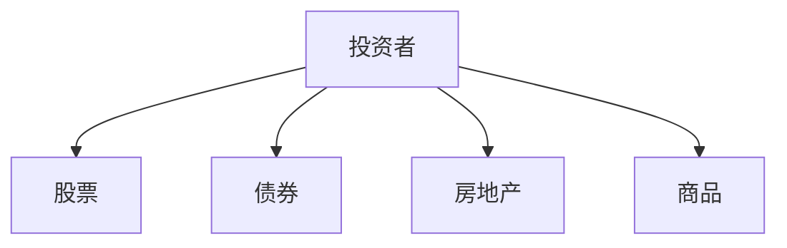

                 

# 约翰伯格对市场时机选择的看法

> 关键词：市场时机选择、约翰·伯格、投资策略、风险管理、技术分析、基本面分析

> 摘要：本文深入探讨了约翰·伯格对市场时机选择的看法，分析了他的投资策略、市场分析方法以及风险管理措施。通过结合理论与实际案例，本文揭示了如何在市场波动中做出明智的投资决策，帮助投资者理解市场时机选择的重要性，并提供实用的投资建议。

---

# 引言

## 1.1 市场时机选择的重要性

市场时机选择是投资成功的关键因素之一。在金融市场中，投资者能否在正确的时间进入或退出市场，往往决定了投资的成败。市场时机选择不仅关乎收益，还与风险控制密切相关。本文将探讨约翰·伯格在市场时机选择方面的独特见解，分析他的策略和方法。

## 1.2 约翰·伯格的背景介绍

约翰·伯格是美国著名投资专家，指数基金的倡导者，被誉为“指数基金之父”。他于1949年加入富达投资公司，1974年创建了第一只现代意义上的指数基金——富达恒定成熟股票指数基金。伯格的投资理念以长期投资、分散投资和低成本运作为核心，强调避免频繁交易和市场预测。

## 1.3 本书的核心观点

约翰·伯格认为，市场时机选择并非易事，投资者应避免频繁预测市场走势，而是通过长期投资和分散投资来降低风险。本文将详细阐述他的观点，并结合实际案例进行分析。

---

# 市场时机选择的理论基础

## 2.1 技术分析基础

技术分析是市场时机选择的重要工具之一。通过分析历史价格数据，投资者可以识别市场趋势和潜在的买卖信号。以下是一些常用的技术指标：

### 2.1.1 移动平均线（MA）

移动平均线是将一定周期内的收盘价平均值连线形成的曲线。常用的方法包括简单移动平均线（SMA）和指数移动平均线（EMA）。例如，SMA的计算公式为：

$$SMA = \frac{\sum_{i=1}^{n} P_i}{n}$$

其中，$P_i$是第$i$天的收盘价，$n$是周期数。

### 2.1.2 相对强弱指数（RSI）

RSI用于衡量市场的超买或超卖状态，计算公式如下：

$$RSI = \frac{100}{1 + \frac{A}{B}}$$

其中，$A$是上升幅度，$B$是下降幅度，周期通常为14天。

## 2.2 基本面分析基础

基本面分析关注公司的财务状况和行业前景。以下是基本面分析的关键指标：

### 2.2.1 市盈率（P/E）

市盈率是股票价格与每股收益的比率，计算公式为：

$$P/E = \frac{P}{E}$$

其中，$P$是股票价格，$E$是每股收益。

### 2.2.2 市净率（P/B）

市净率是股票价格与每股净资产的比率，计算公式为：

$$P/B = \frac{P}{B}$$

其中，$B$是每股净资产。

## 2.3 市场情绪分析基础

市场情绪分析通过投资者的心理和行为来预测市场走势。常用工具包括恐慌指数（VIX）和投资者情绪指数。

---

# 约翰·伯格的投资策略

## 3.1 长期投资与价值投资

伯格强调长期投资的重要性，认为市场波动难以预测，而长期投资可以平滑短期波动的影响。他的投资策略包括：

### 3.1.1 买入并持有策略

买入并持有策略的核心是长期持有优质资产，避免频繁交易。这种方法通过分散投资降低了风险。

### 3.1.2 分散投资

分散投资通过投资于不同资产类别和行业，降低特定资产的风险。以下是分散投资的示意图：

---

# 市场时机选择的实践应用

## 4.1 市场估值分析

市场估值分析是判断市场时机的重要方法。以下是常用的市场估值指标：

### 4.1.1 市场整体市盈率

市场整体市盈率是市场平均市盈率的计算公式：

$$\text{市场市盈率} = \frac{\sum P_i}{\sum E_i}$$

其中，$P_i$是各股票的价格，$E_i$是各股票的收益。

### 4.1.2 市场整体市净率

市场整体市净率的计算公式为：

$$\text{市场市净率} = \frac{\sum P_i}{\sum B_i}$$

---

# 风险管理与市场时机选择

## 5.1 风险管理的重要性

风险管理是市场时机选择中不可忽视的环节。以下是常见的风险管理策略：

### 5.1.1 分散投资

通过投资于不同资产和行业，降低特定资产的风险。

### 5.1.2 设置止损点

在投资组合中设定止损点，以限制潜在损失。例如，设定止损点为投资组合的20%。

### 5.1.3 定期再平衡

定期调整投资组合，以维持预设的资产配置比例。

---

# 实际案例分析

## 6.1 约翰·伯格的市场时机选择策略

伯格在1974年创建了第一只指数基金，当时市场处于低位。通过长期持有指数基金，投资者在市场复苏中获得了丰厚的回报。

---

# 结论

## 7.1 总结

约翰·伯格的市场时机选择策略强调长期投资和分散投资，避免频繁交易和市场预测。通过长期持有优质资产，投资者可以在市场波动中实现稳健收益。

## 7.2 投资建议

- 长期投资者应选择优质资产，避免短期波动。
- 分散投资是降低风险的有效方法。
- 定期再平衡投资组合，维持资产配置。

---

# 最佳实践 Tips

- 定期阅读市场分析报告，了解市场动态。
- 学习技术分析和基本面分析方法，提升判断能力。
- 保持纪律性，避免情绪化决策。

---

通过本文的分析，读者可以更好地理解约翰·伯格的市场时机选择策略，并将其应用于实际投资中。希望本文能为投资者提供有价值的见解和指导。

