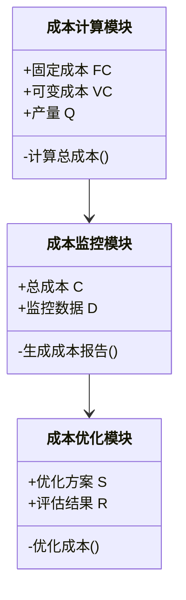
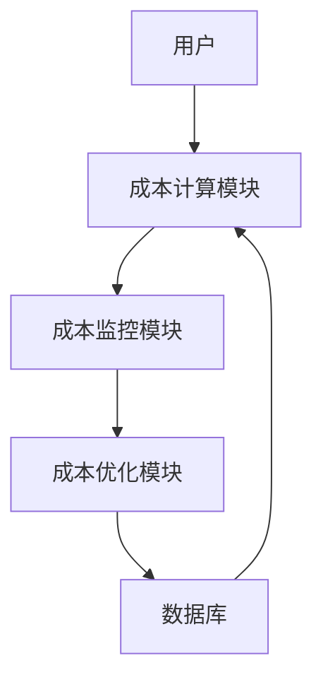
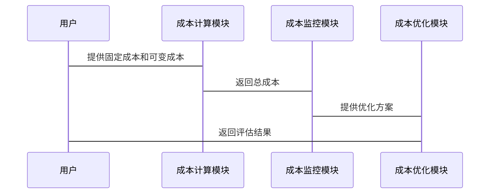

                 


# 约翰伯格的'成本意识'：为什么每一分投资费用都重要

---

## 关键词：
- 成本意识
- 投资效率
- 资源优化
- 成本效益分析
- 投资决策
- 管理策略

---

## 摘要：
本文深入探讨了成本意识的核心概念，分析了其在投资决策和资源优化中的重要性。通过数学模型和算法原理，结合实际案例，揭示了如何通过成本意识实现投资效率的最大化。文章还详细介绍了系统架构设计和项目实战，为读者提供了从理论到实践的完整指南。

---

# 第一部分：成本意识的核心概念与背景

## 第1章：成本意识的基本概念

### 1.1 成本意识的定义与内涵
#### 1.1.1 成本意识的定义
成本意识是指在投资和资源分配过程中，对每一分费用的敏感性和重要性的认知。它强调在决策过程中，对成本的精打细算和优化。

#### 1.1.2 成本意识的核心内涵
成本意识的核心在于“预防性”和“全局性”。它不仅关注单个决策的成本，还关注整体资源的最优分配。通过成本意识，可以在投资初期避免不必要的浪费。

#### 1.1.3 成本意识与投资效率的关系
成本意识是投资效率的基石。通过精打细算，可以在有限的资源中实现更大的收益。例如，通过优化供应链成本，企业可以在同等投入下获得更高的利润。

### 1.2 成本意识的重要性
#### 1.2.1 成本意识在投资决策中的作用
在投资决策中，成本意识可以帮助投资者避免盲目投入。例如，在选择投资项目时，成本意识可以促使投资者对每个项目的回报率进行详细计算。

#### 1.2.2 成本意识对资源优化的贡献
成本意识是资源优化的核心思想。通过精打细算，可以在资源分配中实现最大化的收益。例如，在企业运营中，成本意识可以帮助企业降低生产成本，从而提高利润率。

#### 1.2.3 成本意识在企业竞争力中的地位
在市场竞争中，成本意识是企业核心竞争力的重要组成部分。通过优化成本结构，企业可以在价格战中占据优势地位。例如，通过降低生产成本，企业可以以更低的价格推出产品，从而吸引更多的消费者。

### 1.3 成本意识的边界与外延
#### 1.3.1 成本意识的适用范围
成本意识不仅适用于企业，也适用于个人投资和公共资源配置。例如，在个人理财中，成本意识可以帮助投资者优化投资组合，从而实现更高的收益。

#### 1.3.2 成本意识与其他管理概念的区别
成本意识与预算管理、风险管理等管理概念密切相关，但也有显著区别。例如，预算管理侧重于资金分配，而成本意识侧重于资源优化。

#### 1.3.3 成本意识的局限性
成本意识并非万能的。在某些情况下，过度追求成本最小化可能会导致企业失去发展机遇。例如，在技术研发投入上，如果过于关注短期成本，可能会错失技术创新的机会。

---

## 第2章：成本意识的核心要素

### 2.1 成本构成的分析
#### 2.1.1 固定成本与可变成本
固定成本是指在一定范围内不随产量变化的成本，例如厂房租金；可变成本是指随产量变化的成本，例如原材料成本。

#### 2.1.2 直接成本与间接成本
直接成本是指可以直接追溯到产品的成本，例如生产工人的工资；间接成本是指无法直接追溯到产品的成本，例如行政管理人员的工资。

#### 2.1.3 沉没成本与机会成本
沉没成本是指已经发生的成本，例如已经购买的设备；机会成本是指放弃某项投资所失去的潜在收益，例如将资金用于其他投资项目所获得的收益。

### 2.2 成本效益分析
#### 2.2.1 成本效益分析的基本原理
成本效益分析是指通过比较不同方案的成本与收益，选择最优方案的过程。例如，在选择投资项目时，可以通过计算投资回报率来选择最优方案。

#### 2.2.2 成本效益分析的数学模型
成本效益分析的数学模型可以表示为：
$$
\text{收益} - \text{成本} = \text{净收益}
$$

#### 2.2.3 成本效益分析的案例研究
例如，在选择投资项目时，如果项目A的投资成本为100万元，预期收益为150万元；项目B的投资成本为80万元，预期收益为120万元。通过比较，项目A的净收益为50万元，项目B的净收益为40万元，因此选择项目A更为划算。

### 2.3 成本控制的关键点
#### 2.3.1 投资决策中的成本控制
在投资决策中，成本控制可以通过精打细算来实现。例如，在选择投资项目时，可以通过对项目的成本和收益进行详细分析，选择最优方案。

#### 2.3.2 资源分配中的成本优化
在资源分配中，成本优化可以通过合理分配资源来实现。例如，在企业生产中，可以通过优化生产流程来降低生产成本。

#### 2.3.3 成本监控与反馈机制
在成本监控中，成本意识可以帮助企业建立有效的反馈机制。例如，通过定期检查生产成本，企业可以及时发现浪费并进行调整。

---

## 第3章：成本意识的数学模型与算法原理

### 3.1 成本函数的建立
#### 3.1.1 成本函数的定义
成本函数是指在一定条件下，成本与产量之间的关系函数。例如，生产某产品的成本函数可以表示为：
$$
C = FC + VC \times Q
$$
其中，\(C\) 表示总成本，\(FC\) 表示固定成本，\(VC\) 表示单位可变成本，\(Q\) 表示产量。

#### 3.1.2 成本函数的变量与参数
- 变量：产量 \(Q\)
- 参数：固定成本 \(FC\) 和单位可变成本 \(VC\)

#### 3.1.3 成本函数的数学表达式
$$
C = FC + VC \times Q
$$

### 3.2 成本优化的数学模型
#### 3.2.1 线性规划模型
线性规划模型是一种优化问题的数学模型，可以通过求解线性方程组来找到最优解。例如，在生产计划中，可以通过线性规划模型优化生产量和成本。

#### 3.2.2 非线性规划模型
非线性规划模型是指目标函数或约束条件为非线性的优化问题。例如，在复杂的投资决策中，可以通过非线性规划模型找到最优解。

#### 3.2.3 动态成本模型
动态成本模型是指在时间维度上考虑成本变化的模型。例如，在长期投资中，可以通过动态成本模型预测未来的成本变化。

### 3.3 成本效益分析的数学公式
#### 3.3.1 成本效益比的计算
成本效益比的计算公式为：
$$
\text{成本效益比} = \frac{\text{成本}}{\text{收益}}
$$

#### 3.3.2 投资回报率的计算
投资回报率的计算公式为：
$$
\text{投资回报率} = \frac{\text{净收益}}{\text{投资成本}} \times 100\%
$$

---

## 第4章：成本意识的系统分析与架构设计

### 4.1 系统分析
#### 4.1.1 问题场景介绍
例如，在企业生产中，可以通过成本意识优化生产流程，降低生产成本。

#### 4.1.2 系统功能设计
- 成本计算模块
- 成本监控模块
- 成本优化模块

#### 4.1.3 领域模型 mermaid 类图


#### 4.1.4 系统架构设计


### 4.2 系统架构设计
#### 4.2.1 系统架构设计
系统架构设计包括数据层、业务逻辑层和表现层。例如，在企业生产中，可以通过数据库存储成本数据，业务逻辑层进行成本计算和优化，表现层展示成本报告。

#### 4.2.2 系统接口设计
- 成本计算接口：提供固定成本和可变成本，返回总成本。
- 成本优化接口：提供优化方案，返回评估结果。

#### 4.2.3 系统交互 mermaid 序列图


---

## 第5章：项目实战

### 5.1 环境安装
- 安装 Python 和相关库（如 numpy 和 matplotlib）
- 安装 mermaid 和其他工具

### 5.2 核心代码实现
```python
def calculate_cost(FC, VC, Q):
    return FC + VC * Q

def cost_benefit_analysis(initial_cost, annual_benefit, discount_rate, period):
    present_value = 0
    for year in range(period):
        present_value += annual_benefit / (1 + discount_rate) ** (year + 1)
    return present_value - initial_cost
```

### 5.3 代码应用解读
- `calculate_cost` 函数用于计算总成本。
- `cost_benefit_analysis` 函数用于进行成本效益分析，计算净现值。

### 5.4 实际案例分析
例如，在选择投资项目时，可以通过上述函数计算投资成本和预期收益，选择最优方案。

### 5.5 项目小结
通过项目实战，读者可以掌握成本计算和成本效益分析的基本方法。

---

## 第6章：最佳实践与小结

### 6.1 小结
成本意识是投资决策和资源优化的重要思想。通过精打细算，可以在有限的资源中实现更大的收益。

### 6.2 注意事项
- 成本意识并非万能的，需要结合实际情况灵活应用。
- 在追求成本最小化的同时，也要关注投资的回报率。

### 6.3 拓展阅读
- 《投资学原理》
- 《管理学基础》

---

通过本文的系统讲解，读者可以全面理解成本意识的核心思想，并能够在实际工作中灵活应用。

