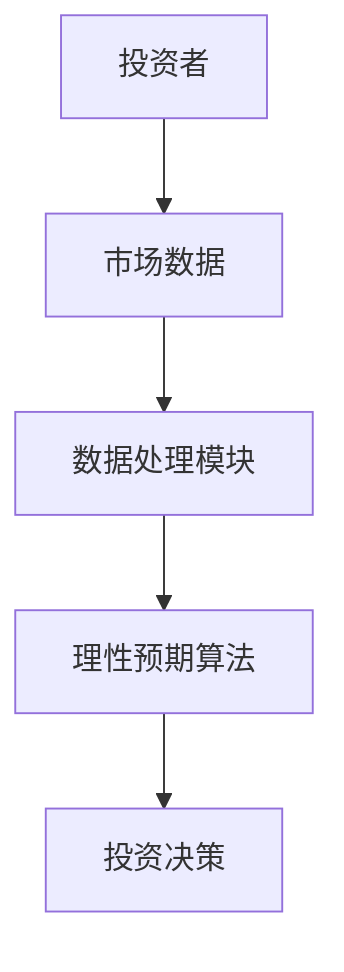

                 


# 约翰伯格的'理性预期'投资：设定合理的收益预期

## 关键词：理性预期，投资，收益预期，约翰·伯格，价值投资，投资策略，长期投资

## 摘要：
本文深入探讨了约翰·伯格的“理性预期”投资理念，分析了如何在投资决策中设定合理的收益预期。通过详细阐述理性预期的定义、核心概念、算法原理、系统架构以及实际案例，本文为读者提供了一个全面的视角来理解和应用这一投资策略。文章结合技术语言和实际操作，帮助投资者在复杂多变的市场中做出明智决策。

---

## 第一章：投资的基本概念

### 1.1 投资的定义与分类
- **1.1.1 投资的定义**：介绍投资的基本概念，包括其定义、目标和作用。
- **1.1.2 投资的主要分类**：详细讲解不同类型的投资，如股票、债券、房地产等。
- **1.1.3 投资与投机的区别**：区分投资与投机，强调理性投资的重要性。

### 1.2 约翰·伯格的生平与投资理念
- **1.2.1 约翰·伯格的生平简介**：介绍约翰·伯格的背景及其在投资领域的贡献。
- **1.2.2 伯格的投资哲学**：探讨伯格的价值投资理念，强调长期投资和基本面分析。
- **1.2.3 伯格与价值投资的关系**：分析伯格如何将价值投资理论应用于实践。

### 1.3 理性预期的定义与特点
- **1.3.1 理性预期的定义**：明确理性预期的定义，解释其在投资中的应用。
- **1.3.2 理性预期的核心特点**：列举理性预期的主要特征，如逻辑性、数据驱动和长期视角。
- **1.3.3 理性预期与非理性预期的对比**：通过对比分析，突出理性预期的优势。

---

## 第二章：理性预期的核心概念与联系

### 2.1 理性预期的原理与模型
- **2.1.1 理性预期的假设基础**：介绍理性预期的假设条件，如完全理性、信息充分等。
- **2.1.2 理性预期的形成过程**：详细描述从数据收集到决策制定的整个过程。
- **2.1.3 理性预期的数学模型**：建立数学模型，解释其在投资中的应用。

### 2.2 理性预期的属性特征对比
- **2.2.1 理性预期的属性列表**：列出理性预期的关键属性，如准确性、一致性等。
- **2.2.2 属性特征对比表格**：通过表格形式对比理性预期与非理性预期的差异。
- **2.2.3 与非理性预期的对比分析**：深入分析两种预期在实际投资中的表现。

### 2.3 理性预期的ER实体关系图
- **2.3.1 实体关系图的定义**：解释ER实体关系图在投资分析中的作用。
- **2.3.2 实体关系图的绘制**：绘制并解释ER图，展示投资系统中的实体及其关系。
- **2.3.3 实体关系图的分析**：通过ER图分析投资系统的关键部分，如投资者、市场、资产等。

---

## 第三章：理性预期的算法原理

### 3.1 理性预期的数学模型
- **3.1.1 理性预期的数学公式**：建立数学模型，如预期收益公式。
- **3.1.2 公式的推导过程**：详细推导公式，解释其背后的逻辑。
- **3.1.3 公式的应用场景**：说明公式在实际投资中的应用。

### 3.2 理性预期的算法流程图
- **3.2.1 流程图的定义**：介绍算法流程图的作用和结构。
- **3.2.2 流程图的绘制**：绘制并解释流程图，展示理性预期的决策过程。
- **3.2.3 流程图的分析**：分析流程图的每个步骤，解释其在投资中的意义。

### 3.3 理性预期的代码实现
- **3.3.1 环境安装与配置**：指导读者如何安装必要的工具和环境。
- **3.3.2 核心代码实现**：提供Python代码示例，实现理性预期的算法。
- **3.3.3 代码的解读与分析**：详细解读代码，解释每部分的功能。

---

## 第四章：理性预期的系统分析与架构设计

### 4.1 投资系统的功能设计
- **4.1.1 系统功能模块划分**：将投资系统划分为数据收集、分析、决策等模块。
- **4.1.2 每个模块的功能描述**：详细描述每个模块的功能和作用。
- **4.1.3 模块之间的关系**：分析模块之间的相互作用和数据流。

### 4.2 理性预期的系统架构图
- **4.2.1 系统架构图的定义**：解释系统架构图的作用和结构。
- **4.2.2 系统架构图的绘制**：使用Mermaid绘制系统架构图，展示系统的整体结构。
- **4.2.3 系统架构图的分析**：分析系统架构图，解释每个部分在理性预期中的作用。

### 4.3 系统接口设计与交互
- **4.3.1 系统接口的设计**：设计投资系统的接口，确保其易用性和功能性。
- **4.3.2 系统交互的流程图**：绘制交互流程图，展示用户与系统之间的互动。
- **4.3.3 系统交互的分析**：分析交互流程，解释其在投资决策中的应用。

---

## 第五章：理性预期投资的项目实战

### 5.1 投资环境的配置
- **5.1.1 投资工具的安装**：指导读者安装必要的投资工具，如数据分析软件。
- **5.1.2 数据源的获取**：介绍如何获取可靠的投资数据源。
- **5.1.3 环境的配置步骤**：详细说明环境配置的步骤和注意事项。

### 5.2 核心代码的实现
- **5.2.1 核心算法的实现**：提供Python代码，实现理性预期的核心算法。
- **5.2.2 代码的解读与分析**：详细解读代码，解释每部分的功能和逻辑。
- **5.2.3 代码的应用场景**：说明代码在实际投资中的应用，如预测股票价格。

### 5.3 实际案例分析
- **5.3.1 案例背景介绍**：选择一个具体的案例，介绍其背景和目标。
- **5.3.2 案例的分析过程**：详细分析案例，展示理性预期的应用过程。
- **5.3.3 案例的解读与总结**：总结案例的结果，提炼经验教训。

---

## 第六章：最佳实践、小结、注意事项与拓展阅读

### 6.1 最佳实践
- **理性预期的应用建议**：提供实际投资中的最佳实践，如定期回顾投资组合。
- **风险管理策略**：介绍如何通过理性预期管理投资风险。

### 6.2 小结
- **理性预期投资的总结**：回顾全文，总结理性预期投资的核心理念和应用。
- **投资决策中的理性思考**：强调理性思考在投资中的重要性。

### 6.3 注意事项
- **避免常见错误**：提醒读者注意常见错误，如过度自信和忽略风险。
- **长期与短期的平衡**：讨论如何在长期投资中平衡短期波动。

### 6.4 拓展阅读
- **推荐书籍和资源**：推荐与理性预期相关的书籍和资源，供读者深入学习。
- **未来趋势与研究方向**：展望理性预期投资的未来发展趋势和研究方向。

---

## 附录：代码示例

### 代码示例1：理性预期的数学模型
```python
import numpy as np
import pandas as pd

def rational_expectation(data):
    # 数据预处理
    data = data.dropna()
    # 计算预期收益
    expected_return = np.mean(data)
    return expected_return
```

### 代码示例2：系统架构图


---

## 结语

通过本文的详细分析，读者可以全面理解约翰·伯格的理性预期投资理念，并掌握如何在实际投资中设定合理的收益预期。理性预期不仅是一种理论，更是一种实践工具，帮助投资者在复杂市场中做出明智决策。

