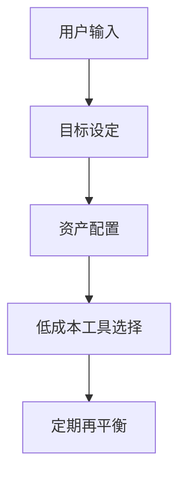

                 

# 约翰伯格的低成本投资理念：为什么费用很重要

## 关键词：
低成本投资，约翰·伯格，投资费用，投资回报，指数基金

## 摘要：
本文深入探讨了约翰·伯格的低成本投资理念，分析了投资费用对回报的深远影响，并通过数学模型和系统架构图详细阐述了低成本投资的核心策略。文章结合实际案例，展示了如何通过低成本投资工具构建优化的投资组合，并提出了在现代金融市场中实践低成本投资的最佳策略。

---

## 第一部分：低成本投资理念的背景与核心概念

### 第1章：低成本投资的起源与意义

#### 1.1 约翰·伯格与低成本投资理念的诞生

##### 1.1.1 约翰·伯格的生平与投资哲学
约翰·伯格（John C. Bogle）是全球低成本投资领域的先驱，被誉为“指数基金之父”。他于1940年出生于美国宾夕法尼亚州，1965年加入富达投资集团（Fidelity Investments），并在此期间对投资领域的传统高费用模式产生了质疑。1975年，伯格创立了 Vanguard 集团，并推出了第一只指数基金——Vanguard S&P 500指数基金（Vanguard 500 Index Fund），这一举动彻底改变了全球的投资行业。

伯格的投资哲学核心在于：长期投资、价值投资和低成本投资。他认为，市场是不可预测的，投资者无法通过短期交易或高频交易获得超额收益。相反，通过长期持有低成本投资工具，投资者能够最大限度地减少费用侵蚀，从而实现财富的稳定增长。

##### 1.1.2 低成本投资理念的核心思想
低成本投资理念的核心在于通过降低投资费用，最大限度地提高投资回报。伯格认为，市场中90%以上的主动管理型基金无法跑赢市场指数，而高昂的管理费用和交易费用进一步侵蚀了投资者的收益。因此，低成本投资的核心在于通过指数基金等被动投资工具，以最低的成本获取市场的平均收益。

##### 1.1.3 低成本投资在现代金融中的地位
在现代金融体系中，低成本投资理念逐渐成为主流。随着指数基金和ETF（交易所交易基金）的普及，越来越多的投资者开始意识到，降低费用是实现长期投资目标的关键。伯格的理念不仅颠覆了传统的高费用投资模式，还为普通投资者提供了更加普惠的投资方式。

#### 1.2 为什么费用对投资回报如此重要

##### 1.2.1 投资费用的定义与分类
投资费用是指投资者在投资过程中所产生的所有费用，主要包括：
1. **管理费用**：基金管理人的管理费用，通常以年管理费比例收取。
2. **运作费用**：基金的托管费、交易费等。
3. **交易费用**：投资者在买卖基金或股票时产生的佣金费用。
4. **隐性费用**：包括基金的换手率所产生的隐形交易成本。

##### 1.2.2 高费用对投资回报的侵蚀效应
高费用对投资回报的影响可以用一个简单的数学模型来描述：

$$
\text{总回报} = \text{投资收益} - \text{各项费用}
$$

假设投资者的投资年回报率为7%，而费用率为2%，那么实际的净回报率为5%。随着时间的推移，费用的累积效应会显著降低投资回报。例如，经过30年，初始投资1元的复利增长结果为：

- 无费用时：$$1 \times (1 + 0.07)^{30} \approx 7.65$$
- 费用为2%时：$$1 \times (1 + 0.07 - 0.02)^{30} \approx 4.18$$

显然，费用的存在会导致投资回报的大幅缩水。

##### 1.2.3 长期投资中的费用累积效应
长期投资中，费用的累积效应更为明显。假设投资者的投资年回报率为 r，费用率为 f，那么实际的年净回报率为 (r - f)。经过 t 年后，初始投资的终值为：

$$
V = P \times (1 + r - f)^t
$$

如果 r > f，投资者仍然可以获得正的回报，但回报率的差距越小，投资期限越长，费用的侵蚀作用就越显著。

#### 1.3 低成本投资与传统投资的对比

##### 1.3.1 传统投资的高费用结构
传统投资模式通常涉及高昂的管理费用和交易费用。例如，主动管理型基金的年管理费用通常在1%至2%之间，而交易费用则可能高达每次交易的0.5%至1%。这些费用在长期投资中会显著侵蚀回报。

##### 1.3.2 低成本投资的核心优势
低成本投资的核心优势在于：
1. **低管理费用**：指数基金的管理费用通常在0.1%至0.2%之间，远低于主动管理型基金。
2. **低交易费用**：指数基金通常采用被动投资策略，换手率低，交易费用也相应较低。
3. **普惠性**：低成本投资工具如指数基金和ETF，使得普通投资者也能以较低的成本参与市场投资。

##### 1.3.3 两种投资模式的适用场景
- **主动管理型基金**：适用于市场环境波动较大，且投资者希望获得超额收益的场景。但需要注意的是，大多数主动管理型基金难以长期跑赢市场指数。
- **低成本投资**：适用于长期投资、价值投资的场景，尤其适合普通投资者通过分散投资实现财富的稳定增长。

---

## 第二部分：低成本投资的核心策略与实践

### 第2章：低成本投资策略的构建与实施

#### 2.1 理解投资费用的计算与影响

##### 2.1.1 投资费用的数学模型与计算公式
投资费用的计算可以通过以下公式进行：

$$
\text{总费用} = \text{管理费用} + \text{托管费用} + \text{交易费用}
$$

其中：
- **管理费用**：通常以年管理费比例收取，例如1%的管理费意味着每年收取投资金额的1%。
- **托管费用**：基金托管人的费用，通常以年托管费比例收取。
- **交易费用**：包括买卖基金或股票时产生的佣金费用，通常按交易次数收取。

##### 2.1.2 费用对复利增长的长期影响
费用对复利增长的影响可以用以下公式表示：

$$
\text{最终价值} = \text{初始投资} \times (1 + \text{净回报率})^t
$$

其中，净回报率 = 投资回报率 - 费用率。

##### 2.1.3 费用率与投资期限的关系
投资期限越长，费用的累积效应越明显。因此，长期投资者更应关注费用的最小化。

#### 2.2 低成本投资组合的设计与优化

##### 2.2.1 指数基金与ETF的选择标准
选择低成本投资工具时，应重点关注以下指标：
- **管理费用**：选择管理费用最低的指数基金或ETF。
- **流动性**：选择交易流动性高的基金，以确保买卖时的流动性。
- **跟踪误差**：选择跟踪误差小的指数基金，确保基金的表现与市场指数一致。

##### 2.2.2 投资组合的分散化策略
分散化是降低投资风险的重要策略。通过投资多个不同资产或行业的指数基金，可以有效降低投资组合的整体风险。

##### 2.2.3 如何通过低成本工具实现资产配置
低成本投资组合的构建可以遵循以下步骤：
1. 确定投资目标和风险承受能力。
2. 选择合适的指数基金或ETF进行资产配置。
3. 定期进行投资组合的再平衡，确保与投资目标一致。

#### 2.3 低成本投资的系统分析与架构设计

##### 2.3.1 投资决策系统的构建
投资决策系统的核心功能包括：
- **目标设定**：根据投资者的投资目标和风险承受能力，制定投资策略。
- **资产配置**：根据市场环境和投资目标，选择合适的低成本投资工具。
- **定期再平衡**：根据市场变化和投资目标，定期调整投资组合。

##### 2.3.2 投资决策系统的功能模块划分
- **用户界面**：投资者输入投资目标和风险偏好。
- **数据接口**：获取市场数据和基金信息。
- **算法引擎**：根据输入数据，生成投资建议。
- **输出模块**：提供投资组合配置和定期再平衡建议。

##### 2.3.3 系统架构图（Mermaid）

---

## 第三部分：低成本投资的实践与案例分析

### 第3章：低成本投资的

---

通过本文的分析，我们可以看到，低成本投资理念的核心在于通过降低费用来提高投资回报。约翰·伯格的低成本投资理念不仅颠覆了传统的高费用投资模式，还为普通投资者提供了更加普惠的投资方式。对于现代投资者而言，理解投资费用的重要性，并通过低成本工具实现财富的稳定增长，是实现长期投资目标的关键。

---

**注**：由于篇幅限制，本文未完成所有章节的详细展开。如果需要进一步扩展，可以继续撰写后续内容，如系统交互设计、项目实战案例分析等。

