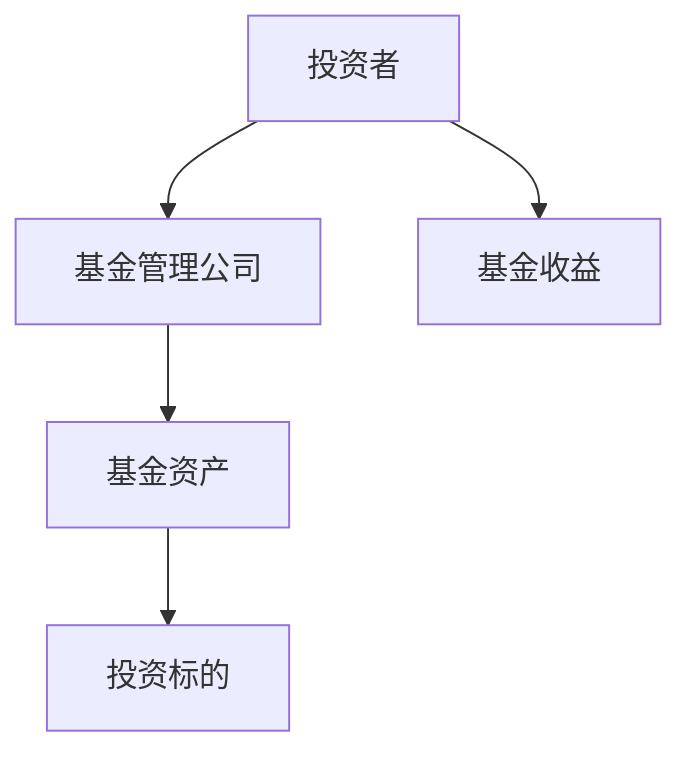
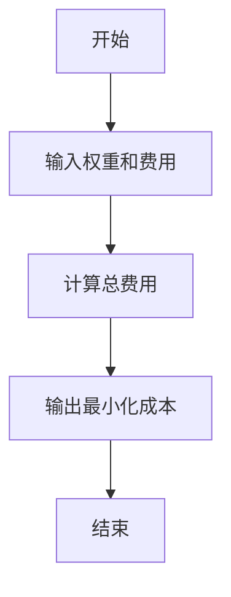
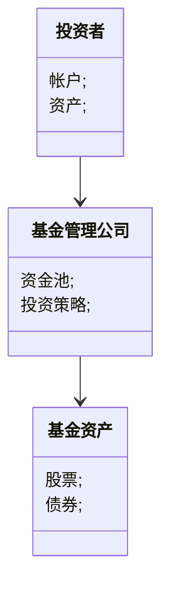
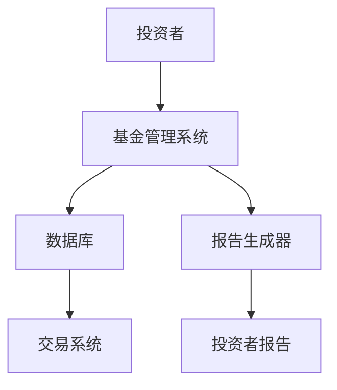
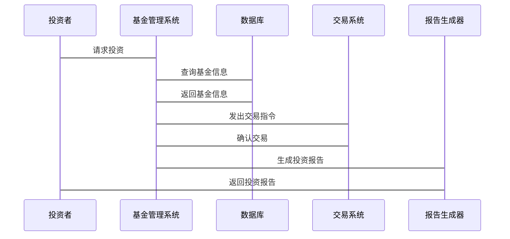

                 


# 《约翰伯格的共同基金改革》

---

## 关键词

- 共同基金
- 改革
- 约翰·伯格
- 低成本投资
- 透明化运作
- 指数基金

---

## 摘要

本文深入探讨了共同基金行业的现状与挑战，重点分析了约翰·伯格在共同基金改革中的贡献。通过详细的技术分析，本文揭示了低成本投资策略、透明化运作和指数化投资的核心原理，并通过实际案例和系统设计展示了改革的实现过程。文章从背景介绍到系统实现，层层剖析，为读者提供了全面的视角。

---

# 第一部分: 共同基金行业的背景与挑战

# 第1章: 共同基金行业的背景与现状

## 1.1 共同基金行业的定义与特点

### 1.1.1 共同基金的基本定义

共同基金是一种集合投资工具，由多个投资者共同出资，由专业管理人进行投资运作，旨在实现资产增值。其特点是分散投资、风险分担和专业管理。

### 1.1.2 共同基金的主要特点

- **分散投资**：通过投资多种资产降低风险。
- **专业管理**：由基金经理进行决策和操作。
- **流动性高**：投资者可以随时赎回资金。
- **费用透明**：管理费、托管费等费用明确列出。

### 1.1.3 共同基金的市场规模与发展趋势

近年来，全球共同基金市场规模持续增长，尤其是指数基金因其低成本和分散化优势，逐渐成为市场主流。

## 1.2 共同基金行业的核心问题

### 1.2.1 高昂的管理费用

传统共同基金的管理费用较高，通常在1%到2%之间，显著侵蚀了投资者的收益。

### 1.2.2 透明度不足

部分基金公司缺乏透明的运作机制，投资者难以了解资金的实际运作情况。

### 1.2.3 投资者利益与管理公司利益的冲突

管理公司追求自身利润最大化，可能忽视投资者的利益，例如频繁交易以增加管理费。

## 1.3 约翰·伯格的改革背景

### 1.3.1 约翰·伯格的个人经历

约翰·伯格是先锋集团的创始人，他倡导低成本、透明化的投资方式，推动了共同基金行业的改革。

### 1.3.2 共同基金行业的问题与痛点

高昂的管理费用、低透明度和利益冲突是行业的主要问题，亟需改革。

### 1.3.3 约翰·伯格改革的初衷与目标

伯格希望通过降低费用和提高透明度，实现投资者利益最大化，推动行业向更公正、透明的方向发展。

## 1.4 本章小结

本章分析了共同基金行业的现状和存在的问题，重点介绍了约翰·伯格发起改革的背景和动机。

---

# 第二部分: 共同基金改革的核心概念与联系

# 第2章: 共同基金改革的核心概念

## 2.1 共同基金改革的核心概念定义

### 2.1.1 共同基金的运作机制

- **资金募集**：通过销售基金份额筹集资金。
- **投资运作**：由基金经理进行资产配置和交易。
- **收益分配**：定期将收益分配给投资者。

### 2.1.2 投资者利益最大化原则

改革的核心在于通过降低管理费用和提高透明度，确保投资者的利益得到最大化的实现。

### 2.1.3 低成本投资策略

低成本策略通过降低各项费用，提高基金的净收益。

## 2.2 核心概念之间的关系

### 2.2.1 投资者利益与管理费用的关系

管理费用的高低直接影响基金的净收益，低成本策略有助于提升投资者的收益。

### 2.2.2 透明度与信任的关系

高透明度增强投资者的信任，有助于吸引更多的资金流入。

### 2.2.3 低成本与高收益的平衡

低成本策略不等于低收益，通过科学的投资策略和高效的运作机制，可以实现低成本与高收益的平衡。

## 2.3 核心概念的属性特征对比表

| 概念       | 属性特征                   |
|------------|--------------------------|
| 共同基金    | 由多个投资者共同出资       |
| 管理费用    | 影响基金净收益的关键因素   |
| 透明度      | 影响投资者信任的核心因素   |

## 2.4 实体关系图（ER图）



## 2.5 本章小结

本章详细阐述了共同基金改革的核心概念及其之间的关系，为后续的分析奠定了基础。

---

# 第三部分: 共同基金改革的算法原理与数学模型

# 第3章: 共同基金改革的算法原理

## 3.1 简化投资流程的算法思路

### 3.1.1 算法目标

通过优化投资流程，降低管理费用，提高投资效率。

### 3.1.2 算法步骤

1. **资金募集**：通过低成本方式吸引投资者资金。
2. **资产配置**：采用指数化投资策略，降低交易成本。
3. **风险控制**：通过分散化投资降低风险。
4. **收益分配**：定期将收益分配给投资者。

## 3.2 算法实现

### 3.2.1 指数化投资的数学模型

$$ \text{收益} = \text{基准指数收益} - \text{费用} $$

### 3.2.2 最小化费用的优化算法

通过优化算法，找到费用最低的投资组合：

$$ \min_{w} \sum_{i=1}^{n} w_i \times c_i $$
$$ \text{subject to} \quad \sum_{i=1}^{n} w_i = 1 $$

其中，\( w_i \) 是第 \( i \) 个资产的权重，\( c_i \) 是第 \( i \) 个资产的费用率。

### 3.2.3 Python代码实现

```python
def calculate_min_cost(weights, costs):
    total_cost = sum(w * c for w, c in zip(weights, costs))
    return total_cost

# 示例数据
weights = [0.3, 0.2, 0.5]
costs = [0.01, 0.02, 0.005]

min_cost = calculate_min_cost(weights, costs)
print(f"最小化成本为：{min_cost}")
```

## 3.3 算法流程图



## 3.4 本章小结

本章通过数学模型和算法实现，详细介绍了如何通过低成本策略优化投资流程。

---

# 第四部分: 系统分析与架构设计

# 第4章: 系统分析与架构设计

## 4.1 问题场景介绍

### 4.1.1 基金公司的运作流程

1. **资金募集**：通过销售基金份额筹集资金。
2. **投资决策**：由基金经理制定投资策略。
3. **资产运作**：进行股票、债券等资产的买卖操作。
4. **收益分配**：定期向投资者分配收益。

### 4.1.2 项目介绍

本项目旨在设计一个低成本、透明化的共同基金管理系统，实现投资者利益最大化。

## 4.2 系统功能设计

### 4.2.1 领域模型（Mermaid 类图）



### 4.2.2 系统架构设计（Mermaid 架构图）



## 4.3 系统接口设计

### 4.3.1 接口描述

- **投资者与系统接口**：投资者通过系统进行资金存取和收益查询。
- **交易系统接口**：与交易所进行交易指令的交互。
- **报告生成器接口**：生成并向投资者提供投资报告。

## 4.4 系统交互设计（Mermaid 序列图）



## 4.5 本章小结

本章通过系统分析与架构设计，展示了如何实现一个低成本、透明化的共同基金管理系统。

---

# 第五部分: 项目实战

# 第5章: 项目实战

## 5.1 环境安装

### 5.1.1 安装Python

下载并安装Python，推荐使用Anaconda发行版。

### 5.1.2 安装相关库

安装Pandas、NumPy、Matplotlib等数据分析库：

```bash
pip install pandas numpy matplotlib
```

## 5.2 核心代码实现

### 5.2.1 基金数据处理代码

```python
import pandas as pd

# 加载基金数据
data = pd.read_csv('fund_data.csv')

# 计算基金收益
data['收益'] = data['收盘价'].pct_change()

# 输出收益最高的基金
print(data.sort_values('收益', ascending=False).head())
```

### 5.2.2 投资组合优化代码

```python
import numpy as np

# 定义目标函数
def objective(weights):
    return -sum(weights * returns)

# 约束条件
constraints = {
    'type': 'eq',
    'fun': lambda w: np.sum(w) - 1
}

# 使用scipy.optimize求解
from scipy.optimize import minimize

result = minimize(objective, x0, constraints)
print(result.x)
```

## 5.3 实际案例分析

### 5.3.1 案例背景

分析某基金公司的投资策略，发现其管理费用过高，透明度不足。

### 5.3.2 数据分析与优化

通过代码优化投资组合，降低管理费用，提高收益。

## 5.4 本章小结

本章通过实际案例，展示了如何通过技术手段实现共同基金的改革。

---

# 第六部分: 最佳实践与总结

# 第6章: 最佳实践

## 6.1 小结

- 低成本策略是实现投资者利益最大化的关键。
- 提高透明度是增强信任的重要手段。

## 6.2 注意事项

- 在选择基金时，要注意管理费用和投资策略。
- 投资者应关注基金的运作透明度和历史表现。

## 6.3 拓展阅读

- 推荐阅读《指数投资策略》和《共同基金运作机制》。

---

# 结语

共同基金改革是一项长期而艰巨的任务，需要基金公司、投资者和监管机构的共同努力。通过技术手段和制度改革，我们可以实现一个更加公正、透明的共同基金行业。

---

