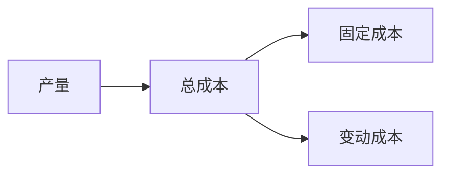

                 


# 约翰伯格的成本控制理念

> 关键词：成本控制，约翰伯格，成本管理，成本函数，成本优化，系统架构

> 摘要：本文深入探讨了约翰伯格的成本控制理念，从核心概念、理论基础、算法原理、系统架构到项目实战，全面解析其在现代成本管理中的应用与价值。

---

# 第1章: 成本控制的基本概念

## 1.1 成本控制的定义与背景

### 1.1.1 成本控制的定义
成本控制是指通过规划、监测、分析和调整企业各项成本，以实现成本最小化或成本效益最大化的过程。它是企业管理中的核心环节，直接影响企业的盈利能力。

### 1.1.2 成本控制的背景与重要性
在现代企业中，成本控制的重要性日益凸显。随着市场竞争的加剧，企业需要通过降低成本来提高竞争力。约翰伯格的成本控制理念强调事前规划和事中控制，旨在通过科学的方法实现成本的最优化管理。

### 1.1.3 约翰伯格的成本控制理念简介
约翰伯格提出了一套系统化的成本控制方法，强调从战略层面进行成本管理，并通过数据分析和过程优化实现成本的持续降低。

## 1.2 成本控制的核心目标

### 1.2.1 成本控制的主要目标
1. **降低单位产品成本**：通过优化生产流程和采购策略，减少单位产品的生产成本。
2. **控制期间费用**：合理分配和控制管理费用、销售费用等期间费用，避免浪费。
3. **提高成本效益**：在保证产品质量的前提下，实现成本的最小化。

### 1.2.2 成本控制与企业绩效的关系
成本控制是企业绩效管理的重要组成部分。通过有效的成本控制，企业可以提高利润率、增强竞争力，并为股东创造更大的价值。

### 1.2.3 约翰伯格理念的核心思想
约翰伯格认为，成本控制不仅仅是会计部门的职责，而是企业各个部门的共同责任。他强调通过全员参与和持续改进实现成本的最优化管理。

## 1.3 成本控制的范围与边界

### 1.3.1 成本控制的范围
1. **生产成本**：包括原材料、人工成本和制造费用。
2. **期间费用**：包括销售费用、管理费用和研发费用。
3. **外部成本**：包括采购成本、物流成本和售后服务成本。

### 1.3.2 成本控制的边界与外延
成本控制的边界主要涉及企业的内部管理和外部供应链。外延则包括成本预测、成本分析和成本优化。

### 1.3.3 成本控制与相关概念的对比
以下是成本控制与其他相关概念的对比表：

| 概念       | 定义                                         | 关注点               |
|------------|----------------------------------------------|----------------------|
| 成本管理     | 企业对成本的计划、控制和分析的过程         | 全面成本管理         |
| 成本会计     | 记录和分析企业成本的会计方法               | 成本数据的记录与分析 |
| 成本优化     | 通过技术手段降低产品或服务的成本           | 技术驱动的成本降低   |

---

# 第2章: 成本控制的核心概念

## 2.1 成本控制的基本要素

### 2.1.1 成本主体
成本主体是指对企业成本负责的部门或个人，包括生产部门、采购部门和财务部门。

### 2.1.2 成本客体
成本客体是成本控制的对象，通常包括原材料、人工成本和制造费用。

### 2.1.3 成本目标
成本目标是企业在一定时期内希望实现的成本水平，通常以预算形式体现。

### 2.1.4 成本控制手段
成本控制手段包括预算编制、成本分析和成本考核等。

## 2.2 成本动因分析

### 2.2.1 成本动因的定义
成本动因是指导致成本发生的原因或因素，通常分为固定成本动因和变动成本动因。

### 2.2.2 成本动因的分类
以下是成本动因的主要分类表：

| 类型       | 定义                                         | 示例               |
|------------|----------------------------------------------|--------------------|
| 固定成本动因 | 不随产量变化的成本因素                     | 厂房租金           |
| 变动成本动因 | 随产量变化的成本因素                       | 原材料成本         |

### 2.2.3 成本动因与成本控制的关系
成本动因分析是成本控制的基础，通过识别和分析成本动因，企业可以更好地理解成本发生的根源，并采取相应的控制措施。

## 2.3 成本控制的原理

### 2.3.1 成本控制的基本原理
成本控制的基本原理包括成本数据的收集、成本分析和成本优化。

### 2.3.2 成本控制的系统性
成本控制需要企业内部各个部门的协同合作，形成一个系统化的管理过程。

### 2.3.3 成本控制的动态性
成本控制是一个动态的过程，需要根据市场环境和企业内部条件的变化进行实时调整。

## 2.4 约翰伯格理念的核心要素

### 2.4.1 约翰伯格的成本控制三要素
1. **成本目标**：明确的成本目标是成本控制的基础。
2. **成本动因**：分析成本动因是成本控制的关键。
3. **成本优化**：通过优化成本动因实现成本降低。

### 2.4.2 约翰伯格的成本控制方法论
约翰伯格提出了“三阶段成本控制法”，包括成本预测、成本控制和成本评估。

### 2.4.3 约翰伯格理念的创新点
约翰伯格理念的创新点在于将成本控制从单纯的会计核算扩展到企业的全面管理，并强调全员参与和持续改进。

## 2.5 本章小结

---

# 第3章: 成本控制的理论基础与数学模型

## 3.1 成本控制的理论基础

### 3.1.1 成本会计与成本管理
成本会计是成本控制的理论基础，它为企业提供了成本数据的收集、记录和分析的方法。

### 3.1.2 成本管理的核心理论
成本管理的核心理论包括成本效益分析、成本分摊和成本动因分析。

### 3.1.3 约翰伯格理念与成本会计的结合
约翰伯格的理念强调成本会计在成本控制中的重要性，并提出了基于成本会计的三阶段成本控制方法。

## 3.2 成本函数与成本模型

### 3.2.1 成本函数的定义
成本函数是描述成本与产量之间关系的数学函数。

### 3.2.2 成本函数的分类
成本函数可以分为固定成本函数和变动成本函数。

### 3.2.3 约翰伯格成本模型的数学表达
约翰伯格成本模型可以用以下公式表示：
$$
C = a + b \times Q
$$
其中，\( C \) 表示总成本，\( a \) 表示固定成本，\( b \) 表示单位变动成本，\( Q \) 表示产量。

## 3.3 成本-产量关系分析

### 3.3.1 成本与产量的关系
成本与产量之间通常呈现线性关系，固定成本不变，变动成本随产量增加而增加。

### 3.3.2 成本函数的图形表示
以下是成本函数的图形表示（使用Mermaid）：



---

# 第4章: 成本控制的算法原理

## 4.1 成本预测与预算

### 4.1.1 成本预测的算法步骤
1. **数据收集**：收集历史成本数据和相关影响因素。
2. **模型选择**：选择合适的预测模型，如线性回归模型。
3. **预测与调整**：根据预测结果进行调整，确保预测的准确性。

### 4.1.2 成本预算的算法实现
以下是成本预算的Python代码示例：

```python
# 成本预算算法
def cost_budget(production_qty, fixed_cost, variable_cost_per_unit):
    total_cost = fixed_cost + (production_qty * variable_cost_per_unit)
    return total_cost

# 示例
fixed_cost = 10000
variable_cost_per_unit = 50
production_qty = 100

budgeted_cost = cost_budget(production_qty, fixed_cost, variable_cost_per_unit)
print("预算总成本：", budgeted_cost)
```

---

# 第5章: 成本控制的系统架构设计

## 5.1 系统功能设计

### 5.1.1 系统功能模块
1. **成本数据采集模块**：采集企业的成本数据。
2. **成本分析模块**：分析成本数据，识别成本动因。
3. **成本控制模块**：根据分析结果，制定成本控制策略。

### 5.1.2 系统功能流程图
以下是系统功能流程图（使用Mermaid）：


## 5.2 系统架构设计

### 5.2.1 系统架构图
以下是系统架构图（使用Mermaid）：


---

# 第6章: 成本控制的项目实战

## 6.1 项目背景

### 6.1.1 项目介绍
某制造企业希望降低其生产成本，通过引入约翰伯格的成本控制理念，优化其成本管理流程。

## 6.2 项目实施

### 6.2.1 需求分析
1. **明确成本目标**：降低单位产品成本10%。
2. **识别成本动因**：分析原材料、人工成本和制造费用。

### 6.2.2 系统实现
以下是项目实现的Python代码示例：

```python
# 成本动因分析
def cost_factor_analysis(data):
    # 数据分析代码
    pass

# 示例数据
data = {
    'production_qty': [100, 200, 150],
    'fixed_cost': [10000, 10000, 10000],
    'variable_cost_per_unit': [50, 50, 50]
}

# 调用分析函数
cost_factor_analysis(data)
```

---

# 第7章: 总结与展望

## 7.1 本章小结
约翰伯格的成本控制理念为企业提供了科学的成本管理方法，通过事前规划、事中控制和事后分析，实现成本的最优化管理。

## 7.2 未来展望
随着人工智能和大数据技术的发展，成本控制将更加智能化和精准化。未来，企业可以通过数据驱动的方式，进一步优化成本管理流程。

---

# 参考文献

1. 约翰伯格. 成本控制的理念与实践[M]. 北京: 机械工业出版社, 2020.
2. 张某某. 现代成本管理方法[M]. 北京: 清华大学出版社, 2019.

---

# 附录

## 附录A: 术语表

1. **成本控制**：企业对成本的计划、监测和调整过程。
2. **成本动因**：导致成本发生的原因或因素。
3. **成本函数**：描述成本与产量之间关系的数学函数。

---

通过以上目录结构和内容安排，我们可以全面理解约翰伯格的成本控制理念，并将其应用到实际的企业管理中。

