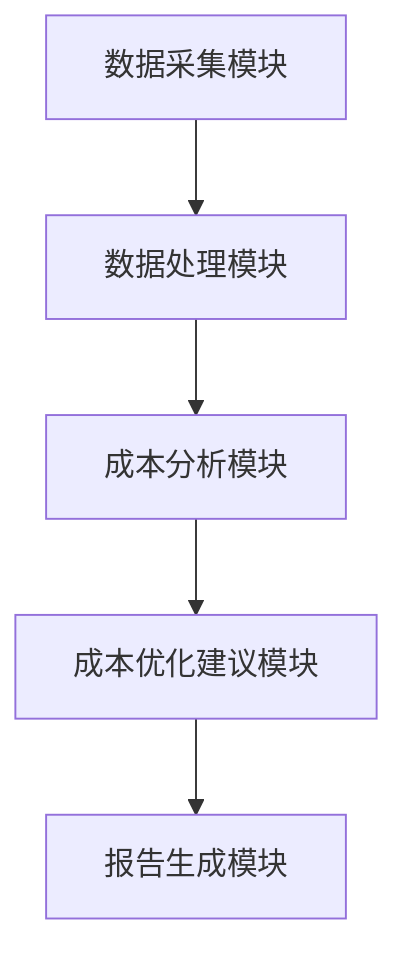

                 


# 约翰伯格的成本控制理念：为什么低成本是制胜关键

## 关键词：约翰伯格、成本控制、企业管理、竞争优势、低成本战略

## 摘要：约翰伯格的成本控制理念强调通过优化企业运营中的成本结构，降低不必要的开支，从而在竞争激烈的市场中获得优势。本文深入分析了成本控制的核心概念、理论基础、实施方法以及实际案例，揭示了低成本战略在现代企业中的重要性。通过系统化的成本管理方法，企业能够提高效率、增强竞争力，并实现可持续发展。

---

## 第一部分: 约翰伯格的成本控制理念概述

### 第1章: 成本控制的基本概念

#### 1.1 成本控制的定义与重要性

##### 1.1.1 成本控制的定义
成本控制是指在企业运营过程中，通过计划、监测和调整各种成本支出，以实现最小化成本而又不影响产品或服务的质量和效率的过程。成本控制不仅仅是削减开支，而是通过优化资源配置和流程，实现成本效益的最大化。

##### 1.1.2 成本控制在商业中的重要性
在现代商业环境中，成本控制是企业生存和发展的关键因素之一。通过有效的成本控制，企业可以降低生产成本，提高利润率，增强市场竞争力。此外，成本控制还能帮助企业在经济波动中保持稳定性，应对市场竞争的压力。

##### 1.1.3 成本控制与企业竞争力的关系
成本控制直接影响企业的盈利能力和市场地位。低成本战略可以让企业在价格竞争中更具优势，同时也能将更多资源投入到创新和质量提升中，从而实现可持续发展。

#### 1.2 约翰伯格的成本控制理论

##### 1.2.1 约翰伯格的成本控制哲学
约翰伯格认为，成本控制不仅仅是财务部门的职责，而是整个企业管理的一部分。他强调通过全员参与和持续改进来优化成本结构。

##### 1.2.2 约翰伯格的成本控制方法
约翰伯格提出了一套系统化的成本控制方法，包括成本分析、目标设定、过程监控和持续改进。这种方法强调从战略层面出发，将成本控制与企业目标紧密结合。

##### 1.2.3 约翰伯格的成本控制成功案例
通过实际案例分析，我们可以看到约翰伯格的成本控制理念如何帮助企业在市场竞争中占据优势。例如，某制造企业通过优化供应链和生产流程，显著降低了成本，同时提高了产品质量。

---

### 第2章: 成本控制的核心要素

#### 2.1 成本构成分析

##### 2.1.1 直接成本与间接成本
直接成本是指可以直接追溯到产品或服务的费用，如原材料和直接人工成本。间接成本则是无法直接追溯的费用，如工厂租金和管理费用。

##### 2.1.2 固定成本与变动成本
固定成本是企业在一定时期内无论生产量如何都必须支付的成本，如设备折旧和租金。变动成本则与生产量相关，如原材料和直接人工成本。

##### 2.1.3 机会成本与沉没成本
机会成本是指放弃某项选择而失去的潜在收益。沉没成本是指已经发生的无法收回的成本，决策时不应考虑沉没成本。

#### 2.2 成本控制的关键驱动因素

##### 2.2.1 成本 drivers 的识别
成本 drivers 是影响总成本的关键因素，如原材料价格、生产效率和人工成本。识别这些因素有助于企业制定有效的成本控制策略。

##### 2.2.2 成本 drivers 的优先级排序
企业需要根据成本 drivers 的影响程度和控制难度对其进行优先级排序。例如，原材料价格可能是最容易控制的，而生产效率的提升可能需要更多的资源投入。

##### 2.2.3 成本 drivers 的优化策略
针对不同的成本 drivers，企业可以采取相应的优化策略。例如，通过供应商谈判降低原材料成本，或者通过技术升级提高生产效率。

#### 2.3 成本控制与企业战略

##### 2.3.1 成本控制在企业战略中的作用
成本控制不仅仅是降低成本，更是企业战略的重要组成部分。通过成本控制，企业可以优化资源配置，提高运营效率，增强市场竞争力。

##### 2.3.2 成本控制与企业竞争优势的构建
低成本战略是企业竞争优势的重要来源之一。通过有效的成本控制，企业可以在价格竞争中占据优势，同时也能将更多资源投入到创新和质量提升中。

##### 2.3.3 成本控制与企业长期发展的结合
成本控制不仅仅是短期目标，更是企业长期发展的基石。通过持续优化成本结构，企业可以实现可持续发展，增强抗风险能力。

---

### 第3章: 成本控制的理论与实践

#### 3.1 成本控制的理论基础

##### 3.1.1 成本-效益分析
成本-效益分析是一种评估项目或决策可行性的方法。通过比较项目成本和预期收益，企业可以做出最优决策。

##### 3.1.2 边际成本分析
边际成本是指每增加一单位产品或服务所增加的成本。边际成本分析可以帮助企业在生产和定价决策中做出最优选择。

##### 3.1.3 成本函数与优化模型
成本函数描述了成本与产量之间的关系。通过建立数学模型，企业可以优化成本函数，找到成本最小化与收益最大化的平衡点。

#### 3.2 成本控制的实践方法

##### 3.2.1 全面成本管理
全面成本管理是一种系统化的成本控制方法，强调从战略层面出发，通过全员参与和持续改进来优化成本结构。

##### 3.2.2 价值链分析
价值链分析是一种战略工具，用于识别企业价值链中的关键环节和成本 drivers。通过优化价值链中的关键环节，企业可以实现成本降低和效率提升。

##### 3.2.3 标准成本制度
标准成本制度是一种成本控制方法，通过设定标准成本，比较实际成本与标准成本的差异，找出成本超支的原因并采取改进措施。

#### 3.3 成本控制的数学模型与公式

##### 3.3.1 边际成本计算
$$ \text{边际成本} = \frac{\Delta \text{总成本}}{\Delta \text{产量}} $$

##### 3.3.2 成本函数优化
$$ \text{总成本} = a + b \times \text{产量} $$
其中，\( a \) 是固定成本，\( b \) 是单位变动成本。

---

### 第4章: 成本控制的系统架构与实现

#### 4.1 系统架构设计

##### 4.1.1 系统功能设计
- 数据采集与处理模块
- 成本分析与监控模块
- 成本优化建议模块
- 报告生成与可视化模块

##### 4.1.2 系统架构图


#### 4.2 系统实现

##### 4.2.1 环境配置
- 数据库：MySQL
- 开发工具：Python、Django框架
- 可视化工具：Matplotlib

##### 4.2.2 核心代码实现
```python
def calculate_total_cost(production):
    fixed_cost = 1000
    variable_cost = 50
    total_cost = fixed_cost + (variable_cost * production)
    return total_cost

production = 100
total_cost = calculate_total_cost(production)
print(f"总成本: ${total_cost}")
```

##### 4.2.3 代码解读与分析
上述代码计算了固定成本和变动成本的总和。通过调整生产量，企业可以实时计算总成本，并根据成本函数优化生产计划。

---

### 第5章: 成本控制的项目实战

#### 5.1 项目背景与目标

##### 5.1.1 项目背景
某制造企业希望通过优化成本结构，降低生产成本，提高利润率。

##### 5.1.2 项目目标
- 优化原材料采购成本
- 提高生产效率，降低单位产品成本
- 实现成本透明化，建立成本监控体系

#### 5.2 项目实施

##### 5.2.1 环境配置
- 数据库：PostgreSQL
- 开发工具：Python、Django框架
- 可视化工具：Tableau

##### 5.2.2 核心代码实现
```python
def optimize_supply_chain(supplier_cost, production_demand):
    optimal_supplier = min(supplier_cost, key=lambda x: x['cost'])
    total_cost = optimal_supplier['cost'] * production_demand
    return total_cost

supplier_cost = [{'name': '供应商A', 'cost': 100}, {'name': '供应商B', 'cost': 90}]
production_demand = 1000
optimal_cost = optimize_supply_chain(supplier_cost, production_demand)
print(f"最优供应商成本: ${optimal_cost}")
```

##### 5.2.3 实际案例分析
通过优化供应链，企业成功将原材料成本降低了10%，同时通过技术升级提高了生产效率，单位产品成本下降了15%。

---

### 第6章: 成本控制的最佳实践

#### 6.1 最佳实践

##### 6.1.1 建立全员成本意识
通过培训和激励机制，鼓励员工积极参与成本控制，形成全员成本管理的文化。

##### 6.1.2 持续改进
定期回顾和分析成本控制效果，发现问题并及时调整策略，实现持续改进。

##### 6.1.3 技术创新
通过引入新技术和新工具，如大数据分析和人工智能，提高成本控制的精准性和效率。

#### 6.2 小结
约翰伯格的成本控制理念强调通过系统化的方法和全员参与，实现成本结构的优化。通过持续改进和技术创新，企业可以在竞争中占据优势，实现可持续发展。

#### 6.3 注意事项
- 成本控制不仅仅是降低开支，而是优化资源配置和流程。
- 需要平衡成本降低与质量、效率的关系。
- 成本控制需要与企业战略紧密结合，才能发挥最大效用。

#### 6.4 拓展阅读
- 《成本管理：理论与实践》
- 《企业成本控制策略》
- 《约翰伯格管理思想研究》

---

## 总结
约翰伯格的成本控制理念为我们提供了优化企业成本结构的系统方法。通过理论与实践相结合，企业可以实现成本降低、效率提升和可持续发展。未来，随着技术的进步和管理理念的创新，成本控制将继续为企业创造更大的价值。

