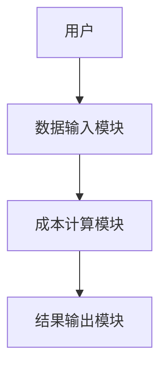
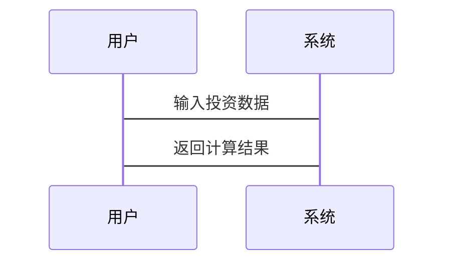

                 


# 约翰·伯格的投资成本计算

> 关键词：投资成本计算、约翰·伯格、显性成本、隐性成本、指数基金、投资决策、成本优化

> 摘要：本文详细探讨了约翰·伯格的投资成本计算方法，从基本概念到数学模型，再到系统设计和项目实战，全面解析投资成本计算的核心原理和实际应用。

---

# 引言

## 1. 投资成本计算的基本概念

### 1.1 投资成本的定义与分类

- **显性成本**：直接可量化的成本，如交易费用、管理费等。
- **隐性成本**：间接成本，如机会成本、时间成本等。

### 1.2 投资成本计算的必要性

- 帮助投资者优化决策，降低整体投资成本。
- 通过成本分析，实现收益最大化。

### 1.3 约翰·伯格的投资理念与成本计算的关系

- 伯格强调长期投资和指数基金，其成本计算方法为投资决策提供了理论基础。

---

## 2. 投资成本计算的核心概念

### 2.1 显性成本与隐性成本的对比分析

| 类别         | 定义                                                                 | 特征                     |
|--------------|----------------------------------------------------------------------|--------------------------|
| 显性成本     | 可以直接量化的成本，如交易费用、管理费等。                           | 可以直接计量，易于计算。  |
| 隐性成本     | 无法直接量化的成本，如机会成本、时间成本等。                         | 难以直接计量，需间接估算。|

### 2.2 投资成本计算的数学模型与公式

- **显性成本计算公式**：
  $$ \text{显性成本} = \text{交易费用} + \text{管理费用} + \text{其他费用} $$
- **隐性成本计算公式**：
  $$ \text{隐性成本} = \text{机会成本} + \text{时间成本} + \text{风险成本} $$

---

## 3. 投资成本计算的算法原理

### 3.1 投资成本计算的数学模型

- **数学模型**：
  $$ \text{总成本} = \text{显性成本} + \text{隐性成本} $$

- **实例分析**：
  假设某投资者购买指数基金，交易费用为$100，管理费率为1%，隐性成本包括机会成本$50，时间成本$30，风险成本$20。计算总成本：
  $$ \text{总成本} = 100 + (50 + 30 + 20) = 200 $$

---

## 4. 投资成本计算系统设计

### 4.1 系统功能设计

- **功能模块**：
  - 数据输入模块：输入投资成本数据。
  - 成本计算模块：根据公式计算显性成本、隐性成本和总成本。
  - 结果输出模块：展示计算结果和优化建议。

### 4.2 系统架构设计



### 4.3 系统交互设计



---

## 5. 项目实战

### 5.1 环境安装

- **Python环境**：安装Python和相关库（如pandas、numpy）。
- **开发工具**：安装Jupyter Notebook或PyCharm。

### 5.2 代码实现

```python
def calculate_explicit_cost(transactions, management_fee):
    return transactions + management_fee

def calculate_hidden_cost(opportunity_cost, time_cost, risk_cost):
    return opportunity_cost + time_cost + risk_cost

def total_investment_cost(explicit_cost, hidden_cost):
    return explicit_cost + hidden_cost

# 示例
explicit_cost = calculate_explicit_cost(100, 50)
hidden_cost = calculate_hidden_cost(50, 30, 20)
total_cost = total_investment_cost(explicit_cost, hidden_cost)
print("总成本:", total_cost)
```

### 5.3 案例分析

- **案例背景**：某投资者投资指数基金，交易费用为$100，管理费率为1%，隐性成本包括机会成本$50，时间成本$30，风险成本$20。
- **计算结果**：总成本为$200。

---

## 6. 最佳实践与小结

### 6.1 小结

- 投资成本计算是优化投资决策的关键步骤。
- 显性成本和隐性成本的计算需要综合考虑多种因素。

### 6.2 注意事项

- 数据准确性：确保输入数据的准确性和完整性。
- 模型优化：根据实际情况调整数学模型，以提高计算精度。

### 6.3 拓展阅读

- 建议阅读约翰·伯格的相关著作，深入理解投资成本计算的理论基础。

---

# 结语

通过本文的分析，读者可以全面理解约翰·伯格的投资成本计算方法，并能够实际应用这些方法进行投资决策优化。希望本文能为投资者提供有价值的参考和指导。

