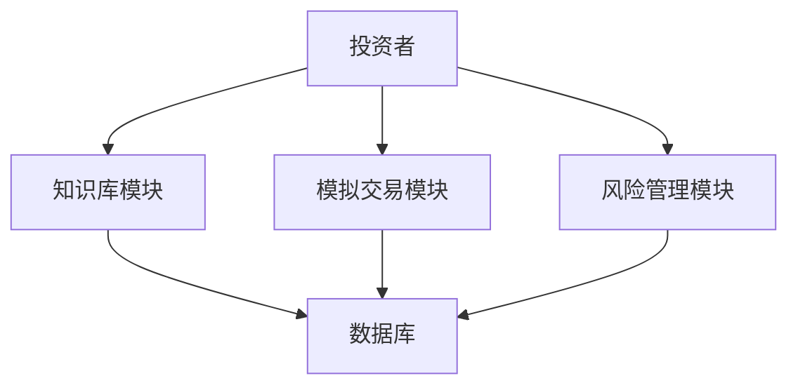

                 


# 《约翰伯格的投资者教育观》

## 关键词：投资者教育，约翰·伯格，价值投资，风险管理，投资组合，教育系统

## 摘要：本文深入探讨了约翰·伯格的投资者教育观，分析了其投资理念的核心要素，包括价值投资、风险管理等，并结合实际案例和系统架构，展示了如何将这些理念应用于实践。通过详细的技术分析和系统设计，本文为读者提供了全面的投资者教育框架，帮助读者理解如何在实际投资中应用伯格的理论。

---

## 第一章：背景介绍

### 1.1 投资者教育的重要性

#### 1.1.1 投资者教育的定义与内涵

投资者教育是指通过系统化的知识传授和实践活动，帮助投资者理解金融市场运作机制、投资工具使用方法以及风险管理策略，从而做出理性的投资决策。其内涵包括金融知识普及、投资心理培养和决策能力提升。

#### 1.1.2 投资者教育的目标与意义

- **目标**：提升投资者的金融素养，帮助其制定合理的投资策略，避免常见投资误区。
- **意义**：促进市场健康发展，保护投资者利益，推动金融创新。

#### 1.1.3 投资者教育的现状与挑战

- **现状**：投资者教育在全球范围内受到重视，但普及程度参差不齐。
- **挑战**：信息过载、投资者认知偏差、教育资源分布不均。

### 1.2 约翰·伯格的生平与投资理念

#### 1.2.1 早年经历与教育背景

约翰·伯格出生于美国宾夕法尼亚州，早年在宾夕法尼亚大学获得工程学学位，后转向金融领域发展。

#### 1.2.2 投资生涯的起点

伯格在职业生涯中积累了丰富的投资经验，尤其是在共同基金领域。他强调长期投资和价值投资的重要性。

#### 1.2.3 伯格的投资哲学

伯格的投资哲学以价值投资为核心，强调长期持有优质资产，避免短期市场波动的干扰。

---

## 第二章：约翰·伯格的投资理念

### 2.1 价值投资的核心要素

价值投资强调买入被市场低估的资产，长期持有，等待其价值回归。伯格认为，市场短期波动不可预测，但长期趋势由基本面决定。

### 2.2 风险管理的重要性

伯格认为，风险管理是投资成功的关键。投资者应通过分散投资和合理配置资产来降低风险。

### 2.3 投资组合优化的数学模型

#### 2.3.1 均值-方差模型的介绍

均值-方差模型由哈里·马科维茨提出，用于优化投资组合的风险与收益。

$$ \text{目标函数：} \min \sum_{i=1}^n \sum_{j=1}^n \sigma_{ij} w_j w_i $$

$$ \text{约束条件：} \sum_{i=1}^n w_i = 1, \quad \sum_{i=1}^n r_i w_i = R $$

其中，$w_i$ 为资产 $i$ 的权重，$r_i$ 为资产 $i$ 的预期收益，$R$ 为目标收益。

---

## 第三章：投资者教育的核心概念

### 3.1 投资者教育的核心要素

#### 3.1.1 投资者的知识结构

投资者应掌握基础的金融知识，包括资产类别、市场运作机制和投资工具使用方法。

#### 3.1.2 投资者的心理素质

投资者需具备冷静的决策能力，避免情绪化投资。

#### 3.1.3 投资者的决策能力

投资者应学会分析财务报表、评估资产价值，并制定合理的投资计划。

---

## 第四章：投资者教育的系统架构设计

### 4.1 投资者教育系统的功能设计

#### 4.1.1 系统功能模块

- **知识库模块**：提供金融知识库，包括视频、文章和案例分析。
- **模拟交易模块**：允许投资者进行虚拟交易，体验投资过程。
- **风险管理模块**：提供风险评估工具和资产配置建议。

#### 4.1.2 系统架构图



### 4.2 系统接口设计

#### 4.2.1 HTTP接口示例

```python
import requests

response = requests.get('http://localhost:8080/api/stocks')
stocks = response.json()
```

---

## 第五章：项目实战

### 5.1 投资组合管理系统的设计与实现

#### 5.1.1 环境安装

安装Python和必要的库：

```bash
pip install pandas numpy matplotlib
```

#### 5.1.2 核心代码实现

```python
import pandas as pd
import numpy as np

def calculate Sharpe Ratio(returns, risk_free_rate):
    # 计算夏普比率
    excess_returns = returns - risk_free_rate
    sharpe_ratio = excess_returns.mean() / excess_returns.std()
    return sharpe_ratio

# 示例数据
returns = pd.Series([0.05, 0.02, 0.07, 0.01, 0.03])
risk_free_rate = 0.01

print(f"夏普比率：{calculate_Sharpe_Ratio(returns, risk_free_rate)}")
```

#### 5.1.3 案例分析

分析一个投资组合的夏普比率，评估其风险调整后的收益。

---

## 第六章：最佳实践

### 6.1 小结

本文通过分析约翰·伯格的投资者教育观，展示了其投资理念的核心要素，并结合系统设计和项目实战，提供了全面的投资者教育框架。

### 6.2 注意事项

- 投资者应保持理性，避免盲目跟风。
- 风险管理是投资成功的关键。

### 6.3 拓展阅读

推荐阅读《约翰·伯格的投资哲学》和《投资学原理》等书籍，深入理解价值投资的精髓。

---

通过本文的详细分析，读者可以全面理解约翰·伯格的投资者教育观，并将其应用于实际投资中，提升自身的投资能力。

