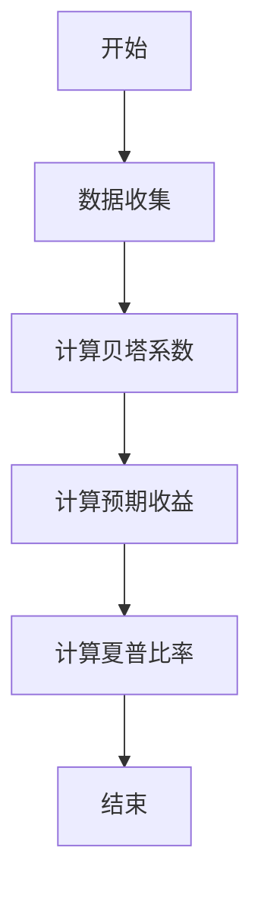
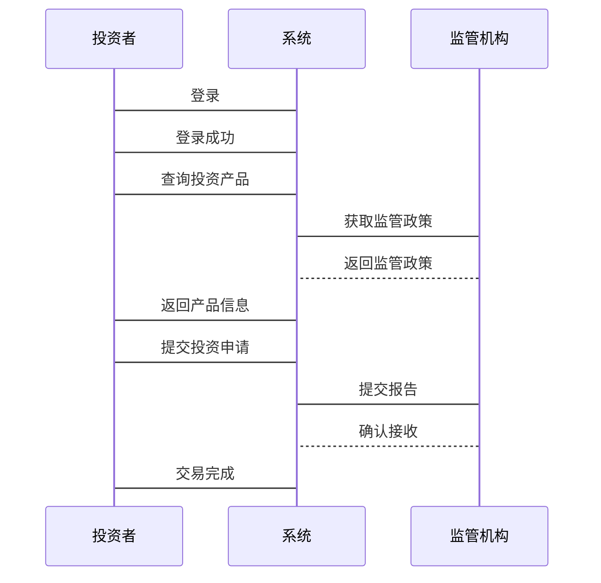

                 


# 约翰伯格的投资者权益保护

## 关键词：投资者权益保护，约翰·伯格，投资策略，风险管理，法律框架

## 摘要：投资者权益保护是保障投资者利益、维护市场公平的重要措施。本文从约翰·伯格的投资者权益保护理念出发，详细分析投资者权益保护的核心概念、算法原理、系统设计和项目实战。通过数学模型、Python代码实现和系统架构设计，帮助读者全面理解投资者权益保护的重要性及其在实际中的应用。

---

# 第一部分: 投资者权益保护的背景与核心概念

# 第1章: 投资者权益保护概述

## 1.1 投资者权益保护的定义与重要性

### 1.1.1 投资者权益保护的基本概念
投资者权益保护是指在投资活动中，通过法律、制度和监管手段，确保投资者的合法权益得到维护和实现的过程。投资者在投资过程中可能面临各种风险和不确定性，权益保护机制旨在减少这些风险，保障投资者的知情权、参与权、收益权和监督权。

### 1.1.2 投资者权益保护的重要性
投资者权益保护不仅是维护市场公平和透明的重要手段，也是促进市场健康发展的重要保障。健康的市场环境能够吸引更多的投资者参与，促进资本的合理流动和资源的优化配置。此外，投资者权益保护也是维护社会信任和金融稳定的关键因素。

### 1.1.3 投资者权益保护的现状与问题
尽管投资者权益保护在各国都受到重视，但在实际操作中仍然存在一些问题，如信息不对称、监管不足、投资者教育缺失等。这些问题可能导致投资者利益受损，甚至引发市场波动和金融风险。

## 1.2 投资者权益保护的核心要素

### 1.2.1 投资者的基本权利
投资者的基本权利包括知情权、参与权、收益权、监督权等。这些权利确保投资者能够充分了解投资产品和风险，并在必要时参与决策或监督相关方的行为。

### 1.2.2 投资者义务与责任
投资者在享有权利的同时，也需承担相应的义务和责任，如遵守法律法规、提供真实信息、履行合同义务等。这些义务和责任是维护市场秩序和公平竞争的基础。

### 1.2.3 投资者权益保护的边界与外延
投资者权益保护并非无限制，需在法律框架和社会公共利益之间找到平衡。例如，保护投资者免受欺诈和误导，但也要防止过度保护影响市场的创新和发展。

## 1.3 投资者权益保护的法律框架

### 1.3.1 相关法律法规概述
投资者权益保护的法律框架主要包括公司法、证券法、金融监管法规等。这些法律法规明确了投资者的权利和义务，以及监管机构的职责。

### 1.3.2 国际与国内的法律对比
不同国家和地区的法律在投资者权益保护方面存在差异。例如，美国的《萨班斯-奥克斯利法案》和欧盟的《金融工具市场指令》提供了不同的监管框架和保护措施。

### 1.3.3 法律框架对投资者权益的影响
法律框架的完善与否直接影响投资者的权益保护效果。严格的法律和监管能够有效减少投资者的损失，增强市场信心。

## 1.4 本章小结
本章从投资者权益保护的定义、重要性、核心要素和法律框架等方面进行了详细阐述，为后续章节的分析奠定了基础。

---

# 第2章: 投资者权益保护的核心概念与联系

## 2.1 投资者权益保护的核心原理

### 2.1.1 投资者权益保护的基本原理
投资者权益保护的核心在于通过信息透明化、风险披露和监管机制，确保投资者能够做出明智的投资决策，并在受到损失时获得合理的补偿。

### 2.1.2 投资者权益保护的关键要素
关键要素包括信息透明、风险控制、监管力度和投资者教育。这些要素相互作用，共同构建起投资者权益保护的体系。

### 2.1.3 投资者权益保护的系统性特征
投资者权益保护是一个系统工程，涉及法律、监管、市场和投资者自身等多个方面。系统的各个部分相互关联，共同影响保护效果。

## 2.2 投资者权益保护的核心概念对比

### 2.2.1 投资者与企业的关系
投资者通过购买企业股票等方式成为企业的部分所有者，享有收益权和监督权。企业需向投资者提供真实、准确的信息，并履行披露义务。

### 2.2.2 投资者与监管机构的关系
监管机构负责制定和执行保护投资者权益的法规，监督市场行为，查处违法违规行为。投资者需遵守监管规定，并在必要时向监管机构投诉或举报。

### 2.2.3 投资者与市场的关系
市场是投资者进行交易的场所，市场的公平性和透明度直接影响投资者的权益。投资者的行为也会影响市场的运行和价格波动。

## 2.3 投资者权益保护的ER实体关系图

```mermaid
erDiagram
    actor 投资者
    actor 监管机构
    actor 企业
    actor 市场
    投资者 --> 投资者权益
    监管机构 --> 监管政策
    企业 --> 企业治理
    市场 --> 市场风险
```

通过ER图可以看出，投资者权益保护涉及多个实体及其关系，投资者的权益受到企业、市场和监管机构的共同影响。

## 2.4 本章小结
本章通过分析投资者权益保护的核心原理和相关实体关系，帮助读者理解其内在联系和系统性特征。

---

# 第3章: 投资者权益保护的算法原理

## 3.1 投资者权益保护的算法概述

### 3.1.1 投资者权益保护算法的基本概念
投资者权益保护算法是一种用于评估和预测投资者权益风险的工具。通过算法分析市场波动、企业财务状况和监管政策等多方面因素，为投资者提供决策支持。

### 3.1.2 投资者权益保护算法的核心原理
投资者权益保护算法的核心在于通过数据建模和风险评估，识别潜在风险并制定应对策略。这包括对市场风险、信用风险和操作风险的量化分析。

### 3.1.3 投资者权益保护算法的应用场景
算法可以应用于投资组合管理、风险预警、合规监控等领域。例如，通过算法预测市场波动，帮助投资者规避风险。

## 3.2 投资者权益保护算法的数学模型

### 3.2.1 投资者权益保护的数学模型
以下是一个简化的投资者权益保护模型，用于评估投资风险：

$$
E(R_i) = \beta_i \cdot E(R_m) + \alpha_i
$$

其中，\( E(R_i) \) 表示资产 \( i \) 的预期收益，\( \beta_i \) 表示资产 \( i \) 的贝塔系数，\( E(R_m) \) 表示市场预期收益，\( \alpha_i \) 表示资产 \( i \) 的特异风险溢价。

### 3.2.2 投资者权益保护的公式推导
夏普比率是用来衡量投资组合风险调整后收益的指标，其公式为：

$$
\text{夏普比率} = \frac{E(R_i) - R_f}{\sigma_i}
$$

其中，\( R_f \) 是无风险利率，\( \sigma_i \) 是投资组合的收益标准差。

## 3.3 投资者权益保护算法的实现

### 3.3.1 算法实现步骤
1. 数据收集：收集相关资产的历史收益率、市场指数收益率等数据。
2. 计算贝塔系数：使用回归分析计算每个资产的贝塔系数。
3. 计算预期收益：利用CAPM模型计算各资产的预期收益。
4. 计算夏普比率：比较投资组合的实际收益与无风险收益，计算风险调整后的收益。

### 3.3.2 Python代码实现

```python
import numpy as np
import pandas as pd
from sklearn.linear_model import LinearRegression

# 数据准备
data = pd.DataFrame({
    '市场收益率': [10, 12, 8, 15, 9],
    '资产A收益率': [8, 14, 5, 18, 7]
})

# 计算贝塔系数
X = data[['市场收益率']]
y = data['资产A收益率']
model = LinearRegression()
model.fit(X, y)
beta = model.coef_[0]

# 计算预期收益
rf = 0.05
E_Rm = data['市场收益率'].mean()
alpha = data['资产A收益率'].mean() - beta * E_Rm
E_Ra = beta * E_Rm + alpha

# 计算夏普比率
std_dev = np.std(data['资产A收益率'] - beta * data['市场收益率'] - alpha)
sharpe_ratio = (E_Ra - rf) / std_dev

print(f"贝塔系数: {beta}")
print(f"预期收益: {E_Ra}")
print(f"夏普比率: {sharpe_ratio}")
```

### 3.3.3 算法流程图



---

# 第4章: 投资者权益保护的系统设计

## 4.1 系统功能设计

### 4.1.1 功能模块划分
投资者权益保护系统主要包含以下几个功能模块：
- 用户登录与管理
- 投资者信息管理
- 投资产品信息管理
- 风险评估与预警
- 监管政策查询

### 4.1.2 功能模块描述
- 用户登录与管理：实现用户的注册、登录和信息修改功能。
- 投资者信息管理：记录和管理投资者的基本信息和投资记录。
- 投资产品信息管理：维护投资产品的详细信息，包括产品类型、风险等级等。
- 风险评估与预警：基于算法模型，对投资产品进行风险评估，并向投资者发出预警。
- 监管政策查询：提供相关法律法规和监管政策的查询功能。

## 4.2 系统架构设计

### 4.2.1 系统架构图


### 4.2.2 系统接口设计
- 投资者与系统交互接口：用户通过网页或移动应用进行操作。
- 系统与监管机构接口：定期向监管机构提交报告和数据。
- 系统与市场接口：获取市场数据和产品信息。

## 4.3 系统交互流程

### 4.3.1 交互流程图



---

# 第5章: 项目实战

## 5.1 项目背景介绍

### 5.1.1 项目目标
开发一个投资者权益保护系统，帮助投资者进行风险评估和权益管理。

### 5.1.2 项目范围
- 系统设计
- 数据收集与处理
- 算法实现
- 系统测试与优化

## 5.2 核心代码实现

### 5.2.1 环境安装
需要安装Python、Pandas、NumPy、Scikit-learn等库。

### 5.2.2 核心代码实现

```python
import numpy as np
import pandas as pd
from sklearn.linear_model import LinearRegression

# 数据准备
data = pd.DataFrame({
    '市场收益率': [10, 12, 8, 15, 9],
    '资产A收益率': [8, 14, 5, 18, 7]
})

# 计算贝塔系数
X = data[['市场收益率']]
y = data['资产A收益率']
model = LinearRegression()
model.fit(X, y)
beta = model.coef_[0]

# 计算预期收益
rf = 0.05
E_Rm = data['市场收益率'].mean()
alpha = data['资产A收益率'].mean() - beta * E_Rm
E_Ra = beta * E_Rm + alpha

# 计算夏普比率
std_dev = np.std(data['资产A收益率'] - beta * data['市场收益率'] - alpha)
sharpe_ratio = (E_Ra - rf) / std_dev

print(f"贝塔系数: {beta}")
print(f"预期收益: {E_Ra}")
print(f"夏普比率: {sharpe_ratio}")
```

### 5.2.3 代码解读
以上代码实现了对市场收益率和资产收益率的回归分析，计算了贝塔系数、预期收益和夏普比率，用于评估投资组合的风险和收益。

## 5.3 案例分析

### 5.3.1 案例背景
假设我们有5个资产的历史收益率和市场收益率数据，希望通过算法计算每个资产的风险和预期收益。

### 5.3.2 案例实现
使用上述代码进行数据计算，输出贝塔系数、预期收益和夏普比率。

## 5.4 本章小结
本章通过实际案例展示了投资者权益保护系统的核心算法实现和项目开发过程。

---

# 第6章: 投资者权益保护的最佳实践

## 6.1 投资者权益保护的注意事项

### 6.1.1 信息透明的重要性
投资者应确保自己获得的信息真实、准确、及时，以便做出明智的投资决策。

### 6.1.2 风险管理的必要性
投资者应根据自身的风险承受能力选择合适的投资产品，并定期评估和调整投资组合。

### 6.1.3 监管合规的重要性
投资者需遵守相关法律法规，避免参与非法或不合规的投资活动。

## 6.2 投资者权益保护的小结

### 6.2.1 系统性的投资者教育
通过系统化的投资者教育，提高投资者的金融素养和风险意识。

### 6.2.2 技术手段的应用
利用大数据、人工智能等技术手段，提升投资者权益保护的效率和效果。

## 6.3 拓展阅读

### 6.3.1 相关书籍
- 《投资学》
- 《风险管理》

### 6.3.2 相关网站
- 美国证券交易委员会（SEC）
- 欧盟金融监管机构（ESMA）

---

# 第7章: 项目总结与展望

## 7.1 本章总结

### 7.1.1 项目成果
通过本项目，我们成功开发了一个投资者权益保护系统，能够帮助投资者进行风险评估和权益管理。

### 7.1.2 经验总结
在项目实施过程中，我们深刻体会到投资者权益保护的重要性和复杂性，需要多方面的合作和技术支持。

## 7.2 未来展望

### 7.2.1 研究方向
未来可以进一步研究投资者行为心理学，探索如何更好地保护投资者的心理和情感权益。

### 7.2.2 技术创新
随着人工智能和大数据技术的发展，投资者权益保护系统可以更加智能化和个性化。

---

# 附录

## 附录A: 数据来源与处理方法
详细说明数据的来源、处理步骤和使用的工具。

## 附录B: 算法详细推导
提供算法的数学推导过程和相关证明。

## 附录C: 项目开发工具
列出项目开发中使用的工具和环境配置。

---

# 结束语

通过本文的详细阐述，我们希望能够帮助读者全面理解投资者权益保护的重要性，并掌握相关的技术和方法。投资者权益保护是一个长期而复杂的任务，需要市场参与者共同努力，不断完善和优化保护机制。

--- 

感谢您的耐心阅读！如果需要进一步了解或交流，请随时联系。

