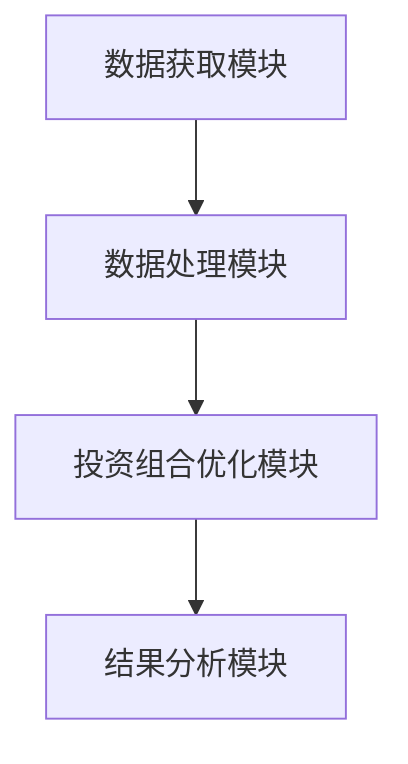

                 


# 约翰伯格的指数投资理论

## 关键词：
- 指数投资
- 约翰·伯格
- 资本资产定价模型（CAPM）
- 现代投资组合理论（MPT）
- 投资组合优化

## 摘要：
本文深入探讨了约翰·伯格的指数投资理论，从理论基础到实际应用，详细分析了指数投资的核心概念、算法原理、系统架构以及项目实战。通过结合数学模型、算法流程图和系统架构图，本文为读者提供了全面的理解和实践指南。

---

## 第二部分：指数投资的理论基础

### 第2章：有效市场假说与指数投资

#### 2.1 有效市场假说的介绍

##### 2.1.1 有效市场假说的定义
有效市场假说（Efficient Market Hypothesis, EMH）是金融学中的一个核心理论，认为在有效市场中，证券的价格反映了所有可获得的信息。市场参与者无法通过分析历史价格数据来获得超额收益。

##### 2.1.2 有效市场假说的分类
有效市场假说可以分为以下三种类型：
1. **弱有效市场**：价格已经反映了历史价格信息。
2. **半强有效市场**：价格反映了所有公开可用的信息。
3. **强有效市场**：价格反映了所有信息，包括内部信息。

##### 2.1.3 有效市场假说与指数投资的关系
指数投资基于有效市场假说，认为市场是半强有效的，因此通过被动投资指数基金可以获得市场的平均收益，而不需要试图通过主动管理获得超额收益。

---

#### 2.2 资本资产定价模型（CAPM）

##### 2.2.1 CAPM的定义与公式
资本资产定价模型（CAPM）是金融学中用于确定资产合理预期收益的模型。其公式为：
$$ E(R_i) = R_f + \beta_i (E(R_m) - R_f) $$
其中：
- $E(R_i)$：资产$i$的预期收益率
- $R_f$：无风险利率
- $\beta_i$：资产$i$的贝塔系数
- $E(R_m)$：市场预期收益率

##### 2.2.2 CAPM的应用与局限性
- **应用**：用于评估资产的合理预期收益，指导投资组合的构建。
- **局限性**：假设市场是有效的，且所有资产都可以通过贝塔系数进行风险调整，这在实际中可能不成立。

##### 2.2.3 CAPM与指数投资的结合
指数基金通过跟踪市场指数，如标普500指数，可以近似实现CAPM中的市场预期收益率，从而为投资者提供市场平均收益。

---

### 第3章：指数投资的核心理论

#### 3.1 现代投资组合理论（MPT）

##### 3.1.1 MPT的定义与核心思想
现代投资组合理论（MPT）由哈里·马科维茨提出，认为通过合理配置资产可以实现风险最小化，同时获得预期收益。

##### 3.1.2 MPT在指数投资中的应用
指数投资通过构建广泛分散的投资组合，实现MPT的核心思想，即通过多样化降低非系统性风险。

##### 3.1.3 MPT的优缺点分析
- **优点**：通过分散化降低风险，提高收益。
- **缺点**：假设市场是有效的，且投资者是理性的，这在现实中可能不成立。

#### 3.2 指数基金的构建方法

##### 3.2.1 指数基金的构建步骤
1. **确定指数**：选择一个代表性强的指数，如标普500。
2. **权重分配**：根据指数的成分股及其权重进行配置。
3. **风险调整**：通过权重调整降低风险。

##### 3.2.2 指数基金的权重分配
- **市值加权**：根据成分股的市值比例分配权重。
- **等权重分配**：每只股票分配相同的权重。

##### 3.2.3 指数基金的风险调整
通过调整权重和分散投资，降低非系统性风险。

---

## 第三部分：指数投资的算法与数学模型

### 第4章：指数投资的计算方法

#### 4.1 资产配置的数学模型

##### 4.1.1 资产配置的定义与分类
资产配置是将资金分配到不同资产类别中，以实现投资目标。

##### 4.1.2 资产配置的优化模型
优化模型的目标是最大化收益，同时最小化风险。

##### 4.1.3 资产配置的数学公式
$$ w_i = \arg \min_w \{ w^T \Sigma w \} $$
其中：
- $w$：权重向量
- $\Sigma$：协方差矩阵

#### 4.2 指数基金的权重计算

##### 4.2.1 权重计算的方法
- **市值加权**：根据成分股的市值比例计算权重。
- **等权重分配**：每只股票分配相同的权重。

##### 4.2.2 权重计算的步骤
1. 收集成分股的市值数据。
2. 计算每只股票的市值占比。
3. 根据市值占比分配权重。

##### 4.2.3 权重计算的案例分析
假设指数包含3只股票，市值分别为100、200、300，总市值为600。权重分别为$100/600=0.167$，$200/600=0.333$，$300/600=0.5$。

---

### 第5章：指数投资的风险管理

#### 5.1 风险调整的数学模型

##### 5.1.1 风险调整的定义与分类
风险调整是指在投资组合中调整资产权重，以降低风险。

##### 5.1.2 风险调整的数学公式
$$ w^* = \arg \min_w \{ w^T \Sigma w \} $$
其中：
- $w$：权重向量
- $\Sigma$：协方差矩阵

#### 5.2 风险控制的策略

##### 5.2.1 风险控制的定义与分类
风险控制是通过调整投资组合来降低风险。

##### 5.2.2 风险控制的策略选择
- **分散投资**：通过投资多样化降低风险。
- **调整权重**：通过调整资产权重降低风险。

##### 5.2.3 风险控制的实施步骤
1. 评估投资组合的风险。
2. 调整资产权重。
3. 重新评估风险。

---

## 第四部分：指数投资的系统架构与实现

### 第6章：指数投资系统的构建

#### 6.1 系统架构设计

##### 6.1.1 系统架构的定义与分类
系统架构是系统设计的核心，用于指导系统的实现。

##### 6.1.2 系统架构的设计原则
- **模块化**：系统分为多个模块，每个模块负责特定功能。
- **可扩展性**：系统应易于扩展。

##### 6.1.3 系统架构的实现步骤
1. 确定系统目标。
2. 设计系统模块。
3. 实现模块功能。

#### 6.2 数据收集与

---

### 第7章：指数投资的项目实战

#### 7.1 环境安装

##### 7.1.1 环境配置
安装Python和必要的库，如pandas、numpy。

##### 7.1.2 数据获取
从Yahoo Finance获取指数数据。

#### 7.2 核心实现

##### 7.2.1 数据处理
清洗数据，计算收益和风险。

##### 7.2.2 投资策略制定
根据指数数据构建投资组合。

##### 7.2.3 结果分析
评估投资组合的收益和风险。

#### 7.3 实际案例分析

##### 7.3.1 案例背景
选择标普500指数作为投资标的。

##### 7.3.2 数据处理
清洗和预处理指数数据。

##### 7.3.3 投资组合优化
根据CAPM和MPT构建优化的投资组合。

#### 7.4 代码实现

##### 7.4.1 数据获取与清洗
```python
import pandas as pd
import numpy as np

# 获取标普500指数数据
data = pd.read_csv('sp500.csv')
data = data.dropna()
```

##### 7.4.2 投资组合优化
```python
# 计算协方差矩阵
cov_matrix = data.cov()

# 优化模型
def optimize_portfolio(weights):
    return weights.T @ cov_matrix @ weights

# 使用随机搜索优化
from scipy.optimize import minimize

result = minimize(optimize_portfolio, x0=np.array([1/3, 1/3, 1/3]), 
                 method='SLSQP')
```

---

### 第8章：指数投资的系统架构与实现

#### 8.1 系统架构设计

##### 8.1.1 系统功能设计
- 数据获取模块
- 数据处理模块
- 投资组合优化模块
- 结果分析模块

##### 8.1.2 系统架构图


#### 8.2 接口设计

##### 8.2.1 接口定义
- 数据获取接口：获取指数数据。
- 数据处理接口：清洗数据。
- 投资组合优化接口：优化投资组合。

---

### 第9章：指数投资的最佳实践

#### 9.1 小结
指数投资是一种有效的投资策略，通过被动投资获得市场平均收益。

#### 9.2 注意事项
- 选择合适的指数
- 定期再平衡投资组合
- 注意市场波动

#### 9.3 拓展阅读
建议阅读约翰·伯格的《投资最重要的事情》。

---

## 总结
本文从理论到实践，详细讲解了约翰·伯格的指数投资理论，为投资者提供了全面的指导和实践方案。通过结合数学模型和实际案例，本文帮助读者理解指数投资的核心思想，并能够在实际中应用这些理论。

