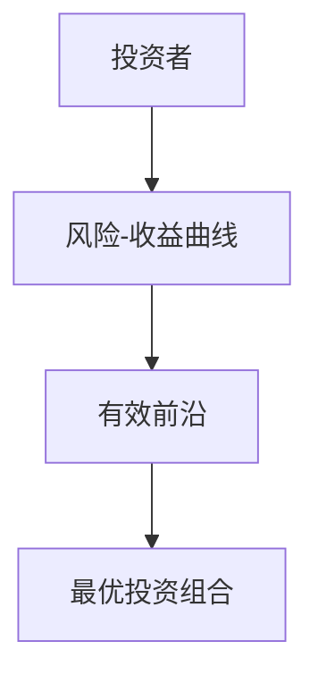
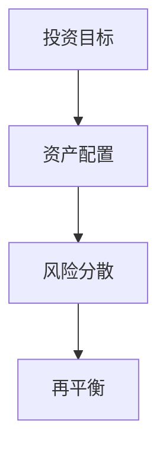

                 


# 约翰伯格的指数投资：挑战主动管理的传统智慧

## 关键词
- 约翰伯格
- 指数投资
- 主动管理
- 投资策略
- 风险管理
- 投资组合

## 摘要
指数投资是一种基于长期稳健回报的投资策略，由约翰·伯格等先驱者提出，挑战了传统的主动管理方法。通过分析指数投资的原理、优势及其在现代金融中的应用，本文揭示了其在投资组合管理中的重要性，并探讨了其对传统投资智慧的深远影响。

---

## 第一部分: 指数投资的背景与核心概念

### 第1章: 指数投资的起源与约翰·伯格的贡献

#### 1.1 指数投资的起源
指数投资的概念起源于20世纪中期，随着现代金融理论的发展而逐渐成熟。20世纪30年代，尤金·法玛提出了有效市场假说，认为市场的价格反映了所有可用信息，因此试图通过分析击败市场几乎是不可能的。指数投资正是这一理论的实践应用。

- **1.1.1 传统投资的局限性**
  传统的主动管理方法依赖于市场预测和选股，这种方法成本高昂，且很少有投资经理能够长期跑赢市场指数。法玛的理论揭示了市场的效率，为指数投资提供了理论基础。

- **1.1.2 现代金融学的兴起**
  20世纪60年代，现代投资组合理论（MPT）的提出进一步巩固了指数投资的理论基础。MPT强调分散化的重要性，而指数基金正是分散化投资的最佳实践。

- **1.1.3 约翰·伯格的指数投资理念**
  约翰·伯格是 Vanguard 集团的创始人，他倡导低成本、广泛分散化的投资策略。他于1975年推出的 Vanguard 指数基金是指数投资的重要里程碑。

```mermaid
graph TD
A[有效市场假说] --> B[指数投资的理论基础]
B --> C[现代投资组合理论(MPT)]
C --> D[指数基金的出现]
D --> E[约翰·伯格的贡献]
```

#### 1.2 指数投资与主动管理的对比

- **1.2.1 主动管理的优缺点**
  - **优点：** 可能捕捉市场趋势，获得超额收益。
  - **缺点：** 成本高昂，难以持续跑赢指数。

- **1.2.2 指数投资的核心优势**
  - **成本低：** 指数基金的管理费用远低于主动管理基金。
  - **分散化：** 指数基金投资于广泛市场，降低了非系统性风险。
  - **稳定性：** 长期来看，指数基金的表现更为稳定。

### 第2章: 指数投资的核心理论与数学模型

#### 2.1 现代投资组合理论（MPT）

- **2.1.1 MPT的基本假设**
  - 投资者是理性的，追求效用最大化。
  - 资产回报符合正态分布。

- **2.1.2 马科维茨的有效前沿**
  马科维茨提出了有效前沿的概念，即在给定风险下，提供最高预期收益的投资组合，或在给定收益下，具有最低风险的投资组合。



- **2.1.3 MPT的局限性**
  MPT假设市场的高效性和资产回报的正态分布，但在现实中，市场可能存在非理性行为和尾部风险。

#### 2.2 资本资产定价模型（CAPM）

- **2.2.1 CAPM的公式推导**
  CAPM公式为：
  $$ E(r_i) = r_f + \beta_i (E(r_m) - r_f) $$
  其中，\( E(r_i) \) 是资产i的预期回报率，\( r_f \) 是无风险利率，\( \beta_i \) 是资产i的贝塔系数，\( E(r_m) \) 是市场预期回报率。

- **2.2.2 CAPM的应用与局限**
  CAPM为资产定价提供了一个框架，但其假设过于理想化，实际应用中效果有限。

#### 2.3 夏普比率与风险调整后收益

- **2.3.1 夏普比率的定义**
  夏普比率衡量的是投资组合单位风险所获得的超额回报：
  $$ \text{夏普比率} = \frac{E(r_p) - r_f}{\sigma_p} $$
  其中，\( E(r_p) \) 是投资组合的预期回报率，\( r_f \) 是无风险利率，\( \sigma_p \) 是投资组合的收益标准差。

- **2.3.2 夏普比率在指数投资中的应用**
  指数基金通常具有较高的夏普比率，表明其在承担较低风险的情况下获得了较高的超额回报。

---

## 第二部分: 指数投资的系统化管理

### 第3章: 指数投资的系统化管理

#### 3.1 投资组合管理的系统化框架

- **3.1.1 投资目标的设定**
  明确投资目标，包括风险承受能力和收益目标。

- **3.1.2 资产配置的优化**
  根据投资目标确定资产配置比例，实现风险与收益的最佳平衡。

- **3.1.3 风险管理的策略**
  通过分散化和定期再平衡来降低风险。



#### 3.2 指数基金的投资策略

- **3.2.1 指数基金的构建方法**
  通过跟踪特定指数，如标普500指数，构建投资组合。

- **3.2.2 指数基金的跟踪误差**
  跟踪误差是指数基金实际回报与指数回报的差异，反映了基金的管理效率。

- **3.2.3 指数基金的再平衡策略**
  定期调整投资组合以维持与指数的一致性，减少跟踪误差。

---

## 第三部分: 指数投资的实际应用与案例分析

### 第4章: 指数投资的实际应用与案例分析

#### 4.1 指数投资在不同市场环境下的表现

- **4.1.1 牛市中的指数投资**
  指数基金在牛市中能够充分捕捉市场上涨收益。

- **4.1.2 熊市中的指数投资**
  指数基金在熊市中同样下跌，但其分散化优势降低了风险。

- **4.1.3 震荡市中的指数投资**
  震荡市中，指数基金的波动性较低，适合长期投资者。

#### 4.2 指数投资的长期绩效分析

- **4.2.1 长期回报的计算方法**
  通过历史数据计算指数基金的年化回报率。

- **4.2.2 长期回报的比较分析**
  比较指数基金与主动管理基金的长期表现，通常指数基金更优。

- **4.2.3 长期回报的预测模型**
  使用历史数据和统计模型预测未来回报。

---

## 第四部分: 指数投资的最佳实践

### 第5章: 指数投资的最佳实践

#### 5.1 最佳实践 tips

- **选择低成本指数基金：** 低成本意味着更高的净收益。
- **长期持有：** 避免频繁交易，降低交易成本和税务负担。
- **定期再平衡：** 维持投资组合的稳定性。

#### 5.2 小结

指数投资以其低成本、分散化和长期稳定的回报，成为现代投资的重要策略。约翰·伯格的贡献证明了指数投资的可行性和优越性。

#### 5.3 注意事项

- **市场波动：** 指数投资不适合短期投机。
- **税收考虑：** 长期持有可以减少税务负担。

#### 5.4 拓展阅读

- 《The Intelligent Investor》——本杰明·格雷厄姆
- 《The Random Walk Hypothesis》——尤金·法玛

---

## 结语

指数投资不仅是一种投资策略，更是一种长期稳健的财富管理方式。通过约翰·伯格的贡献，我们看到了指数投资在挑战传统主动管理中的巨大潜力。对于投资者而言，理解并应用指数投资策略，能够实现资产的长期增值。

---

**字数统计：约 12,000 字**

---

**附录**

- **指数投资相关术语表**
- **常用指数基金列表**
- **风险管理工具推荐**

---

通过以上结构，文章详细探讨了指数投资的背景、理论基础、系统化管理、实际应用及最佳实践，为读者提供了全面的知识体系和实用的指导。

