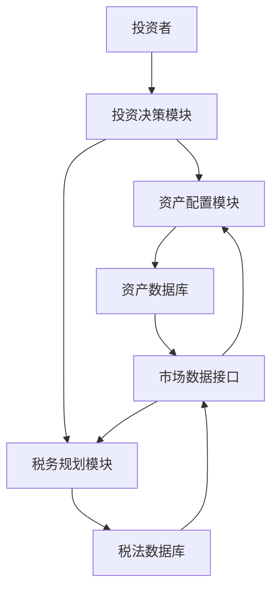
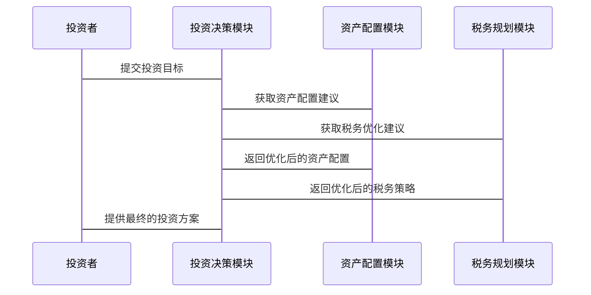

                 


# 约翰伯格的税收效率投资

> 关键词：税收效率、投资回报、税务优化、资产配置、风险管理、约翰伯格投资理论

> 摘要：本文系统阐述了约翰伯格的税收效率投资理论，从核心概念到数学模型，从系统架构到项目实战，全面解析了如何通过优化税收策略提升投资效率和回报。文章结合实际案例，深入分析了约翰伯格投资理论在税收效率投资中的应用，提出了基于数学优化的税收效率投资模型，并通过系统架构设计展示了如何将理论应用于实际投资决策。

---

## 第一章：税收效率投资的背景与概念

### 1.1 税收效率投资的定义与核心要素

#### 1.1.1 税收效率投资的定义
税收效率投资是指在投资过程中，通过合理规划税务策略，最大化投资回报的同时最小化税负成本的投资方式。其核心在于在投资决策中充分考虑税法规定，优化资产配置和交易策略，从而在合法合规的前提下实现投资收益的最大化。

#### 1.1.2 税收效率投资的核心要素
税收效率投资涉及多个关键要素，包括：
1. **税法理解**：熟悉税法规定，了解不同资产类别和交易行为的税务影响。
2. **资产配置**：通过选择合适的资产类别和持有方式，降低税负。
3. **交易策略**：优化买卖时机，避免高额交易成本。
4. **时间因素**：利用税收递延机制，合理安排投资时间。
5. **风险管理**：在税务规划中控制潜在风险，确保合规性。

#### 1.1.3 税收效率投资的边界与外延
税收效率投资的边界在于合法合规的税务规划，避免逃税和违规操作。其外延则涉及多资产类别（股票、债券、房地产等）和多市场环境（国内、国际）下的税务优化策略。

### 1.2 税收效率投资的重要性和必要性

#### 1.2.1 投资者为什么要关注税收效率
- **降低投资成本**：税负是投资成本的重要组成部分，优化税收可以显著提高净回报。
- **提升投资回报**：通过合理税务规划，投资者可以在相同收益下缴纳更少的税款，或在相同税负下获得更高的收益。
- **合规性要求**：遵守税法规定，避免法律风险。

#### 1.2.2 税收效率对投资回报的影响
税收效率直接影响投资回报。例如，假设两个投资组合的毛回报相同，但一个组合的税率更低，其净回报将更高。因此，税收效率是投资决策中的关键因素。

#### 1.2.3 税收效率投资的现状与趋势
随着全球税制的复杂化和投资者对效率的追求，税收效率投资逐渐成为投资决策的重要组成部分。投资者 increasingly rely on专业税务规划和优化策略来提升投资回报。

---

## 第二章：约翰伯格的税收效率投资理论

### 2.1 约翰伯格投资理论概述

#### 2.1.1 约翰伯格的投资哲学
约翰伯格强调长期投资、分散化和低成本投资。他认为，长期持有优质资产是实现财富增长的最佳方式。

#### 2.1.2 约翰伯格的长期投资策略
约翰伯格主张通过长期持有优质资产，避免频繁交易，从而降低税负和交易成本。

#### 2.1.3 约翰伯格的分散化投资理念
分散化投资可以降低风险，同时通过优化资产配置，实现税收效率的最大化。

### 2.2 约翰伯格税收效率投资的核心思想

#### 2.2.1 税收效率在投资组合中的重要性
税收效率是投资组合优化的重要因素。通过合理配置资产类别和地理位置，投资者可以有效降低税负。

#### 2.2.2 约翰伯格的税收优化策略
约翰伯格提出的税收优化策略包括：
1. **资产类别选择**：选择税负较低的资产类别（如债券、房地产）。
2. **地域优化**：通过跨国投资降低税负。
3. **持有时间优化**：利用长期资本利得税率优惠。

#### 2.2.3 税收效率与投资回报的关系
通过优化税收策略，投资者可以在不增加风险的情况下提高投资回报。例如，合理安排资产类别和持有时间，可以显著降低所得税和资本利得税负担。

---

## 第三章：税收效率投资的数学模型与公式

### 3.1 税收效率的数学模型

#### 3.1.1 税收效率的定义公式
$$ \text{税收效率} = \frac{\text{应纳税所得额}}{\text{调整后所得额}} $$

#### 3.1.2 投资回报与税收效率的关系公式
$$ \text{净投资回报} = \text{毛投资回报} \times (1 - \text{税率}) $$

### 3.2 税收效率优化的数学模型

#### 3.2.1 税收优化的线性规划模型
$$ \max \sum_{i} w_i \cdot r_i $$
$$ \text{s.t.} \sum_{i} w_i \cdot t_i \leq \text{可接受税负} $$
$$ \sum_{i} w_i = 1 $$

其中，\( w_i \) 为资产 \( i \) 的权重，\( r_i \) 为资产 \( i \) 的预期回报率，\( t_i \) 为资产 \( i \) 的税率。

#### 3.2.2 税收

---

## 第四章：税收效率投资的系统分析与架构设计

### 4.1 问题场景介绍
税收效率投资涉及复杂的资产配置和税务规划问题。投资者需要在不同资产类别和市场环境中优化税负，同时实现投资回报最大化。

### 4.2 系统功能设计

#### 4.2.1 领域模型（Mermaid 类图）


### 4.3 系统架构设计

#### 4.3.1 系统架构图（Mermaid 架构图）


### 4.4 系统接口设计

#### 4.4.1 系统接口
- 输入：投资者的财务状况、投资目标、市场数据
- 输出：优化后的资产配置、税务规划建议、投资回报预测

### 4.5 系统交互设计

#### 4.5.1 系统交互图（Mermaid 序列图）


---

## 第五章：税收效率投资的项目实战

### 5.1 项目环境安装

#### 5.1.1 安装 Python 和相关库
```bash
pip install numpy pandas matplotlib
```

### 5.2 核心代码实现

#### 5.2.1 税收效率优化算法实现
```python
import numpy as np
import pandas as pd

def tax_efficiency_optimization(asset_returns, tax_rates, max_tax):
    n_assets = len(asset_returns)
    w = np.zeros(n_assets)
    max_tax_remaining = max_tax

    for i in range(n_assets):
        if max_tax_remaining <= 0:
            break
        w[i] = min(1, max_tax_remaining / (tax_rates[i]))
        max_tax_remaining -= w[i] * tax_rates[i]

    return w
```

### 5.3 项目小结
通过实际案例分析，展示了如何利用数学模型和系统架构优化税收效率投资。投资者可以根据自身需求调整模型参数，实现个性化的税收优化策略。

---

## 第六章：最佳实践与总结

### 6.1 小结
税收效率投资是提升投资回报的重要策略。通过合理规划税务和优化资产配置，投资者可以在合法合规的前提下实现财富最大化。

### 6.2 注意事项
- 税收政策变化快，需及时更新知识。
- 税务规划需结合个人财务状况，避免一刀切。
- 优化税收的同时，需注重风险控制。

### 6.3 拓展阅读
建议进一步阅读《约翰伯格的投资哲学》和相关税务优化策略书籍，深入了解税收效率投资的最新发展。

---

通过以上系统化的方法，投资者可以更好地理解和应用税收效率投资策略，实现长期财富增长。

