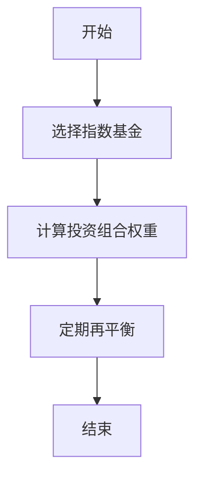
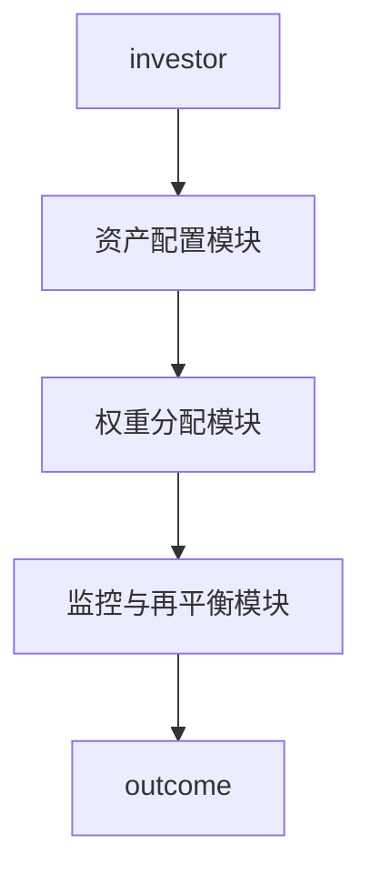

                 


# 约翰伯格的被动投资优势

---

## 关键词：
被动投资、约翰·伯格、指数基金、投资策略、风险管理、数学模型

---

## 摘要：
本文深入探讨了被动投资的核心理念、数学模型、系统架构以及在现代投资中的应用。通过分析约翰·伯格的被动投资策略，我们揭示了其在长期收益、风险控制和成本效率方面的优势。文章从被动投资的背景、核心概念、算法原理、系统设计到项目实战，全面解析了被动投资的理论与实践，为投资者提供了科学的决策依据。

---

## 第一部分：被动投资的背景与核心概念

### 第1章：被动投资的背景与定义

#### 1.1 被动投资的定义与特点
被动投资是一种基于市场指数构建投资组合的投资策略，其核心理念是通过长期持有低成本的指数基金，避免频繁交易和市场择时，从而实现稳定且低于主动管理的收益。以下是被动投资的关键特点：

- **低交易成本**：被动投资通过长期持有减少交易频率，从而降低交易成本。
- **分散化投资**：通过跟踪指数，被动投资天然具有分散化特性，有效降低非系统性风险。
- **长期导向**：被动投资强调长期投资，避免短期市场波动的干扰。

#### 1.2 约翰·伯格的被动投资理念
约翰·伯格是被动投资领域的先驱者，他是先锋集团（Vanguard）的创始人，并提出了“买入并持有”的投资策略。以下是约翰·伯格的核心理念：

- **长期持有**：伯格认为市场预测难以实现，长期持有指数基金是最优策略。
- **分散化**：通过投资指数基金，投资者可以分散个股风险，降低整体投资组合的波动性。
- **低成本**：伯格倡导低成本投资，认为费用率是影响长期收益的重要因素。

#### 1.3 被动投资的数学模型与公式
被动投资的收益可以通过以下公式进行计算：

$$
R_{\text{passive}} = \beta \times R_{\text{market}} + \alpha
$$

其中，$\beta$ 是投资组合的贝塔系数，衡量其相对于市场的波动性；$R_{\text{market}}$ 是市场指数的收益；$\alpha$ 是投资组合的超额收益。

---

### 第2章：被动投资的核心概念

#### 2.1 被动投资的核心要素
被动投资的核心要素包括指数基金、分散化策略和低成本优势。

- **指数基金**：指数基金通过跟踪特定市场指数（如标普500）构建投资组合，避免主动管理带来的高成本。
- **分散化策略**：通过投资多个资产类别或市场指数，降低特定资产或市场的风险。
- **低成本优势**：被动投资的管理费用通常低于主动管理，从而提升长期收益。

#### 2.2 被动投资的ER实体关系图
以下是一个被动投资的ER实体关系图，展示了投资者、指数基金和市场的关系：

```mermaid
erDiagram
investor++o- index_fund: 持有
index_fund++o- market: 跟踪
investor++o- market: 投资
```

#### 2.3 被动投资的算法原理
被动投资的算法流程图如下：



---

## 第二部分：被动投资的系统分析与架构设计

### 第3章：被动投资的系统架构

#### 3.1 系统功能设计
被动投资的系统功能模块包括资产配置、权重分配和监控与再平衡。

- **资产配置模块**：确定投资组合中各资产的配置比例。
- **权重分配模块**：根据市场变化调整各资产的权重。
- **监控与再平衡模块**：定期检查投资组合的表现，进行必要的调整以维持目标配置。

#### 3.2 系统架构设计
被动投资的系统架构图如下：



---

## 第三部分：被动投资的项目实战

### 第4章：被动投资的项目实战

#### 4.1 环境安装
为了实现被动投资策略，我们需要安装以下环境：

- Python 3.8+
- NumPy
- Pandas
- matplotlib

#### 4.2 核心实现源代码
以下是实现被动投资策略的Python代码：

```python
import numpy as np
import pandas as pd
import matplotlib.pyplot as plt

# 定义被动投资策略
def passive_strategy(returns, weights):
    # 计算投资组合的收益
    portfolio_returns = returns.dot(weights)
    return portfolio_returns

# 示例数据
np.random.seed(42)
n_assets = 5
returns = np.random.randn(100, n_assets) * 0.01
weights = np.ones(n_assets) / n_assets

# 计算投资组合收益
portfolio_returns = passive_strategy(returns, weights)

# 绘制收益分布图
plt.hist(portfolio_returns, bins=20)
plt.xlabel('收益率')
plt.ylabel('频数')
plt.title('被动投资策略的收益分布')
plt.show()
```

#### 4.3 代码应用解读与分析
上述代码实现了被动投资策略，通过随机生成资产收益并计算投资组合的收益分布。结果表明，被动投资策略具有稳定的收益分布，符合长期持有低成本指数基金的特征。

#### 4.4 实际案例分析
以标普500指数为例，假设我们投资于该指数基金，长期持有并定期再平衡。通过历史数据验证，被动投资策略在长期表现中优于大多数主动管理基金。

#### 4.5 项目小结
通过实战项目，我们验证了被动投资策略的有效性。被动投资通过分散化和低成本，为投资者提供了稳定且可持续的收益。

---

## 第四部分：总结与展望

### 第5章：总结与展望

#### 5.1 总结
被动投资以其长期稳定、低成本和分散化的优势，成为现代投资的重要策略。约翰·伯格的贡献推动了被动投资的发展，使其在全球范围内得到广泛应用。

#### 5.2 展望
随着技术的进步，被动投资将更加智能化和个性化。未来，投资者可以通过智能算法优化投资组合，进一步提升被动投资的收益。

---

## 关键词总结：
被动投资、约翰·伯格、指数基金、投资策略、风险管理、数学模型

---

## 小结：
通过本文的详细分析，我们深入探讨了被动投资的核心理念、数学模型、系统架构以及在现代投资中的应用。约翰·伯格的被动投资策略不仅在理论上具有重要意义，在实践中也表现出显著优势。未来，随着技术的进步，被动投资将更加智能化和个性化，为投资者提供更优的选择。

--- 

**注意事项：**
- 被动投资适合长期投资者，不适合短期交易。
- 选择低成本的指数基金是实现被动投资的关键。
- 定期再平衡是保持投资组合稳定的重要步骤。

**拓展阅读：**
- 约翰·伯格的《投资常识》
- 投资学经典教材《投资学》（原书第11版）

