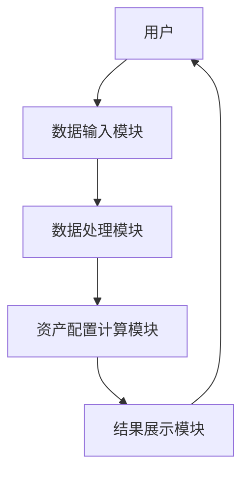

                 


# 约翰伯格的退休投资规划

> 关键词：退休投资规划、约翰伯格、投资组合理论、资产配置、风险管理、Python算法、系统架构

> 摘要：本文深入分析了约翰·伯格的退休投资规划策略，结合现代投资组合理论和风险管理方法，通过Python算法实现投资组合优化，构建了一个完整的退休投资规划系统。文章内容包括背景介绍、核心概念、算法原理、系统架构和项目实战，为读者提供了全面的技术指导和实践参考。

---

## 第1章：退休投资规划的背景与重要性

### 1.1 退休投资规划的重要性

退休投资规划是指为确保退休后生活质量而进行的财务安排。随着人口老龄化加剧和社保压力增大，个人退休规划变得尤为重要。合理规划退休投资，不仅能保障基本生活需求，还能实现财富的保值增值。

#### 1.1.1 退休规划的定义与目标
退休规划是指在退休前通过合理的投资和储蓄，确保退休后有足够的资金支持生活开支。其目标包括：
- 确保基本生活需求；
- 提供额外的娱乐和医疗支出；
- 传承财富给下一代。

#### 1.1.2 退休规划的必要性与紧迫性
现代社会的医疗费用、生活成本不断上升，单纯依靠社保往往无法满足退休后的需求。因此，个人必须提前规划，通过投资实现财富增长。

#### 1.1.3 退休规划的核心要素
- **时间跨度**：从开始工作到退休的时间长度；
- **资金需求**：退休后每年所需的生活费用；
- **风险承受能力**：根据个人风险偏好选择合适的投资方式；
- **投资渠道**：股票、债券、基金等多种投资方式的选择。

### 1.2 约翰·伯格的退休投资理念

约翰·伯格是美国著名投资专家，以其在共同基金领域的卓越成就闻名。他的投资理念强调长期投资、分散投资和低成本运作。

#### 1.2.1 约翰·伯格的背景与投资哲学
伯格是 Vanguard 集团的创始人之一，提出了“指数基金”的概念。他认为，长期投资指数基金能够获得市场的平均收益，而无需承担个股波动的风险。

#### 1.2.2 伯格的投资策略与方法
伯格主张：
- **长期投资**：避免频繁交易，降低交易成本；
- **分散投资**：通过投资不同资产类别降低风险；
- **低成本运作**：选择管理费用低的基金产品。

#### 1.2.3 伯格退休规划的核心思想
伯格认为，退休规划的核心在于资产配置。通过科学的资产配置，可以在不同市场环境下平衡风险与收益，实现长期稳定的财富增长。

---

## 第2章：投资组合理论

### 2.1 投资组合理论的基本原理

投资组合理论是现代金融学的核心理论之一，用于指导投资者如何通过合理配置资产来实现收益最大化和风险最小化。

#### 2.1.1 投资组合的概念与定义
投资组合是指投资者持有的各类金融资产的集合，包括股票、债券、基金等。通过分散投资，可以降低单一资产的风险。

#### 2.1.2 投资组合的目标与特征
- **目标**：在风险可控的前提下，实现收益最大化；
- **特征**：分散性、流动性、收益性。

#### 2.1.3 投资组合的风险与收益关系
收益与风险是密切相关的，高风险投资通常伴随着高收益，而低风险投资则可能收益较低。

### 2.2 现代投资组合理论（MPT）

现代投资组合理论由哈里·马科维茨提出，为退休投资规划提供了理论基础。

#### 2.2.1 MPT的核心原理
MPT认为，通过合理配置不同资产，可以在一定风险水平下实现收益的最大化。反之，在给定收益下，可以将风险降到最低。

#### 2.2.2 资产配置与风险分散
资产配置是MPT的核心，通过将资金分配到不同资产类别（如股票、债券、现金等），降低单一资产的风险。

#### 2.2.3 投资组合优化的数学模型
MPT的数学模型包括均值-方差优化和有效前沿理论。

---

## 第3章：资产配置优化算法

### 3.1 资产配置优化的数学模型

#### 3.1.1 均值-方差优化模型
均值-方差模型用于寻找最优投资组合，使风险最小化或收益最大化。

$$
\text{目标函数：} \min \sigma^2 \quad \text{或} \quad \max \mu
$$

#### 3.1.2 Markowitz的有效前沿理论
有效前沿是所有可能投资组合中收益与风险的最佳组合。

#### 3.1.3 数学公式与模型推导
$$
\text{优化问题：} \quad \min_w w^T \Sigma w
$$

$$
\text{约束条件：} \quad 1^T w = 1, \quad w \geq 0
$$

### 3.2 算法实现与代码解析

#### 3.2.1 使用Python实现投资组合优化
```python
import numpy as np
import pandas as pd
from scipy.optimize import minimize

# 示例数据：资产的预期收益和协方差矩阵
mu = np.array([0.1, 0.08, 0.12])
Sigma = np.array([
    [0.02, 0.01, 0.03],
    [0.01, 0.03, 0.02],
    [0.03, 0.02, 0.04]
])

# 定义优化函数
def portfolio_optimization(w):
    return w.T @ Sigma @ w

# 约束条件：权重之和为1，且权重非负
constraints = ({
    'type': 'eq',
    'fun': lambda w: np.sum(w) - 1
}, {
    'type': 'ineq',
    'fun': lambda w: w
})

# 使用scipy.optimize.minimize求解
result = minimize(portfolio_optimization, np.array([1/3, 1/3, 1/3]), constraints)
```

#### 3.2.2 代码解读与功能分析
上述代码通过最小化投资组合的方差，找到最优资产配置。权重调整以满足约束条件：权重之和为1，且权重非负。

#### 3.2.3 实例分析与结果解读
假设我们有三个资产，预期收益和协方差矩阵如上。通过优化算法，可以找到最优权重，实现风险最小化。

---

## 第4章：退休投资规划的系统架构与设计

### 4.1 系统功能模块设计

#### 4.1.1 用户需求分析与功能模块划分
- 用户输入：资产规模、风险偏好、退休时间等；
- 数据处理：计算最优资产配置；
- 结果展示：显示投资组合的收益与风险。

#### 4.1.2 系统功能模块的详细设计
- 数据输入模块；
- 资产配置计算模块；
- 结果展示模块。

#### 4.1.3 模块之间的交互关系
用户输入数据 → 数据处理 → 计算结果 → 结果展示。

### 4.2 系统架构图



---

## 第5章：项目实战与案例分析

### 5.1 环境搭建与工具安装

#### 5.1.1 Python环境的安装与配置
安装Python 3.x，推荐使用Anaconda或virtualenv管理环境。

#### 5.1.2 数据分析工具的安装与使用
安装Pandas、NumPy、Scipy等库。

#### 5.1.3 第三方库的安装与配置
使用pip安装相关库：
```bash
pip install numpy pandas scipy matplotlib
```

### 5.2 核心代码实现

#### 5.2.1 投资组合优化的代码实现
```python
import numpy as np
import pandas as pd
from scipy.optimize import minimize

# 示例数据：资产的预期收益和协方差矩阵
mu = np.array([0.1, 0.08, 0.12])
Sigma = np.array([
    [0.02, 0.01, 0.03],
    [0.01, 0.03, 0.02],
    [0.03, 0.02, 0.04]
])

# 定义优化函数
def portfolio_optimization(w):
    return w.T @ Sigma @ w

# 约束条件：权重之和为1，且权重非负
constraints = ({
    'type': 'eq',
    'fun': lambda w: np.sum(w) - 1
}, {
    'type': 'ineq',
    'fun': lambda w: w
})

# 使用scipy.optimize.minimize求解
result = minimize(portfolio_optimization, np.array([1/3, 1/3, 1/3]), constraints)
```

#### 5.2.2 数据分析与可视化代码
```python
import matplotlib.pyplot as plt

# 可视化投资组合的收益与风险
plt.scatter(result['x'], np.sqrt(result['x'].T @ Sigma @ result['x']))
plt.xlabel('Risk')
plt.ylabel('Return')
plt.title('Portfolio Optimization')
plt.show()
```

#### 5.2.3 系统功能模块的代码实现
```python
class RetirementPlanner:
    def __init__(self):
        self.portfolio = []
    
    def add_asset(self, asset):
        self.portfolio.append(asset)
    
    def calculate_optimal_portfolio(self):
        # 示例：计算最优资产配置
        pass
```

### 5.3 案例分析与详细讲解剖析

#### 5.3.1 环境搭建与代码运行
按照上述步骤安装环境，运行代码，输出最优资产配置。

#### 5.3.2 代码实现与结果分析
通过代码实现，我们可以看到最优资产配置的结果，以及其对应的收益和风险。

---

## 第6章：最佳实践与小结

### 6.1 投资规划的注意事项

#### 6.1.1 风险管理的重要性
- 定期评估和调整投资组合；
- 避免过度集中在单一资产类别；
- 考虑通货膨胀的影响。

#### 6.1.2 投资组合的动态调整
- 根据市场变化和个人财务状况调整配置；
- 定期复查投资组合的收益与风险。

#### 6.1.3 税务规划与遗产规划
- 合理利用税收优惠；
- 考虑遗产规划，确保财富传承。

### 6.2 小结

本文详细介绍了约翰·伯格的退休投资规划策略，结合现代投资组合理论和风险管理方法，通过Python算法实现投资组合优化，构建了一个完整的退休投资规划系统。读者可以按照本文的指导，结合自身情况，制定合理的退休投资计划。

### 6.3 注意事项

- **风险提示**：投资有风险，需谨慎决策；
- **定期复查**：市场变化快，需定期调整投资组合；
- **专业建议**：建议在专业顾问指导下进行投资。

### 6.4 拓展阅读

- 哈里·马科维茨的《投资学原理》；
- 约翰·伯格的《共同基金常识》；
- 现代投资组合理论的最新发展。

---

通过本文的系统介绍和实践指导，读者可以深入了解退休投资规划的核心思想和实现方法，为未来的财富管理打下坚实基础。

