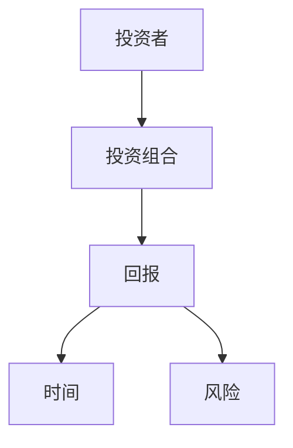
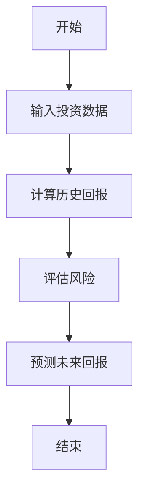
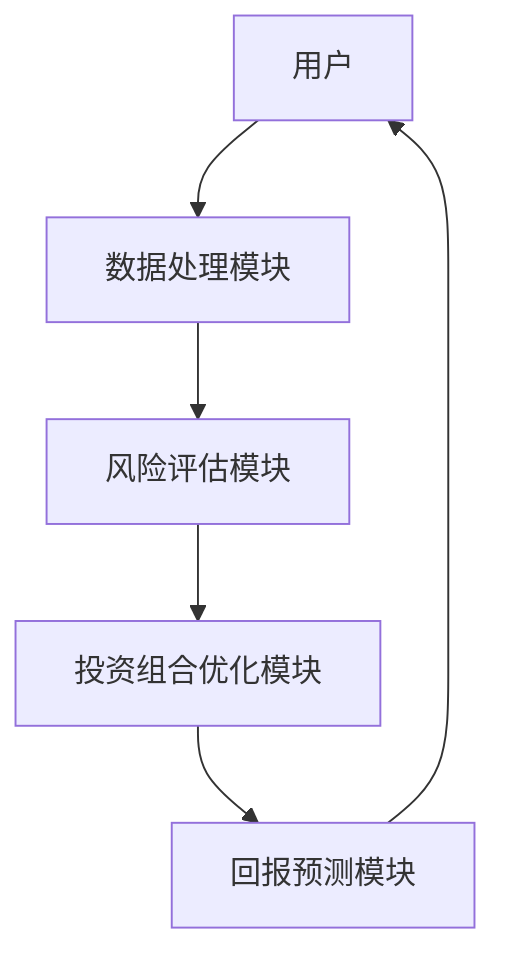

                 


# 《约翰·伯格的长期回报预期》

## 关键词：长期回报预期，投资策略，约翰·伯格，风险管理，回报预测，投资哲学

## 摘要：本文将深入探讨约翰·伯格的长期回报预期理论，分析其在投资决策中的重要性。通过系统化的分析，结合算法原理和实际案例，阐述如何通过长期视角实现稳健的投资回报。文章内容涵盖长期回报预期的核心概念、算法原理、系统架构设计及项目实战，为读者提供全面的视角和实用的指导。

---

# 第1章 长期回报预期的背景与核心概念

## 1.1 长期回报预期的定义与重要性

### 1.1.1 长期回报预期的定义
长期回报预期是指投资者对未来一段时间内投资组合或资产所产生的收益的期望值。与短期回报相比，长期回报预期更关注资产的长期增值能力，而非短期波动。

### 1.1.2 长期回报预期的重要性
- **投资决策的基础**：长期回报预期帮助投资者制定合理的投资策略，避免因短期波动而做出错误决策。
- **风险管理的核心**：通过评估长期回报，投资者可以更好地理解风险与收益的平衡。
- **资产配置的关键**：长期回报预期是资产配置的重要依据，有助于优化投资组合的结构。

### 1.1.3 约翰·伯格与长期回报预期
约翰·伯格是指数基金的倡导者，他强调长期投资的重要性，并认为长期回报预期是实现财富增长的核心。

## 1.2 长期回报预期的核心要素

### 1.2.1 投资组合的构成
- **资产类别**：股票、债券、房地产等。
- **资产权重**：各资产在投资组合中的占比。

### 1.2.2 风险与收益的关系
- **收益**：投资回报的期望值。
- **风险**：投资回报的不确定性，通常用标准差或VaR（Value at Risk）衡量。

### 1.2.3 时间跨度的影响
- **短期回报**：波动较大，受市场情绪影响。
- **长期回报**：受经济基本面影响更大，波动性较小。

## 1.3 本章小结
长期回报预期是投资决策的核心，其计算依赖于资产的构成、权重以及各资产的预期回报和风险。

---

# 第2章 长期回报预期的核心概念与联系

## 2.1 核心概念原理

### 2.1.1 预期回报的计算
$$ E(r) = \sum_{i=1}^{n} w_i r_i $$
其中，\( w_i \) 是资产 \( i \) 的权重，\( r_i \) 是资产 \( i \) 的预期回报率。

### 2.1.2 风险调整的回报模型
$$ r_i = r_f + \beta_i (r_m - r_f) $$
其中，\( r_f \) 是无风险利率，\( r_m \) 是市场平均回报率，\( \beta_i \) 是资产 \( i \) 的贝塔系数。

## 2.2 核心概念属性对比表格

| 概念       | 描述                                                                 | 示例                         |
|------------|----------------------------------------------------------------------|------------------------------|
| 预期回报   | 投资者对未来收益的期望值                                             | 理财产品的年化收益率           |
| 风险       | 投资回报的不确定性                                                   | 标准差、VaR等风险指标         |
| 时间跨度   | 回报的计算周期                                                       | 长期（5年以上）、中期（3-5年）、短期（1年以下） |

## 2.3 ER实体关系图


## 2.4 本章小结
通过对比分析和实体关系图，我们可以清晰地理解长期回报预期的核心概念及其相互联系。

---

# 第3章 长期回报预期的算法原理

## 3.1 算法原理概述

### 3.1.1 预期回报的计算方法
- **历史平均回报法**：基于历史数据计算各资产的平均回报。
- **情景分析法**：通过模拟不同经济环境下的回报，计算期望值。

### 3.1.2 风险调整的回报模型
- **CAPM模型**：计算资产的预期回报，考虑其系统性风险。
- **APT模型**：基于多个因素解释资产回报。

### 3.1.3 时间序列分析方法
- **ARIMA模型**：用于预测资产回报的时间序列。
- **GARCH模型**：用于估计资产回报的波动性。

## 3.2 算法流程图


## 3.3 数学模型与公式

### 3.3.1 预期回报的计算公式
$$ E(r) = \sum_{i=1}^{n} w_i r_i $$

### 3.3.2 风险调整的回报公式
$$ r_i = r_f + \beta_i (r_m - r_f) $$

## 3.4 本章小结
通过算法流程图和数学公式，我们可以清晰地理解长期回报预期的计算过程。

---

# 第4章 长期回报预期的系统架构设计

## 4.1 项目介绍

### 4.1.1 项目目标
构建一个基于长期回报预期的投资决策支持系统。

### 4.1.2 项目范围
- 数据收集与处理
- 风险评估与回报预测
- 投资组合优化

## 4.2 系统功能设计

### 4.2.1 数据收集模块
- 从市场数据源获取历史回报、风险指标等。

### 4.2.2 风险评估模块
- 使用CAPM或APT模型评估资产风险。

### 4.2.3 回报预测模块
- 基于时间序列模型预测未来回报。

### 4.2.4 投资组合优化模块
- 根据长期回报预期优化资产配置。

## 4.3 系统架构设计


## 4.4 本章小结
通过系统架构设计，我们可以清晰地理解如何构建一个基于长期回报预期的投资决策支持系统。

---

# 第5章 长期回报预期的项目实战

## 5.1 环境安装

### 5.1.1 安装Python
```bash
pip install numpy pandas matplotlib
```

### 5.1.2 安装数据分析库
```bash
pip install yfinance pandas_datareader
```

## 5.2 核心实现源代码

### 5.2.1 数据获取与处理
```python
import pandas as pd
import pandas_datareader as pdr

# 获取数据
data = pdr.get_data_yahoo('AAPL', start='2020-01-01', end='2023-12-31')
```

### 5.2.2 计算历史回报
```python
returns = data['Adj Close'].pct_change().dropna()
```

### 5.2.3 风险评估
```python
import numpy as np

def calculate_volatility(returns):
    return np.std(returns) * np.sqrt(252)
```

### 5.2.4 回报预测
```python
from statsmodels.tsa.arima_model import ARIMA

model = ARIMA(returns, order=(1, 1, 0))
model_fit = model.fit()
future_forecast = model_fit.forecast(steps=10)
```

## 5.3 代码解读与分析
- **数据获取**：使用yfinance库获取股票数据。
- **历史回报计算**：使用pct_change()方法计算收益率。
- **风险评估**：计算收益率的标准差，衡量资产的波动性。
- **回报预测**：使用ARIMA模型预测未来10天的回报。

## 5.4 案例分析
以苹果公司（AAPL）为例，使用上述代码计算其历史回报和预测未来回报。

## 5.5 本章小结
通过项目实战，我们可以将理论知识应用到实际投资决策中。

---

# 第6章 长期回报预期的最佳实践

## 6.1 小结
- 长期回报预期是投资决策的核心。
- 通过系统化的分析和算法模型，可以更准确地预测和评估回报。

## 6.2 注意事项
- **数据质量**：确保数据的完整性和准确性。
- **模型选择**：根据实际情况选择合适的模型。
- **风险控制**：定期评估和调整投资组合。

## 6.3 拓展阅读
- 《投资学》（书籍推荐）
- 现代投资组合理论（进一步学习）

---

# 《约翰·伯格的长期回报预期》

通过本文的系统分析和实践案例，我们可以更好地理解约翰·伯格的长期回报预期理论，并将其应用于实际投资决策中。希望本文能为投资者提供有价值的指导和启发。

