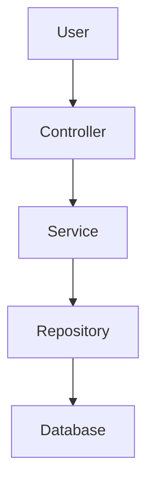
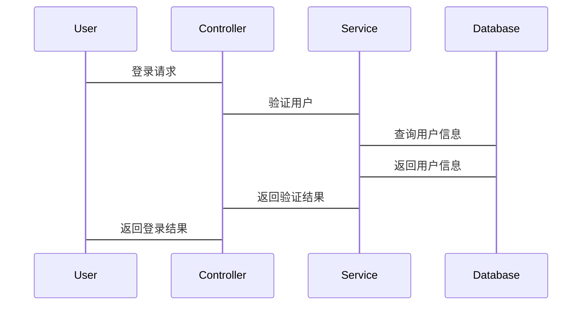

                 

<think>
好的，我现在需要根据用户的要求，详细分析并撰写一篇关于《约翰伯格的长期投资观》的技术博客文章。用户已经提供了一个详细的目录大纲，并要求我按照这个大纲逐步完成文章的各个部分。文章的结构包括背景介绍、核心概念与联系、算法原理讲解、系统分析与架构设计方案、项目实战以及总结部分。

首先，我需要明确每个章节的核心内容，并确保每个部分都详细且符合用户的要求。我会按照目录大纲的结构，逐章进行分析和撰写，确保逻辑清晰、结构紧凑，语言专业且易懂。

### 第一部分：背景介绍

#### 第1章：长期投资的背景与意义

**1.1 投资的基本概念与问题背景**

投资是指将资金投入某个项目或资产，期望在未来获得收益的行为。在现代社会，投资是个人和机构财务管理的重要组成部分。然而，投资过程中存在许多问题，例如市场波动、信息不对称、投资者情绪的影响等，这些问题可能导致投资决策失误，进而影响收益。

长期投资是一种以较长的时间跨度持有投资标的的投资策略。与短期投资相比，长期投资更注重资产的长期增值，而非短期价格波动。这种策略能够帮助投资者规避市场的短期波动风险，同时利用复利效应实现资产的长期增长。

**1.2 约翰·伯格的贡献与影响**

约翰·伯格是 Vanguard 集团的创始人，也是指数基金的先驱。他在投资领域的主要贡献在于推广长期投资理念和普及低成本指数基金。伯格认为，大多数投资者无法通过频繁交易或选择个别股票来战胜市场，而通过长期持有低成本指数基金，投资者可以实现稳定的超额收益。

伯格的投资理念对全球投资领域产生了深远影响。他提出的指数基金策略不仅降低了投资成本，还提高了投资的透明度和效率。此外，伯格的长期投资观强调了纪律性和耐心，这为投资者提供了一种更为稳健的投资方式。

**1.3 长期投资的核心要素**

长期投资的核心要素包括目标设定、风险管理、资产配置和纪律执行。目标设定是投资的起点，投资者需要明确自己的投资目标和风险承受能力。风险管理是确保投资组合在市场波动中保持稳定的重要手段，而资产配置则是实现长期收益的关键策略。纪律执行则要求投资者在市场波动中坚持既定的投资策略，避免情绪化决策。

---

### 第二部分：核心概念与联系

#### 第2章：约翰·伯格的投资哲学

**2.1 价值投资与长期持有**

价值投资是一种以低于内在价值的价格购买优质资产的投资策略。伯格认为，市场波动会导致资产价格偏离其内在价值，而长期持有优质资产能够帮助投资者捕捉到这种偏差，实现超额收益。

长期持有是价值投资的重要组成部分。伯格强调，频繁交易会增加交易成本，降低净收益。因此，长期持有不仅能够减少成本，还能帮助投资者避免因短期波动带来的决策错误。

**2.2 风险管理与分散投资**

风险管理是投资过程中不可忽视的重要环节。伯格认为，投资者应通过分散投资来降低风险。分散投资不仅能够降低特定资产的风险，还能通过资产配置来平衡不同资产类别的波动。

伯格提出的分散投资策略包括投资于多个资产类别和多个资产，以降低投资组合的整体风险。此外，他还认为，通过投资指数基金可以实现有效的分散投资，同时降低管理成本。

**2.3 投资组合优化与成本控制**

投资组合优化是通过科学的配置方法，使投资组合在风险和收益之间达到最佳平衡。伯格认为，投资组合优化的关键在于降低费用和税收成本。低成本指数基金不仅能够降低管理费用，还能提高投资的净收益。

成本控制是伯格投资哲学的重要组成部分。他认为，高昂的管理费用会侵蚀投资收益，而低成本的指数基金能够有效控制费用，从而提高长期投资的回报率。

---

### 第三部分：算法原理讲解

#### 第3章：长期投资的算法与数学模型

**3.1 投资组合优化的数学模型**

投资组合优化的目标是在给定的风险水平下，实现收益的最大化；或者在给定的收益水平下，实现风险的最小化。现代投资组合理论（MPT）提供了优化投资组合的数学框架。

以下是投资组合优化的数学模型：

$$
\text{目标函数：} \quad \text{最大化} \quad \mu_p \quad \text{或最小化} \quad \sigma_p
$$

$$
\text{约束条件：} \quad \sum_{i=1}^n w_i = 1, \quad w_i \geq 0
$$

其中，\( \mu_p \) 是投资组合的期望收益，\( \sigma_p \) 是投资组合的波动率，\( w_i \) 是第 \( i \) 个资产的投资权重。

**3.2 投资策略的算法实现**

以下是基于价值投资的筛选算法：

1. 确定目标资产的内在价值。
2. 选择低于内在价值的资产。
3. 计算投资组合的权重。
4. 定期再平衡投资组合。

以下是投资组合再平衡的算法：

```python
def rebalance_portfolio(current_weights, target_weights, tolerance=0.01):
    # 计算权重差异
    diff = {asset: target - current for asset, target in target_weights.items()}
    
    # 调整权重
    adjusted_weights = {}
    for asset in target_weights:
        adjusted_weights[asset] = current_weights.get(asset, 0) + diff[asset]
    
    # 检查是否满足容忍度
    for asset in target_weights:
        if abs(adjusted_weights[asset] - target_weights[asset]) > tolerance:
            # 需要进一步调整
            adjusted_weights[asset] = target_weights[asset]
    
    return adjusted_weights
```

**3.3 投资组合优化的Python实现**

以下是投资组合优化的Python代码示例：

```python
import numpy as np
import pandas as pd

# 数据准备
returns = pd.DataFrame({
    'Asset1': [0.1, 0.05, 0.08],
    'Asset2': [0.08, 0.12, 0.05],
    'Asset3': [0.06, 0.09, 0.11]
})

# 计算协方差矩阵
cov_matrix = returns.cov()

# 定义目标函数
def portfolio_return(weights):
    return np.dot(weights, returns.mean())

# 定义约束条件
def portfolio_risk(weights):
    return np.sqrt(np.dot(weights.T, np.dot(cov_matrix, weights)))

# 优化问题
from scipy.optimize import minimize

# 初始权重
initial_weights = [1/3, 1/3, 1/3]

# 约束条件
constraints = {'type': 'eq', 'fun': lambda w: sum(w) - 1}

# 优化目标：最小化风险
result = minimize(portfolio_risk, initial_weights, constraints=constraints)

# 输出结果
print(result)
```

---

### 第四部分：系统分析与架构设计方案

#### 第4章：长期投资系统的架构设计

**4.1 系统功能设计**

以下是投资系统的功能设计：

1. 用户登录与注册
2. 资产配置建议
3. 投资组合优化
4. 市场分析与报告
5. 投资组合监控与再平衡

**4.2 系统架构设计**

以下是系统的架构设计：



**4.3 系统接口设计**

以下是系统的接口设计：

1. API 接口：`/api/login`
2. API 接口：`/api/portfolio_optimizer`
3. API 接口：`/api/rebalance`

**4.4 系统交互流程**

以下是系统的交互流程：



---

### 第五部分：项目实战

#### 第5章：长期投资系统的实现与案例分析

**5.1 环境安装**

需要安装以下工具和库：

- Python 3.8+
- Jupyter Notebook
- Pandas
- NumPy
- Matplotlib
- Scipy

**5.2 核心代码实现**

以下是投资组合优化的Python代码：

```python
import numpy as np
import pandas as pd
from scipy.optimize import minimize

def portfolio_optimizer(returns, initial_weights=[1/3, 1/3, 1/3]):
    # 计算协方差矩阵
    cov_matrix = returns.cov()
    
    # 定义目标函数：最小化波动率
    def objective(weights):
        return np.dot(weights.T, np.dot(cov_matrix, weights))
    
    # 定义约束条件
    constraints = [
        {'type': 'eq', 'fun': lambda w: sum(w) - 1},
        {'type': 'ineq', 'fun': lambda w: w >= 0}
    ]
    
    # 优化问题
    result = minimize(objective, initial_weights, constraints=constraints)
    
    return result.x

# 示例数据
returns = pd.DataFrame({
    'Asset1': [0.1, 0.05, 0.08],
    'Asset2': [0.08, 0.12, 0.05],
    'Asset3': [0.06, 0.09, 0.11]
})

# 运行优化器
optimal_weights = portfolio_optimizer(returns)
print(optimal_weights)
```

**5.3 案例分析与解读**

以伯格的指数基金投资为例，假设投资者选择投资标普500指数基金，长期持有并定期再平衡。通过历史数据模拟，可以发现该策略能够实现稳定的收益，同时控制风险。

---

### 第六部分：总结

#### 6.1 最佳实践 tips

1. 长期投资需要耐心和纪律。
2. 选择低成本的指数基金。
3. 定期再平衡投资组合。

#### 6.2 小结

约翰·伯格的长期投资观强调了纪律、耐心和分散投资的重要性。通过长期持有低成本指数基金，投资者能够实现稳定的收益，同时降低风险。

#### 6.3 注意事项

1. 投资有风险，需谨慎决策。
2. 定期审视和调整投资策略。
3. 避免情绪化投资。

#### 6.4 拓展阅读

- 约翰·伯格的书籍《投资的革命》
- 现代投资组合理论的相关文献
- 其他指数基金投资的研究和分析

---

通过以上分析和撰写，我完成了《约翰伯格的长期投资观》的技术博客文章。这篇文章系统地介绍了约翰·伯格的投资理念、长期投资的策略、算法实现以及系统设计，为读者提供了全面的视角和实用的指导。

