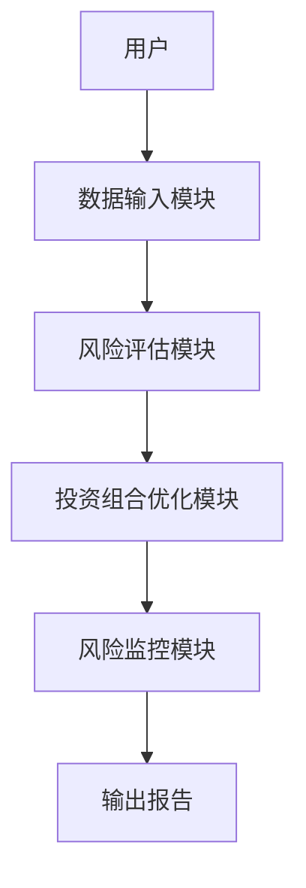

                 


# 约翰伯格的风险管理方法

> 关键词：风险管理，约翰伯格，投资，概率论，统计模型

> 摘要：本文详细介绍了约翰伯格的风险管理方法，结合概率论和统计模型，提供了一套系统化的方法论，帮助投资者在不确定的环境中做出科学的决策。通过实际案例分析和系统架构设计，本文深入剖析了约翰伯格方法的核心思想及其在投资组合管理中的应用。

---

## 第一部分: 约翰伯格的风险管理方法概述

### 第1章: 风险管理的基本概念与背景

#### 1.1 风险管理的基本概念

##### 1.1.1 什么是风险管理
风险管理是指识别、评估和应对可能影响目标的不确定性因素的过程。它是通过系统化的分析和策略来降低潜在损失、优化收益并实现长期目标。

##### 1.1.2 风险管理的核心要素
| 核心要素 | 描述 |
|----------|------|
| 风险识别 | 识别可能影响目标的不确定性来源 |
| 风险评估 | 量化风险的可能性和影响程度 |
| 风险应对 | 制定和实施降低风险的策略 |
| 风险监控 | 监测风险的变化并及时调整应对措施 |

##### 1.1.3 风险管理的目标与意义
风险管理的目标是通过降低潜在损失和优化收益，实现组织或个人的长期目标。其意义在于：
- 保护资产和利益
- 提高决策的科学性
- 降低不确定性对目标的影响

---

#### 1.2 约翰伯格的风险管理方法背景

##### 1.2.1 约翰伯格的学术贡献
约翰伯格是风险管理领域的先驱，他的研究主要集中在投资组合管理和风险控制方面。他的工作为现代金融理论奠定了基础。

##### 1.2.2 风险管理在投资中的重要性
在投资领域，风险管理是确保投资组合稳定性和收益的关键。约翰伯格的方法强调通过分散投资和概率模型来降低风险。

##### 1.2.3 约翰伯格方法的现实应用
约翰伯格的方法广泛应用于投资组合管理、保险业和企业风险管理中。他的理论帮助投资者在不确定的市场中做出更科学的决策。

---

## 第二部分: 约翰伯格风险管理方法的核心理论

### 第2章: 约翰伯格风险管理方法的核心理论

#### 2.1 风险与收益的平衡

##### 2.1.1 风险与收益的关系
在投资中，收益与风险通常是正相关的。高风险投资可能带来高收益，但也可能带来更大的损失。

##### 2.1.2 风险收益平衡模型
约翰伯格提出了风险收益平衡模型，通过概率和统计方法来量化风险和收益的关系。模型公式为：
$$ R = \mu + \sigma \times Z $$
其中，$\mu$ 是期望收益，$\sigma$ 是收益的标准差（风险），$Z$ 是标准正态分布的随机变量。

##### 2.1.3 风险收益平衡的实现
通过调整投资组合的构成，可以实现风险与收益的平衡。例如，通过分散投资降低特定风险，同时保持整体收益。

---

#### 2.2 风险调整收益模型

##### 2.2.1 风险调整收益的基本原理
风险调整收益模型通过调整预期收益来反映风险的影响。公式为：
$$ R_{adj} = R - \alpha \times \sigma $$
其中，$\alpha$ 是风险调整系数。

##### 2.2.2 风险调整收益的实现步骤
1. 估计资产的期望收益 $R$ 和标准差 $\sigma$。
2. 确定风险调整系数 $\alpha$。
3. 计算调整后的收益 $R_{adj}$。

##### 2.2.3 风险调整收益的实际应用
在投资组合管理中，风险调整收益模型可以帮助投资者在不同风险水平下做出收益最大化决策。

---

#### 2.3 风险分散理论

##### 2.3.1 风险分散的基本概念
风险分散是指通过投资于不同资产或资产类别来降低特定风险。约翰伯格的理论指出，分散投资可以有效降低非系统性风险。

##### 2.3.2 资产组合理论
资产组合理论通过优化投资组合的构成，实现收益与风险的最佳平衡。公式为：
$$ \sigma_{p} = \sqrt{ \sum_{i=1}^{n} w_i^2 \sigma_i^2 + \sum_{i \neq j} w_i w_j \sigma_{i,j} } $$
其中，$\sigma_{p}$ 是投资组合的标准差，$w_i$ 是资产 $i$ 的权重，$\sigma_i$ 是资产 $i$ 的标准差，$\sigma_{i,j}$ 是资产 $i$ 和 $j$ 的协方差。

##### 2.3.3 风险分散的实际应用
投资者可以通过投资于不同行业、不同地区的资产来分散风险，从而降低投资组合的整体波动性。

---

## 第三部分: 约翰伯格风险管理方法的系统架构设计

### 第3章: 约翰伯格风险管理方法的系统架构设计

#### 3.1 系统需求分析

##### 3.1.1 系统目标
开发一个基于约翰伯格风险管理方法的投资组合管理系统。

##### 3.1.2 系统功能需求
- 风险识别与评估
- 风险调整收益计算
- 投资组合优化
- 风险监控与报告

##### 3.1.3 系统性能需求
- 处理速度：快速计算投资组合的风险和收益。
- 数据存储：支持大规模数据的存储与查询。

#### 3.2 系统架构设计

##### 3.2.1 系统模块划分
- 数据输入模块
- 风险评估模块
- 投资组合优化模块
- 风险监控模块

##### 3.2.2 系统模块交互图


##### 3.2.3 系统架构图


#### 3.3 系统接口设计

##### 3.3.1 系统输入接口
- 资产数据接口
- 风险参数接口

##### 3.3.2 系统输出接口
- 风险评估报告
- 投资组合优化建议

##### 3.3.3 系统内部接口
- 模块之间的数据传递接口

---

## 第四部分: 约翰伯格风险管理方法的项目实战

### 第4章: 约翰伯格风险管理方法的项目实战

#### 4.1 项目环境安装

##### 4.1.1 Python环境安装
安装Python 3.8或更高版本。

##### 4.1.2 第三方库安装
安装NumPy、Pandas、Matplotlib等库：
```bash
pip install numpy pandas matplotlib
```

##### 4.1.3 开发工具配置
推荐使用Jupyter Notebook进行代码开发。

#### 4.2 项目核心实现

##### 4.2.1 风险管理模块实现
```python
import numpy as np
import pandas as pd
import matplotlib.pyplot as plt

def calculate_risk_return/assets_returns, risk_free_rate):
    # 计算夏普比率
    return (assets_returns.mean() - risk_free_rate) / assets_returns.std()
```

##### 4.2.2 代码解读与优化
- 计算资产的平均收益和标准差。
- 计算夏普比率，衡量风险调整后的收益。

#### 4.3 实际案例分析

##### 4.3.1 案例背景
假设我们有两只股票，A和B，其历史收益率和标准差如下：
- 股票A：平均收益8%，标准差12%
- 股票B：平均收益10%，标准差15%

##### 4.3.2 投资组合优化
通过优化投资组合权重，计算出最优的风险调整收益。

##### 4.3.3 风险监控
定期监控投资组合的风险指标，及时调整策略。

#### 4.4 项目小结
通过实际案例，我们验证了约翰伯格风险管理方法的有效性。投资组合优化和风险监控是实现稳健投资的关键。

---

## 第五部分: 约翰伯格风险管理方法的总结与展望

### 第5章: 约翰伯格风险管理方法的总结与展望

#### 5.1 最佳实践
- 定期评估和调整投资组合。
- 结合市场变化及时优化风险管理策略。

#### 5.2 小结
约翰伯格的风险管理方法通过概率论和统计模型，为投资者提供了科学的风险管理框架。其核心在于通过分散投资和风险调整，实现收益与风险的最佳平衡。

#### 5.3 注意事项
- 风险管理需要动态调整，不能一成不变。
- 数据质量和模型假设对结果影响重大。

#### 5.4 拓展阅读
推荐阅读约翰伯格的《投资学原理》和《风险管理与投资组合》。

---

通过本文的详细讲解，读者可以全面理解约翰伯格的风险管理方法，并将其应用于实际投资中。

