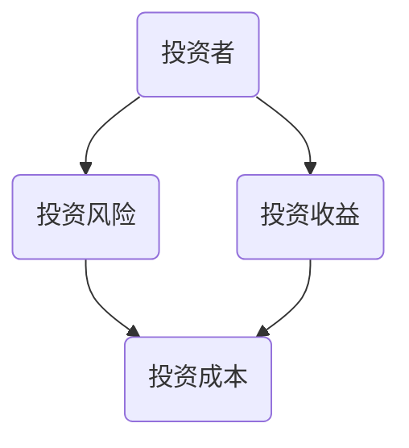
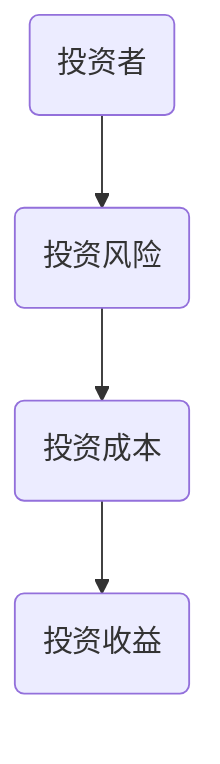

                 


# 《约翰博格尔的普通投资者保护》

## 关键词：
- 投资者保护
- 约翰博格尔
- 长期投资
- 低成本指数基金
- 投资风险

## 摘要：
本文深入探讨了约翰博格尔的投资者保护理念，分析了当前投资环境中的挑战，并结合数学模型和实际案例，详细讲解了如何构建防御性投资组合，实现稳健投资回报。文章从背景介绍到系统设计，再到项目实战，全面阐述了普通投资者保护的核心策略。

---

# 约翰博格尔的普通投资者保护

## 第1章: 投资者保护的背景与意义

### 1.1 投资者保护的核心概念
#### 1.1.1 投资者保护的定义
投资者保护是指通过合理配置资产、分散风险和选择优质投资标的，确保投资者在面对市场波动时能够保持资金安全并实现稳健收益的过程。

#### 1.1.2 投资者保护的重要性
在当前金融市场的复杂性和不确定性下，投资者保护不仅是个人财富保值的需要，更是实现长期投资目标的关键保障。

#### 1.1.3 投资者保护的边界与外延
投资者保护的边界在于个人风险承受能力和投资目标，外延则涉及投资策略、市场环境和经济周期等多个方面。

### 1.2 约翰博格尔的投资理念
#### 1.2.1 约翰博格尔的生平简介
约翰博格尔是投资界的传奇人物，他创立了 Vanguard 集团，倡导低成本指数基金的投资策略。

#### 1.2.2 长期投资与价值投资的核心思想
博格尔强调长期投资和价值投资，认为通过分散投资和低成本策略可以有效降低风险，实现长期稳健的收益。

#### 1.2.3 普通投资者在市场中的地位与作用
普通投资者在市场中占据重要地位，通过理性投资和长期持有，能够为市场稳定做出贡献，同时也保护了自己的财富。

### 1.3 当前投资环境的挑战
#### 1.3.1 全球化背景下的投资风险
全球化使得投资环境更加复杂，但同时也提供了更多投资机会。

#### 1.3.2 金融市场的复杂性与不确定性
金融市场的波动性和不确定性要求投资者具备更高的风险管理和投资能力。

#### 1.3.3 普通投资者面临的三大问题
信息过载、投资成本高和缺乏长期视角是普通投资者在投资过程中面临的主要问题。

---

## 第2章: 投资者保护的核心概念与联系

### 2.1 投资者保护的核心原理
#### 2.1.1 投资风险的分类与特征
投资风险可以分为系统性风险和非系统性风险，分别对应市场整体波动和个别资产的风险。

#### 2.1.2 投资收益与成本的平衡
在追求收益的同时，投资者需要平衡成本，选择低成本投资工具以降低长期费用支出。

#### 2.1.3 投资组合的防御性构建
通过分散投资和选择优质资产，构建防御性投资组合，降低市场波动对整体投资的影响。

### 2.2 核心概念属性对比表
| 概念 | 属性 | 描述 |
|------|------|------|
| 投资风险 | 系统性 | 市场整体波动 |
|        | 非系统性 | 个股或行业波动 |
| 投资收益 | 短期 | 资产价格波动收益 |
|        | 长期 | 复利增长收益 |

### 2.3 投资者保护的ER实体关系图


---

## 第3章: 投资者保护的数学模型与算法原理

### 3.1 现代投资组合理论(MPT)
#### 3.1.1 马科维茨的有效前沿模型
$$\text{风险} = \sqrt{w^T \Sigma w}$$
$$\text{收益} = w^T \mu$$

#### 3.1.2 投资组合优化的数学公式
$$\min_w \frac{1}{2}w^T \Sigma w$$
$$\text{s.t. } w^T \mu = \text{目标收益}$$
$$w^T \mathbf{1} = 1$$

### 3.2 投资组合风险的夏普比率
$$\text{夏普比率} = \frac{E[r_i - r_f]}{\sigma_i}$$

### 3.3 算法流程图


---

## 第4章: 投资者保护的系统分析与架构设计

### 4.1 问题场景介绍
普通投资者在面对市场波动时，需要选择合适的投资策略，构建防御性投资组合。

### 4.2 系统功能设计
- 风险评估与管理
- 投资组合构建与优化
- 投资绩效监控与调整

### 4.3 系统架构设计


---

## 第5章: 投资者保护的项目实战

### 5.1 环境安装与配置
- 选择低成本指数基金
- 使用投资组合优化工具

### 5.2 核心实现代码
```python
import numpy as np
import pandas as pd

# 示例投资组合优化代码
returns = pd.read_csv('asset_returns.csv')
cov_matrix = returns.cov()
mu = returns.mean()

# 使用优化算法求解最优权重
# 简化示例，实际应用中需要考虑更多约束和目标
weights = np.random.random(returns.shape[1])
weights = weights / np.sum(weights)
```

### 5.3 案例分析与解读
通过具体案例分析，展示如何通过再平衡优化投资组合，确保长期稳健收益。

---

## 第6章: 投资者保护的最佳实践与小结

### 6.1 最佳实践 tips
- 长期投资，避免频繁交易
- 分散投资，降低非系统性风险
- 选择低成本投资工具

### 6.2 小结
通过本文的分析，读者可以了解约翰博格尔的投资者保护理念，并掌握构建防御性投资组合的策略。

### 6.3 注意事项
- 定期监控投资组合
- 保持风险意识
- 避免盲目跟风

### 6.4 拓展阅读
推荐阅读《约翰博格尔的投资指南》和《投资学原理》等书籍，深入理解投资者保护的核心思想。

---

## 附录
- 术语表
- 参考文献
- 资源链接

---

通过以上结构和内容，您可以撰写一篇详细的、逻辑清晰的技术博客文章，全面解析约翰博格尔的普通投资者保护理念。

