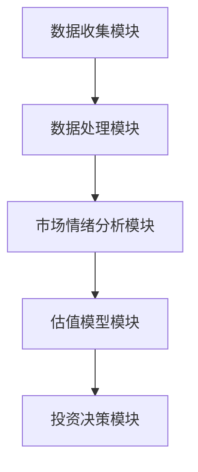

                 


好的，我将按照您的要求创作一篇关于《约翰·聂夫的Contrarian投资法》的高质量技术博客文章。让我们一步一步来构建这篇文章。

---

# 约翰·聂夫的Contrarian投资法

> 关键词：Contrarian投资法，约翰·聂夫，投资策略，逆向思维，市场情绪，投资系统

> 摘要：本文深入分析约翰·聂夫的Contrarian投资法，从其核心理念、数学模型、系统架构到实战应用，全面解读这一投资方法的逻辑与实践。通过逆向思维和市场情绪分析，揭示如何在复杂市场中捕捉投资机会。

---

## 第1章：Contrarian投资法的背景与基础

### 1.1 Contrarian投资法的起源
Contrarian投资法是一种基于逆向思维的投资策略，起源于20世纪中期的美国投资界。其核心思想是“买别人忽略的东西”，即在市场情绪低落时买入，市场情绪高涨时卖出。这种方法与传统的价值投资不同，更注重市场的短期波动和投资者心理。

#### 1.1.1 投资学派的演变与Contrarian的诞生
投资学派经历了从基本面分析到行为金融学的演变。Contrarian投资法的诞生，正是行为金融学发展的产物。它试图通过分析市场参与者的心理偏差，找到市场定价的错误。

#### 1.1.2 约翰·聂夫的背景与投资理念
约翰·聂夫是Contrarian投资法的代表人物之一。他通过研究市场情绪和投资者行为，提出了“市场过度反应”的理论，认为市场在短期内会过度反应，而长期会回归理性。

#### 1.1.3 Contrarian投资法的基本概念
Contrarian投资法的核心是通过分析市场情绪，寻找市场定价的偏差。其基本概念包括：
- 市场情绪周期：市场情绪从乐观到悲观的循环。
- 逆向思维：在市场恐慌时买入，在市场狂热时卖出。

### 1.2 Contrarian投资法的核心理念
Contrarian投资法的核心理念是通过逆向思维，在市场情绪的极端情况下寻找投资机会。

#### 1.2.1 逆向思维在投资中的应用
逆向思维的核心是“反其道而行之”。当市场情绪过于乐观时，市场可能会高估资产价格；当市场情绪过于悲观时，市场可能会低估资产价格。

#### 1.2.2 市场情绪与投资决策的关系
市场情绪是Contrarian投资法的核心变量。通过分析市场情绪的变化，投资者可以判断市场的定价是否偏离合理区间。

#### 1.2.3 投资者心理与市场周期
Contrarian投资法认为，投资者心理是市场周期波动的根本原因。市场的波动性越大，投资机会也越大。

### 1.3 Contrarian投资法的适用场景
Contrarian投资法适用于以下场景：
- 牛市与熊市的切换：在牛市顶部寻找卖出机会，在熊市底部寻找买入机会。
- 震荡市场的投资机会：在市场剧烈波动时，寻找市场定价的偏差。
- 长期投资与短期波动的平衡：通过逆向思维，在长期趋势中捕捉短期波动的机会。

---

## 第2章：Contrarian投资法的核心概念与分析

### 2.1 Contrarian投资法的核心要素
Contrarian投资法的核心要素包括市场情绪分析、估值与价格的关系、市场参与者的心理偏差。

#### 2.1.1 市场情绪分析
市场情绪分析是Contrarian投资法的核心。通过分析市场情绪的变化，投资者可以判断市场的定价是否偏离合理区间。

#### 2.1.2 估值与价格的关系
Contrarian投资法认为，市场的价格波动是估值与价格偏离的结果。当价格低于合理估值时，市场情绪可能过于悲观；当价格高于合理估值时，市场情绪可能过于乐观。

#### 2.1.3 市场参与者的心理偏差
Contrarian投资法通过分析市场参与者的心理偏差，寻找市场定价的错误。常见的心理偏差包括从众心理、过度自信、厌恶损失等。

### 2.2 Contrarian与传统投资方法的对比
Contrarian投资法与传统投资方法有显著的不同。

#### 2.2.1 传统价值投资与Contrarian的异同
- 价值投资：注重基本面分析，寻找被低估的资产。
- Contrarian投资法：注重市场情绪分析，寻找市场定价的偏差。

#### 2.2.2 技术分析与Contrarian的结合
Contrarian投资法可以与技术分析结合，通过分析技术指标判断市场的短期波动。

#### 2.2.3 其他投资策略的对比分析
Contrarian投资法与其他投资策略（如趋势投资、套利策略）的对比，可以发现其独特的优势。

### 2.3 Contrarian投资法的数学模型
Contrarian投资法可以通过数学模型进行量化分析。

#### 2.3.1 市场情绪指数的构建
市场情绪指数可以通过以下步骤构建：
1. 收集市场参与者的心理数据（如投资者情绪调查、市场交易量、市场波动率）。
2. 对数据进行标准化处理。
3. 计算市场情绪指数。

#### 2.3.2 市场反转概率的计算公式
市场反转概率可以通过以下公式计算：
$$P_{\text{反转}} = \frac{N_{\text{反转}}}{N_{\text{总}}}$$
其中，$N_{\text{反转}}$ 是历史上市场反转的次数，$N_{\text{总}}$ 是总样本数。

#### 2.3.3 市场趋势的数学分析
市场趋势可以通过时间序列分析进行量化。常用的模型包括ARIMA、GARCH等。

---

## 第3章：Contrarian投资法的系统架构

### 3.1 投资决策系统的模块划分
Contrarian投资法可以通过一个系统架构实现。

#### 3.1.1 数据收集与处理模块
数据收集与处理模块负责收集市场数据（如价格、成交量、市场情绪指标）并进行预处理。

#### 3.1.2 市场情绪分析模块
市场情绪分析模块负责分析市场情绪的变化，判断市场的定价偏差。

#### 3.1.3 估值模型与决策模块
估值模型与决策模块负责计算资产的合理估值，并根据市场情绪变化做出投资决策。

### 3.2 Contrarian投资法的系统架构图
以下是Contrarian投资法的系统架构图：



### 3.3 系统接口与交互设计
系统接口与交互设计包括：
- 数据接口设计：定义数据输入和输出的格式。
- 用户交互流程设计：用户输入市场数据，系统输出投资建议。
- 系统输出与反馈机制：系统根据市场变化实时调整投资策略。

---

## 第4章：Contrarian投资法的项目实战

### 4.1 项目环境与工具安装
Contrarian投资法的实战需要以下工具：
- 数据源：股票价格、市场情绪指标等。
- 分析工具：Python、Pandas、Matplotlib等。

#### 4.1.1 数据源的选择与获取
数据源可以选择Yahoo Finance、Quandl等金融数据平台。

#### 4.1.2 分析工具的安装与配置
安装Python、Pandas、Matplotlib等工具，并配置开发环境。

#### 4.1.3 开发环境的搭建
搭建一个完整的开发环境，包括数据处理、分析、可视化工具。

### 4.2 项目核心代码实现
以下是Contrarian投资法的Python代码实现：

```python
import pandas as pd
import matplotlib.pyplot as plt

# 数据获取
data = pd.read_csv('market_data.csv')

# 市场情绪分析
def calculate_market_sentiment(data):
    # 计算市场情绪指数
    sentiment = data['sentiment'].mean()
    return sentiment

# 估值模型
def calculate_valuation(data):
    # 计算合理估值
    valuation = data['price'].mean() * 0.8
    return valuation

# 投资决策
def make_investment_decision(sentiment, valuation):
    if sentiment < 0.5 and valuation < data['price'].mean():
        return '买入'
    elif sentiment > 0.5 and valuation > data['price'].mean():
        return '卖出'
    else:
        return '观望'

# 主程序
sentiment = calculate_market_sentiment(data)
valuation = calculate_valuation(data)
decision = make_investment_decision(sentiment, valuation)
print(f'市场情绪：{sentiment}\n估值：{valuation}\n投资决策：{decision}')
```

### 4.3 实战案例分析
以下是Contrarian投资法的一个实战案例：

#### 4.3.1 历史案例回顾与分析
以2020年新冠疫情为例，市场情绪在疫情初期极度悲观，但市场估值低于合理水平。因此，Contrarian投资法建议在市场底部买入。

#### 4.3.2 案例中的Contrarian策略应用
在案例中，通过分析市场情绪和估值，投资者可以在市场底部买入，在市场顶部卖出。

#### 4.3.3 案例总结与经验分享
Contrarian投资法的核心在于通过逆向思维，在市场情绪极端时做出投资决策。

---

## 第5章：Contrarian投资法的最佳实践

### 5.1 投资策略的优化与调整
- 定期评估投资策略，根据市场变化进行调整。
- 优化估值模型，提高市场情绪分析的准确性。

### 5.2 投资者心理与行为管理
- 克服从众心理，坚持逆向思维。
- 建立长期投资心态，避免短期波动的影响。

### 5.3 风险管理与止损策略
- 设置止损点，避免重大损失。
- 分散投资，降低风险。

---

## 小结
通过本文的分析，我们可以看到Contrarian投资法的独特优势。它通过逆向思维和市场情绪分析，帮助投资者在复杂市场中捕捉投资机会。然而，Contrarian投资法的成功需要投资者具备强大的心理素质和风险管理能力。

